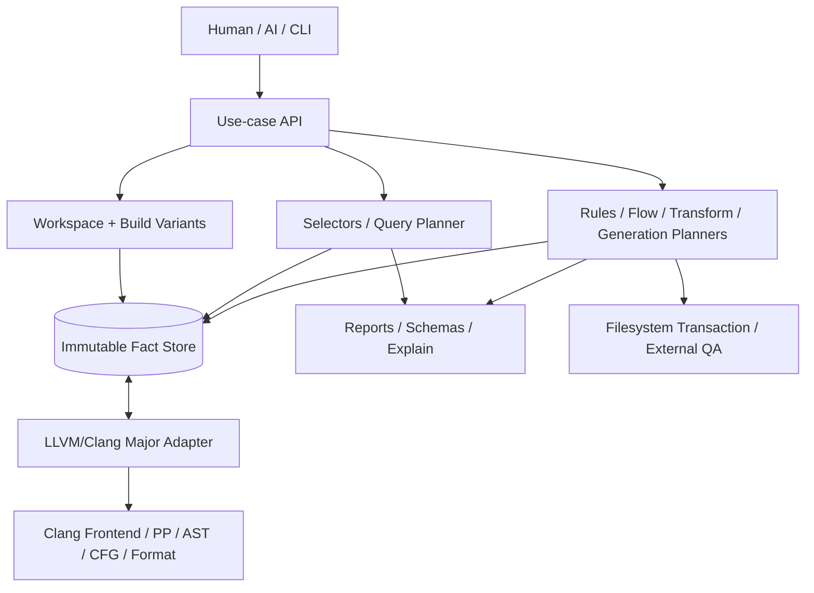
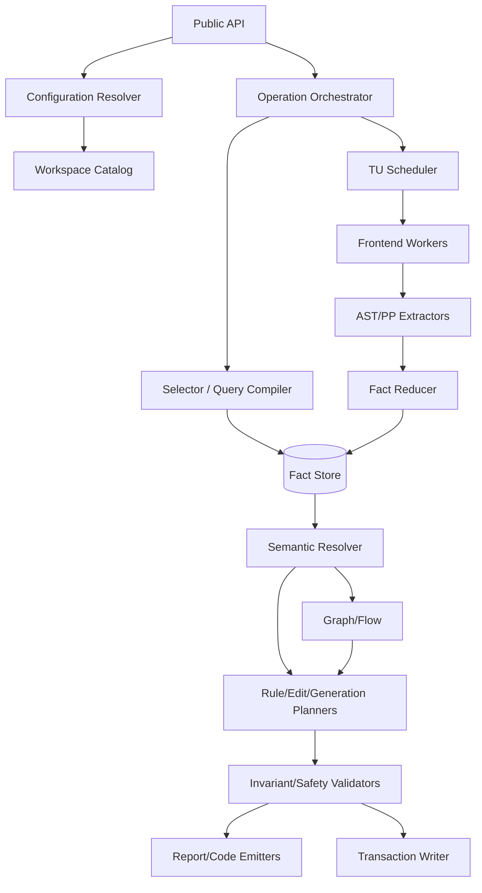
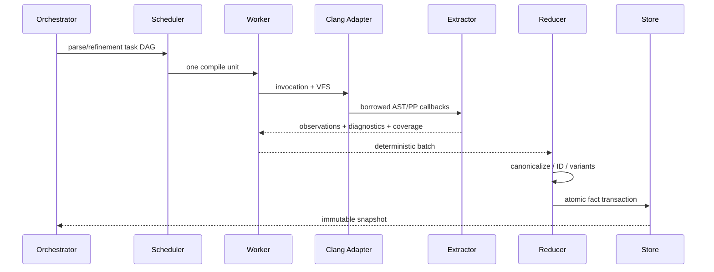

# cxxlens 統合版ソフトウェア要求・アーキテクチャ・公開 API 詳細設計書

- 文書 ID: `CXXLENS-SRAD-001`
- 文書版: `1.0.0-draft`
- 作成日: 2026-07-11
- 対象製品: 新 `cxxlens`
- 対象実装言語: C++23
- 基準 LLVM/Clang: LLVM/Clang 22 系（初期検証版 22.1.8）
- 文書状態: 実装開始用の規範設計案
- 旧称: 下位層 `cxxlens` + 上位層 `cxxred`

> 本書は、旧 `cxxlens` と旧 `cxxred` の二層構想を廃止し、**ユースケース駆動の単一ライブラリ `cxxlens`** として再設計するための、要求分析、要件定義、アーキテクチャ、公開 API、LLVM/Clang 対応、内部データモデル、詳細処理方式、品質保証、実装ロードマップを一体化した設計書である。
>
> 実装者は本書を規範とし、公開 API の意味、失敗時の振る舞い、証拠・限界の表現、AST の寿命、安全な編集・生成、決定性を独自判断で縮小してはならない。

---

## 0. 最終設計判断

### 0.1 結論

新 `cxxlens` は LLVM/Clang の全 API をラップするライブラリではない。C/C++ 開発者が日常的に抱える次の問いを、Clang の内部知識を最小限にして解決する**アプリケーション層の解析・変更・生成ライブラリ**である。

- この関数・メソッド・型・マクロ・include はどこで、どの意味で使われているか。
- 継承・override・overload・暗黙変換・テンプレート・マクロを考慮すると、候補は何か。
- この規則違反はなぜ検出され、どこまで確実で、何が未解決か。
- この API 変更の影響範囲はどこか。
- この変更をマクロや別構成を壊さず、安全に適用できるか。
- この class/C API から mock、fake、method harness、fuzz harness を安全に作れるか。
- CI では「新規の高確度 finding だけ」をどう gate するか。
- 高水準 API で足りない場合、AST の寿命とスレッド制約を破らず Clang API へどう降りるか。

### 0.2 単一ライブラリの意味

- 名前空間: `cxxlens`
- 公開 CMake target: `cxxlens::cxxlens`
- umbrella header: `<cxxlens/cxxlens.hpp>`
- 設定ファイル: `.cxxlens.yaml`
- CLI: `cxxlens`（任意ビルド、ライブラリ API の薄い client）
- 公開 JSON schema prefix: `cxxlens.*`

内部では object library や package directory を分けるが、利用者に「下位ラッパ」と「上位ライブラリ」の選択を要求しない。

### 0.3 旧構想から残すもの・捨てるもの

| 項目 | 判断 |
|---|---|
| use-case first | 最上位原則として維持。 |
| evidence / confidence / unresolved | 全結果の共通契約にする。 |
| compile database 第一級 | 実プロジェクトでは既定必須。 |
| semantic grep | 最優先の中核機能。 |
| safe transform / reparse verification | 中核機能。 |
| mock/fake/test generation | 中核ユースケースとして統合。 |
| dataflow / taint | 段階導入するが型と拡張点は初期固定。 |
| sanitizer / coverage / fuzz runner | 任意 capability。 |
| 全 AST node / matcher wrapper | 廃止。 |
| LLVM IR / Pass Manager / ORC JIT 汎用 wrapper | concrete use case がない限り非スコープ。 |
| clangd 内部 API 全面依存 | 廃止。index/include-cleaner の設計知見は採用。 |
| raw escape hatch | `cxxlens/interop/clang.hpp` に限定して維持。 |

### 0.4 API 追加の審査規則

公開 API は次の全条件を満たす場合にだけ追加する。

1. 明示されたユーザーユースケースを短縮する。
2. Clang の型名を言い換えただけではない。
3. 入力、結果、evidence、coverage、unresolved、保証レベルを説明できる。
4. 複数 LLVM major に対し意味契約を維持できる見込みがある。
5. 高水準 API で不足しても raw interop で行き止まりにならない。
6. unit fixture と end-to-end acceptance case を定義できる。
7. public API complexity budget を消費する価値がある。

---

## 1. 文書の目的・規範性・設計入力

### 1.1 目的

コーディングエージェントまたは人間の実装者が、追加の抽象設計を行わずに次を実施できる状態を作る。

- repository skeleton と CMake target を作る。
- domain model、schema、ID 生成規則を実装する。
- LLVM/Clang 22 adapter を実装する。
- package ごとの公開 header を実装する。
- vertical slice ごとの acceptance test を実装する。
- API から LLVM/Clang 呼び出しまでを追跡する。
- LLVM major 更新時に変更箇所を adapter 内へ閉じ込める。

### 1.2 規範キーワード

- **MUST**: 実装が必ず満たす。
- **MUST NOT**: 実装が行ってはならない。
- **SHOULD**: 原則として満たす。逸脱時は ADR と代替策が必要。
- **MAY**: 任意。

### 1.3 設計入力

- `horiyamayoh/cxxlens`: 旧 wrapper 設計と旧 `cxxred` 上位設計。
- `horiyamayoh/sappp`: 実ビルド再現、source map、stable ID、evidence、UNKNOWN 開拓性、決定性。
- `horiyamayoh/azteca`: exact method resolution、意味 IR、Extraction Plan、dependency classification、method harness generation。
- `horiyamayoh/mock-fake-generator`: semantic identity、multi-TU/config reduction、surface census、GenerationPlan、silent omission 禁止、artifact publication state。
- LLVM/Clang 22.1 公式ドキュメント。

### 1.4 LLVM バージョン前提

初期検証基準は LLVM 22.1.8。公開契約を patch に依存させず、初期 binary target は LLVM major 22 とする。

- `CXXLENS_LLVM_MAJOR == 22`
- CI 最低検証: 22.1.0
- CI 推奨検証: 22.1.8
- 同一 process に複数 LLVM major を混在させない。
- LLVM 23 対応は `src/llvm/clang23/` adapter を追加して行う。
- raw interop は LLVM major ごとの source compatibility だけを best effort で保証する。

---

## 2. 背景と問題分析

LibTooling、ASTMatchers、SourceManager、Preprocessor、index、CFG、Transformer、Replacements、LibFormat を直接組み合わせるには、API 名の知識だけでなく、次の横断的制約を同時に扱う必要がある。

- translation unit ごとの正しい compile command
- implicit/explicit node、template pattern/instantiation
- canonical declaration、USR、overload resolution
- spelling/expansion location と macro stack
- ASTContext と node pointer の寿命
- AST の thread confinement
- multi-TU・multi-configuration の同一性と相違
- Replacement の競合、stale source、format、reparse
- unsupported surface の完全な会計

旧二層案では、巨大な Clang surface を wrapper として再公開し、上位層がその wrapper を再構成するため、利用価値に直結しない保守負担と型の重複が生じる。新設計は LLVM/Clang 接点を内部 adapter に閉じ、公開 API を workspace、semantic facts、selectors、findings、graphs、plans、workflows に限定する。

---

## 3. 製品ビジョン、対象利用者、成功基準

### 3.1 ビジョン

> C/C++ の意味に基づく調査・検査・変更・生成を、人間と AI が「やりたいこと」の語彙から安全に記述できるようにする。

### 3.2 対象利用者

- C/C++ 静的解析・refactoring tool の作者
- 大規模 C/C++ repository の品質・移行・レビュー担当者
- mock/fake/test harness generator の作者
- AI coding agent に C++ 解析ツールを実装させる開発者
- 専用解析器（SAP++、Azteca 等）を構築する研究・製品チーム

### 3.3 成功基準

- flagship use case を 20 行未満の利用コードで表現できる。
- 結果が evidence、confidence、coverage、unresolved を持つ。
- LLVM の公開型が通常 header に露出しない。
- multi-TU/config を first-wins で失わない。
- edit/generation が plan-first、dry-run、検証可能。
- unsupported surface が silent omission されない。
- jobs 数や checkout root を変えても semantic output が決定的。
- LLVM major 更新が adapter と conformance test に局所化される。

---

## 4. スコープと非スコープ

### 4.1 MUST スコープ

- compile database と build variant
- source/macro mapping
- symbol/type/reference/call/inheritance/override/include/macro facts
- semantic selectors と search
- class/call/include/impact graph
- rule/finding/evidence/report
- safe edit plan、format、reparse、transaction apply
- surface census と generation plan
- mock/fake、exact method selection、method harness、semantic copy、fuzz harness
- diff/baseline/gate
- AI/human explain/schema/testing/interop

### 4.2 SHOULD スコープ

- local CFG/dataflow/taint/resource protocol
- Include Cleaner 相当の include hygiene
- sanitizer/coverage normalization
- path-sensitive Static Analyzer adapter
- adjacent LLVM major adapters

### 4.3 非スコープ

- LLVM/Clang 全 API の mirror
- arbitrary AST node/value wrapper catalog
- arbitrary LLVM IR/pass/JIT wrapper
- C++ parser/compiler の再実装
- 任意 build system の完全再実装
- whole-program soundness の無条件保証
- SAP++ 固有 proof system/validator
- Azteca 固有 MMIR 全意味論の core 固定
- 全 mock framework 能力の無条件保証

---

## 5. 最上位設計原則と不変条件

1. **Use-case first**: API の入口は `call`、`symbol`、`rule`、`codemod`、`mock`、`method harness`。
2. **Evidence first**: 重要結果は根拠、保証、確信度、限界を持つ。
3. **Failure is data**: ambiguous、dependent、missing command、budget 超過等を `unresolved` として保存。
4. **Plan before side effect**: edit/generation は immutable plan の検証後だけ実行。
5. **No silent omission**: included/excluded/not-applicable/deferred/unsupported/failed/quarantined を明示。
6. **Stable domain, unstable adapter**: public domain は SemVer、Clang internals は adapter。
7. **Conservative mutation**: search の partial は許すが mutation は必要 evidence 不足で既定拒否。
8. **Deterministic reduction**: thread/FS/hash-map 順を ID・出力へ反映しない。
9. **Build variant preservation**: 同じ file の複数 command を勝手に一件へ縮約しない。
10. **AST confinement**: raw AST pointer は frontend job/callback 外へ出さない。

---

## 6. ユースケース体系

### 6.1 Semantic search

| ID | 優先 | ユースケース | 受け入れ条件 |
|---|---:|---|---|
| UC-SR-001 | P0 | qualified function call | overload resolution 後の canonical callee で識別。 |
| UC-SR-002 | P0 | receiver type 指定 method call | static type、base/derived、override candidate。 |
| UC-SR-003 | P0 | symbol declaration/definition/reference | USR または deterministic fallback ID。 |
| UC-SR-004 | P1 | read/write/address-taken | reference role と根拠。 |
| UC-SR-005 | P1 | ctor/dtor/operator | explicit/implicit policy。 |
| UC-SR-006 | P1 | implicit/user-defined/narrowing conversion | implicit traversal を明示。 |
| UC-SR-007 | P1 | macro definition/expansion/argument | spelling/expansion/macro stack。 |
| UC-SR-008 | P1 | include direct/transitive/use/provider | conditional/variant を保持。 |
| UC-SR-009 | P2 | function pointer/callback targets | target set と unresolved reason。 |
| UC-SR-010 | P2 | template pattern/instantiation | duplicate policy と variant。 |

### 6.2 Rules / analysis

| ID | 優先 | ユースケース |
|---|---:|---|
| UC-RL-001 | P0 | 禁止 API rule と optional fix |
| UC-RL-002 | P0 | project rule DSL |
| UC-RL-003 | P1 | suppression と監査 |
| UC-RL-004 | P1 | include hygiene |
| UC-RL-005 | P1 | resource protocol |
| UC-RL-006 | P1 | taint source-to-sink |
| UC-RL-007 | P2 | path-sensitive report normalization |
| UC-RL-008 | P2 | architecture boundary rule |

### 6.3 Transform / generation / review

| ID | 優先 | ユースケース |
|---|---:|---|
| UC-TF-001 | P0 | function API replacement |
| UC-TF-002 | P0 | method call replacement |
| UC-TF-003 | P0 | safe edit plan |
| UC-TF-004 | P1 | symbol rename |
| UC-TF-005 | P1 | include add/remove |
| UC-TF-006 | P1 | signature migration |
| UC-GN-001 | P0 | class public surface census |
| UC-GN-002 | P0 | gMock subclass generation |
| UC-GN-003 | P0 | link-replacement fake generation |
| UC-GN-004 | P0 | exact method selection |
| UC-GN-005 | P1 | method harness generation |
| UC-GN-006 | P1 | semantic dependency copy |
| UC-GN-007 | P1 | C API fake |
| UC-GN-008 | P1 | fuzz harness |
| UC-GR-001 | P0 | class hierarchy/override graph |
| UC-GR-002 | P1 | call graph |
| UC-GR-003 | P1 | changed symbol impact |
| UC-RV-001 | P1 | diff-only review |
| UC-RV-002 | P1 | baseline/no-new-findings gate |
| UC-QA-001 | P2 | sanitizer run |
| UC-QA-002 | P2 | source coverage import |

---

## 7. 要件定義

### 7.1 機能要件

| ID | 強度 | 要件 |
|---|---|---|
| FR-001 | MUST | compile DB の `arguments` を優先し、cwd と複数 command を保持。 |
| FR-002 | MUST | 同一 file の複数 build configuration を variant として解析。 |
| FR-003 | MUST | source は offset、line/column、spelling、expansion、macro stack を保持。 |
| FR-004 | MUST | AST pointer/reference を raw callback 外へ持ち出さない。 |
| FR-005 | MUST | cross-TU 結果を immutable fact に変換。 |
| FR-006 | MUST | symbol identity は USR 優先、fallback は deterministic。 |
| FR-007 | MUST | selector は serializable、explainable、requirements 計算可能。 |
| FR-008 | MUST | search report は match、evidence、coverage、unresolved、guarantee を返す。 |
| FR-009 | MUST | virtual call は direct callee と possible target set を区別。 |
| FR-010 | MUST | silent omission 禁止。非対応・除外・失敗は reason code。 |
| FR-011 | MUST | finding は stable ID、severity、confidence、guarantee、evidence。 |
| FR-012 | MUST | edit は `edit_plan`、既定 dry-run と macro reject。 |
| FR-013 | MUST | write 前に digest、range、conflict、path safety。 |
| FR-014 | MUST | format と affected TU/variant reparse。 |
| FR-015 | MUST | generation は census→decision→plan→emit。 |
| FR-016 | MUST | emitter は plan 外判断をしない。 |
| FR-017 | MUST | artifact の present/publishable/usable/link-ready/listed を区別。 |
| FR-018 | MUST | C++ API と JSON/fact/plan schema version を分離。 |
| FR-019 | MUST | raw interop は borrowed lifetime/thread ownership を明示。 |
| FR-020 | MUST | in-memory VFS/fixed command fixture。 |

### 7.2 品質要件

| ID | 強度 | 要件 |
|---|---|---|
| QR-001 | MUST | 同一 snapshot/config/version で stable ID と出力順が決定的。 |
| QR-002 | MUST | normal public headers は LLVM/Clang headers を include しない。 |
| QR-003 | MUST | LLVM 変更を `src/llvm/clangXX` へ局所化。 |
| QR-004 | MUST | TU parse failure を partial report として継続可能。 |
| QR-005 | MUST | partial report は coverage 必須。 |
| QR-006 | MUST | AST を複数 thread で共有しない。 |
| QR-007 | MUST | compile command string を shell 実行しない。 |
| QR-008 | MUST | path traversal、symlink escape、overwrite を検査。 |
| QR-009 | MUST | schema、determinism、golden、reparse、idempotence test。 |
| QR-010 | MUST | unsupported capability は structured error。 |
| QR-011 | SHOULD | 大規模 incremental fact cache。 |
| QR-012 | SHOULD | memory budget、parallelism、cancellation、progress。 |

---

## 8. システムコンテキストと論理アーキテクチャ



### 8.1 レイヤ規則

```text
core/source
  <- workspace/facts/models
  <- select
  <- search/graph/flow
  <- rules/transform/generate/review/qa
  <- report/explain/testing

application/internal semantic ports
  <- llvm/clang22 adapter
```

通常 package から `clang::*` へ直接依存してはならない。例外は `interop/clang.hpp` と `src/llvm/clangXX`。

### 8.2 公開 package

| Package | 主責務 |
|---|---|
| core/source | ID、error、source、evidence、coverage、finding |
| workspace | compile DB、variant、scope、snapshot |
| facts | immutable semantic facts、store、profiles |
| models | project API effects/source/sink/barrier/replacement models |
| select | use-case selector DSL |
| search | semantic grep |
| graph | call/class/include/impact graph |
| rules | rule DSL、suppression、finding execution |
| flow | CFG/dataflow/taint/resource protocol |
| transform | immutable edit plan、validation、apply |
| generate | census/decision/artifact plan、mock/fake/harness/copy/fuzz |
| qa | sanitizer/coverage/fuzzer workflow |
| review | diff/baseline/gate |
| report | JSON/Markdown/SARIF/DOT/diff |
| explain | why matched/no-match/plan/task-card |
| testing | fixture/golden/property/determinism |
| interop | scoped Clang raw access |

---

## 9. 物理構成と CMake

```text
include/cxxlens/
  cxxlens.hpp core.hpp source.hpp workspace.hpp facts.hpp models.hpp
  select.hpp search.hpp graph.hpp rules.hpp flow.hpp transform.hpp
  generate.hpp qa.hpp review.hpp report.hpp explain.hpp testing.hpp
  interop/clang.hpp
src/
  core source config workspace facts models select search graph rules flow
  transform generate qa review report explain testing runtime
  llvm/common llvm/clang22
schemas/ docs/ tests/ benchmarks/ tools/cxxlens/
```

公開 target は一つ。

```cmake
find_package(cxxlens 1 CONFIG REQUIRED)
target_link_libraries(my_tool PRIVATE cxxlens::cxxlens)
target_compile_features(my_tool PRIVATE cxx_std_23)
```

内部 target は `OBJECT`/private library に分けてよい。Clang link closure は `cmake/CxxlensClangTargets.cmake` に集中する。

---

## 10. 公開 API 共通設計

### 10.1 命名・所有権・例外

- namespace/type/function は lower snake_case。
- service handle は pImpl、semantic result/plan は immutable value。
- public expected failure は `result<T> = std::expected<T,error>`。
- observer/accessor だけを `noexcept` にする。
- builder は原則 immutable copy-returning。
- boolean で意味が曖昧な policy は enum/class にする。
- stable headers は LLVM/Clang header を include しない。

### 10.2 Core/source API

```cpp
namespace cxxlens {

using path = std::filesystem::path;

struct semantic_version {
  std::uint16_t major{}, minor{}, patch{};
  std::string prerelease;
  auto operator<=>(const semantic_version&) const = default;
  [[nodiscard]] std::string to_string() const;
};

struct api_versions {
  semantic_version library, public_schema, fact_schema;
  semantic_version finding_schema, edit_plan_schema, generation_plan_schema;
  semantic_version llvm;
};

enum class capability_state : std::uint8_t {
  available, experimental, disabled_at_build,
  unavailable_for_llvm, unavailable_for_platform
};

struct capability {
  std::string id;
  capability_state state{};
  std::string summary;
  std::optional<std::string> limitation;
};

class capability_set {
public:
  [[nodiscard]] bool has(std::string_view) const;
  [[nodiscard]] capability get(std::string_view) const;
  [[nodiscard]] std::vector<capability> all() const;
  [[nodiscard]] std::string to_json() const;
};

[[nodiscard]] api_versions versions();
[[nodiscard]] capability_set capabilities();

template<class Tag> class typed_id {
public:
  typed_id() = default;
  explicit typed_id(std::string);
  [[nodiscard]] bool empty() const noexcept;
  [[nodiscard]] std::string_view value() const noexcept;
  auto operator<=>(const typed_id&) const = default;
private:
  std::string value_;
};

struct file_id_tag; struct compile_unit_id_tag; struct build_variant_id_tag;
struct fact_id_tag; struct symbol_id_tag; struct type_id_tag;
struct finding_id_tag; struct plan_id_tag; struct artifact_id_tag;
struct surface_id_tag; struct rule_id_tag; struct operation_id_tag;

using file_id = typed_id<file_id_tag>;
using compile_unit_id = typed_id<compile_unit_id_tag>;
using build_variant_id = typed_id<build_variant_id_tag>;
using fact_id = typed_id<fact_id_tag>;
using symbol_id = typed_id<symbol_id_tag>;
using type_id = typed_id<type_id_tag>;
using finding_id = typed_id<finding_id_tag>;
using plan_id = typed_id<plan_id_tag>;
using artifact_id = typed_id<artifact_id_tag>;
using surface_id = typed_id<surface_id_tag>;
using rule_id = typed_id<rule_id_tag>;
using operation_id = typed_id<operation_id_tag>;

enum class severity : std::uint8_t { note, info, warning, error, fatal };
enum class confidence : std::uint8_t { speculative, possible, probable, high, certain };
enum class result_guarantee : std::uint8_t {
  exact_within_coverage, sound_over_approximation,
  sound_under_approximation, best_effort, heuristic
};
enum class precision_level : std::uint8_t {
  ast_structural, local_semantic, workspace_semantic,
  local_flow, interprocedural_summary, path_sensitive, dynamic_observation
};

enum class source_origin : std::uint8_t {
  directly_spelled, macro_argument, macro_body, macro_expansion,
  implicit_compiler_node, generated_file, system_header, builtin, unknown
};

struct source_point {
  file_id file;
  std::uint64_t byte_offset{};
  std::uint32_t line{}, column{}; // 1-based, columnはUTF-8 byte column
  auto operator<=>(const source_point&) const = default;
};

struct file_range {
  source_point begin, end; // half-open
  bool token_range{true};
  auto operator<=>(const file_range&) const = default;
};

struct macro_frame {
  std::string macro_name;
  file_range invocation;
  std::optional<file_range> definition;
  std::optional<std::uint32_t> argument_index;
};

struct source_span {
  file_range primary;
  std::optional<file_range> spelling, expansion;
  std::vector<macro_frame> macro_stack;
  source_origin origin{source_origin::unknown};
  std::string source_digest;
  [[nodiscard]] bool is_directly_editable() const noexcept;
  [[nodiscard]] std::string display() const;
};

enum class failure_scope : std::uint8_t {
  operation, file, compile_unit, build_variant, symbol, workspace
};

struct error_code { std::string value; auto operator<=>(const error_code&) const = default; };
struct error {
  error_code code;
  std::string message;
  failure_scope scope{failure_scope::operation};
  std::vector<source_span> locations;
  std::vector<error> causes;
  std::vector<std::string> suggested_actions;
  std::map<std::string,std::string> attributes;
  bool retryable{false};
  [[nodiscard]] std::string explain() const;
  [[nodiscard]] std::string to_json() const;
};

template<class T> using result = std::expected<T,error>;

enum class unresolved_kind : std::uint16_t {
  missing_compile_command, inferred_compile_command, malformed_compile_command,
  parse_failed, incomplete_ast, ambiguous_symbol, dependent_type,
  unresolved_overload, unsupported_language_extension, missing_module_bmi,
  macro_origin_ambiguous, macro_edit_unsafe, generated_code_read_only,
  function_pointer_target_unknown, callback_target_unknown,
  virtual_dynamic_type_unknown, open_world_virtual_target,
  alias_analysis_required, dataflow_budget_exceeded,
  path_sensitive_budget_exceeded, capability_unavailable,
  build_variant_disagreement, stale_source, custom
};

struct unresolved {
  unresolved_kind kind{};
  std::string stable_code, summary;
  failure_scope scope{failure_scope::operation};
  std::vector<source_span> related;
  std::vector<std::string> missing_inputs, suggested_actions;
  std::optional<precision_level> required_precision;
  std::optional<std::string> required_capability;
  std::map<std::string,std::string> attributes;
};

enum class evidence_kind : std::uint16_t {
  source, ast_binding, canonical_symbol, canonical_type,
  inheritance_relation, override_relation, call_resolution,
  control_flow, dataflow_path, api_model, dynamic_observation,
  build_context, approximation, exclusion, custom
};

struct evidence_item {
  evidence_kind kind{};
  std::string summary;
  std::optional<source_span> source;
  std::vector<fact_id> supporting_facts;
  std::map<std::string,std::string> attributes;
};

class evidence {
public:
  evidence& add(evidence_item);
  [[nodiscard]] std::span<const evidence_item> items() const noexcept;
  [[nodiscard]] std::string to_json() const;
  [[nodiscard]] std::string to_markdown() const;
};

struct coverage_unit {
  std::string kind;
  std::string id;
  std::string state; // covered/excluded/failed/unresolved/not_applicable
  std::optional<std::string> reason;
};

class coverage_report {
public:
  [[nodiscard]] bool complete() const noexcept;
  [[nodiscard]] std::span<const coverage_unit> units() const noexcept;
  [[nodiscard]] std::vector<compile_unit_id> covered_compile_units() const;
  [[nodiscard]] std::vector<compile_unit_id> failed_compile_units() const;
  [[nodiscard]] std::string to_json() const;
  [[nodiscard]] std::string to_markdown() const;
};

struct diagnostic {
  std::string id, message;
  severity level{severity::warning};
  std::optional<source_span> primary;
  std::vector<source_span> related;
  std::optional<std::string> compiler_option;
  [[nodiscard]] std::string to_json() const;
};

class finding {
public:
  [[nodiscard]] finding_id id() const;
  [[nodiscard]] std::string_view rule_or_recipe() const noexcept;
  [[nodiscard]] severity level() const noexcept;
  [[nodiscard]] confidence certainty() const noexcept;
  [[nodiscard]] result_guarantee guarantee() const noexcept;
  [[nodiscard]] const source_span& primary_location() const noexcept;
  [[nodiscard]] std::string_view message() const noexcept;
  [[nodiscard]] const evidence& why() const noexcept;
  [[nodiscard]] std::span<const unresolved> unresolved_items() const noexcept;
  [[nodiscard]] std::string explain() const;
  [[nodiscard]] std::string to_json() const;
};

class finding_set {
public:
  [[nodiscard]] std::size_t size() const noexcept;
  [[nodiscard]] bool empty() const noexcept;
  [[nodiscard]] std::span<const finding> all() const noexcept;
  [[nodiscard]] finding_set minimum_confidence(confidence) const;
  [[nodiscard]] finding_set minimum_severity(severity) const;
  [[nodiscard]] std::string to_json() const;
  [[nodiscard]] std::string to_markdown() const;
  [[nodiscard]] std::string to_sarif() const;
};

struct execution_context {
  std::stop_token cancellation;
  std::optional<std::chrono::steady_clock::time_point> deadline;
  std::size_t parallelism{};       // 0=auto
  std::size_t memory_budget_mb{};  // 0=default
  std::function<void(double,std::string_view)> progress;
};

} // namespace cxxlens
```

### 10.3 ID 規則

Stable ID は versioned domain-separated canonical encoding から作る。絶対 checkout root、timestamp、thread/observation order、diagnostic prose は入力にしない。短縮表示と完全 digest を分け、異なる canonical payload が同じ ID を生じた場合は hard error。

Finding ID の入力は、rule/recipe ID、subject semantic ID、primary semantic source key、variant signature、identity-relevant parameters。message/severity は含めない。

---

## 11. Workspace / build context 詳細設計

### 11.1 Public API

```cpp
namespace cxxlens {

enum class compile_command_policy : std::uint8_t {
  require_exact, allow_header_inference, allow_fallback_for_snippets
};
enum class variant_selection : std::uint8_t { all, representative, explicitly_selected };
enum class generated_code_policy : std::uint8_t { include, exclude, read_only };
enum class system_header_policy : std::uint8_t { include, exclude };

struct workspace_options {
  path project_root;
  path compilation_database;
  std::optional<path> cache_directory;
  compile_command_policy commands{compile_command_policy::require_exact};
  variant_selection variants{variant_selection::all};
  generated_code_policy generated{generated_code_policy::exclude};
  system_header_policy system_headers{system_header_policy::exclude};
  std::optional<path> configuration_file;
  static workspace_options from_compilation_database(path build_or_json);
};

struct compile_command {
  path directory, file;
  std::vector<std::string> arguments;
  std::optional<path> output;
};

struct target_context {
  std::string triple, abi, language_standard;
  std::optional<std::string> resource_directory;
};

class compile_unit {
public:
  [[nodiscard]] compile_unit_id id() const;
  [[nodiscard]] build_variant_id variant_id() const;
  [[nodiscard]] file_id main_file() const;
  [[nodiscard]] const compile_command& command() const;
  [[nodiscard]] const target_context& target() const;
  [[nodiscard]] std::string command_digest() const;
};

class analysis_scope {
public:
  static analysis_scope all();
  static analysis_scope files(std::vector<path>);
  static analysis_scope compile_units(std::vector<compile_unit_id>);
  static analysis_scope changed_files(std::vector<path>);
  [[nodiscard]] analysis_scope include_headers(bool=true) const;
  [[nodiscard]] analysis_scope variants(std::vector<build_variant_id>) const;
  [[nodiscard]] std::string to_json() const;
};

class workspace {
public:
  static result<workspace> open(workspace_options, execution_context = {});
  [[nodiscard]] path root() const;
  [[nodiscard]] std::vector<compile_unit> compile_units() const;
  [[nodiscard]] std::vector<compile_unit> command_for(path file) const;
  [[nodiscard]] result<void> ensure(class fact_profile,
                                    analysis_scope = analysis_scope::all(),
                                    execution_context = {}) const;
  [[nodiscard]] class fact_store facts() const;
  [[nodiscard]] capability_set capabilities() const;
  [[nodiscard]] result<class doctor_report> doctor(execution_context = {}) const;
  [[nodiscard]] std::string explain_build_context(path) const;
};

class doctor_report {
public:
  [[nodiscard]] bool healthy() const noexcept;
  [[nodiscard]] std::span<const diagnostic> diagnostics() const noexcept;
  [[nodiscard]] std::string to_json() const;
  [[nodiscard]] std::string to_markdown() const;
};

} // namespace cxxlens
```

### 11.2 Open algorithm

1. project root と config を解決。
2. JSON Compilation Database（通常は `compile_commands.json`）を load。
3. `arguments` を優先し、`command` しかない場合は互換 parser で argv 化するが shell 実行しない。
4. cwd、response files、driver mode、resource dir、target、language/std、macro/include を正規化。
5. 同じ source の command を variant signature で grouping。
6. unsafe plugin/load flags を policy 検査。
7. workspace snapshot key と cache compatibility を計算。
8. immutable catalog を構築。

Header inference は evidence と候補 score を保持し、mutation では strict policy により既定拒否。

### 11.3 Snapshot

Operation 開始時に compile DB digest、source catalog digest、config/model/extractor digests、LLVM/schema version を固定する。read-only search 中に source が変われば `stale_source` unresolved、apply は拒否。

---

## 12. Immutable fact model / store 詳細設計

### 12.1 Fact profile

```cpp
namespace cxxlens {

enum class fact_kind : std::uint16_t {
  file, compile_command, symbol, type, declaration, definition,
  reference, call, construction, conversion,
  inheritance, override_relation, include_relation, macro_definition,
  macro_expansion, cfg_summary, flow_summary, effect_summary,
  dynamic_observation, coverage_region, custom
};

class fact_profile {
public:
  static fact_profile minimal();
  static fact_profile semantic_search();
  static fact_profile refactor();
  static fact_profile generation();
  static fact_profile flow();
  static fact_profile full();
  [[nodiscard]] fact_profile include(fact_kind) const;
  [[nodiscard]] fact_profile exclude(fact_kind) const;
  [[nodiscard]] fact_profile precision(precision_level) const;
  [[nodiscard]] std::string to_json() const;
};

struct provenance {
  std::vector<compile_unit_id> compile_units;
  std::vector<build_variant_id> variants;
  std::string extractor_id, extractor_version;
};

class fact {
public:
  [[nodiscard]] fact_id id() const;
  [[nodiscard]] fact_kind kind() const noexcept;
  [[nodiscard]] std::string_view stable_key() const noexcept;
  [[nodiscard]] std::optional<source_span> source() const;
  [[nodiscard]] const provenance& origin() const noexcept;
  [[nodiscard]] std::string to_json() const;
};

} // namespace cxxlens
```

### 12.2 Semantic types

```cpp
namespace cxxlens {

enum class symbol_kind : std::uint16_t {
  namespace_, record, class_, struct_, union_, function, method,
  constructor, destructor, variable, field, enum_type, enum_constant,
  typedef_, type_alias, template_, concept_, macro, module_, parameter,
  unknown
};

enum class linkage_kind : std::uint8_t { none, internal, unique_external, external, module, unknown };

enum class access_kind : std::uint8_t { none, public_, protected_, private_ };

class symbol {
public:
  [[nodiscard]] symbol_id id() const;
  [[nodiscard]] symbol_kind kind() const noexcept;
  [[nodiscard]] std::string_view name() const noexcept;
  [[nodiscard]] std::string_view qualified_name() const noexcept;
  [[nodiscard]] std::optional<std::string_view> usr() const noexcept;
  [[nodiscard]] linkage_kind linkage() const noexcept;
  [[nodiscard]] std::optional<source_span> declaration() const;
  [[nodiscard]] std::optional<source_span> definition() const;
  [[nodiscard]] std::span<const build_variant_id> variants() const noexcept;
  [[nodiscard]] std::string display_name() const;
};

enum class type_kind : std::uint16_t {
  builtin, pointer, lvalue_reference, rvalue_reference, array,
  function, record, enum_, typedef_, auto_, decltype_, template_parameter,
  template_specialization, dependent, unknown
};

class type_ref {
public:
  [[nodiscard]] type_id id() const;
  [[nodiscard]] type_kind kind() const noexcept;
  [[nodiscard]] std::string_view spelling() const noexcept;
  [[nodiscard]] std::string_view canonical_spelling() const noexcept;
  [[nodiscard]] std::optional<symbol_id> declaration() const;
  [[nodiscard]] bool is_const() const noexcept;
  [[nodiscard]] bool is_volatile() const noexcept;
  [[nodiscard]] bool is_pointer() const noexcept;
  [[nodiscard]] bool is_reference() const noexcept;
  [[nodiscard]] std::vector<type_ref> template_arguments() const;
};

enum class reference_kind : std::uint16_t {
  read, write, read_write, call, address_taken, type_use,
  template_argument, using_exposure, override, unknown
};

class reference {
public:
  [[nodiscard]] fact_id id() const;
  [[nodiscard]] symbol_id target() const;
  [[nodiscard]] reference_kind kind() const noexcept;
  [[nodiscard]] const source_span& location() const noexcept;
  [[nodiscard]] bool from_macro() const noexcept;
  [[nodiscard]] const evidence& why() const noexcept;
};

enum class call_kind : std::uint16_t {
  direct_function, member, virtual_member, constructor, destructor,
  overloaded_operator, builtin_operator, function_pointer, callback,
  modeled, unknown
};

enum class dispatch_kind : std::uint8_t {
  direct_exact, static_member_target, virtual_candidate_set,
  indirect_candidate_set, modeled_candidate_set, unresolved
};

class call_site {
public:
  [[nodiscard]] fact_id id() const;
  [[nodiscard]] call_kind kind() const noexcept;
  [[nodiscard]] const source_span& location() const noexcept;
  [[nodiscard]] std::optional<symbol_id> caller() const;
  [[nodiscard]] std::optional<symbol_id> direct_callee() const;
  [[nodiscard]] std::span<const symbol_id> possible_callees() const noexcept;
  [[nodiscard]] std::optional<type_ref> receiver_static_type() const;
  [[nodiscard]] dispatch_kind dispatch() const noexcept;
  [[nodiscard]] confidence certainty() const noexcept;
  [[nodiscard]] result_guarantee guarantee() const noexcept;
  [[nodiscard]] const evidence& why() const noexcept;
};

struct inheritance_edge {
  symbol_id derived, base;
  access_kind access{access_kind::public_};
  bool is_virtual{};
  source_span source;
  evidence why;
};

struct override_edge {
  symbol_id overriding_method, overridden_method;
  source_span source;
  evidence why;
};

struct include_relation {
  file_id includer;
  std::string spelling;
  std::optional<file_id> resolved;
  source_span source;
  bool angled{}, system{}, conditional{}, used{};
  std::vector<symbol_id> symbols_using_it;
};

struct macro_expansion {
  std::string name;
  source_span expansion;
  std::optional<source_span> definition;
  std::vector<std::string> arguments;
  bool function_like{};
};

} // namespace cxxlens
```

### 12.3 Store API

```cpp
namespace cxxlens {

class fact_query {
public:
  static fact_query all();
  [[nodiscard]] fact_query kind(fact_kind) const;
  [[nodiscard]] fact_query file(file_id) const;
  [[nodiscard]] fact_query owner(symbol_id) const;
  [[nodiscard]] fact_query range_intersects(source_span) const;
  [[nodiscard]] fact_query variant(build_variant_id) const;
  [[nodiscard]] fact_query custom(std::string key, std::string value) const;
};

class fact_store {
public:
  [[nodiscard]] result<std::vector<fact>> find(fact_query) const;
  [[nodiscard]] result<std::vector<symbol>> symbols() const;
  [[nodiscard]] result<std::vector<reference>> references(symbol_id) const;
  [[nodiscard]] result<std::vector<call_site>> calls() const;
  [[nodiscard]] result<std::vector<inheritance_edge>> inheritance() const;
  [[nodiscard]] result<std::vector<override_edge>> overrides() const;
  [[nodiscard]] result<std::vector<include_relation>> includes() const;
  [[nodiscard]] result<std::vector<macro_expansion>> macros() const;
  [[nodiscard]] coverage_report coverage(fact_profile,
                                         analysis_scope = analysis_scope::all()) const;
  [[nodiscard]] std::string to_json(fact_query = fact_query::all()) const;
};

} // namespace cxxlens
```

### 12.4 Reduction rules

Extractor は TU/variant 固有 observation を出し、reducer が stable fact にする。qualified name/string だけで merge しない。USR が同じでも ABI/layout/surface/call resolution が variant で異なれば variant facts を保持。parallel completion order、absolute root、diagnostic prose は identity にしない。

Persistent backend は SQLite を既定とし、snapshot は immutable。fact payload は versioned canonical binary、JSON は public/export projection。

---

## 13. API model pack 詳細設計

Project固有APIの効果をコードへ埋め込まず、versioned model として定義する。

```cpp
namespace cxxlens::models {

enum class effect_kind : std::uint16_t {
  reads_memory, writes_memory, allocates, frees, locks, unlocks,
  blocks, performs_io, throws_, terminates, returns_untrusted,
  sanitizes, transfers_ownership, borrows, escapes, custom
};

struct parameter_effect {
  std::size_t index{};
  std::vector<effect_kind> effects;
};

struct api_effects {
  std::vector<effect_kind> function_effects;
  std::vector<parameter_effect> parameters;
  std::vector<std::size_t> outputs;
  std::optional<std::size_t> size_parameter;
};

class api_model_pack {
public:
  static api_model_pack empty(std::string id, semantic_version);
  [[nodiscard]] api_model_pack function(std::string qualified_name,
                                        api_effects) const;
  [[nodiscard]] api_model_pack method(std::string receiver_type,
                                      std::string method_name,
                                      api_effects) const;
  [[nodiscard]] api_model_pack replacement(std::string old_api,
                                           std::string new_api) const;
  [[nodiscard]] api_model_pack source(std::string name,
                                      class flow_source_model) const;
  [[nodiscard]] api_model_pack sink(std::string name,
                                    class flow_sink_model) const;
  [[nodiscard]] api_model_pack barrier(std::string name,
                                       class flow_barrier_model) const;
  [[nodiscard]] result<api_model_pack> merge(const api_model_pack&) const;
  static result<api_model_pack> load(path yaml_or_json);
  [[nodiscard]] result<void> save(path) const;
  [[nodiscard]] std::string to_json() const;
};

} // namespace cxxlens::models
```

Binding は exact canonical symbol を優先し、ambiguous/unresolved model は診断する。model ID/version は evidence と cache key に含む。

---

## 14. Selector DSL 詳細設計

Selector は immutable、serializable、explainable。ASTMatcher の逐語 wrapper ではなく、fact scan、graph join、AST/CFG refinement へ compile される。

```cpp
namespace cxxlens::select {

enum class name_match : std::uint8_t { exact, qualified_exact, unqualified_exact, glob };
enum class macro_match_policy : std::uint8_t {
  exclude, include_with_origin, only_macro_arguments,
  only_macro_bodies, only_expansions
};
enum class implicit_node_policy : std::uint8_t {
  spelled_only, include_language_implicit, implicit_only
};
enum class template_selection_policy : std::uint8_t {
  patterns, observed_instantiations, patterns_and_observed_instantiations
};
enum class variant_match_policy : std::uint8_t {
  any_variant, all_variants, report_per_variant, reject_disagreement
};

enum class dispatch_policy : std::uint8_t {
  direct_only, static_target,
  static_and_virtual_candidates, include_indirect_candidates
};

struct selector_requirements {
  fact_profile facts;
  precision_level minimum_precision{precision_level::ast_structural};
  std::vector<std::string> capabilities;
};

class file_selector {
public:
  [[nodiscard]] file_selector path_exact(path) const;
  [[nodiscard]] file_selector path_glob(std::string) const;
  [[nodiscard]] file_selector generated(bool=true) const;
  [[nodiscard]] file_selector system(bool=true) const;
  [[nodiscard]] file_selector any_of(std::vector<file_selector>) const;
  [[nodiscard]] file_selector negate() const;
  [[nodiscard]] std::string to_json() const;
};

class symbol_selector {
public:
  [[nodiscard]] symbol_selector kind(symbol_kind) const;
  [[nodiscard]] symbol_selector kinds(std::vector<symbol_kind>) const;
  [[nodiscard]] symbol_selector name(std::string,
                                     name_match = name_match::qualified_exact) const;
  [[nodiscard]] symbol_selector declared_in(file_selector) const;
  [[nodiscard]] symbol_selector defined(bool=true) const;
  [[nodiscard]] symbol_selector member_of(symbol_selector) const;
  [[nodiscard]] symbol_selector derived_from(symbol_selector) const;
  [[nodiscard]] symbol_selector overrides(symbol_selector) const;
  [[nodiscard]] symbol_selector public_surface(bool=true) const;
  [[nodiscard]] symbol_selector macro(macro_match_policy) const;
  [[nodiscard]] symbol_selector variants(variant_match_policy) const;
  [[nodiscard]] symbol_selector any_of(std::vector<symbol_selector>) const;
  [[nodiscard]] symbol_selector all_of(std::vector<symbol_selector>) const;
  [[nodiscard]] symbol_selector negate() const;
  [[nodiscard]] selector_requirements requirements() const;
  [[nodiscard]] std::string explain() const;
  [[nodiscard]] std::string to_json() const;
};

[[nodiscard]] symbol_selector any_symbol();
[[nodiscard]] symbol_selector function(std::string qualified_name = {});
[[nodiscard]] symbol_selector method(std::string qualified_name = {});
[[nodiscard]] symbol_selector record(std::string qualified_name = {});
[[nodiscard]] symbol_selector variable(std::string qualified_name = {});
[[nodiscard]] symbol_selector macro(std::string name = {});

class type_selector {
public:
  [[nodiscard]] type_selector canonical(std::string) const;
  [[nodiscard]] type_selector spelling(std::string) const;
  [[nodiscard]] type_selector declared_as(symbol_selector) const;
  [[nodiscard]] type_selector pointer_to(type_selector) const;
  [[nodiscard]] type_selector reference_to(type_selector) const;
  [[nodiscard]] type_selector const_qualified(bool=true) const;
  [[nodiscard]] type_selector derived_from(symbol_selector) const;
  [[nodiscard]] type_selector including_derived(bool=true) const;
  [[nodiscard]] type_selector convertible_to(type_selector) const;
  [[nodiscard]] type_selector specialization_of(std::string template_name) const;
  [[nodiscard]] type_selector any_cvref() const;
  [[nodiscard]] selector_requirements requirements() const;
  [[nodiscard]] std::string explain() const;
  [[nodiscard]] std::string to_json() const;
};

[[nodiscard]] type_selector type(std::string canonical = {});

class expression_selector {
public:
  [[nodiscard]] expression_selector type_is(type_selector) const;
  [[nodiscard]] expression_selector refers_to(symbol_selector) const;
  [[nodiscard]] expression_selector is_null_pointer() const;
  [[nodiscard]] expression_selector is_literal() const;
  [[nodiscard]] expression_selector integer_value(std::int64_t) const;
  [[nodiscard]] expression_selector string_value(std::string) const;
  [[nodiscard]] expression_selector implicit(implicit_node_policy) const;
  [[nodiscard]] expression_selector macro(macro_match_policy) const;
  [[nodiscard]] selector_requirements requirements() const;
  [[nodiscard]] std::string to_json() const;
};

class reference_selector {
public:
  [[nodiscard]] reference_selector target(symbol_selector) const;
  [[nodiscard]] reference_selector kind(reference_kind) const;
  [[nodiscard]] reference_selector kinds(std::vector<reference_kind>) const;
  [[nodiscard]] reference_selector inside(symbol_selector) const;
  [[nodiscard]] reference_selector in_file(file_selector) const;
  [[nodiscard]] reference_selector macro(macro_match_policy) const;
  [[nodiscard]] reference_selector variants(variant_match_policy) const;
  [[nodiscard]] selector_requirements requirements() const;
  [[nodiscard]] std::string to_json() const;
};

[[nodiscard]] reference_selector references_to(symbol_selector);

class call_selector {
public:
  [[nodiscard]] call_selector kind(call_kind) const;
  [[nodiscard]] call_selector kinds(std::vector<call_kind>) const;
  [[nodiscard]] call_selector callee(symbol_selector) const;
  [[nodiscard]] call_selector callee_name(std::string qualified_name) const;
  [[nodiscard]] call_selector function_name(std::string) const;
  [[nodiscard]] call_selector method_name(std::string) const;
  [[nodiscard]] call_selector receiver_type(type_selector) const;
  [[nodiscard]] call_selector include_derived_types(bool=true) const;
  [[nodiscard]] call_selector include_virtual_overrides(bool=true) const;
  [[nodiscard]] call_selector dispatch(dispatch_policy) const;
  [[nodiscard]] call_selector argument(std::size_t, expression_selector) const;
  [[nodiscard]] call_selector argument_type(std::size_t, type_selector) const;
  [[nodiscard]] call_selector inside(symbol_selector) const;
  [[nodiscard]] call_selector in_file(file_selector) const;
  [[nodiscard]] call_selector implicit(implicit_node_policy) const;
  [[nodiscard]] call_selector macro(macro_match_policy) const;
  [[nodiscard]] call_selector templates(template_selection_policy) const;
  [[nodiscard]] call_selector variants(variant_match_policy) const;
  [[nodiscard]] call_selector precision(precision_level) const;
  [[nodiscard]] selector_requirements requirements() const;
  [[nodiscard]] std::string explain() const;
  [[nodiscard]] std::string to_json() const;
};

[[nodiscard]] call_selector any_call();
[[nodiscard]] call_selector calls_to(symbol_selector);
[[nodiscard]] call_selector calls_to_function(std::string qualified_name);
[[nodiscard]] call_selector calls_to_method(std::string receiver_type,
                                            std::string method_name);

class conversion_selector {
public:
  [[nodiscard]] conversion_selector kind(std::string) const;
  [[nodiscard]] conversion_selector from(type_selector) const;
  [[nodiscard]] conversion_selector to(type_selector) const;
  [[nodiscard]] conversion_selector implicit(bool=true) const;
  [[nodiscard]] conversion_selector in_file(file_selector) const;
  [[nodiscard]] selector_requirements requirements() const;
};

class include_selector {
public:
  [[nodiscard]] include_selector header(std::string spelling) const;
  [[nodiscard]] include_selector resolved_to(path) const;
  [[nodiscard]] include_selector used(bool=true) const;
  [[nodiscard]] include_selector system(bool=true) const;
  [[nodiscard]] include_selector providing(symbol_selector) const;
  [[nodiscard]] include_selector included_by(file_selector) const;
  [[nodiscard]] selector_requirements requirements() const;
};

class macro_selector {
public:
  [[nodiscard]] macro_selector name(std::string) const;
  [[nodiscard]] macro_selector function_like(bool=true) const;
  [[nodiscard]] macro_selector used_in(file_selector) const;
  [[nodiscard]] macro_selector argument_contains(expression_selector) const;
  [[nodiscard]] selector_requirements requirements() const;
};

class semantic_selector {
public:
  static result<semantic_selector> from_json(std::string_view);
  [[nodiscard]] selector_requirements requirements() const;
  [[nodiscard]] std::string explain() const;
  [[nodiscard]] std::string to_json() const;
};

[[nodiscard]] semantic_selector semantic(file_selector);
[[nodiscard]] semantic_selector semantic(symbol_selector);
[[nodiscard]] semantic_selector semantic(type_selector);
[[nodiscard]] semantic_selector semantic(expression_selector);
[[nodiscard]] semantic_selector semantic(reference_selector);
[[nodiscard]] semantic_selector semantic(call_selector);
[[nodiscard]] semantic_selector semantic(conversion_selector);
[[nodiscard]] semantic_selector semantic(include_selector);
[[nodiscard]] semantic_selector semantic(macro_selector);

} // namespace cxxlens::select
```

Exact name は regex でなく canonical resolver を使う。regex は明示 optional presentation/filter predicate とし、semantic identity の主手段にしない。

---

## 15. Semantic search 詳細設計

### 15.1 Public API

```cpp
namespace cxxlens {

struct search_options {
  analysis_scope scope{analysis_scope::all()};
  precision_level precision{precision_level::workspace_semantic};
  select::variant_match_policy variants{select::variant_match_policy::report_per_variant};
  bool include_unresolved{true};
  bool strict_coverage{false};
  std::optional<std::uint64_t> result_limit;
  execution_context execution;
};

template<class T> class search_report {
public:
  [[nodiscard]] std::span<const T> matches() const noexcept;
  [[nodiscard]] const coverage_report& coverage() const noexcept;
  [[nodiscard]] std::span<const unresolved> unresolved_items() const noexcept;
  [[nodiscard]] result_guarantee guarantee() const noexcept;
  [[nodiscard]] precision_level precision() const noexcept;
  [[nodiscard]] std::string query_explanation() const;
  [[nodiscard]] std::string to_json() const;
  [[nodiscard]] std::string to_markdown() const;
};

} // namespace cxxlens

namespace cxxlens::search {

[[nodiscard]] result<search_report<symbol>>
symbols(const workspace&, select::symbol_selector = select::any_symbol(),
        search_options = {});

[[nodiscard]] result<search_report<reference>>
references(const workspace&, select::reference_selector,
           search_options = {});

[[nodiscard]] result<search_report<call_site>>
calls(const workspace&, select::call_selector = select::any_call(),
      search_options = {});

[[nodiscard]] result<search_report<call_site>>
calls_to_function(const workspace&, std::string qualified_name,
                  search_options = {});

[[nodiscard]] result<search_report<call_site>>
calls_to_method(const workspace&, std::string receiver_type,
                std::string method_name, search_options = {});

[[nodiscard]] result<search_report<inheritance_edge>>
inheritance(const workspace&, select::symbol_selector record,
            bool transitive=true, search_options = {});

[[nodiscard]] result<search_report<override_edge>>
overrides(const workspace&, select::symbol_selector method,
          bool reverse=false, search_options = {});

[[nodiscard]] result<search_report<include_relation>>
includes(const workspace&, select::include_selector = {},
         search_options = {});

[[nodiscard]] result<search_report<macro_expansion>>
macros(const workspace&, select::macro_selector,
       search_options = {});

[[nodiscard]] result<search_report<fact>>
conversions(const workspace&, select::conversion_selector,
            search_options = {});

} // namespace cxxlens::search
```

### 15.2 実行方式

1. selector requirements を計算。
2. fact coverage 不足分だけ extractor task を作る。
3. fact index で candidates を絞る。
4. hierarchy/model/variant join。
5. fact だけで確定できない candidate の TU だけ AST/CFG refinement。
6. evidence、confidence、guarantee、unresolved を組み立てる。
7. semantic ID + variant + source key で canonical sort。

### 15.3 Flagship: receiver type 指定 method call

1. requested type を exact resolver で symbol/type ID に解決。
2. class hierarchy から派生型 closure を構築。
3. member call candidates を index scan。
4. `CXXMemberCallExpr::getMethodDecl()` と implicit object argument の canonical type を抽出。
5. receiver type relation を確認。
6. direct/static callee を記録。
7. virtual の場合、override graph と receiver type set から conservative candidate upper bound。
8. `final`、exact object construction、closed-world policy 等で絞れる場合だけ保証を強める。
9. dependent type、function pointer、unseen derived class 等を unresolved/evidence 化。
10. spelling/expansion/variant を結果へ付与。

文字列 `start` の grep や class name substring だけで実装してはならない。

---

## 16. Graph 詳細設計

```cpp
namespace cxxlens::graph {

enum class graph_kind : std::uint8_t {
  call, class_hierarchy, override_, include, dependency, impact, custom
};

struct graph_node {
  std::string id, label, kind;
  std::optional<source_span> source;
  std::map<std::string,std::string> properties;
};

struct graph_edge {
  std::string id, from, to, kind;
  confidence certainty{confidence::probable};
  result_guarantee guarantee{result_guarantee::best_effort};
  evidence why;
};

class semantic_graph {
public:
  [[nodiscard]] graph_kind kind() const noexcept;
  [[nodiscard]] std::span<const graph_node> nodes() const noexcept;
  [[nodiscard]] std::span<const graph_edge> edges() const noexcept;
  [[nodiscard]] semantic_graph subgraph(std::vector<std::string> roots,
                                        std::size_t max_depth) const;
  [[nodiscard]] std::string to_json() const;
  [[nodiscard]] std::string to_dot() const;
};

struct graph_options {
  analysis_scope scope{analysis_scope::all()};
  std::size_t max_depth{}; // 0=unbounded within budget
  bool include_unresolved{true};
  execution_context execution;
};

[[nodiscard]] result<semantic_graph> class_hierarchy(const workspace&,
                                                      graph_options = {});
[[nodiscard]] result<semantic_graph> override_graph(const workspace&,
                                                     graph_options = {});
[[nodiscard]] result<semantic_graph> call_graph(const workspace&,
                                                 graph_options = {});
[[nodiscard]] result<semantic_graph> include_graph(const workspace&,
                                                    graph_options = {});

class impact_query {
public:
  static impact_query changed_symbols(std::vector<symbol_id>);
  [[nodiscard]] impact_query callers(bool=true) const;
  [[nodiscard]] impact_query derived_types(bool=true) const;
  [[nodiscard]] impact_query reverse_includes(bool=true) const;
  [[nodiscard]] impact_query tests(bool=true) const;
  [[nodiscard]] impact_query max_depth(std::size_t) const;
  [[nodiscard]] result<semantic_graph> run(const workspace&,
                                           execution_context = {}) const;
};

} // namespace cxxlens::graph
```

Direct、virtual candidate、indirect、modeled edge を別 kind/guarantee とする。専用 graph DB は v1 で不要。fact store の forward/reverse edge index を使う。

---

## 17. Rule engine 詳細設計

```cpp
namespace cxxlens::transform { class codemod; }

namespace cxxlens::rules {

struct rule_metadata {
  std::string id, title, summary;
  severity default_severity{severity::warning};
  std::vector<std::string> tags;
  std::optional<std::string> help_uri;
};

class rule;
class rule_builder {
public:
  [[nodiscard]] rule_builder metadata(rule_metadata) const;
  [[nodiscard]] rule_builder when(select::semantic_selector) const;
  [[nodiscard]] rule_builder unless(select::semantic_selector) const;
  [[nodiscard]] rule_builder scope(analysis_scope) const;
  [[nodiscard]] rule_builder severity_level(severity) const;
  [[nodiscard]] rule_builder confidence_at_least(confidence) const;
  [[nodiscard]] rule_builder diagnose(std::string message_template) const;
  [[nodiscard]] rule_builder note(std::string message_template) const;
  [[nodiscard]] rule_builder fix(transform::codemod) const;
  [[nodiscard]] rule_builder explain(std::string markdown) const;
  [[nodiscard]] result<rule> build() const;
};

class rule {
public:
  [[nodiscard]] std::string_view id() const noexcept;
  [[nodiscard]] const rule_metadata& metadata() const noexcept;
  [[nodiscard]] result<finding_set> run(const workspace&,
                                        execution_context = {}) const;
  [[nodiscard]] std::string to_json() const;
  [[nodiscard]] std::string explain() const;
};

class suppression_policy {
public:
  [[nodiscard]] suppression_policy clang_tidy_nolint(bool=true) const;
  [[nodiscard]] suppression_policy token(std::string = "CXXLENS-NOLINT") const;
  [[nodiscard]] suppression_policy require_reason(bool=true) const;
  [[nodiscard]] suppression_policy expire_after(std::chrono::sys_days) const;
};

struct rule_run_options {
  analysis_scope scope{analysis_scope::all()};
  suppression_policy suppressions;
  std::optional<confidence> minimum_confidence;
  execution_context execution;
};

class rule_pack {
public:
  [[nodiscard]] rule_pack add(rule) const;
  [[nodiscard]] rule_pack add(rule_pack) const;
  [[nodiscard]] rule_pack enable(std::string glob) const;
  [[nodiscard]] rule_pack disable(std::string glob) const;
  [[nodiscard]] result<finding_set> run(const workspace&,
                                        rule_run_options = {}) const;
};

[[nodiscard]] rule_builder make_rule(std::string id);

} // namespace cxxlens::rules
```

Rule pack は required facts/query subexpressions を union/hash-consingし、rule ごとに TU を再parseしない。suppression/baseline は stable finding ID 作成後に適用。message placeholders は typed match properties に限定し、任意式評価をしない。

---

## 18. Dataflow / taint / resource protocol 詳細設計

### 18.1 Public model

```cpp
namespace cxxlens::flow {

struct flow_node {
  std::string id, label, kind;
  source_span source;
  std::optional<symbol_id> symbol;
};

class flow_path {
public:
  [[nodiscard]] const flow_node& source() const noexcept;
  [[nodiscard]] const flow_node& sink() const noexcept;
  [[nodiscard]] std::span<const flow_node> steps() const noexcept;
  [[nodiscard]] confidence certainty() const noexcept;
  [[nodiscard]] result_guarantee guarantee() const noexcept;
  [[nodiscard]] const evidence& why() const noexcept;
  [[nodiscard]] std::string to_json() const;
  [[nodiscard]] std::string to_dot() const;
};

class source_model {
public:
  static source_model call_return(select::call_selector);
  static source_model parameter(select::symbol_selector callable,
                                std::size_t index);
  static source_model global(select::symbol_selector variable);
};

class sink_model {
public:
  static sink_model call_argument(select::call_selector,
                                  std::size_t index);
  static sink_model dereference();
  static sink_model array_index();
  static sink_model format_string();
  static sink_model command_execution();
  static sink_model file_path_open();
};

class barrier_model {
public:
  static barrier_model validation_call(select::call_selector);
  static barrier_model bounds_check();
  static barrier_model null_check();
  static barrier_model sanitizer_call(select::call_selector);
};

class taint_policy {
public:
  [[nodiscard]] taint_policy source(source_model) const;
  [[nodiscard]] taint_policy sink(sink_model) const;
  [[nodiscard]] taint_policy barrier(barrier_model) const;
  [[nodiscard]] taint_policy max_depth(std::size_t) const;
  [[nodiscard]] taint_policy interprocedural(bool=true) const;
  [[nodiscard]] taint_policy precision(precision_level) const;
};

class taint_report {
public:
  [[nodiscard]] std::span<const flow_path> paths() const noexcept;
  [[nodiscard]] const finding_set& findings() const noexcept;
  [[nodiscard]] const coverage_report& coverage() const noexcept;
  [[nodiscard]] std::span<const unresolved> unresolved_items() const noexcept;
  [[nodiscard]] std::string to_json() const;
  [[nodiscard]] std::string to_sarif() const;
};

[[nodiscard]] result<taint_report>
run_taint(const workspace&, taint_policy, execution_context = {});

class resource_protocol {
public:
  [[nodiscard]] resource_protocol resource(std::string name) const;
  [[nodiscard]] resource_protocol acquire(select::call_selector) const;
  [[nodiscard]] resource_protocol release(select::call_selector) const;
  [[nodiscard]] resource_protocol use(select::call_selector) const;
  [[nodiscard]] resource_protocol escape(select::call_selector) const;
  [[nodiscard]] resource_protocol invalid_use_message(std::string) const;
  [[nodiscard]] resource_protocol leak_message(std::string) const;
};

[[nodiscard]] result<finding_set>
check_resource_protocol(const workspace&, resource_protocol,
                        execution_context = {});

struct effect_summary {
  symbol_id callable;
  std::vector<models::effect_kind> effects;
  std::vector<std::size_t> input_to_return;
  std::vector<std::pair<std::size_t,std::size_t>> input_to_output;
  confidence certainty{confidence::possible};
  evidence why;
};

[[nodiscard]] result<std::vector<effect_summary>>
build_effect_summaries(const workspace&, analysis_scope,
                       execution_context = {});

} // namespace cxxlens::flow
```

### 18.2 Implementation

- CFG: `clang::CFG::buildCFG`。
- local analysis: typed finite lattice + worklist fixpoint。
- interprocedural: parameter/return/global/effect summary facts + call graph。
- barrier は dominating/control-flow evidence を必要とし、単なる「validator callが同じ関数にある」では成立させない。
- pointer/alias/object/heap sensitivity の未実装範囲は unresolved/guarantee に反映。
- path-sensitive backend は optional Static Analyzer adapter。

---

## 19. Safe transform / codemod 詳細設計

### 19.1 Edit model

```cpp
namespace cxxlens::transform {

enum class edit_kind : std::uint8_t { insert, replace, erase, create_file, delete_file };
enum class macro_edit_policy : std::uint8_t {
  reject, allow_macro_argument_spelling, allow_definition_with_explicit_opt_in
};
enum class reparse_policy : std::uint8_t {
  none, changed_main_files, affected_variants, all_variants
};
enum class format_policy : std::uint8_t { none, changed_ranges, whole_changed_file };
enum class apply_mode : std::uint8_t { dry_run, write_files };

struct edit_precondition {
  std::string expected_source_digest;
  bool directly_spelled_required{true};
  std::vector<build_variant_id> verified_variants;
};

struct edit {
  std::string id;
  edit_kind kind{};
  path file;
  std::uint64_t begin{}, end{}; // half-open byte range
  std::string replacement;
  edit_precondition precondition;
  std::string atomic_group;
  evidence why;
};

struct plan_options {
  analysis_scope scope{analysis_scope::all()};
  macro_edit_policy macro_policy{macro_edit_policy::reject};
  generated_code_policy generated{generated_code_policy::read_only};
  format_policy formatting{format_policy::changed_ranges};
  reparse_policy reparse{reparse_policy::affected_variants};
  bool reject_new_diagnostics{true};
  execution_context execution;
};

class edit_plan {
public:
  [[nodiscard]] plan_id id() const;
  [[nodiscard]] bool valid() const noexcept;
  [[nodiscard]] std::span<const edit> edits() const noexcept;
  [[nodiscard]] std::span<const diagnostic> diagnostics() const noexcept;
  [[nodiscard]] std::span<const unresolved> unresolved_items() const noexcept;
  [[nodiscard]] const coverage_report& coverage() const noexcept;
  [[nodiscard]] std::string preview_unified_diff() const;
  [[nodiscard]] std::string to_json() const;
  [[nodiscard]] result<class apply_result>
  apply(workspace&, apply_mode = apply_mode::dry_run,
        execution_context = {}) const;
};

class apply_result {
public:
  [[nodiscard]] bool committed() const noexcept;
  [[nodiscard]] std::span<const path> changed_files() const noexcept;
  [[nodiscard]] std::string transaction_id() const;
  [[nodiscard]] std::string to_json() const;
};

class replacement_template {
public:
  static replacement_template text(std::string);
  [[nodiscard]] replacement_template argument(std::size_t,
                                              std::string placeholder) const;
  [[nodiscard]] replacement_template preserve_comments(bool=true) const;
};

class codemod {
public:
  [[nodiscard]] std::string_view id() const noexcept;
  [[nodiscard]] result<edit_plan> plan(workspace&,
                                       plan_options = {}) const;
  [[nodiscard]] std::string explain() const;
};

[[nodiscard]] codemod replace_function_call(std::string old_qualified,
                                            std::string new_qualified);
[[nodiscard]] codemod replace_method_call(std::string receiver_type,
                                          std::string old_method,
                                          std::string new_method);
[[nodiscard]] codemod rewrite_calls(select::call_selector,
                                    replacement_template);
[[nodiscard]] codemod rename_symbol(select::symbol_selector,
                                    std::string new_name);
[[nodiscard]] codemod add_include_where_needed(std::string header,
                                                select::symbol_selector use);
[[nodiscard]] codemod remove_unused_includes();

} // namespace cxxlens::transform
```

### 19.2 Pipeline

```text
semantic selection
 -> safety precheck (unique target, macro/generated/system, variant)
 -> immutable edits + source digests
 -> interval/conflict/atomic-group validation
 -> include edits
 -> LibFormat changed ranges
 -> overlay VFS reparse of affected variants
 -> diagnostic delta
 -> validated edit_plan + diff
 -> explicit transaction apply
```

Apply は output root containment、symlink/case collision、writer lock、source digest を再検査し、same-filesystem staging + journal + deterministic commit を行う。planner/emitter が直接 file write してはならない。

### 19.3 LLVM mapping

- selection: `CallExpr`/`CXXMemberCallExpr` と canonical callee。
- source ranges: `SourceManager`、`Lexer::getSourceText`、token end。
- edits: `tooling::Replacement`/`AtomicChange` concepts。
- rename/refactoring: index occurrences + Refactoring Engine concepts。
- include: HeaderIncludes/Include Cleaner concepts。
- format: `clang::format::reformat` / cleanup around replacements。
- reparse: overlay VFS + `ClangTool`/custom FrontendAction。

---

## 20. Generation foundation 詳細設計

### 20.1 Surface / decision / artifact model

```cpp
namespace cxxlens::generate {

enum class surface_kind : std::uint16_t {
  record, method, static_method, constructor, destructor,
  conversion_operator, overloaded_operator, assignment_operator,
  function_template, member_template, field, static_data,
  nested_type, using_exposure, c_function, typedef_, enum_, macro_, unknown
};

enum class decision_state : std::uint8_t {
  generate, not_required, not_applicable, defer, unsupported,
  diagnostic_only, reject
};

struct surface {
  surface_id id;
  surface_kind kind{};
  symbol_id owner;
  std::optional<symbol_id> symbol;
  source_span source;
  std::string display_signature;
  provenance origin;
};

struct surface_decision {
  surface_id surface;
  std::string axis;          // mock/definition/dispatch/link/extraction/copy/...
  decision_state state{};
  std::string reason_code, reason;
  std::vector<std::string> suggested_actions;
  std::optional<std::string> payload_id;
  std::vector<artifact_id> artifacts;
};

enum class artifact_kind : std::uint16_t {
  cpp_header, cpp_source, cmake_fragment, manifest, report,
  scenario, corpus, config, custom
};

struct artifact_state {
  bool generated{}, present{}, publishable{}, usable{};
  bool link_ready{}, listed{}, quarantined{};
};

struct artifact_plan {
  artifact_id id;
  artifact_kind kind{};
  path relative_path;
  std::vector<surface_id> satisfies;
  std::vector<std::string> payload_ids;
  artifact_state intended_state;
};

class generation_plan {
public:
  [[nodiscard]] plan_id id() const;
  [[nodiscard]] bool valid() const noexcept;
  [[nodiscard]] std::span<const surface> census() const noexcept;
  [[nodiscard]] std::span<const surface_decision> decisions() const noexcept;
  [[nodiscard]] std::span<const artifact_plan> artifacts() const noexcept;
  [[nodiscard]] std::span<const diagnostic> diagnostics() const noexcept;
  [[nodiscard]] std::span<const unresolved> unresolved_items() const noexcept;
  [[nodiscard]] const coverage_report& coverage() const noexcept;
  [[nodiscard]] std::string preview() const;
  [[nodiscard]] std::string to_json() const;
  [[nodiscard]] std::string to_markdown() const;
  [[nodiscard]] result<class generation_result>
  apply(workspace&, transform::apply_mode = transform::apply_mode::dry_run,
        execution_context = {}) const;
};

class generation_result {
public:
  [[nodiscard]] std::span<const path> emitted_files() const noexcept;
  [[nodiscard]] std::span<const path> quarantined_files() const noexcept;
  [[nodiscard]] std::string manifest_json() const;
  [[nodiscard]] std::string report_markdown() const;
};

} // namespace cxxlens::generate
```

### 20.2 Plan invariants

1. relevant surface は census に exactly once。
2. generation kind が要求する decision axis を全 surface が持つ。
3. unknown/unclassified decision は validated plan に残らない。
4. `generate` decision は typed payload と artifact reference を持つ。
5. payload owner/kind/source/signature は census と一致。
6. artifact が参照する surface/payload は plan 内に存在。
7. summary/count/report/CMake list は decision/artifact rows から導出。
8. variant divergence は merge/split/reject policy で明示。
9. emitter は plan decision を再発見しない。
10. invalid plan を validator が黙って補完しない。

### 20.3 Typed CodeDOM

生成 C++ は文字列連結だけで構築しない。translation unit、include、namespace、type/name、template、record、function/method、cv/ref/noexcept、statement、source-preserved fragment を表す internal CodeDOM を使う。TypeIR/NameIR から CodeDOM へ変換し、printer が punctuation/spacing を担当。Clang pretty-printer は補助であり唯一の source of truth ではない。

### 20.4 Generation sequence

```text
exact target resolution
 -> exhaustive relevant surface census
 -> dependency/include/variant analysis
 -> per-surface decision and typed payload
 -> plan invariant validation
 -> pure emission to bytes
 -> compilerless structural audit
 -> optional reparse/compile/link evidence
 -> publication/quarantine/CMake projection
 -> transactional write
```

---

## 21. Mock / Fake generation 詳細設計

### 21.1 Public API

```cpp
namespace cxxlens::generate::mock {

enum class mock_framework : std::uint8_t { gmock, trompeloeil, custom };
enum class fake_strategy : std::uint8_t {
  none, subclass_fake, link_replacement, function_table
};
enum class include_strategy : std::uint8_t {
  original_header, minimal_public, forward_declare_where_safe
};

enum class mock_decision : std::uint8_t {
  direct_mock, proxy_mock, not_applicable, unsupported, suppressed
};
enum class fake_definition_decision : std::uint8_t {
  dispatching_definition, definition_not_required, definition_only,
  unsupported_call_stub, unsupported, template_deferred
};
enum class fake_dispatch_decision : std::uint8_t {
  dispatch_to_mock, dispatch_to_proxy, definition_only,
  unsupported_stub, not_required
};
enum class link_effect : std::uint8_t {
  none, symbol_defined, symbol_not_required, symbol_missing,
  symbol_stubbed, requires_build_substitution, unknown
};

struct generation_options {
  mock_framework framework{mock_framework::gmock};
  fake_strategy fake{fake_strategy::none};
  path output_header, output_source;
  include_strategy includes{include_strategy::minimal_public};
  bool format{true};
  bool verify_reparse{true};
  bool verify_compile{false};
  bool verify_link{false};
};

class generator {
public:
  static generator for_class(std::string qualified_name);
  static generator for_symbol(select::symbol_selector);
  static generator for_c_api_header(path);
  [[nodiscard]] generator options(generation_options) const;
  [[nodiscard]] generator include_method(select::symbol_selector) const;
  [[nodiscard]] generator exclude_method(select::symbol_selector) const;
  [[nodiscard]] result<generation_plan> plan(workspace&,
                                             execution_context = {}) const;
};

} // namespace cxxlens::generate::mock
```

### 21.2 Surface census

Relevant surfaces:

- ordinary/static/virtual/pure methods
- conversion/overloaded operators
- constructors/destructor/assignment
- function/member templates
- inline/header-body methods
- deleted/defaulted/implicit special members where generation/link decisionsに影響
- static data
- nested types/using-exposed methods
- inaccessible/unspellable/macro-derived/unknown surfaces

Silent skip 禁止。各 surface は generated、not-required、deferred、unsupported、diagnostic-only 等の明示 decision。

### 21.3 Four axes

Mock/fake plan は全 surface に次の四軸を持つ。

1. **mock decision**: direct/proxy/not-applicable/unsupported/suppressed
2. **fake definition decision**: dispatching/not-required/definition-only/stub/unsupported/deferred
3. **fake dispatch decision**: mock/proxy/definition-only/stub/not-required
4. **link-completeness effect**: none/defined/not-required/missing/stubbed/build-substitution/unknown

存在する file と link-ready/usable を同一視しない。

### 21.4 Signature preservation

Return type、parameters/default omission、cv、volatile、ref qualifier、`noexcept`、calling convention、attributes、template parameters、namespace、overload/operator identity を structured TypeIR/NameIR から復元する。pretty string の切り貼りだけに依存しない。

### 21.5 Dependencies and emission

Required include/forward declaration/type definitionsを dependency closure で計算。ODR-sensitive inline/template/macro は policy で説明・拒否。Emitter は validated payload を `MOCK_METHOD`/proxy/fake definition/manifest/reportへ純粋射影し、decision を再計算しない。

---

## 22. Exact method selection / Method harness 詳細設計

### 22.1 Method specification

```cpp
namespace cxxlens::generate::method_harness {

enum class ref_qualifier : std::uint8_t { none, lvalue, rvalue };

struct method_spec {
  std::string qualified_class_name;
  std::string method_name;
  std::vector<std::string> parameter_canonical_types;
  std::optional<std::string> return_canonical_type;
  bool is_const{}, is_volatile{};
  ref_qualifier refq{ref_qualifier::none};
  std::optional<bool> is_noexcept;
  std::optional<std::string> template_arguments;
};

[[nodiscard]] result<method_spec> parse_method_spec(std::string_view);
[[nodiscard]] result<symbol> resolve_method(const workspace&, const method_spec&,
                                             execution_context = {});
```

Exact resolution は canonical parameter types、cv/ref、template specialization を比較。候補を first-match しない。ambiguous 時は候補 signatures/evidence を返す。

### 22.2 Inspection / planning model

```cpp
enum class extraction_class : std::uint8_t {
  kernel_safe, live_required, unsupported, diagnostic_only
};

enum class dependency_kind : std::uint16_t {
  field, parameter, local, helper_function, virtual_call,
  global_state, allocation, io, synchronization, exception_path,
  this_escape, lifetime_sensitive, byte_operation, unknown
};

struct method_feature {
  std::string id, kind, detail;
  source_span source;
  extraction_class classification{extraction_class::diagnostic_only};
  std::string reason_code;
};

struct method_inspection {
  symbol method;
  std::vector<method_feature> features;
  std::vector<symbol_id> dependencies;
  evidence why;
  coverage_report coverage;
};

struct harness_options {
  path output_directory;
  bool generate_kernel{true};
  bool generate_live_reference{true};
  bool generate_scenario{true};
  bool differential_validation{true};
  bool verify_reparse{true};
};

class generator {
public:
  static generator for_method(method_spec);
  static generator for_symbol(select::symbol_selector);
  [[nodiscard]] generator options(harness_options) const;
  [[nodiscard]] result<method_inspection> inspect(const workspace&,
                                                  execution_context = {}) const;
  [[nodiscard]] result<generate::generation_plan> plan(workspace&,
                                                        execution_context = {}) const;
};

} // namespace cxxlens::generate::method_harness
```

### 22.3 Internal Method Meaning IR

Method bodyを source text だけでコピーせず、少なくとも以下を表す internal IRへ変換する。

- field/parameter/local reads/writes
- arithmetic/comparison/logical/cast
- branch/loop/return
- direct/helper/member/virtual calls
- object identity and `this`
- allocation/deallocation/lifetime/byte operations
- exception/escape/effect classifications
- source map and unresolved nodes

### 22.4 Planner

1. exact method resolve。
2. body/CFG/semantic featuresを収集。
3. dependency/effect/escape/lifetimeを分類。
4. featureごとに kernel-safe/live-required/unsupported。
5. required ports/state shape/helper closureを計算。
6. self/shape/port/kernel/scenario/live-reference/manifest artifactsをplan。
7. unsafe raw-this escape、virtual unknown、ODR/macro/variant divergenceをblock/defer。
8. reparse/compile/differential validationを別evidenceとして記録。

fake-this UB など危険な fallback は禁止。

---

## 23. Semantic copy / Fuzz harness 詳細設計

### 23.1 Semantic copy

```cpp
namespace cxxlens::generate::copy {

enum class copy_policy : std::uint8_t {
  declarations_only, declarations_and_required_inline,
  public_surface, minimal_dependency_closure
};

struct copy_options {
  copy_policy policy{copy_policy::minimal_dependency_closure};
  path output;
  bool allow_forward_declarations{true};
  bool reject_odr_risk{true};
  bool reject_macro_derived{true};
  bool verify_reparse{true};
};

[[nodiscard]] result<generation_plan>
public_surface(workspace&, select::symbol_selector target,
               copy_options, execution_context = {});

[[nodiscard]] result<generation_plan>
required_types(workspace&, std::vector<symbol_id> roots,
               copy_options, execution_context = {});

} // namespace cxxlens::generate::copy
```

Planner は declaration order、namespace/template params、nested/dependent types、include/forward declarations、inline/template definitions、ODR/macro riskを説明する。

### 23.2 Fuzz harness

```cpp
namespace cxxlens::generate::fuzz {

enum class input_kind : std::uint8_t {
  bytes, string, integer, floating, enum_, aggregate,
  pointer_buffer, structured_sequence, custom, unsupported
};

struct input_model {
  input_kind kind{};
  std::optional<std::size_t> max_size;
  std::string decoder;
};

struct fuzz_options {
  path output_source;
  std::optional<path> seed_corpus_directory;
  std::size_t max_input_size{4096};
  bool add_sanitizer_profile{true};
  bool verify_reparse{true};
  bool verify_compile{false};
};

class generator {
public:
  static generator for_function(select::symbol_selector);
  [[nodiscard]] generator input(std::size_t parameter, input_model) const;
  [[nodiscard]] generator infer_inputs(bool=true) const;
  [[nodiscard]] generator options(fuzz_options) const;
  [[nodiscard]] result<generation_plan> plan(workspace&,
                                             execution_context = {}) const;
};

} // namespace cxxlens::generate::fuzz
```

Type→input inference は explicit finite rules。raw pointer length relation、ownership、valid enum/object invariant、non-trivial constructor等が不明なら unsupported/unresolved。生成後 audit は reparse、optional compile、entry-point signature、resource limits、unreachable parameterを検査。

---

## 24. Dynamic QA / coverage 詳細設計

Dynamic evidence は optional capability。静的 semantic fact と区別し、build/run identity を必ず持つ。

```cpp
namespace cxxlens::qa {

enum class sanitizer_kind : std::uint8_t {
  address, leak, undefined_behavior, thread, memory
};
enum class coverage_mode : std::uint8_t { none, source_regions, branches, functions };

class profile {
public:
  static profile memory();
  static profile concurrency();
  static profile undefined_behavior();
  static profile coverage();
  [[nodiscard]] profile sanitizer(sanitizer_kind) const;
  [[nodiscard]] profile coverage_mode_(coverage_mode) const;
  [[nodiscard]] profile build_target(std::string) const;
  [[nodiscard]] profile test_command(std::vector<std::string>) const;
  [[nodiscard]] profile environment(std::string key, std::string value) const;
  [[nodiscard]] profile timeout(std::chrono::seconds) const;
};

struct process_policy {
  std::vector<path> executable_allowlist;
  path working_directory_root;
  std::vector<std::string> inherited_environment_allowlist;
  std::size_t stdout_limit_bytes{16*1024*1024};
  std::size_t stderr_limit_bytes{16*1024*1024};
  std::chrono::seconds timeout{300};
  bool network_allowed{false};
  bool shell_allowed{false};
};

class dynamic_report {
public:
  [[nodiscard]] const finding_set& findings() const noexcept;
  [[nodiscard]] std::span<const diagnostic> diagnostics() const noexcept;
  [[nodiscard]] std::string build_identity() const;
  [[nodiscard]] std::string to_json() const;
  [[nodiscard]] std::string to_sarif() const;
};

class workflow {
public:
  static workflow for_project(const workspace&);
  [[nodiscard]] workflow use(profile) const;
  [[nodiscard]] workflow process_policy_(process_policy) const;
  [[nodiscard]] workflow import_coverage(bool=true) const;
  [[nodiscard]] workflow associate_with(finding_set) const;
  [[nodiscard]] result<dynamic_report> run(execution_context = {}) const;
};

struct coverage_import_options {
  path profile_data;
  std::vector<path> binaries;
  bool changed_lines_only{false};
};

[[nodiscard]] result<class coverage_data>
import_source_coverage(const workspace&, coverage_import_options,
                       execution_context = {});

} // namespace cxxlens::qa
```

External process は argv、allowlist、environment allowlist、timeout、output limitで実行。shell既定禁止。Sanitizer logs は version-tolerant parserで finding/evidenceへ正規化し、source/build mismatchは unresolved。

---

## 25. Diff / baseline / review 詳細設計

```cpp
namespace cxxlens::review {

class diff_view {
public:
  static result<diff_view> from_unified_diff(std::string_view);
  static result<diff_view> from_git(path repository, std::string base_ref);
  [[nodiscard]] bool contains(const source_span&) const;
  [[nodiscard]] std::vector<path> changed_files() const;
  [[nodiscard]] std::string to_json() const;
};

class baseline {
public:
  static result<baseline> load(path);
  [[nodiscard]] result<void> save(path) const;
  [[nodiscard]] bool contains_equivalent(const finding&) const;
  [[nodiscard]] std::string to_json() const;
};

class gate_policy {
public:
  static gate_policy no_new_errors();
  static gate_policy no_high_confidence_security_findings();
  [[nodiscard]] gate_policy minimum_severity(severity) const;
  [[nodiscard]] gate_policy minimum_confidence(confidence) const;
  [[nodiscard]] gate_policy changed_lines_only(bool=true) const;
  [[nodiscard]] gate_policy no_new_only(bool=true) const;
};

class review_report {
public:
  [[nodiscard]] const finding_set& findings() const noexcept;
  [[nodiscard]] const coverage_report& coverage() const noexcept;
  [[nodiscard]] bool gate_passed() const noexcept;
  [[nodiscard]] std::string to_json() const;
  [[nodiscard]] std::string to_sarif() const;
  [[nodiscard]] std::string to_markdown() const;
};

class workflow {
public:
  static workflow for_diff(diff_view);
  [[nodiscard]] workflow add(rules::rule_pack) const;
  [[nodiscard]] workflow add_findings(finding_set) const;
  [[nodiscard]] workflow baseline_(baseline) const;
  [[nodiscard]] workflow gate(gate_policy) const;
  [[nodiscard]] workflow propose_fixes(bool=true) const;
  [[nodiscard]] result<review_report> run(const workspace&,
                                          execution_context = {}) const;
};

} // namespace cxxlens::review
```

Changed-lines は報告 filter、affected scope は reverse include/call/hierarchy graphを使う解析 scope。stable finding identityでmovement/baselineを照合し、gate failure(exit 1)とtool failureを分離。

---

## 26. Report / explain 詳細設計

```cpp
namespace cxxlens::report {

enum class format : std::uint8_t { json, markdown, sarif, dot, unified_diff };

enum class path_presentation : std::uint8_t {
  absolute, project_relative, redacted_token, basename_only
};

struct options {
  format output{format::markdown};
  path_presentation paths{path_presentation::project_relative};
  bool include_source_excerpt{true};
  bool include_evidence{true};
  bool include_unresolved{true};
  bool deterministic{true};
};

[[nodiscard]] result<std::string> render(const finding_set&, options = {});
[[nodiscard]] result<std::string> render(const transform::edit_plan&, options = {});
[[nodiscard]] result<std::string> render(const generate::generation_plan&, options = {});
[[nodiscard]] result<std::string> render(const review::review_report&, options = {});

} // namespace cxxlens::report

namespace cxxlens::explain {

enum class detail_level : std::uint8_t { summary, normal, verbose, agent };

struct explanation {
  std::string title, summary;
  std::vector<std::string> steps;
  std::vector<evidence_item> evidence;
  std::vector<unresolved> unresolved_items;
  std::vector<std::string> suggested_actions;
  std::map<std::string,std::string> properties;
  [[nodiscard]] std::string to_markdown() const;
  [[nodiscard]] std::string to_json() const;
};

[[nodiscard]] explanation selector(const select::semantic_selector&,
                                   detail_level = detail_level::normal);
[[nodiscard]] explanation finding(const cxxlens::finding&,
                                  detail_level = detail_level::normal);
[[nodiscard]] explanation coverage(const coverage_report&,
                                   detail_level = detail_level::normal);
[[nodiscard]] result<explanation>
why_not_matched(const workspace&, select::semantic_selector,
                analysis_scope = analysis_scope::all(),
                detail_level = detail_level::normal,
                execution_context = {});
[[nodiscard]] explanation edit_plan(const transform::edit_plan&,
                                    detail_level = detail_level::normal);
[[nodiscard]] explanation generation_plan(const generate::generation_plan&,
                                          detail_level = detail_level::normal);

struct agent_task_card {
  std::string goal;
  std::vector<std::string> required_headers, api_calls, preconditions;
  std::vector<std::string> expected_outputs, failure_modes, verification_steps;
  [[nodiscard]] std::string to_markdown() const;
  [[nodiscard]] std::string to_json() const;
};

[[nodiscard]] agent_task_card for_selector(const select::semantic_selector&);
[[nodiscard]] agent_task_card for_rule(const rules::rule&);
[[nodiscard]] agent_task_card for_codemod(const transform::codemod&);
[[nodiscard]] agent_task_card for_generation(const generate::generation_plan&);
[[nodiscard]] std::string api_catalog_json();

} // namespace cxxlens::explain
```

Reportはauthoritative rowsの純粋projection。summary countを別truthとして手管理しない。SARIFは stable rule/result/artifact/location/fix mappingを持つ。`agent` detailはheaders、API IDs、required facts/capabilities、error codes、fixture skeleton、forbidden shortcutsを含む。

---

## 27. Raw interop 詳細設計

通常 header は LLVM-free。明示的な `<cxxlens/interop/clang.hpp>` 内だけで borrowed raw access を許す。

```cpp
namespace cxxlens::interop {

struct clang_api_version {
  std::uint32_t llvm_major{}, llvm_minor{}, llvm_patch{};
  std::string clang_revision;
};
[[nodiscard]] clang_api_version linked_clang_version() noexcept;

class borrowed_clang_tu {
public:
  borrowed_clang_tu(const borrowed_clang_tu&) = delete;
  borrowed_clang_tu& operator=(const borrowed_clang_tu&) = delete;
  [[nodiscard]] clang::CompilerInstance& compiler() const noexcept;
  [[nodiscard]] clang::ASTContext& ast_context() const noexcept;
  [[nodiscard]] clang::SourceManager& source_manager() const noexcept;
  [[nodiscard]] clang::Preprocessor& preprocessor() const noexcept;
  [[nodiscard]] const clang::LangOptions& language_options() const noexcept;
  [[nodiscard]] const compile_unit& unit() const noexcept;
};

using clang_tu_callback =
  std::move_only_function<result<void>(borrowed_clang_tu&)>;

[[nodiscard]] result<void>
with_translation_unit(workspace&, compile_unit_id,
                      clang_tu_callback, execution_context = {});

class fact_sink {
public:
  [[nodiscard]] result<void> emit(fact);
  [[nodiscard]] result<void> emit_custom(struct custom_fact);
  [[nodiscard]] result<void> emit_evidence(evidence_item);
  [[nodiscard]] result<void> mark_partial(unresolved);
};

class clang_fact_extractor {
public:
  virtual ~clang_fact_extractor() = default;
  [[nodiscard]] virtual std::string id() const = 0;
  [[nodiscard]] virtual semantic_version version() const = 0;
  [[nodiscard]] virtual result<void>
  extract(borrowed_clang_tu&, fact_sink&) = 0;
};

[[nodiscard]] result<std::string>
register_extractor(workspace&, std::shared_ptr<clang_fact_extractor>);
[[nodiscard]] result<void> unregister_extractor(workspace&, std::string token);

} // namespace cxxlens::interop
```

Callback中だけ有効。`Decl*`/`Stmt*`/`Type*`/ASTContext/SourceManagerを保存、別threadへ渡す、coroutine suspendすることは禁止。必要情報を stable/custom factへコピー。v1では任意shared-library plugin ABIを提供しない。

---

## 28. Testing API 詳細設計

```cpp
namespace cxxlens::testing {

struct fixture_variant {
  std::string name;
  std::vector<std::string> arguments;
  std::map<std::string,std::string> environment;
};

class workspace_fixture {
public:
  static workspace_fixture cpp(std::string main_source);
  static workspace_fixture c(std::string main_source);
  [[nodiscard]] workspace_fixture main_file(path) const;
  [[nodiscard]] workspace_fixture add_file(path,std::string) const;
  [[nodiscard]] workspace_fixture add_header(path,std::string) const;
  [[nodiscard]] workspace_fixture add_variant(fixture_variant) const;
  [[nodiscard]] workspace_fixture standard(std::string) const;
  [[nodiscard]] workspace_fixture target(std::string triple) const;
  [[nodiscard]] workspace_fixture argument(std::string) const;
  [[nodiscard]] workspace_fixture generated(path) const;
  [[nodiscard]] workspace_fixture system_header(path) const;
  [[nodiscard]] result<workspace> open(execution_context = {}) const;
};

class result_assertion {
public:
  [[nodiscard]] result_assertion has_exactly(std::size_t) const;
  [[nodiscard]] result_assertion has_no_errors() const;
  [[nodiscard]] result_assertion is_complete() const;
  [[nodiscard]] result_assertion is_partial_with(unresolved_kind) const;
  [[nodiscard]] result_assertion json_matches(path golden) const;
  [[nodiscard]] result<void> check(const finding_set&) const;
};

class edit_plan_assertion {
public:
  [[nodiscard]] edit_plan_assertion valid() const;
  [[nodiscard]] edit_plan_assertion changes_file(path) const;
  [[nodiscard]] edit_plan_assertion diff_matches(path) const;
  [[nodiscard]] edit_plan_assertion reparses() const;
  [[nodiscard]] edit_plan_assertion idempotent(transform::codemod) const;
  [[nodiscard]] result<void> check(const workspace&,
                                   const transform::edit_plan&) const;
};

class generation_plan_assertion {
public:
  [[nodiscard]] generation_plan_assertion valid() const;
  [[nodiscard]] generation_plan_assertion census_complete() const;
  [[nodiscard]] generation_plan_assertion no_unknown_decisions() const;
  [[nodiscard]] generation_plan_assertion artifacts_reparse() const;
  [[nodiscard]] result<void> check(const workspace&,
                                   const generate::generation_plan&) const;
};

struct determinism_options {
  std::vector<std::size_t> parallelism{1,2,8};
  std::vector<std::uint64_t> scheduler_seeds{0,1,0xC771EULL};
  bool reverse_compile_database_order{true};
  bool relocate_workspace_root{true};
};

template<class Operation>
[[nodiscard]] result<class determinism_report>
check_determinism(const workspace_fixture&, Operation&&,
                  determinism_options = {});

[[nodiscard]] result<void>
assert_schema_conforms(std::string_view schema_id,
                       const class json_value&);

} // namespace cxxlens::testing
```

Productionと同じ frontend/reducer/plannerを使い、fixture専用の捏造semantic backendを作らない。Goldenはworkspace/build/resource rootsとruntime metadataだけをnormalizeし、source range、variant、fact/plan IDs、reason codesは隠さない。

---

## 29. Configuration / CLI 詳細設計

### 29.1 Precedence

API option > CLI > named profile > config default > safe built-in default。環境変数はsecret/path補完に限定し、解析意味論を暗黙変更しない。

### 29.2 Configuration API

```cpp
namespace cxxlens {

class configuration {
public:
  static result<configuration> defaults();
  static result<configuration> load(path yaml_file);
  static result<configuration> load_nearest(path start);
  [[nodiscard]] result<configuration> with_profile(std::string_view) const;
  [[nodiscard]] result<configuration> overlay(const configuration&) const;
  [[nodiscard]] result<void> validate() const;
  [[nodiscard]] std::string resolved_json() const;
  [[nodiscard]] std::string explain(std::string_view key) const;
};

} // namespace cxxlens
```

Unknown keyは既定error。

### 29.3 Example `.cxxlens.yaml`

```yaml
schema: cxxlens.config.v1
workspace:
  root: .
  compilation_database: build
  compile_command_policy: require_exact
  variants: all
  generated_code: { default: exclude, patterns: ["**/generated/**"] }
  system_headers: exclude
cache: { directory: .cxxlens/cache, backend: sqlite, mode: read_write }
execution: { parallelism: auto, memory_budget_mb: 4096, per_tu_timeout_seconds: 120 }
analysis:
  default_precision: workspace_semantic
  template_policy: patterns_and_observed_instantiations
  macro_policy: include_with_origin
models: { files: [tools/cxxlens/models/project.yaml] }
transform:
  macro_policy: reject
  formatting: changed_ranges
  reparse: affected_variants
  apply: dry_run
review:
  baseline: .cxxlens/baseline.json
  changed_lines_only: true
  gate: { minimum_severity: warning, minimum_confidence: probable, no_new_only: true }
output: { path_style: project_relative, deterministic: true }
```

### 29.4 CLI

```text
cxxlens init | doctor | capabilities
cxxlens facts build|status|clear
cxxlens search symbols|references|calls|conversions|macros|includes
cxxlens graph call|class|override|include|impact
cxxlens rules run|list|explain
cxxlens flow taint|protocol
cxxlens transform plan|apply
cxxlens generate mock|fake|method-harness|copy|fuzz
cxxlens qa run|coverage
cxxlens review
cxxlens explain selector|finding|coverage|plan|config
cxxlens schema list|show
```

CLI固有のAST/planner/emitter logicは禁止。変更・生成は`--dry-run`既定、writeには`--apply`。

Exit code: 0成功、1 finding/gate、2 usage/config、3 workspace、4 required analysis guarantee failure、5 plan/apply failure、6 external process failure、7 internal invariant、130 cancellation。

---

## 30. LLVM/Clang アダプタ設計と API 対応

### 30.1 Port/adapter構造

```text
Public use-case API
 -> application services / planners
 -> Clang-free internal semantic ports
 -> clang22::{frontend,semantic,pp,flow,edit,format,include,diagnostic}_adapter
 -> LLVM/Clang libraries
```

内部 port: compilation database、compiler invocation、translation unit、semantic extraction、preprocessor extraction、source text、USR generation、hierarchy、call resolution、CFG、local dataflow、include analysis、replacement、formatter、reparse verifier、Static Analyzer、coverage importer。

`src/llvm/clang22` 以外の production codeは原則Clang headerをincludeしない。

### 30.2 Link components

| 領域 | 主 target/library |
|---|---|
| compile DB/tool | `clangTooling`, `clangToolingCore`, `clangFrontend`, `clangFrontendTool`, `clangDriver`, `clangOptions` |
| basic/source/PP | `clangBasic`, `clangLex`, `LLVMSupport`, `LLVMOption` |
| AST/Sema/types | `clangAST`, `clangASTMatchers`, `clangSema`, `clangSerialization` |
| USR/index | `clangIndex` |
| CFG/analysis | `clangAnalysis` |
| flow-sensitive | `clangAnalysisFlowSensitive`（optional） |
| rewrite/refactor | `clangRewrite`, `clangToolingRefactoring`, `clangTransformer` |
| format | `clangFormat` |
| include analysis | `clangIncludeCleaner` または互換adapter（optional） |
| Static Analyzer | `clangStaticAnalyzerCore/Checkers/Frontend`（optional） |

Transitive link依存へ偶然依存せず、adapterごとのlink-closure testをCIに置く。

### 30.3 Build/workspace mapping

| cxxlens | LLVM/Clang | 方式と追加保証 |
|---|---|---|
| `workspace::open` | `JSONCompilationDatabase::loadFromFile`, `CompilationDatabase::loadFromDirectory` | DB/entry/duplicatesを構造化診断。 |
| `compile_units` | `getAllCompileCommands()` | argv、cwd、複数commandを保持。 |
| `command_for` | `getCompileCommands(file)` | 一件を勝手に選ばずvariant化。 |
| invocation normalize | `driver::Driver`, `CompilerInvocation::CreateFromArgs` | target/resource/lang/macro/includeをcanonical projection。plugin flags policy。 |
| TU parse | `ClangTool`/custom `FrontendAction`, `CompilerInstance` | fresh job、AST寿命をworker内、TU-level diagnostics/coverage。 |
| fixture | `FixedCompilationDatabase`, `runToolOnCodeWithArgs`, `vfs::InMemoryFileSystem` | production extractorと同じ。 |

### 30.4 Source/preprocessor mapping

| Domain | Clang API | cxxlens contract |
|---|---|---|
| source point/span | `SourceManager::{getFileLoc,getSpellingLoc,getExpansionLoc,getPresumedLoc}`, `Lexer::getLocForEndOfToken/getSourceText` | primary/spelling/expansionを同時保持、half-open byte range、digest。 |
| macro origin | `isMacroArgExpansion`, `isMacroBodyExpansion`, immediate expansion range | invocation/definition/argument stackとorigin。 |
| include | `PPCallbacks::InclusionDirective` | spelling/resolved/system/conditional/variant。 |
| macro | `MacroDefined`, `MacroExpands`, condition callbacks | token/source map、argument/definition/useを区別。 |
| digest | VFS file buffers | cache/edit precondition。 |

### 30.5 Symbol/type/relation mapping

| Domain | Clang API | cxxlens contract |
|---|---|---|
| symbol | `NamedDecl`, `DeclContext`, canonical decl | stable ID、observations、decl/def、linkage/visibility。 |
| USR | `clang::index::generateUSRForDecl` | primary token。取得不能時 structural fallback。 |
| name | `getQualifiedNameAsString` + structured context walk | display stringとsemantic componentsを分離。 |
| type | `QualType`, `Type`, `TypeLoc` | canonical TypeIR、source spelling、cv/ref/template args。pretty stringをequality keyにしない。 |
| layout | `ASTContext::getTypeInfo`, `ASTRecordLayout` | target/ABI/variantに紐付く。 |
| base | `CXXRecordDecl::bases/vbases` | access/virtual/dependent/source。 |
| override | `CXXMethodDecl::overridden_methods` | direct edgeとtransitive closureを区別。 |
| template | TemplateDecl/Specialization/Instantiation AST | pattern/partial/full/observed instantiationを別facts。 |

### 30.6 Reference/call/conversion mapping

| Domain | Clang API | cxxlens contract |
|---|---|---|
| references | `DeclRefExpr`, `MemberExpr`, `TypeLoc`, `UsingDecl` 等 | read/write/call/address/type-use/using/override role。 |
| direct call | `CallExpr::getDirectCallee` | canonical callee ID。 |
| member call | `CXXMemberCallExpr::getMethodDecl`, implicit object argument | method、receiver static type/cvref、dispatch evidence。 |
| operator | `CXXOperatorCallExpr`, `BinaryOperator`, `UnaryOperator` | overloaded/builtinを分離。 |
| ctor/dtor | `CXXConstructExpr`, temporary/delete/implicit dtor | writtenとlanguage-insertedを区別。 |
| conversion | `ImplicitCastExpr`, cast nodes, converting ctor | standard/user-defined/narrowing/dependent chain。 |
| virtual candidates | direct method + override graph + receiver type set | conservative upper bound、exact/possible/unresolved。 |
| function pointer | indirect CallExpr + address/assignment/flow/model | unknownを空集合にしない。 |

### 30.7 Graph/flow mapping

- class graph: base facts。
- call graph: direct/virtual/indirect/modeled call facts。
- include graph: `InclusionDirective` variant edges。
- CFG: `clang::CFG::buildCFG`、blocks/elements/normal+exceptional edges。
- local dataflow: Clang flow-sensitive APIまたはcxxlens typed lattice engine。
- path-sensitive: Static Analyzer `PathDiagnostic` adapter。
- taint/resource: CFG + source/sink/barrier/model + summaries。

### 30.8 Transform/generation mapping

| Operation | Clang APIs | Safety layer |
|---|---|---|
| edit creation | `tooling::Replacement`, AtomicChange concepts | digest、macro、variant、encoding。 |
| call rewrite | AST binding + Transformer stencil concepts | semantic target/argumentsを再確認。 |
| rename | index occurrences + Refactoring Engine concepts | collision、shadowing、using/override、variant。 |
| include edit | HeaderIncludes/Include Cleaner concepts | conditional/IWYU/duplicate/style。 |
| conflict | Replacements +独自interval validator | same-point insert order、atomic groups。 |
| format | `format::getStyle/reformat/cleanupAroundReplacements` | style originとfailure。 |
| reparse | overlay VFS + `ClangTool` | affected variants、diagnostic delta。 |
| surface census | `CXXRecordDecl`, methods/functions/types | silent omission禁止、stable surface IDs。 |
| source extraction | Lexer source text + structured CodeDOM | macro/ODR/dependency plan。 |

### 30.9 Adapter directory

```text
src/llvm/common/{diagnostic_bridge,vfs_bridge,capability_probe}
src/llvm/clang22/
  compilation_database_adapter.cpp
  compiler_invocation_adapter.cpp
  frontend_job.cpp
  source_map_adapter.cpp
  semantic_extractor.cpp
  preprocessor_extractor.cpp
  reference_call_extractor.cpp
  hierarchy_extractor.cpp
  cfg_adapter.cpp
  flow_sensitive_adapter.cpp
  include_cleaner_adapter.cpp
  replacement_formatter_reparse_adapter.cpp
  static_analyzer_adapter.cpp
```

### 30.10 Conformance

LLVM major adapterは同じClang-free vectorsを満たす: symbol/type/call facts、macro map、override、conversion、edit token ranges、diagnostic normalization、stable IDs/order。AST shapeが変わってもpublic semanticsが同じならgolden outputは変えない。意味変更ならsemantics/schema versionとmigration noteを更新。

---

## 31. 内部ソフトウェアアーキテクチャ

### 31.1 Components



### 31.2 Responsibilities

| Component | MUST | MUST NOT |
|---|---|---|
| Workspace catalog | compile units/files/variants/snapshot | semantic symbol decision |
| Scheduler | task DAG、budget、coalesce | AST共有 |
| Frontend worker | one TU fresh Clang context | raw pointerを返す |
| Extractor | TU observations | cross-TU merge/first-wins |
| Reducer | canonicalize、ID、variant reduction | filename/textだけでmerge |
| Fact store | immutable indexed snapshots | native pointer/ABI object保存 |
| Query compiler | selector→fact/graph/refinement plan | regex/stringだけへ縮退 |
| Resolver | multi-valued exact/ambiguous/partial resolution | unknownをempty扱い |
| Planner | complete immutable plan | emitterへ判断先送り |
| Validator | independent invariant/safety checks | invalid planを黙って修復 |
| Emitter | typed payload→bytes | AST/factsからdecision再発見 |
| Transaction writer | staged atomic-ish commit/journal | direct partial write |

### 31.3 Operation lifecycle

```text
created -> validated -> capabilities_checked -> snapshot_acquired
 -> plan_compiled -> executing/refining -> reduced
 -> invariant_validated -> succeeded | partial | failed | cancelled
```

Read-only partial resultはcoverage/unresolved必須。mutationはrequired safetyを満たさないpartialをvalidatedへ遷移させない。

### 31.4 Frontend sequence



### 31.5 Observation vs fact

ObservationはTU/variant/adapter固有でpublic/persistent schemaではない。Reducerがsource/name/typeをcanonicalizeし、stable keyを作り、equivalent observationsをgroupし、variant-sensitive差を分離し、provenanceをunion/sortし、全group確定後にpresentation indexを付ける。

### 31.6 Query plan stages

- ResolveSymbol
- FactIndexScan
- VariantJoin
- HierarchyClosure
- CandidateFilter
- ASTRefinement
- CFGRefinement
- FlowSummaryJoin
- ModelExpansion
- ConfidenceAssign
- EvidenceAssemble
- Deduplicate/Sort/Limit

Plannerはrequired facts/capabilities/costを算出。precision downgradeは明示policyなしで行わない。

### 31.7 Semantic resolution result

```cpp
template<class T> struct resolution {
  std::vector<T> candidates;
  enum class status_t { exact, unique_best, ambiguous, partial, unresolved } status;
  confidence certainty;
  evidence why;
  std::vector<unresolved> unresolved_items;
};
```

### 31.8 Rule/edit/generation execution

- rule packはrequired factsとshared subqueryをbatch化。
- edit plannerはsemantic matches→atomic edits→safety validator→format→reparse。
- generation plannerはtarget resolve→census→decisions/payloads→validator→pure emit→audit。
- report/manifest/CMake projectionは同じauthoritative rows。

### 31.9 Storage

SQLite default tables: snapshots、files、build_variants、facts、edges、coverage、extractor_cache。Indexes: fact kind/owner/file/stable-key、edge forward/reverse。Payloadはversioned canonical binary。Cache keyはsource/include digests、normalized invocation、target/resource/toolchain、LLVM compatibility、extractor/model/schema versionsを含む。

### 31.10 Incremental invalidation

Changed fileのmain units、reverse include includers、generated inputs、module dependencies、config/model-dependent unitsを再抽出。新snapshotでaffected contributionを置換しreducerを再finalize。contributorが残るentityを誤削除しない。

### 31.11 Deterministic ordering

- compile unit: project-relative main file + variant signature + command digest
- fact: kind + stable key + variant + source semantic key
- finding: rule ID + source key + subject + variant
- edit: logical path + begin/end + kind + atomic group
- artifact: kind + target ID + variant signature + relative path

Hash-map、filesystem、compile DB、thread completion順をserializeしない。

---

## 32. Error / unresolved / diagnostic / finding 契約

### 32.1 四分類

| 種別 | 意味 | Operation failure |
|---|---|---|
| `error` | API/config/I/O/invariantでoperation成立不能 | 原則 yes |
| `unresolved` | 一部対象を意味確定できない | search partial可、mutationは保証次第拒否 |
| `diagnostic` | Clang/compiler/formatter/processからの観測 | policy次第 |
| `finding` | user codeに対するrule/search/flow/review結果 | gate次第、tool failureではない |

### 32.2 Stable codes

| Domain | 主 codes |
|---|---|
| core | `core.invalid-argument`, `core.unsupported-capability`, `core.schema-validation-failed`, `core.cancelled`, `core.budget-exhausted`, `core.internal-invariant-violation`, `core.version-mismatch` |
| config/workspace | `config.unknown-key`, `config.invalid-value`, `workspace.compile-database-not-found`, `workspace.compile-command-ambiguous`, `workspace.header-inference-rejected`, `workspace.resource-dir-not-found`, `workspace.driver-not-allowed`, `workspace.snapshot-stale` |
| parse/facts | `parse.invocation-build-failed`, `parse.frontend-failed`, `parse.crashed`, `parse.timeout`, `extractor.invalid-observation`, `facts.reduction-conflict`, `facts.identity-collision`, `facts.store-corrupt`, `facts.cache-incompatible` |
| select/search/flow | `select.ambiguous-name`, `search.plan-compilation-failed`, `search.required-facts-unavailable`, `search.refinement-failed`, `flow.cfg-unavailable`, `flow.non-convergent`, `flow.model-invalid`, `flow.path-budget-exhausted` |
| transform | `transform.target-ambiguous`, `transform.source-stale`, `transform.range-conflict`, `transform.macro-edit-rejected`, `transform.variant-divergence`, `transform.format-failed`, `transform.reparse-failed`, `transform.plan-invalid`, `transform.writer-lock-conflict`, `transform.commit-failed` |
| generate | `generate.target-ambiguous`, `generate.surface-census-incomplete`, `generate.unknown-decision`, `generate.payload-missing`, `generate.type-unspellable`, `generate.odr-risk-rejected`, `generate.variant-artifact-conflict`, `generate.structural-audit-failed`, `generate.artifact-quarantined` |
| qa/review/interop | `qa.process-not-allowed`, `qa.build-failed`, `qa.report-parse-failed`, `review.baseline-invalid`, `review.gate-failed`, `interop.borrowed-lifetime-violation`, `interop.nondeterministic-extractor` |

Codeはlower-case dotted、messageは安定比較対象外。原因、scope、attributes、suggested actionsを保持。

### 32.3 Aggregation

複数TU failureを一文字列に畳まない。成功TUのresults、unit failures、unresolved、coverageを別collectionで返す。`continue_after_tu_failure=true`でもmutation required coverage不足ならplan invalid。

### 32.4 Exception policy

Expected failureは`result<T>`。User callback/interop extractor例外はboundaryで捕捉しstructured errorへ。destructorはthrow禁止。`std::bad_alloc`等でstateを破壊せずresource failureとしてoperation中止。

---

## 33. 性能・並列性・キャッシュ・キャンセル

### 33.1 原則

- 正確性/coverage/決定性を暗黙に下げない。
- fact indexで候補を絞ってからAST/CFG。
- 一回のTU parseで複数fact kindを抽出。
- AST短命、facts長命。
- cold/warmを分けて測る。
- budget超過はunresolved。

### 33.2 Scheduler/threading

- priority: explicit target > changed > refinement > background build。
- compatible extractor requestsをcoalesce。
- CPUとmemory budgetからworker数決定。
- `CompilerInstance`/AST/SourceManager/PPはone job/thread。
- immutable config/fact snapshots/selectors/plans/reportsはconcurrent read可。
- same output root applyはexclusive writer lock。
- user callbackをinternal lock保持中に呼ばない。

### 33.3 Memory/cancellation

Memory pressure順: completed AST解放、lazy source buffer eviction、batch chunking、streaming cursor、optional trace削減。Required semantic dataをdropしてcomplete報告は禁止。

Cancellation checkpoints: compile command、scheduler dequeue、top-level decl/function、graph frontier、dataflow iteration、artifact emission、process wait、commit前。commit不可分区間では安全点まで延期。

### 33.4 Cache levels

| Level | 内容 |
|---|---|
| L0 | operation memo |
| L1 | process-local immutable snapshot |
| L2 | persistent extractor batch |
| L3 | reduced fact snapshot |
| L4 | graph/summary materialization |

Cache hitでもcoverageを復元。過去partialをcomplete扱いしない。corruptionは隔離してrebuild可能。

### 33.5 Initial performance targets（実測ではなく設計目標）

- 1,000 TU valid warm snapshot reopen: 2秒以内。
- exact symbol warm query p95: 200ms以内。
- direct-call warm query p95: 500ms以内。
- method-call refinementはcandidate TUだけparse。
- full fact build wall timeは同commandの`clang -fsyntax-only` aggregateの1.6倍以内を目標。
- jobs 1/2/8でsemantic JSON/manifest byte-identical。
- one-header changeでreverse include affected TU以外を再parseしない。

Benchmarkはhardware/OS/LLVM/cold-warm/cache/coverageを記録。

---

## 34. Security / reliability / reproducibility

### 34.1 Trust boundaries

Source、compile DB/response files、config/model/rule、diff/baseline、external logsはuntrusted。External compiler/build/test、plugin/shared-library load、workspace writeはexplicitly privileged。

### 34.2 Execution safety

- compile command stringをshellへ渡さない。
- `-Xclang -load`、`-fplugin`等は既定拒否。
- arbitrary build script/code generatorを自動実行しない。
- QA processはexecutable/environment allowlist、cwd root、timeout、memory/CPU/output limit、network policy。
- `shell_allowed=false`既定。

### 34.3 Filesystem safety

Write前に lexical normalization、root containment、canonical ancestor/symlink、case/Unicode collision、reserved names、special file、overwrite、source/output alias、same-filesystem stagingを検査。User-controlled qualified nameをpathへ直書きせずsanitized stem + stable hash。

### 34.4 Data/redaction

Default report pathはproject-relative。support bundle/traceにsource full content、full environment、secret-like args、absolute home paths、unbounded logsをopt-inなしで含めない。Terminal escape/control charsをsanitize。

### 34.5 Determinism

同一source/config/model/tool/schema/LLVM/scopeでIDs、rows/order、generated bytes、gate decisionを安定化。timestamp、elapsed、PID/thread、absolute root、cache hitはsemantic digest外のrun metadata。

### 34.6 Transactions/artifact states

Stage→digest/audit→journal→deterministic rename/replace→manifest last。Failure時は既存outputを保全。Artifactのpresent/publishable/usable/link-ready/listed/quarantinedを独立管理。

### 34.7 Dynamic evidence

Sanitizer/coverage/fuzzer結果はbuild identity、instrumentation、runtime、argv/env digest、source mappingを伴う。「observed in this run」であり静的target/flowを無条件にcertainへ昇格しない。

### 34.8 Security acceptance

Shell metacharacter非実行、plugin flag拒否、`../../`/symlink/case collision拒否、ANSI無害化、output limit、YAML nesting limit、support bundle redaction、stale apply拒否、transaction failure保全。

---

## 35. Versioning / ABI / packaging

### 35.1 Version axes

- library SemVer
- public/fact/finding/edit/generation/model schema versions
- semantics version
- LLVM adapter version
- generated runtime ABI version

全report/manifest/plan/support bundleにrelevant versionsを埋める。

### 35.2 Compatibility

1.xでstable headersのsource API、meaning、ownership/error、schemasをSemVer管理。`interop/clang.hpp`、`detail`、diagnostic prose、experimental capabilityは除外。

Binary ABIは同じcxxlens ABI range、compiler/STL/target/build mode、LLVM major/linkage、exception/RTTI tuple内だけ。初期1.xは同toolchain tupleでpatch間ABI維持をSHOULD。

### 35.3 Isolation

ServiceはpImpl、stable headerへ`clang::*`/`llvm::*`を出さない。Optional capabilityの型をpreprocessorで消さず、operationがstructured unavailableを返す。Exported symbol visibility/allowlist test。

### 35.4 Schema evolution

Required field削除/意味・型変更はmajor。Optional field追加はcompatible。Open reason/capability/rule kindsはstringを優先。canonical JSONのkey/order/encodingを固定。fact cacheはsource of truthでなく、unsafe migrationよりrebuild。

### 35.5 LLVM policy

一release branchのprimary LLVM majorを一つにし、隣接major adaptersを並存可能にする。supported majorごとCI/conformance。Downstreamが別LLVM majorを同processへlinkする構成はunsupported。

### 35.6 Build options

```cmake
CXXLENS_BUILD_SHARED
CXXLENS_BUILD_CLI
CXXLENS_BUILD_TESTING_API
CXXLENS_ENABLE_FLOW_SENSITIVE
CXXLENS_ENABLE_STATIC_ANALYZER
CXXLENS_ENABLE_INCLUDE_CLEANER
CXXLENS_ENABLE_QA
CXXLENS_ENABLE_CLANG_INTEROP
CXXLENS_BUILD_BENCHMARKS
CXXLENS_BUILD_FUZZ_TESTS
```

Release package: binaries/headers/CMake config/schemas/default metadata/CLI/notices/build manifest/API catalog/docs/examples。

---

## 36. Test strategy / quality gates

### 36.1 Test layers

```text
unit/schema/property/fuzz
 -> clang adapter semantic fixtures
 -> multi-TU/multi-variant integration
 -> transform/generation reparse/compile/link
 -> installed end-to-end/compatibility/security/performance
```

Clang behaviorをmockだけで再現したtestはsemantic acceptanceの代わりにならない。

### 36.2 Test repository

```text
tests/
  unit/{core,identity,selectors,query,reducers,models,rules,flow,plans,transaction}
  adapter/clang22
  fixtures/{search,macros,templates,variants,graphs,flow,transform,mock_fake,method_harness,copy,fuzz}
  golden integration end_to_end determinism schema compatibility security performance fuzz install
```

### 36.3 Adapter fixtures

最低限: namespace/using/overload、value/ref/pointer member calls、base/derived/override/final/pure、implicit/user conversions、operator、templates pattern/specialization/instantiation/dependent、macro body/arg/nested、conditional variants、anonymous/internal linkage、typedef/alias、ctor/dtor/temporary、C function pointer/extern C、cv/ref/noexcept/calling convention、system/generated、parse errors。

ExpectedはClang node dumpでなくcxxlens fact schema。

### 36.4 Flagship acceptance

```cpp
struct Base { virtual void start(); };
struct Derived : Base { void start() override; };
void f(Base& a, Derived& b) { a.start(); b.start(); }
```

```cpp
auto selector = cxxlens::select::calls_to_method("Base", "start")
  .include_derived_types()
  .include_virtual_overrides()
  .dispatch(cxxlens::select::dispatch_policy::static_and_virtual_candidates);

auto report = cxxlens::search::calls(ws, selector).value();
```

受け入れ:

- 2 call sites。
- static/direct target と possible virtual candidatesを区別。
- `a.start()`のdynamic type unknown/open-worldをevidence/unresolved。
- receiver static types、source/macro/variant、coverage。
- same-name unrelated overload false positiveなし。
- jobs/root/cache状態でdeterministic。

### 36.5 Rule tests

各rule: positive、negative、boundary/ambiguous、macro、variant、suppression、stable ID、optional fix diff/reparse、JSON/SARIF。Shared query planがruleごとに全TU再parseしないこともtraceで検査。

### 36.6 Flow tests

Straight path、branch+barrier、loop/fixpoint、resource acquire/use/release、exception edges、summary、recursion/SCC、function pointer unknown、alias limitation、budget、path evidence。Lattice joinのcommutative/associative/idempotent、transfer monotonicityをproperty test。

### 36.7 Transform tests

Semantic target、overload negative、comments/token boundary、macro body/arg policy、generated/system reject、variants、conflicts、format、reparse、diagnostic delta、idempotence、stale digest、dry-run no-write、transaction rollback/recovery。Goldenはdiffだけでなくplan JSON。

### 36.8 Generation tests

Surface-heavy fixture: methods/static/virtual/pure/operators/conversions/ctors/dtor/assignment/cvref/noexcept/defaulted/deleted/implicit/inline/templates/static data/nested/using/inaccessible/unspellable/macro/variants。

受け入れ:

- relevant surface exactly once。
- required decision axes全件。
- generated decisionにpayload/artifact。
- unsupported/deferred/not-requiredのsilent omissionなし。
- manifest/report/count/CMake projection一致。
- artifact states区別。
- generated files reparse、selected fixtures compile/link/run。

### 36.9 Method harness tests

Exact overload/cvref resolution、field/state、branch/return、helper dependency、this escape、virtual/dynamic type、identity/lifetime/byte operations、plan determinism、self/ports/kernel/scenario/manifest、safe subset differential validation。Unsupportedをunsafe fake-thisへfallbackしない。

### 36.10 Determinism matrix

jobs 1/2/8、scheduler seeds、reversed compile DB/FS enumeration、different absolute root、cold/warm cache、repeated processes。Compare facts/findings/coverage/plans/artifact names+bytes/manifests/gates。Duration/cache metricsはsemantic projection外。

### 36.11 Fuzz/security

Fuzz: YAML/JSON/diff/log parsers、source span normalization、selector compiler、canonical serializers、edit interval planner、artifact path sanitizer、transaction journal。

Security: shell metacharacters、plugin flags、path traversal/symlink/casefold、ANSI/control chars、huge logs、YAML bomb、invalid UTF-8、disk-full/failure injection、corrupt cache、hostile custom extractor。

### 36.12 Coverage/mutation targets

- stable ID/canonical encoding: feasible branches 100% + mutation。
- plan validators: decision branches 100%、reason codeごとnegative fixture。
- path safety/transaction/edit conflict: 95%+ branch + failure injection。
- serializers/migrations: 95%+ branch + round-trip/fuzz。
- query/reducer: 90%+ branch + semantic/property。
- adapters: numeric coverageよりsemantic feature matrix。

### 36.13 CI gates

- `quick`: format/lint/unit/schema/public-header compile。
- `smart`: dependency-aware adapter fixtures、semantic golden、determinism subset。
- `full`: all unit/fixtures/integration/schema/security/fuzz-smoke/install。
- `release`: platform/toolchain/LLVM matrix、shared/static、performance、sanitizers、ABI/API diff、examples/docs、notices/reproducibility manifest。

### 36.14 Definition of Done for public API

1. use case/requirement ID
2. stable header/signature/ownership
3. inputs/outputs/error/unresolved/coverage
4. facts/capability/precision
5. LLVM mapping
6. positive/negative semantic fixtures
7. macro/template/variant policy
8. determinism/schema
9. cost/performance consideration
10. example/task card
11. machine-readable API catalog
12. maturity/release note

---

## 37. Implementation roadmap / vertical slices

### M0 — Contracts and package skeleton

Core/source types、IDs、errors、coverage、schemas、config、CMake install/export、testing skeleton。Stable headers compile without LLVM。Schema/ID/root-relocation/install smoke。

### M1 — Build context and fact foundation

LLVM22 discovery/link probes、compile DB/variants、invocation normalization、frontend worker/scheduler、source/macro/include、symbol/type/base/override/call observations、reducer、in-memory+SQLite cache、doctor。

Acceptance: real TU parse、no AST escape、multi-TU reduction、multi-config divergence、macro map、jobs determinism。

### M2 — Flagship polymorphism-aware call search

Symbol/type/call selectors、resolver、class/override graph、method call/virtual candidate semantics、query planner/executor、report/evidence/coverage、why-not-matched、CLI search calls。

### M3 — General semantic search and graphs

Symbols/references/conversions/constructors/operators/macros/includes、call/include/impact graph、selector JSON、models。

### M4 — Rules and safe transform

Rule DSL、suppression、finding IDs/SARIF、codemod/edit plan、macro/generated/variant/conflict/digest gates、LibFormat、reparse、transaction。Banned API + fix、rename、include examples。

### M5 — Generation foundation and mock/fake

Census/decisions/payloads/artifacts/invariants、TypeIR/NameIR/CodeDOM、manifest/report/CMake、public surface、gMock、link replacement fake、dependency closure。

### M6 — Method harness, semantic copy, fuzz generation

Exact method spec、meaning IR、dependency/effect/escape classification、kernel/live planner、copy closure/ODR、fuzz input/harness。

### M7 — Local flow and model recipes

CFG/lattice/local taint/resource protocol、summaries、flow findings/evidence、small security/safety examples。

### M8 — Review and dynamic QA

Diff/affected scope、baseline/gate、sanitizer process/logs、coverage import、fuzz runner optional、static/dynamic association。

### M9 — Scale and ecosystem

Preamble/cache optimization、large scheduler、optional flow-sensitive/CSA/include-cleaner、adjacent LLVM adapter、platform/package expansion、external subprocess extension protocol if required。

### 37.1 Critical path

```text
Core contracts -> Build context/frontend -> Facts/identity/variants
 -> call/hierarchy flagship -> general query planner
 -> plan/validator foundation -> transform/generation/flow/review
```

Identity、variants、source snapshot、plan invariants未完成でtransform/generationを先行させない。

### 37.2 Coding-agent parallel boundaries

Parallel可: schemas/value types、SQLite port、fact-kind extractors（observation schema固定後）、serializers、fixtures、CodeDOM、platform ports。

Serial: public schema/identity、variant reduction、selector semantics、edit/generation invariants、transaction state machine。同じpublic header/schema/validatorを複数agentが独自変更しない。

---

## 38. Traceability matrix

### 38.1 Use case mapping

| UC group | Public package/API | Facts/precision | LLVM/Clang | Milestone |
|---|---|---|---|---|
| SR-001/002 | select call + `search::calls*` | symbol/type/call/hierarchy/override | CallExpr/CXXMemberCallExpr/Sema | M2 |
| SR-003/004 | `search::symbols/references` | symbol/reference roles | NamedDecl/DeclRefExpr/MemberExpr/Index | M3 |
| SR-005/006 | call/conversion selectors | construction/conversion facts | CXXConstructExpr/ImplicitCastExpr/operators | M3 |
| SR-007/008 | macro/include search | PP/source/provider | PPCallbacks/SourceManager | M3 |
| SR-009/010 | indirect/template | flow/model/template facts | indirect calls/TemplateDecl | M7/M3 |
| RL-001..004 | rules + search/transform | selector facts | AST queries/Include Cleaner concepts | M4 |
| RL-005/006 | flow protocol/taint | CFG/summary | CFG/dataflow | M7 |
| TF-001..006 | transform codemods/edit plan | target occurrences/source snapshot | Replacements/Format/Refactoring | M4+ |
| GN-001..003 | generation/mock | census/TypeIR/dependencies | CXXRecordDecl/MethodDecl/TypeLoc | M5 |
| GN-004..006 | method harness/copy | exact method/CFG/effects/closure | AST/CFG/Lexer | M6 |
| GN-007/008 | C fake/fuzz | function/linkage/types | FunctionDecl/QualType | M5/M6 |
| GR-001..003 | graph/impact | edge facts | AST/index/PP | M2/M3 |
| RV-001/002 | review | findings/diff/impact | external Git + cxxlens facts | M8 |
| QA-001/002 | QA | dynamic evidence/coverage | sanitizers/source coverage | M8 |

### 38.2 Requirement mapping

| Requirements | Design mechanisms | Tests |
|---|---|---|
| FR-001/002 | workspace normalization/variant reduction | multi-command/config fixtures |
| FR-003/004/005 | source map/worker confinement/facts | macro/lifetime/no-pointer tests |
| FR-006/007 | identity/selector canonical schema | collision/root/roundtrip |
| FR-008..011 | reports/evidence/coverage/finding ID | search/rule/schema/determinism |
| FR-012..014 | edit plan/safety/format/reparse | transform suite |
| FR-015..017 | census/plan/artifact state | generation exhaustive suite |
| FR-018/019/020 | versions/interop/testing | compatibility/interop/fixtures |
| QR-001..003 | canonical order/LLVM boundary/adapters | determinism/include architecture |
| QR-004..006 | partial+coverage/thread confinement | mixed TU/TSAN/debug token |
| QR-007/008 | process/path/transaction safety | security/failure injection |
| QR-009..012 | test gates/capabilities/cache/context | full CI/benchmark/cancellation |

Traceability/API catalog更新なしのpublic API changeをCIで拒否する。

---

## 39. Coding agent implementation contract

### 39.1 Authority

衝突時: 本書の原則/invariants > versioned schemas/API catalog > package detail > accepted ADR > acceptance fixtures > implementation > historical docs。既存test/codeが上位contractと矛盾する場合、contractを縮小せずdebtとして修正。

### 39.2 Layering/files

- public headerにClang禁止。
- internal interface suffix `_port.hpp`、LLVM adapter `_adapter.cpp`、planner `_planner.cpp`、validator `_validator.cpp`、serializer `_json.cpp`。
- `utils.cpp`/`helpers.cpp`へdomain logicを集約しない。
- filesystem/process/time/hashはports越し。
- `unordered_map` iterationをserializeしない。
- raw owning pointer禁止。Clang pointerはborrowed worker/callback内。
- optional capability型をpreprocessorで消さない。

### 39.3 Schema-first order

1. field semantics/invariants
2. canonical identity projection
3. C++ value types
4. serializer/deserializer/schema
5. invariant validator
6. property/golden tests
7. producer/consumer service

現在のobject dumpに後からschemaを合わせない。

### 39.4 Stable ID template

```cpp
result<fact_id> make_fact_id(const fact_identity_input& in) {
  CXXLENS_TRY(validate(in));
  canonical_encoder e{"cxxlens.fact-id.v1"};
  e.field("kind", in.kind);
  e.field("owner", in.semantic_owner);
  e.field("payload", in.domain_payload);
  e.optional("variant", in.variant_signature);
  return fact_id{encode_prefixed_digest("fact", e.finish())};
}
```

絶対path、timestamp、observation order、display prose禁止。collision/root relocation tests必須。

### 39.5 Read operation template

```cpp
result<search_report<call_site>>
search::calls(const workspace& ws, select::call_selector selector,
              search_options options) {
  CXXLENS_TRY(selector.validate());
  CXXLENS_TRY(options.validate());
  auto op = operation_context::begin(ws, "search.calls", options.execution);
  CXXLENS_TRY(op.require(selector.requirements()));
  auto snap = CXXLENS_TRY_VALUE(ws.acquire_snapshot(op));
  auto plan = CXXLENS_TRY_VALUE(
      op.services().query_compiler->compile(selector, options, snap));
  auto raw = CXXLENS_TRY_VALUE(
      op.services().query_executor->execute(plan, op));
  auto report = reduce_call_results(raw, options, snap);
  canonical_sort(report);
  CXXLENS_TRY(validate_search_report(report));
  return report;
}
```

入力検証、capability、snapshot、plan、execution、evidence/coverage、sort、invariantを飛ばさない。emptyとunresolvedを区別。

### 39.6 Mutation template

```cpp
result<transform::edit_plan>
plan(workspace& ws, const transform::codemod& recipe,
     transform::plan_options options) {
  CXXLENS_TRY(recipe.validate());
  auto op = operation_context::begin(ws,"transform.plan",options.execution);
  auto snap = CXXLENS_TRY_VALUE(ws.acquire_snapshot(op));
  auto matches = CXXLENS_TRY_VALUE(
      execute_selector_for_mutation(recipe.selector(), snap, op));
  auto candidate = CXXLENS_TRY_VALUE(
      edit_planner{op.services()}.build(recipe,matches,snap,options));
  return edit_plan_validator{op.services()}.validate(candidate,snap,options);
}
```

`apply()`は再validation、digest、authorization、lock後にtransaction writer。planner/emitterからdirect write禁止。

### 39.7 Generation template

```cpp
result<generate::generation_plan>
plan_generation(workspace& ws, const generation_request& req,
                generation_options options) {
  CXXLENS_TRY(req.validate());
  auto op = operation_context::begin(ws,"generate.plan",options.execution);
  auto snap = CXXLENS_TRY_VALUE(ws.acquire_snapshot(op));
  auto target = CXXLENS_TRY_VALUE(resolve_unique_target(req,snap,op));
  auto census = CXXLENS_TRY_VALUE(build_surface_census(target,req,snap,op));
  auto candidate = CXXLENS_TRY_VALUE(build_generation_plan(target,census,req,snap,op));
  return generation_plan_validator{}.validate(candidate,census,snap,options);
}
```

Emitterはvalidated payloadだけを受け、`virtualか`等を再判定しない。

### 39.8 Adapter template

```cpp
result<observation_batch>
clang22_frontend_adapter::execute(parse_task task, execution_context& ctx) {
  auto invocation = CXXLENS_TRY_VALUE(build_invocation(task));
  auto vfs = CXXLENS_TRY_VALUE(build_vfs(task.files));
  frontend_job job{std::move(invocation),std::move(vfs),ctx};
  composite_observer observer{task.extractors,ctx};
  auto status = job.run(observer);
  auto batch = observer.take_batch();
  batch.diagnostics = job.take_diagnostics();
  batch.coverage = make_parse_coverage(task,status,batch.diagnostics);
  CXXLENS_TRY(validate_observation_batch(batch));
  return batch;
}
```

Clang typeをpersisted payloadに入れない。pretty type stringだけでidentityを作らない。SourceLocationをnormalized spanへ変換しinvalid/macroを明示。

### 39.9 Reducer/validator/serializer rules

- reducer: cross-TU mergeはcanonical key、first/last wins禁止、variant fields versioned、contributors sort/unique。
- validator: independent inputsでowner/kind/source/decision/payload/coverageを再検証。invalid plan補完禁止。
- serializer: authoritative rowsからpure projection。summary/countを別実装しない。schema version必須。operational metadata分離。

### 39.10 Evidence/coverage

Evidence itemはtyped factory。raw proseだけを根拠にしない。supporting fact IDsのsnapshot membership、model version、approximation/guarantee整合をvalidate。

Coverageは requested universe − excluded − covered − failed − unresolved − not-applicable = 0 の会計。summary countを手更新しない。

### 39.11 Forbidden shortcuts

- string/nameだけでsymbol equality
- pretty type string再parseでtype equality
- command欠落時に黙ってdefault flags
- multiple commandsのfirst-wins
- AST pointer persistent/cross-thread cache
- macro expansion rangeへ直接replacement
- Replacement conflict無視
- one variant reparseをall-variant成功と報告
- unsupported surfaceをvectorから落とす
- emitter/report/CMakeでdecision再計算
- diagnostic prose substringでcontrol
- shell command string組立て
- non-transactional source write
- testsに合わせcontractを縮小

### 39.12 API completion checklist

```text
[ ] API catalog ID/use case/requirement
[ ] exact header/signature/ownership
[ ] validation/capability/snapshot
[ ] facts/precision/LLVM mapping
[ ] coverage/unresolved/evidence
[ ] stable IDs/canonical order
[ ] invariant/schema
[ ] unit + semantic + negative
[ ] determinism/root relocation
[ ] macro/template/variant policy
[ ] example/task card
[ ] no forbidden shortcut
```

---

## 40. Public API inventory

本章は operation-level index。全 value type/accessor/builder signature は Sections 10–29 を規範とする。付属 `cxxlens_public_api_contract.yaml` が machine-readable source of truthであり、API ID、header、maturity、phase、facts、capability、LLVM components、guarantees/errorsを持つ。

### 40.1 Core/workspace/facts

| API ID | Symbol | Purpose |
|---|---|---|
| API-CORE-001 | `versions()` | library/schema/LLVM versions |
| API-CORE-002 | `capabilities()` | runtime/build feature negotiation |
| API-WS-001 | `workspace::open` | compile DBからworkspace snapshot |
| API-WS-002 | `workspace::ensure` | required fact profileを範囲限定構築 |
| API-WS-003 | `workspace::facts` | immutable fact store handle |
| API-WS-004 | `workspace::doctor` | build/resource/cache/capability diagnostics |
| API-FACT-001 | `fact_profile::*` | extraction profile |
| API-FACT-002 | `fact_store::find` | generic fact query |
| API-FACT-003 | `fact_store::{symbols,references,calls,...}` | typed fact access |
| API-MODEL-001 | `api_model_pack::load/save/merge` | project API semantics |

### 40.2 Select/search/graph

| API ID | Symbol | Purpose |
|---|---|---|
| API-SEL-001 | symbol/type/reference/call selectors | serializable semantic predicates |
| API-SEL-002 | `calls_to_function/method` | common call selector shortcuts |
| API-SEL-003 | `semantic_selector::from_json` | AI/config selector ingestion |
| API-SRCH-001 | `search::symbols` | symbol search |
| API-SRCH-002 | `search::references` | reference role search |
| API-SRCH-003 | `search::calls` | general call search |
| API-SRCH-004 | `search::calls_to_function` | canonical function calls |
| API-SRCH-005 | `search::calls_to_method` | receiver-type method calls |
| API-SRCH-006 | `search::inheritance/overrides` | relations |
| API-SRCH-007 | `search::includes/macros/conversions` | PP/conversion searches |
| API-GRAPH-001 | graph builders | call/class/override/include graph |
| API-GRAPH-002 | `impact_query` | reverse impact traversal |

### 40.3 Rules/flow/transform

| API ID | Symbol | Purpose |
|---|---|---|
| API-RULE-001 | `make_rule` / `rule_builder` | rule DSL |
| API-RULE-002 | `rule::run`, `rule_pack::run` | shared analysis execution |
| API-RULE-003 | `suppression_policy` | NOLINT/reason/expiry |
| API-FLOW-001 | `run_taint` | source-to-sink flow |
| API-FLOW-002 | `check_resource_protocol` | finite-state resource checks |
| API-FLOW-003 | `build_effect_summaries` | interprocedural summaries |
| API-TF-001 | call rewrite/replace codemods | semantic API migration |
| API-TF-002 | `rename_symbol` | symbol rename |
| API-TF-003 | include codemods | add/remove includes |
| API-TF-004 | `codemod::plan` | immutable safe edit plan |
| API-TF-005 | `edit_plan::apply` | dry-run/transaction write |

### 40.4 Generation

| API ID | Symbol | Purpose |
|---|---|---|
| API-GEN-001 | `generation_plan` | common census/decision/artifact contract |
| API-MOCK-001 | `mock::generator::for_class/for_symbol/for_c_api_header` | mock/fake target |
| API-MOCK-002 | `mock::generator::plan` | four-axis surface decisions |
| API-METHOD-001 | `parse_method_spec/resolve_method` | exact method identity |
| API-METHOD-002 | method-harness `inspect/plan` | extraction classification/artifacts |
| API-COPY-001 | `copy::public_surface/required_types` | semantic dependency copy |
| API-FUZZ-001 | fuzz `generator::plan` | type-driven harness |
| API-GEN-002 | `generation_plan::apply` | dry-run/transaction emission |

### 40.5 QA/review/report/explain/testing/interop

| API ID | Symbol | Purpose |
|---|---|---|
| API-QA-001 | `qa::workflow::run` | sanitizer/build/run/import |
| API-QA-002 | `import_source_coverage` | coverage mapping |
| API-RV-001 | `diff_view` | diff scope |
| API-RV-002 | `baseline` | stable finding comparison |
| API-RV-003 | review `workflow::run` | gate/report |
| API-REPORT-001 | `report::render` overloads | JSON/Markdown/SARIF/DOT/diff |
| API-EXP-001 | selector/finding/coverage/plan explanations | human/AI reasoning projection |
| API-EXP-002 | `why_not_matched` | rejection trace |
| API-EXP-003 | task cards/API catalog | agent integration |
| API-TEST-001 | `workspace_fixture` | real frontend fixture |
| API-TEST-002 | assertions/determinism/schema | contract verification |
| API-INT-001 | `with_translation_unit` | borrowed Clang access |
| API-INT-002 | extractor registration | custom facts |

---

## 41. Representative usage examples

### 41.1 Polymorphism-aware method call search

```cpp
#include <cxxlens/cxxlens.hpp>
#include <iostream>

int main() {
  auto ws_result = cxxlens::workspace::open(
      cxxlens::workspace_options::from_compilation_database("build"));
  if (!ws_result) {
    std::cerr << ws_result.error().explain() << '\n';
    return 3;
  }
  auto ws = std::move(*ws_result);

  auto selector = cxxlens::select::calls_to_method("core::Allocator", "allocate")
    .include_derived_types()
    .include_virtual_overrides()
    .dispatch(cxxlens::select::dispatch_policy::static_and_virtual_candidates)
    .macro(cxxlens::select::macro_match_policy::include_with_origin);

  auto report = cxxlens::search::calls(ws, selector);
  if (!report) {
    std::cerr << report.error().explain() << '\n';
    return 4;
  }

  std::cout << report->to_markdown();
  return report->coverage().complete() ? 0 : 4;
}
```

### 41.2 Exact function call

```cpp
auto calls = cxxlens::search::calls_to_function(
    ws, "net::connect",
    cxxlens::search_options{
      .scope = cxxlens::analysis_scope::all(),
      .precision = cxxlens::precision_level::workspace_semantic,
      .strict_coverage = false
    });
```

### 41.3 Banned API rule

```cpp
auto selector = cxxlens::select::calls_to_function("std::system");

auto rule = cxxlens::rules::make_rule("project.no-system")
  .metadata({
    .id = "project.no-system",
    .title = "Do not invoke a command shell",
    .summary = "Use the project process abstraction",
    .default_severity = cxxlens::severity::error,
    .tags = {"security", "process"}
  })
  .when(cxxlens::select::semantic(selector))
  .diagnose("Call to {callee} bypasses the safe process abstraction")
  .build();

if (!rule) { /* handle design/config error */ }
auto findings = rule->run(ws);
```

### 41.4 Safe API replacement

```cpp
auto recipe = cxxlens::transform::replace_function_call(
    "legacy::open", "io::open_checked");

auto plan = recipe.plan(ws, {
  .scope = cxxlens::analysis_scope::all(),
  .macro_policy = cxxlens::transform::macro_edit_policy::reject,
  .formatting = cxxlens::transform::format_policy::changed_ranges,
  .reparse = cxxlens::transform::reparse_policy::affected_variants
});

if (!plan || !plan->valid()) {
  // Show diagnostics/unresolved. Never write an invalid plan.
}

std::cout << plan->preview_unified_diff();

// Explicit authorization. Rechecks source digests and writer lock.
auto applied = plan->apply(ws, cxxlens::transform::apply_mode::write_files);
```

### 41.5 Mock/fake plan

```cpp
using namespace cxxlens::generate::mock;

auto plan = generator::for_class("net::Transport")
  .options(generation_options{
    .framework = mock_framework::gmock,
    .fake = fake_strategy::link_replacement,
    .output_header = "tests/generated/MockTransport.hpp",
    .output_source = "tests/generated/FakeTransport.cpp",
    .includes = include_strategy::minimal_public,
    .format = true,
    .verify_reparse = true,
    .verify_compile = true
  })
  .plan(ws);

if (plan) {
  std::cout << plan->to_markdown();
  // dry-run by default
  auto preview = plan->apply(ws);
}
```

### 41.6 Exact method harness

```cpp
using namespace cxxlens::generate::method_harness;

auto spec = parse_method_spec(
    "app::Parser::parse(std::span<const std::byte>) const &");
if (!spec) { /* show candidate/parse diagnostics */ }

auto harness = generator::for_method(*spec)
  .options(harness_options{
    .output_directory = "tests/generated/parser_harness",
    .generate_kernel = true,
    .generate_live_reference = true,
    .generate_scenario = true,
    .differential_validation = true,
    .verify_reparse = true
  });

auto inspection = harness.inspect(ws);
auto plan = harness.plan(ws);
```

### 41.7 Resource protocol

```cpp
auto protocol = cxxlens::flow::resource_protocol{}
  .resource("mutex")
  .acquire(cxxlens::select::calls_to_method("std::mutex", "lock"))
  .release(cxxlens::select::calls_to_method("std::mutex", "unlock"))
  .use(cxxlens::select::calls_to_method("SharedState", "mutate"))
  .leak_message("Lock may be held when control leaves this path");

auto findings = cxxlens::flow::check_resource_protocol(ws, protocol);
```

### 41.8 Taint

```cpp
auto policy = cxxlens::flow::taint_policy{}
  .source(cxxlens::flow::source_model::call_return(
      cxxlens::select::calls_to_function("http::Request::parameter")))
  .sink(cxxlens::flow::sink_model::command_execution())
  .barrier(cxxlens::flow::barrier_model::validation_call(
      cxxlens::select::calls_to_function("security::validate_command")))
  .interprocedural(true)
  .max_depth(6);

auto report = cxxlens::flow::run_taint(ws, policy);
```

### 41.9 Diff review and gate

```cpp
auto diff = cxxlens::review::diff_view::from_git(".", "origin/main");
auto base = cxxlens::review::baseline::load(".cxxlens/baseline.json");

auto review = cxxlens::review::workflow::for_diff(*diff)
  .add(project_rules)
  .baseline_(*base)
  .gate(cxxlens::review::gate_policy::no_new_errors()
    .minimum_confidence(cxxlens::confidence::probable)
    .changed_lines_only(true))
  .propose_fixes(true)
  .run(ws);
```

### 41.10 Scoped raw interop

```cpp
#include <cxxlens/interop/clang.hpp>

cxxlens::interop::with_translation_unit(
  ws, unit_id,
  [](cxxlens::interop::borrowed_clang_tu& tu) -> cxxlens::result<void> {
    // Use ASTContext only inside this callback.
    auto& context = tu.ast_context();
    (void)context;
    // Copy any durable result into a stable/custom fact before returning.
    return {};
  });
```

---

## 42. Design review checklist

### 42.1 Product boundary

- [ ] API starts from a user goal rather than a Clang class name.
- [ ] No proposal to mirror all AST/matcher/IR APIs.
- [ ] High-level feature has a scoped extension route.
- [ ] Capability/maturity is explicit.

### 42.2 Semantic correctness

- [ ] Real compile command and all relevant variants.
- [ ] Canonical symbol/type identity, not string equality.
- [ ] Macro/template/implicit/virtual/indirect cases considered.
- [ ] Unknown is not converted to empty/exact.
- [ ] Evidence, confidence, guarantee, coverage are coherent.

### 42.3 Mutation/generation safety

- [ ] Immutable plan before side effects.
- [ ] Source digest, path, macro, variant, conflict gates.
- [ ] Formatter and reparse/diagnostic delta.
- [ ] Every relevant surface/decision is accounted for.
- [ ] Emitter is pure and does not rediscover decisions.
- [ ] Transaction/rollback/quarantine states are explicit.

### 42.4 Engineering quality

- [ ] Stable public header is LLVM-free.
- [ ] Deterministic IDs/order under jobs/root/cache changes.
- [ ] Schema/API/traceability updated together.
- [ ] Positive, negative, variant, macro, determinism tests.
- [ ] No shell/default flags/first-wins/unsafe temporary shortcut.

---

## 43. References and design inheritance

### 43.1 Project sources

- Current repository: `https://github.com/horiyamayoh/cxxlens`
  - `llvm_clang_wrapper_design_ja.md`
  - `cxxred_upper_layer_design_ja.md`
- SAP++: `https://github.com/horiyamayoh/sappp`
  - compile replay、source map、stable proof/result identity、structured UNKNOWN、determinismの設計を、cxxlensのfacts/evidence/coverage/unresolvedへ適用。
- Azteca: `https://github.com/horiyamayoh/azteca`
  - exact method resolution、meaning IR、feature/dependency classification、Extraction Plan、kernel/live modesをmethod-harness設計へ適用。
- mock-fake-generator: `https://github.com/horiyamayoh/mock-fake-generator`
  - exhaustive surface census、plan-first generation、mock/definition/dispatch/link-effect、artifact states、silent omission禁止をgeneration foundationへ適用。

### 43.2 LLVM/Clang primary documentation

- LLVM release/download: `https://github.com/llvm/llvm-project/releases`
- Clang documentation: `https://clang.llvm.org/docs/`
- LibTooling: `https://clang.llvm.org/docs/LibTooling.html`
- JSON Compilation Database: `https://clang.llvm.org/docs/JSONCompilationDatabase.html`
- AST Introduction: `https://clang.llvm.org/docs/IntroductionToTheClangAST.html`
- AST Matchers Reference: `https://clang.llvm.org/docs/LibASTMatchersReference.html`
- Clang Transformer Tutorial: `https://clang.llvm.org/docs/ClangTransformerTutorial.html`
- Refactoring Engine: `https://clang.llvm.org/docs/RefactoringEngine.html`
- LibFormat: `https://clang.llvm.org/docs/LibFormat.html`
- Dataflow introduction: `https://clang.llvm.org/docs/DataFlowAnalysisIntro.html`
- Static Analyzer: `https://clang.llvm.org/docs/ClangStaticAnalyzer.html`
- clangd indexing: `https://clangd.llvm.org/design/indexing`
- Include Cleaner: `https://clangd.llvm.org/design/include-cleaner`
- Source-based coverage: `https://clang.llvm.org/docs/SourceBasedCodeCoverage.html`
- Sanitizers: `https://clang.llvm.org/docs/AddressSanitizer.html`
- libFuzzer: `https://llvm.org/docs/LibFuzzer.html`

### 43.3 Important design inheritance decisions

| Source idea | Adopted form | Not adopted wholesale |
|---|---|---|
| old cxxlens broad wrappers | LLVM adapters + raw corridor | exhaustive wrapper catalog |
| old cxxred recipes | single public use-case library | two public layers |
| SAP++ evidence/UNKNOWN | evidence/coverage/unresolved/stable IDs | proof obligations/certificate validator in core |
| Azteca extraction | reusable method harness planner | all Azteca-specific IR/runtime semantics in core |
| mock-fake-generator output-first | common census/decision/plan/artifact model | framework-specific implementation as universal core |

---

## 44. Glossary

- **Build variant**: 同じsource fileに対する意味的に異なるcompile command/target/macro configuration。
- **Compile unit**: 一つのmain fileと一つのnormalized compile invocation。
- **Observation**: Clang frontend job内で得たTU/variant固有の未還元データ。
- **Fact**: AST寿命から独立したimmutable semantic record。
- **Selector**: use-case語彙で記述されたserializable semantic predicate。
- **Refinement**: fact candidatesを対象にAST/CFG/flowで精度を上げる処理。
- **Evidence**: 結果の根拠となるsource/facts/relations/models/path。
- **Coverage**: requested universeに対するcovered/excluded/failed/unresolved/not-applicableの完全会計。
- **Unresolved**: 確定不能の理由、必要入力/precision/capability、改善action。
- **Guarantee**: exact、sound over/under approximation、best effort、heuristic。
- **Surface census**: generation対象に関係する全semantic surfaceの一覧。
- **Decision axis**: surfaceに対するmock/definition/dispatch/link/extraction/copy等の独立判断。
- **Plan**: side effect前に固定・検証されるimmutable decisions/edits/artifacts。
- **CodeDOM**: typed C++ code generation model。
- **Publication state**: artifactの存在、公開可否、利用可否、link-ready、listed、quarantine。
- **Raw corridor**: scoped borrowed Clang interop。
- **Semantics version**: selector/call/dispatch/confidence等の意味契約version。

---

## 45. Final architectural statement

新 `cxxlens` の価値は、LLVM/Clang の千を超えるAPIを別名で再公開することではない。**実ビルド条件を再現し、C++の意味を安定factへ変換し、人間とAIが目的から選択・検査・変更・生成でき、結果の根拠と限界を必ず説明できること**にある。

公開面は一つ、内部adapterは交換可能、ASTは短命、facts/plansは安定、side effectは保守的、unsupportedは可視、出力は決定的。この不変条件を守る限り、semantic grepからrule/refactor、mock/fake、method harness、flow、reviewへ段階的に機能を増やしても、旧二層案のような全面wrapper保守へ戻る必要はない。
