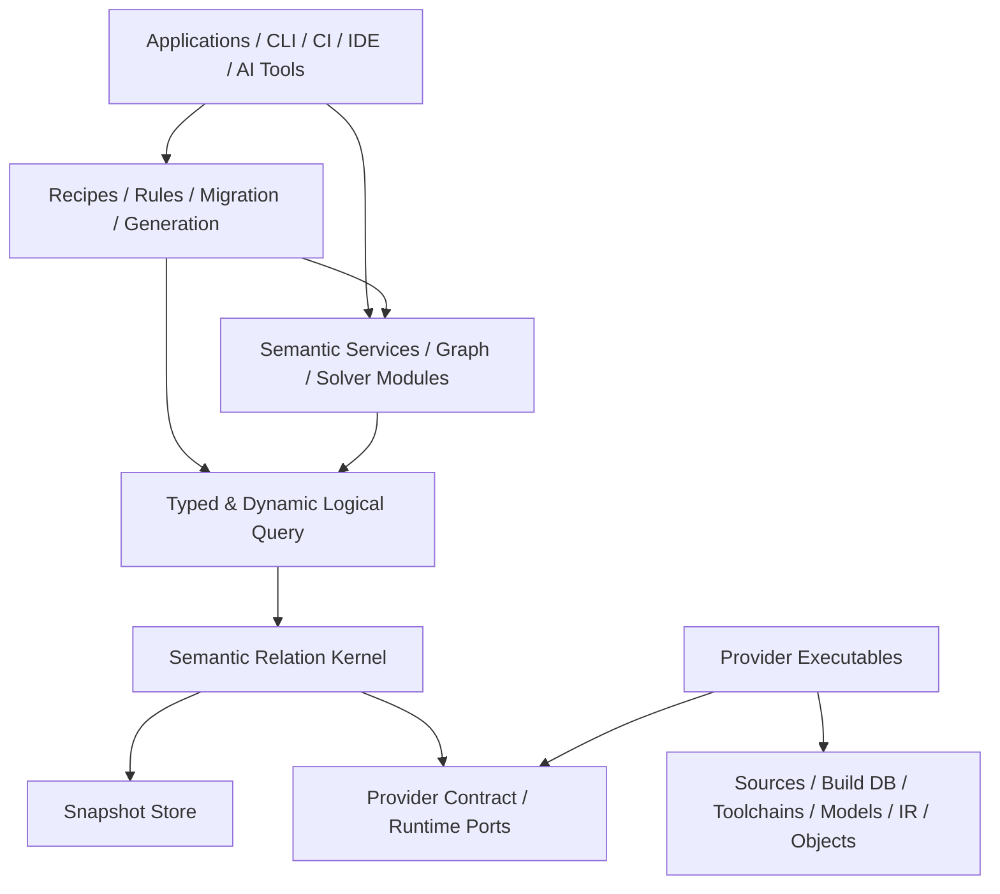
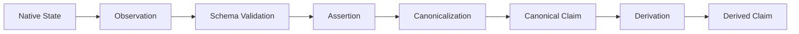
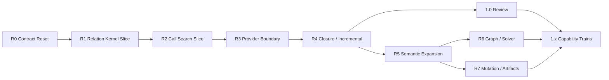

# cxxlens 次世代 Semantic Relation Platform

## 改善版 統合設計書

| 項目 | 値 |
| --- | --- |
| 文書 ID | `CXXLENS-NG-SRAD-002` |
| 文書版 | `1.0.0-normative` |
| 文書状態 | 規範・Issue #57 / Issue #59 / Issue #60 / Issue #61 / Issue #62 / Issue #63 / Issue #64 / Issue #65 / Issue #66 反映版 |
| 対象製品 | 次世代 `cxxlens` |
| 基準言語 | C++23 |
| 初期 primary platform | Linux |
| 初期 reference frontend | Clang 22 |
| 初期 reference store | in-memory / SQLite |
| 設計基準 | `CXXLENS-NG-SRAD-001` と旧 `CXXLENS-SRAD-001` 資産の統合レビュー |
| 作成日 | 2026-07-16 |

本書は Issue #57 により次世代 `cxxlens` の最上位規範へ昇格した。旧
`docs/archive/legacy-v1/design/cxxlens_integrated_design_ja.md` と旧 124 API freeze は移行時の provenance であり、
新規 API、relation、provider、実装 dispatch を認可しない。

---

## 文書の位置付け

本書は、次世代 `cxxlens` の製品境界、安定核、意味的不変条件、release profile、主要外部契約、検証・移行方針を定義する。

本書は、すべての relation 列、wire byte encoding、SQL DDL、solver algorithm、filesystem 実装を一つに固定する文書ではない。詳細契約は次の独立した authority へ分割する。

| Authority | 規範対象 |
| --- | --- |
| 本書 | 製品境界、層、依存方向、意味的不変条件、release profile |
| Relation Registry / IDL | relation key、column、reference、merge、coverage、version |
| Logical Query Contract / IR Schema | operator algebra、ordering、partiality、normalized digest |
| Semantic Guarantee Contract | truth、approximation、verification、condition、provenance の合成 |
| Snapshot / Store Contract | identity DAG、closure binding、publication series、format/compaction |
| Provider Protocol Specification | process protocol、manifest、task、batch、failure |
| Public C++ API Catalog | signature、lifetime、threading、stability |
| Acceptance Manifest | requirement、test、gate、evidence |
| Security Profile / Trust Registries | namespace ownership、certification、discovery、sandbox、support tuple |
| ADR | 選択理由、代替案、未確定実装方式 |
| Examples / Tutorials | 非規範の利用例 |

下位 authority が上位 authority と矛盾する場合、下位 authority を修正する。

---

## 規範キーワード

- **MUST**: 必ず満たす。
- **MUST NOT**: 行ってはならない。
- **SHOULD**: 原則として満たす。逸脱には ADR と代替保証が必要。
- **SHOULD NOT**: 原則として避ける。採用には ADR が必要。
- **MAY**: 任意。
- **INVARIANT**: provider、backend、execution path にかかわらず常に成立する。
- **PROFILE**: release ごとに有効化される能力集合。
- **EXPERIMENTAL**: source/semantic compatibility を約束しない。

---

## 0. 最終設計判断

### 0.1 製品定義

次世代 `cxxlens` は、次の製品である。

> **実際の C/C++ build context に基づく versioned semantic claims を provider から収集し、明示的な condition・provenance・partiality とともに immutable snapshot へ公開し、typed/dynamic logical query と versioned analysis module から利用する Semantic Relation Platform。**

次世代 `cxxlens` の安定核は、特定の lint、search、taint、rewrite、generator ではない。

```text
Project Catalog
+ Condition Universe
+ Versioned Relation Schema
+ Semantic Claims and Provenance
+ Immutable Snapshots
+ Materialization Runtime
+ Logical Query
+ Provider Contract
```

### 0.2 原案からの主要修正

| 項目 | 改善版の判断 |
| --- | --- |
| 初期スコープ | 全機能同時実装ではなく NG0〜NG3 profile へ分割 |
| coverage | provider execution accounting として維持 |
| negation 根拠 | `closure_certificate` を独立導入 |
| truth | policy 未確定の四値表を廃止し support-pair algebra を固定 |
| condition | `condition_universe_id` に必ず bind |
| build variant | provider/frontend identity を含めない |
| provider 差 | `interpretation_domain` を導入し、即 conflict にしない |
| identity | `semantic_key_id` / `assertion_id` / `content_digest` に分離 |
| schema API | generated static API と runtime dynamic API を両方提供 |
| query | logical IR のみ versioned。physical plan は internal |
| ordering | relation は unordered。明示 order/export のみ順序保証 |
| custom reducer | kernel callback ではなく normalization/derivation provider |
| foreign key | hard reference と soft semantic reference を分離 |
| native extension | third-party は専用 worker executable とする |
| transaction | multi-file atomicity ではなく journaled recoverability |
| public targets | 初期は少数の粗い target に限定 |
| ABI | C++ source compatibility と binary ABI を分離 |
| migration | 水平 phase ではなく end-to-end vertical slice を優先 |

### 0.3 Release Profile

#### NG0 — Semantic Relation Kernel

NG0 は 1.0 候補の最小垂直スライスである。ただし NG0 completion だけで distribution 1.0 を
production release してよい、という意味ではない。

- project catalog
- source snapshot
- finite condition universe
- versioned relation registry
- static/dynamic relation access
- observation / assertion / canonical claim
- semantic key / assertion / content identity
- immutable snapshot publication
- in-memory / SQLite parity
- positive logical algebra と total-order boundary query
- custom relation vertical slice
- Clang 22 provider boundary
- evidence / execution coverage / unresolved
- deterministic semantic serialization
- process failure isolation

#### NG1 — Closure and Incrementality

- partition invalidation
- closure certificate
- anti-join / difference / negation
- bounded recursive query
- transitive closure
- production provider protocol
- adjacent provider differential
- multi-process immutable readers

#### NG2 — Analysis Frameworks

- graph algorithms
- CFG
- abstract interpretation
- taint/resource exemplars
- targeted native refinement
- derived relation persistence

#### NG3 — Mutation and Artifacts

- patch plan
- journaled source transaction
- content-addressed artifact plan
- verification provider chain
- migration/mock/fuzz/harness recipes

GCC、LLVM IR、object/binary、remote provider は profile と独立して追加可能だが、NG0 completion の blocker にはしない。

profile と distribution release の対応は次で一意に解釈する。

| Profile | Release role | 1.0 blocker |
| --- | --- | --- |
| NG0 | pre-1.0 で候補化する最小 kernel vertical slice | 必須 |
| NG1 | 1.0 の closure、incrementality、provider production hardening | 必須 |
| NG2 | 1.x へ独立追加可能な analysis capability | 不要 |
| NG3 | 1.x へ独立追加可能な mutation/artifact capability | 不要 |

NG1 は 1.0 release に必須の production hardening である。1.0 review の blocker は R0 から R4 および
G0 から G5、GR であり、R5、R6、R7 は 1.0 blocker ではない。NG2/NG3 の実装や追加は distribution
major を自動的に上げない。accepted stable version axis を破壊するときだけ future major を要求する。

NG0 provider protocol は manifest/digest、major/feature negotiation、bounded frame、deterministic CBOR control、
streaming column chunk、credit backpressure、ACK/同一 task transaction 内 resume、task/batch/group lifecycle、
cancel/deadline、coverage/unresolved、structured failure、process isolation までを含む最小 protocol である。
NG1 は durable resume token、heartbeat、progress-rate enforcement、spill staging、hung worker recovery、
multi-process reader、adjacent provider differential、長時間 conformance を加える。詳細境界と
release/version tuple は `schemas/cxxlens_ng_release_bundle.yaml` を規範とする。

### 0.4 初期非スコープ

NG0 では次を安定契約にしない。

- arbitrary recursive Datalog
- non-stratified negation
- generic abstract interpretation
- whole-program soundness
- distributed store
- remote execution
- stable C++ binary plugin ABI
- arbitrary shared-library native provider loading
- source mutation apply
- artifact publication
- GCC/IR/object の production support
- symbolic presence condition / BDD
- global cost-based optimizer
- stable textual query language

### 0.5 現行資産の扱い

#### 継承する

- root-independent canonical identity
- half-open byte source span
- macro/source origin
- compile unit と build variant
- no-shell compilation database parser
- bounded response/config parsing
- observation と detached semantic value の分離
- evidence / coverage / unresolved
- deterministic scheduler perturbation
- Clang native lifetime confinement
- process worker / prior snapshot preservation
- no-first-wins reducer intent
- in-memory / SQLite parity
- warm-zero provisioning
- stale digest edit precondition
- acceptance manifest 思想

#### 互換性対象から外す

- central `fact_kind`
- `fact_kind::custom`
- opaque string/JSON custom payload
- use-case profile enum
- domain 固定 selector model
- use-case 固定 query stage enum
- single implementation target への全責務集約
- 124 public API exact signature freeze
- physical query plan の wire identity
- framework-specific kernel enum

---

## 1. 製品ゴールと成功基準

### 1.1 利用者

- static analyzer author
- organization-specific rule author
- semantic search / migration tool author
- compiler/frontend provider author
- CI / IDE / review integrator
- security reviewer
- research analysis author
- AI coding agent platform author

### 1.2 成功基準

#### Extension

- 新しい relation を central enum/switch の変更なしで登録できる。
- runtime custom relation が built-in relation と同じ store、query、index、provenance 契約を利用できる。
- generated static type がない relation も dynamic query できる。
- provider executable を kernel source 改修なしで追加できる。
- Clang major の変更が stable semantic API を変更しない。

#### Semantic correctness

- empty rows と complete absence を区別する。
- negation は closure certificate なしに確定しない。
- provider unavailable を empty success にしない。
- same-domain conflict と cross-domain differential disagreement を区別する。
- direct observation と derived claim を区別する。
- condition は明示 universe に bind される。
- approximation、assumption、verification を独立表現する。

#### Operational correctness

- published snapshot は immutable。
- failed materialization は prior snapshot を破壊しない。
- native provider crash は host を破壊しない。
- semantic digest は root、jobs、task order、backend に依存しない。
- unchanged partition は warm run で provider execution を要求しない。
- query は bounded、cancellable、streaming である。

#### Usability

- flagship call search は LLVM header なしで利用できる。
- custom analyzer は static/dynamic query の双方を利用できる。
- provider author は major-specific native SDK 内で compiler API を利用できる。
- result から schema、producer、input、provenance、partiality を追跡できる。

### 1.3 NG0 の代表証明

1. `cc.call_site` と `company.lock.acquire` を同じ logical query で join できる。
2. external relation registration に core source diff が不要である。
3. memory と SQLite が同じ semantic snapshot digest を生成する。
4. jobs 1/2/8、root relocation、cold/warm で semantic output が一致する。
5. Clang worker crash 後も prior snapshot を query できる。
6. incomplete execution 上の absence check が unknown を返す。
7. generated static query と dynamic query が同じ logical IR digest を持つ。
8. frontend/native pointer が observation、batch、snapshot へ入らない。

---

## 2. Core Invariants

### INV-ARCH-001 — Dependency direction

下位 component は上位 use-case component に依存してはならない。

```text
Applications / Recipes
        ↓
Semantic Services / Analysis Modules
        ↓
Logical Query
        ↓
Semantic Relation Kernel
        ↓
Provider Contract / Runtime Ports
```

Provider implementation は provider SDK/contract に依存するが、kernel は provider implementation を link-time dependency にしてはならない。

### INV-ARCH-002 — Kernel ignorance

Kernel は次を知ってはならない。

- Clang AST node kind
- GCC tree code
- LLVM IR class
- gMock/libFuzzer 等の framework
- 特定 lint rule
- 特定 relation ID の列内容
- provider implementation 固有 enum
- UI/SARIF presentation structure

### INV-EXT-001 — Core-independent extension

新 relation/provider/recipe の追加は、中央 enum、switch、registry source list の変更を要求してはならない。installation manifest または engine build configuration の追加は許可する。

### INV-ID-001 — Stable semantic identity

semantic identity は次へ依存してはならない。

- absolute checkout root
- pointer/address
- timestamp
- PID/thread ID
- task completion order
- hash table iteration
- display prose
- provider arrival order

### INV-SOURCE-001 — Source coordinate

authoritative source coordinate は immutable source snapshot に bind された half-open byte range `[begin,end)` とする。

### INV-NATIVE-001 — Native lifetime confinement

compiler-native object、pointer、reference、address、ABI-dependent handle は provider job/callback/thread 境界を越えてはならない。

### INV-CLAIM-001 — Claim stages

observation、assertion、canonical claim、derived claim を同一状態として扱ってはならない。

### INV-PARTIAL-001 — No silent omission

unsupported、unavailable、failed、truncated、stale、open-world を empty success として表してはならない。

### INV-PARTIAL-002 — No inferred absence

closure certificate がない relation domain で、row 不在から false/true を推測してはならない。

### INV-MERGE-001 — No first-wins

same-domain semantic disagreement を priority、arrival order、task orderで隠してはならない。

### INV-SNAPSHOT-001 — Immutability

published snapshot の semantic content は変更してはならない。

### INV-SNAPSHOT-002 — Failure isolation

failed/cancelled/rejected materialization は既存 published snapshot を破壊してはならない。

### INV-QUERY-001 — Logical/physical separation

versioned Query IR は logical semantics のみを表す。index、join algorithm、spill、thread schedule 等の physical decision を authority にしてはならない。

### INV-DETERMINISM-001 — Semantic reproducibility

同じ semantic inputs、registry、provider binaries/semantics、configuration に対する semantic output は、parallelism、task order、backend、root relocation で変化してはならない。

### INV-ABI-001 — Native type isolation

stable public semantic header は LLVM/Clang/GCC native type layout に依存してはならない。

### INV-MUTATION-001 — Plan-first effect

source/artifact effect は immutable plan、precondition、verification、journaled transaction を経由しなければならない。NG0 では effect apply を提供しない。

---

## 3. 論理アーキテクチャ

### 3.1 Layer



矢印は compile/link dependency ではなく利用方向を示す。provider executable は kernel library の下位実装ではなく、protocol peer である。

### 3.2 Component responsibilities

#### `base`

- typed IDs
- semantic version
- canonical encoding
- errors/diagnostics
- evidence references
- budgets
- capability descriptors

#### `kernel`

- project catalog
- source snapshots
- condition universe
- relation registry
- claim validation
- snapshot store port
- materialization session
- provider planning/runtime port
- execution coverage
- closure certificate registry

#### `query`

- generated static DSL
- dynamic DSL
- logical Query IR
- type validation
- execution API
- physical planner interface
- cursor/result model

#### `cpp`

- standard C/C++ relation descriptors
- canonicalization providers
- semantic services
- identity contracts

#### `provider_sdk`

- provider manifest/task/batch value types
- protocol client/server helpers
- relation sink
- native SDK shared utilities
- conformance harness

#### `recipes`

- flagship semantic search
- optional rule/report adapters
- no kernel-private access

### 3.3 Initial public CMake targets

```text
cxxlens::base
cxxlens::kernel
cxxlens::query
cxxlens::cpp
cxxlens::provider_sdk
cxxlens::recipes
cxxlens::cxxlens       INTERFACE aggregate of base/kernel/query/cpp
```

Provider package examples:

```text
cxxlens-clang-worker-22
cxxlens-provider-clang22-sdk
```

`cxxlens::cxxlens` は provider executable、native SDK、recipes を強制 link してはならない。
`cxxlens::provider_sdk` は ADR 0089 により relation、snapshot、Logical Query、provider、testing、recipe を束ねる
高水準 author SDK とし、direct public dependency は `cxxlens::cxxlens` と `cxxlens::recipes` とする。
compiler-native surface は引き続き major-specific native SDK だけに隔離する。

1.0 の source compatibility authority は installed public header とする。C++ module は 1.0 の installed
stable surface に含めない。module surface を提供する場合は `experimental` とし、header authority と同値で
あることを別 gate で証明してから昇格する。native SDK は compiler/provider major ごとの別 package とし、
umbrella target に含めない。

### 3.4 Physical package rule

内部 target は public target より細分化してよい。dependency graph は CI で検証し、cycle を禁止する。

```text
base
schema
project
condition
claims
store-port
store-memory
store-sqlite
materialize
query-ir
query-exec
cpp-relations
cpp-normalizer
provider-protocol
provider-runtime
```

public target 数と internal package 数を同一にしない。

---

## 4. 用語

| 用語 | 定義 |
| --- | --- |
| Project Catalog | compile unit、source input、toolchain context、variant を保持する immutable catalog |
| Compile Unit | main source と一つの effective invocation の組 |
| Build Variant | 製品の declaration/semantic に影響する build context の canonical identity |
| Toolchain Context | production compiler、target、builtins、ABI、plugin/spec 等の build authority |
| Condition Universe | 一つの catalog generation に属する build variant atom の有限集合 |
| Presence Condition | condition universe 上で claim が成立する variant subset |
| Interpretation Domain | claim がどの semantic interpretation/authority の下で成立するかを表す ID |
| Observation | 一回の provider job が生成する provider-local record |
| Assertion | schema-valid で直接 observation に基づく claim |
| Canonical Claim | standard semantics に正規化された claim |
| Derived Claim | query/analysis/provider が入力 claim から導出した claim |
| Semantic Key | relation 内の同一意味対象を表す key identity |
| Assertion ID | condition、interpretation、producer semantics を含む claim identity |
| Content Digest | assertion の authoritative payload digest |
| Relation | versioned schema を持つ claim set |
| Partition | materialization/invalidation の単位 |
| Snapshot | relation partitions を原子的に固定した immutable semantic view |
| Execution Coverage | requested work unit がどう処理されたかの会計 |
| Closure Certificate | 指定 domain で absence を確定できる根拠 |
| Unresolved | 入力不足、unsupported、open world、budget 等の未解決状態 |
| Claim Conflict | 同じ interpretation domain の functional claim が両立しない状態 |
| Differential Disagreement | 異なる interpretation domain/provider view の差 |
| Provider | relation delta、coverage、certificate を生成する executable/module |
| Recipe | query/semantic service/plan を組み合わせた高水準機能 |

---

## 5. Identity and Canonical Encoding

### 5.1 Strong IDs

authoritative ID は strong type とする。

```cpp
template<class Tag>
class typed_id;
```

最低限:

```text
project_id
catalog_id
compile_unit_id
build_variant_id
toolchain_context_id
condition_universe_id
condition_id
interpretation_domain_id
source_snapshot_id
file_id
source_span_id
relation_name
relation_descriptor_id
semantic_key_id
assertion_id
content_digest
snapshot_id
partition_id
provider_id
provider_execution_id
query_id
recipe_id
evidence_id
closure_certificate_id
```

### 5.2 Three-part claim identity

```text
semantic_key_id = H(
    relation name,
    relation semantic major,
    authoritative key tuple
)

assertion_id = H(
    semantic_key_id,
    condition universe,
    canonical condition,
    interpretation domain,
    producer semantic contract
)

content_digest = H(
    assertion_id,
    authoritative payload tuple
)
```

display fields、operational metrics、containing snapshot ID は含めない。

### 5.3 Canonical tuple

hash input は versioned length-prefixed binary tuple とする。

MUST:

- schema-defined field order
- explicit type tags
- canonical integer encoding
- UTF-8 policy for semantic strings
- bytes as bytes
- sorted unique set
- sorted map keys
- explicit optional tag
- stable symbolic enum ID
- domain separation
- full digest storage

`canonical_value` は closed `kind` と active payload を構造的に bind し、inactive field は default/empty でなければならない。
tuple child を含む全値を encoder 入口で再帰検証し、範囲外 kind、invalid UTF-8、inactive payload は
`sdk.canonical-value-invalid` として bytes/digest を生成する前に拒否する。valid value の value equality と canonical byte equality
は一致し、不正 child を zero-length item として取り込んではならない。

MUST NOT:

- JSON text を identity authority にする
- locale-dependent formatting
- float を primary/semantic key に使う
- unordered container iteration に依存する
- display path/prose を含める

relation result ID は accepted `domain_identity.result_column` と ordered `projection` を runtime descriptor に保持し、
`sdk::derive_domain_identity(descriptor,row)` で導出する。domain tag は result column の `typed_id<X_id>` から
`_id` を除き、`_` を `-` に変換した値とする。optional absent は canonical null とし、unknown、required projection
欠落、result mismatch は fail closed とする。provider は hidden task/variant metadata を projection 外から混ぜず、
`sdk::validate_domain_identity` で result cell と row projection の exact 一致を独立再検証する。

semantic floating value を許可する relation は、NaN、signed zero、endianness を schema で定義する。NG0 standard relation は authoritative float を使用しない。

caller-supplied domain と byte payload を受ける `semantic_digest` は ADR 0016 の
`cxxlens-semantic-digest-v2` tuple（contract tag、UTF-8 domain、bytes payload）を使用する。domain は
`^[a-z][a-z0-9_.-]*$` とし、invalid domain は `sdk.semantic-domain-invalid` で拒否する。v2 の serialized form は
`semantic-v2:sha256:<64 lowercase hex>` であり、legacy の NUL-separated `sha256:` value と同一 namespace へ
silent rehash してはならない。legacy value は canonical source から明示的に再計算できる場合だけ移行する。

project catalog は ADR 0063 と `schemas/cxxlens_ng_project_catalog_contract.yaml` を authority とする。compile unit entry は catalog input census 内で stable な
`compile_unit_id` と exact invocation/source/environment digest を保持する。この ID は project より上流の catalog-local input identity であり、
Relation Registry の authoritative payload から導出する final `build.compile_unit.v1.compile_unit` ID の equality alias ではない。consumer は
entry の invocation/source/environment digest と final relation row を exact に cross-bind し、両 ID の明示 mapping を保持する。
catalog projection は contract tag、logical root、catalog
environment digest、compile-unit ID byte order の全 entry を canonical binary tuple で encode する。duplicate/conflict は拒否し、
`catalog_digest` は semantic digest v2、`catalog_id` は `catalog:` + exact digest とする。loader と validator は同一 codec を使い、provider
task は `task_accepted` より前に bottom-up 再計算する。`build.project` は catalog ID/digest/root/environment を同じ validated value から
写像し、別 authority や first-wins fallback を持たない。catalog entry ID を final relation ID と暗黙に同一視して project/catalog/variant/
compile-unit の hash fixed point を要求してはならない。

### 5.4 Path domains

path は単なる host absolute string ではなく domain 付き logical path とする。

```text
project://
build://
toolchain://
sysroot://
generated://
provider://
external://
```

`file_id` は path domain、normalized logical path、path contract version から作る。host mount path は evidence/operational metadata とする。

### 5.5 Semantic and operational data

#### Semantic

- IDs
- relation descriptor digest
- claim key/payload
- condition
- interpretation domain
- unresolved stable code
- execution coverage classification
- closure certificate
- assumptions
- verification level

#### Operational

- timestamp
- elapsed time
- PID
- worker host
- scheduling order
- cache lookup latency
- memory sample

operational data は semantic digest に含めない。

---

## 6. Source Model

### 6.1 Source snapshot

```cpp
struct source_file_snapshot {
    file_id file;
    source_snapshot_id snapshot;
    content_digest content;
    std::uint64_t size;
    source_encoding encoding;
    line_index_id line_index;
};
```

source content は path 上の mutable file ではなく immutable blob として扱う。

encoding は少なくとも次を表現する。

```text
utf8
utf16le
utf16be
locale_dependent
binary_or_unknown
```

compiler が byte stream として解釈した内容を authority とし、display conversion failure を semantic data loss にしてはならない。

### 6.2 Source span

```cpp
struct source_span_ref {
    source_snapshot_id snapshot;
    file_id file;
    std::uint64_t begin;
    std::uint64_t end;
    source_range_role role;
    origin_id origin;
    bool read_only;
};
```

`source.span.v1.span` は `sdk::source_span_identity(snapshot, file, begin, end, role)` を共有 authority とし、
`canonical_identity_digest("source-span", [snapshot,file,begin,end,role])` で導出する。logical path、checkout root、
provider-local path は identity projection に含めない。source snapshot、file、role のいずれかが欠ける場合は span ID を
捏造せず fail closed とする。Clang native input と worker task wire は exact snapshot/file を運び、range role は
normalization call ごとに明示する。

- range は `[begin,end)`
- line/column は projection
- invalid span は fabricated default に置き換えない
- source snapshot mismatch は stale
- source excerpt は privacy policy に従う

### 6.3 Origin graph

標準 origin kind:

```text
spelled_from
expanded_from
macro_argument_from
macro_body_from
instantiated_from
generated_from
inlined_from
lowered_from
imported_from
```

origin graph は DAG とする。cycle は batch rejection。

many-to-many mapping を許可し、一つの「元位置」へ潰さない。

---

## 7. Project Catalog and Build Context

### 7.1 Catalog opening

Project Catalog は compilation database、source roots、path maps、environment policy、toolchain policy から構築する。

MUST:

- shell を実行しない
- `arguments` array を優先
- command string は bounded tokenizer
- response file を size/depth/count budget 下で展開
- duplicate JSON key、invalid Unicode、oversized input を拒否
- distinct command を保持
- raw/normalized/effective invocation を区別
- mutable input digest を保持
- unresolved executable/generated input を明示

### 7.2 Invocation forms

```cpp
struct compile_invocation {
    raw_invocation raw;
    normalized_invocation normalized;
    effective_invocation effective;
};
```

#### Raw

入力監査用。直接実行しない。

#### Normalized

- tokenization
- response expansion
- option classification
- wrapper detection
- lexical path normalization
- semantic/nonsemantic flag classification

#### Effective

- sandbox logical paths
- executable resolution
- path map
- rematerialized response file
- output action redirection
- environment allowlist
- trust profile

Provider は effective invocation を使用する。

### 7.3 Build Variant

Build Variant は製品の language semantics に影響する入力から作る。

候補:

```text
language and standard
target triple
ABI/data layout
predefined macros
-D/-U
include search identity
forced include
PCH/module inputs
sysroot
language-affecting flags
production toolchain semantic mode
product plugin/spec identity when authoritative
```

MUST NOT include:

- analysis provider executable ID
- analysis task order
- output path
- dependency file path
- elapsed/runtime metadata

flag を variant key から除外する場合、versioned argument classification registry と fixture が必要である。optimization flag は predefined macro 等へ影響し得るため、無条件に除外してはならない。

### 7.4 Toolchain Context

```text
compiler family
exact version/build
target
builtin header identity
sysroot
ABI
plugin/spec/wrapper identity
language runtime assumptions
```

production toolchain context と analysis provider identity を分離する。

### 7.5 Environment Identity

environment は allowlist を既定とする。

- semantic value のみ identity 対象
- secret は raw value を保存しない
- secret-dependent semantics が不可避な場合は workspace-local keyed fingerprint
- `LD_PRELOAD` 等の code injection variable は explicit trust profile がない限り拒否
- locale は diagnostics と tokenization へ影響する場合に固定

---

## 8. Condition Universe and Presence Conditions

### 8.1 Universe

一つの catalog generation は `condition_universe_id` を持つ。

```cpp
struct condition_universe {
    condition_universe_id id;
    catalog_id catalog;
    semantic_version semantics;
    std::vector<build_variant_id> atoms;
};
```

atoms は canonical sorted unique。

### 8.2 Condition reference

```cpp
struct condition_ref {
    condition_universe_id universe;
    condition_id condition;
};
```

異なる universe の condition を暗黙比較してはならない。

### 8.3 NG0 representation

NG0 は finite variant set のみを規範化する。

semantic representation:

```text
canonical sorted set of build_variant_id
```

physical representation:

- interned bitset
- roaring bitmap
- sorted vector

のいずれでもよい。physical bit position は semantic identity ではない。

### 8.4 Operations

```cpp
class condition_registry {
public:
    condition_ref none(condition_universe_id);
    condition_ref all(condition_universe_id);
    condition_ref variant(condition_universe_id, build_variant_id);
    condition_ref set(condition_universe_id,
                      std::span<const build_variant_id>);
    result<condition_ref> unite(condition_ref, condition_ref);
    result<condition_ref> intersect(condition_ref, condition_ref);
    result<condition_ref> difference(condition_ref, condition_ref);
    result<condition_ref> negate(condition_ref);
    result<bool> overlaps(condition_ref, condition_ref) const;
    result<bool> contains(condition_ref, condition_ref) const;
};
```

### 8.5 Universe rebase

catalog 更新後は新 universe を作る。

rebase operation は:

- common variant atoms
- removed atoms
- added atoms
- unmapped atoms

を明示する。旧 `all` を新 `all` と同一視しない。

### 8.6 Canonical condition fragments

coverage、conflict、closure を集計する場合、overlapping conditions を disjoint canonical fragments へ分割する。

同じ `(domain,key,fragment)` を複数 execution coverage state に分類してはならない。

---

## 9. Relation Schema System

### 9.1 Relation identity

```text
relation name: namespaced stable string
semantic major: key/meaning/invariant compatibility
descriptor version: exact major.minor.patch
descriptor digest: exact schema bytes/semantics
```

例:

```text
cc.call_site
semantic major 1
descriptor 1.2.0
```

logical query は relation name + compatible major/minor requirement を参照し、snapshot は exact descriptor digest を記録する。

### 9.2 Static and dynamic API

#### Static generated API

build-time に known な schema は C++ tag/view/builder を生成する。

```cpp
using R = cxxlens::cc::relations::call_site;
auto q = query::from<R>();
```

#### Dynamic API

runtime-discovered schema は descriptor/column stable ID から操作する。

```cpp
auto relation = registry.require("company.lock.acquire", major{1});
auto lock = relation.column("lock");
auto q = dynamic_query::from(relation).project(lock);
```

両 API は同じ logical IR を生成する。

### 9.3 Descriptor

relation descriptor は最低限次を持つ。

```text
name
version
semantics ID
stability
owner namespace
column descriptors
authoritative key
functional/multivalued classification
reference descriptors
condition column policy
interpretation policy
merge policy
partition hints
index hints
coverage domain
closure kinds
provenance minimum
evolution policy
```

descriptor collection のうち `columns`、`references`、`conflict_columns` は投入順に意味を持たず、canonical form では
各 serialized record の全 field を含む strict total order へ整列する。一方、`key_columns`、domain identity projection、
各 reference 内の source/target column list は位置対応を持つ sequence なので順序を保持する。reference の比較が equivalent
となるのは serialized reference が同一の場合だけでなければならない。

### 9.4 Column types

NG0 scalar:

```text
bool
signed/unsigned integer
utf8_string
bytes
digest
semantic_version
typed_id
open_symbol
condition_ref
source_span_id
evidence_id
```

NG0 container:

```text
optional<T>
list<T>
set<T>
struct<T>
```

NG0 では arbitrary map、nested union、float key を standard relation で使用しない。

set は canonical sorted unique。`detached_cell` の byte-backed `set<T>` は empty set を zero bytes、それ以外を
`u32 little-endian element length || UTF-8 element bytes` の連結で表し、element byte 列は strict ascending / unique とする。
各 element は nested `T` の scalar contract で再検証し、truncated length、empty element、重複、逆順、invalid UTF-8、invalid
digest/ID/symbol を拒否する。list は order が semantics の一部である場合だけ使う。

present scalar は `detached-cell-value-v2` を共通 authority とする。digest は `sha256:` または
`semantic-v2:sha256:` と lowercase 64 hex、semantic version は leading zero のない u32 `major.minor.patch`、typed ID は canonical
`*_id` parameter と nonempty/control-free UTF-8 value、unknown reason も nonempty/control-free UTF-8 を要求する。general
`utf8_string` は strict Unicode scalar sequence を要求するが、JSON codec が表現できる control code 自体の意味制約は column
schema が所有する。この検査は row builder、dynamic row、Logical Query literal、provider decode、store reopen で同一である。

### 9.5 Open and closed symbols

- open symbol: unknown value を保持できる。minor で symbol 追加可能。
- closed symbol: exhaustive set。symbol 追加は major change。

closed symbol は `symbol_contracts` の exact membership を必要とし、未知 contract/value は context-free `detached_cell` 境界でも
fail closed とする。open symbol は canonical contract ID と nonempty/control-free UTF-8 value を満たせば未知値を保持する。

generated C++ API は open symbol を raw `enum class` のみで表してはならない。

### 9.6 Key and claim cardinality

#### Multivalued relation

複数 row が自然に成立する。区別に必要な列を key に含める。

例:

```text
cc.call_possible_target key = call + target + condition
```

#### Functional assertion

同じ key/condition/interpretation で authoritative payload は一つであるべき。

payload が異なる場合は claim conflict。

schema は functional dependency を明示する。

### 9.7 References

#### Hard reference

同一 staged snapshot 内で解決必須。

欠落時:

- batch rejection
- schema error

#### Soft semantic reference

外部世界、未 materialize relation、provider limitation により欠落可能。

欠落時:

- row は保持可能
- unresolved item と evidence が必須
- closure を主張できない

### 9.8 Declarative merge modes

NG0 kernel merge:

```text
set
multiset
functional_assertion
keyed_union
operational_last_writer
```

`operational_last_writer` は semantic relation に使用してはならない。

arbitrary custom reducer callback は kernel に登録しない。任意 normalization は versioned provider とする。

### 9.9 Schema registration

- engine build 前に registry を構築
- registry digest を engine/snapshot へ bind
- duplicate name/version/digest mismatch を拒否
- incompatible key change を拒否
- hard reference cycle を検証
- runtime execution 中の registry mutation を禁止
- schema 追加には新 engine generation が必要

### 9.10 Evolution

#### Patch

- documentation correction
- test metadata
- validation message
- accepted semantic value setを変えない

validation tightening/looseningで row acceptance が変わる場合、patch にしてはならない。

#### Minor

- optional column
- index/partition hint
- open symbol追加
- optional capability
- unknown-preserving additive metadata

#### Major

- key変更
- column semantics変更
- required column
- functional/multivalued変更
- condition semantics変更
- closure interpretation変更
- identity contract変更
- closed symbol追加
- source coordinate semantics変更

### 9.11 NG0 exact registry と claim envelope

Issue #60 で accepted となった exact authority は
`schemas/cxxlens_ng_relation_registry.yaml`（`cxxlens.relation-registry.v1`）である。全 user relation は
system claim envelope を共有し、condition authority は `envelope-presence-only` とする。relation payload に
`presence` / `condition_ref` を重複させない。system column は通常の user projection から除外し、明示要求時だけ
stable system column ID で参照する。

Issue #63 / ADR 0009 により system claim envelope は `cxxlens.claim-envelope.v2` へ更新された。producer input
は `producer_input_basis` の tagged direct/derived variant とし、direct observation に snapshot ID を要求しない。
derived claim だけが strict-prior published snapshot と consumed partition content digest を保持できる。

Issue #130 / ADR 0058 により claim envelope の全 text surface は common の `validate_utf8_text()`、
`validate_strong_id()`、`validate_registered_symbol()` を共有する。strong ID は nonempty、strict UTF-8、control-free、最大512
Unicode scalar、registered symbol は `[a-z][a-z0-9_.-]+` とする。public builder、aggregate revalidation、stage constructor、store
adoption は identity encoding より前に同じ検査を行い、checked canonical string/JSON encoder は invalid UTF-8 を escape によって
別 Unicode textへ救済しない。delimiter の printable character は typed framing で扱い、schema が許可する値を追加禁止しない。

static generated API と runtime dynamic API は同じ descriptor/column ID を使用し、Logical Query IR もその ID を
operand とする。descriptor digest は exact descriptor の canonical projection から計算する。unknown open symbol と
minor optional column は保持し、unknown closed symbol、minor required column、key/cardinality/condition/identity の
変更は fail closed または semantic major change とする。

Issue #154 / ADR 0085 により `static_row_view<Relation>::get<Column>()` は descriptor IDだけをtrusted preconditionにしない。
Columnのdescriptor/存在/exact typeを検証し、`validate_row(Relation::descriptor(), row)` でrow全体のrequired/unknown columnと
全cell scalar/state/typeを再検証した後だけvalue-owned cellを返す。optional column欠落だけはexact optional typeのabsentを返す。
wrong type、invalid digest/closed symbol/UTF-8、同一majorの別descriptor shape、foreign Columnはdynamic validationと同じstable errorで
fail closedにし、validated rowではdynamic/static readのcanonical valueが一致しなければならない。

Issue #74 / ADR 0017 により descriptor identity は authority contract digest と runtime が実際に使用する
`canonical_form()` の双方を `cxxlens.relation-descriptor-binding.v2` で bind する。generated descriptor の
authority digestを保持したまま column/key/reference/merge/conflict/semanticsを改変した場合は
`sdk.descriptor-digest-mismatch` で拒否し、registry digest はこの bound descriptor digest 集合から構成する。

Issue #75 / ADR 0018 により runtime descriptor validator は relation IDL の runtime projection と同じ ASCII
pattern、`semantic_major >= 1`、unique key/reference/conflict list、claim-key role parity、merge/cardinality conflict
projectionを検査する。functional assertion の conflict columns は全 authoritative payload と exact一致し、
非 functional mergeでは空とする。reference の `hard` は `on_missing: reject_batch`、`soft_semantic` は
`on_missing: unresolved` の型付き projectionであり、runtimeで別の silent policyを選択できない。schema-invalid
dynamic descriptorは digest計算済みであっても registry adoption 前に stable `sdk.*-invalid` categoryで拒否する。

registry の build-time generation は descriptor document または installation manifest を探索する。external
relation の追加に中央 enum、switch、source list の変更を要求してはならない。hard reference は staged/base
snapshot で解決できなければ batch reject、soft semantic reference は row と `core.unresolved` をともに保持する。

---

## 10. Relation IDL Example

```yaml
schema: cxxlens.relation-registry.v1
system_claim_envelope:
  condition_authority: envelope-presence-only
  columns:
    - {id: system.claim.v2.presence, name: presence, type: condition_ref}
    - {id: system.claim.v2.producer_input_basis, name: producer_input_basis,
       type: tagged<producer-input-basis/1>}
relations:
  - descriptor_id: cc.call_site.v1
    name: cc.call_site
    version: 1.0.0
    claim:
      cardinality: functional_assertion
      key: [cc.call_site.v1.call]
      condition_policy: claim-envelope-required
    columns:
      - {id: cc.call_site.v1.call, name: call, type: typed_id<cc_call_id>}
      - {id: cc.call_site.v1.compile_unit, name: compile_unit,
         type: typed_id<compile_unit_id>}
      - {id: cc.call_site.v1.caller, name: caller,
         type: optional<typed_id<cc_entity_id>>}
      - {id: cc.call_site.v1.kind, name: kind, type: open_symbol<cc.call-kind/1>}
      - {id: cc.call_site.v1.source, name: source, type: typed_id<source_span_id>}
      - {id: cc.call_site.v1.receiver_static_type, name: receiver_static_type,
         type: optional<typed_id<cc_type_id>>}
      - {id: cc.call_site.v1.ordinal, name: ordinal, type: uint64}
    partition:
      suggested_keys: [cc.call_site.v1.compile_unit]
      condition_fragment: envelope
      interpretation_domain: envelope

  - descriptor_id: cc.call_direct_target.v1
    name: cc.call_direct_target
    version: 1.0.0
    claim:
      cardinality: functional_assertion
      key: [cc.call_direct_target.v1.call]
      condition_policy: claim-envelope-required
    columns:
      - {id: cc.call_direct_target.v1.call, name: call, type: typed_id<cc_call_id>}
      - {id: cc.call_direct_target.v1.target, name: target,
         type: typed_id<cc_entity_id>}
      - {id: cc.call_direct_target.v1.resolution, name: resolution,
         type: open_symbol<cc.direct-target-resolution/1>}
```

上記は call model の抜粋である。全列、reference、merge、coverage、closure、provenance、evolution の exact
authority は registry 本体とする。physical index、SQL table、wire layout は authority に含めない。

---

## 11. Claim and Provenance Model

### 11.1 Pipeline



### 11.2 Observation

- provider/job local
- provider-specific schema
- native pointer禁止
- compile unit / variant / source ownership必須
- batch atomic
- permanent canonical identityを要求しない
- exact provider executionへ trace

### 11.3 Assertion

- schema-valid
- direct observation に基づく
- producer semantics を保持
- provider-owned namespace でもよい
- interpretation domain を持つ

### 11.4 Canonical claim

- standard relation semantics に適合
- canonicalizer producer を保持
- input assertions を provenance に保持
- provider wording/native ID を authoritative payload にしない
- canonicalization不能時は provider-local claimを保持し、捏造しない

Issue #93 / ADR 0036 により、入力 claim を受け取る stage constructor は stage 固有判定と出力 encoding より前に共通の
independent input validation を実行する。`make_canonical_claim()` は入力 assertion の row、descriptor、condition、interpretation、
producer、basis、guarantee、semantic key/assertion/content identity を `validate_claim()` で再検証する。
`make_derived_claim()` も全入力に同じ policy を適用し、同じ invalid input は同じ validation error で拒否する。

### 11.5 Derived claim

- input semantic keys/assertions/content digests を保持
- derivation provider/version を保持
- assumptions/precision を保持
- invalidation key を計算可能
- fixed-pointの場合は convergence summary を保持

### 11.6 Claim envelope

```cpp
struct direct_input_basis {
    content_digest basis_digest;
};

struct derived_input_basis {
    snapshot_id input_snapshot; // strict-prior published snapshot only
    std::vector<content_digest> consumed_partition_contents;
    content_digest transform_semantics;
};

struct claim_envelope {
    relation_descriptor_id descriptor;
    semantic_key_id semantic_key;
    assertion_id assertion;
    content_digest content;
    condition_ref presence;
    interpretation_domain_id interpretation;
    producer_ref producer;
    std::variant<direct_input_basis, derived_input_basis> producer_input_basis;
    evidence_id provenance_root;
    guarantee guarantee;
};
```

`producer_input_basis` の exact schema は `schemas/cxxlens_ng_claim_envelope.schema.yaml` と
`schemas/cxxlens_ng_snapshot_store_contract.yaml` が所有する。direct basis は source/invocation/toolchain 等の
semantic input digest を持ち snapshot を持たない。derived basis の `input_snapshot` は出力を収容する snapshot
より前の generation でなければならない。containing snapshot ID は store association として管理し、claim、
basis、certificate の identity に含めない。

Issue #94 / ADR 0037 により semantic claim set と evidence occurrence set を分離する。非 multiset relation の claim set は
canonical sorted unique content ID 集合とし、claim envelope 全 field が完全一致する occurrence だけを deduplicate する。同じ
content でも producer ID、input basis、provenance、guarantee、stage が異なる occurrence は canonical total order ですべて保持し、
batch content identity v2 は公開 `claim_batch_content_encoding()` と、それだけを hash する `claim_batch_content_digest()` が所有する。
schema tag、claims、unresolved references、conflicts、differential disagreements の4 collectionを `canonical_value` の型付き
self-delimiting tuple として符号化し、各 record の全 field と collection count を bind する。record は canonical total order、内部 set は
canonical sorted unique とし、claim の multiplicity は relation law を維持する。したがって区切り文字や NUL を semantic string から禁止せず、
prose 連結にも依存しない。公開 `canonical_binary_decode()` は一つの完全な minimal encoding だけを受理し、replay は
encode→decode→encode の byte-for-byte 一致を検証できる。
multiset relation の multiplicity law は変更しない。

Issue #155 / ADR 0086 により、evidence occurrence の subject と cardinality を明確化する。public/persisted claim model の occurrence は
別 record への occurrence ID reference ではなく、descriptor、semantic key、assertion、content、row、producer、basis、provenance、
guarantee、stage を同じ record に持つ self-contained claim envelope である。subject kind は closed な `claim-envelope` 一種類で、
row-only detached evidence record は存在しない。一 occurrence はちょうど一 semantic claim content に属し、複数 occurrence が同じ content
を支持できるが、一 occurrence を異なる content 間で共有しない。従って reference union と evidence record set は構造上同一であり、
missing、orphan、ambiguous resolution は表現不能である。builder、Store adoption、persisted partition-envelope load は同じ
`validate_claim()` により subject identities と row を再計算し、別 claim への付け替えを拒否する。

### 11.7 Evidence graph

node kinds:

```text
source_observation
compile_context
provider_execution
canonicalization
model_assumption
derivation
user_configuration
dynamic_observation
verification
exclusion
closure_proof
```

DAG とする。fixed-point は iteration summary node へ圧縮できる。

retention policy:

```text
full
compressed
summary
```

finding/plan は原則 full、bulk relation は descriptor/policy に従う。

---

## 12. Interpretation Domain, Authority, Conflict

### 12.1 Interpretation domain

claim の semantic authority を表す。

例:

```text
cc.canonical/1 + production GCC toolchain context
cc.canonical/1 + Clang approximation
frontend.clang22.native/1
ir.llvm22.optimized/1
dynamic.runtime-observation/1
```

provider implementation version と interpretation domain を同一視しない。certified provider が同じ semantic contract を実装する場合、同じ domain を宣言できる。

### 12.2 Provider-owned observation

未 certified provider は provider-owned namespace/domain へ出力する。standard canonical relation を直接出す場合、relation-specific conformance level を満たさなければならない。

### 12.3 Same-domain claim conflict

次をすべて満たす場合に `core.claim_conflict` を生成する。

- same relation semantic major
- same semantic key
- overlapping presence condition
- same interpretation domain
- functional assertion relation
- authoritative payload mismatch

overlap condition だけを conflict fragment とし、非overlap fragment の claim は保持する。

Issue #76 / ADR 0019 により batch commit の比較集合は accepted new claims と既存 snapshot claims の和集合とし、
少なくとも片側が new claimである全 functional pairへ同じ overlap/payload/interpretation classificationを適用する。
existing-existingの既知 disagreementは再掲しない。pairの左右、conflict/differential record、batch content identity入力はclaimの
canonical orderで固定し、同じclaim集合をone-shot ingestionしても複数publicationへ分割しても、new claimが
関与する最終classificationは一致しなければならない。exact duplicateとsame payloadはconflictではない。

Issue #77 / ADR 0020 により query runtime が snapshot annotation から再構成する conflict/differential side
channelもclaim kernelと同じdescriptor `conflict_columns` canonical tuple digestを使用する。claim `content` IDは
condition、interpretation、producer contractを含むoccurrence identityであり、functional payload equalityへ使用して
はならない。queryとingestionは同じannotation集合についてrelation name、semantic key、pair orientation、overlap
fragments、assertion/content pairを含む同一classificationを返す。

### 12.4 Differential disagreement

異なる interpretation domain の結果差は `core.differential_disagreement` とする。

分類:

```text
missing_claim
additional_claim
key_mismatch
payload_mismatch
condition_mismatch
source_mismatch
guarantee_mismatch
closure_mismatch
```

### 12.5 Selection policy

```text
authoritative_exact
preferred_approximation
merge_same_domain
differential_compare
all_independent
```

arrival order は選択根拠にしない。

selected policy、provider candidates、rejection reason は explain 可能でなければならない。

---

## 13. Truth and Guarantee

### 13.1 Truth support

exact authority は `schemas/cxxlens_ng_semantic_guarantee_contract.yaml` と ADR 0008 である。

boolean claim/check の truth は二ビット support として定義する。

```cpp
struct truth_support {
    bool supports_true;
    bool supports_false;
};
```

名称:

```text
unknown  = {0,0}
true     = {1,0}
false    = {0,1}
conflict = {1,1}
```

knowledge order は support の componentwise inclusion（bottom `unknown`、top `conflict`）、truth order は
negative support reversed / positive support forward（bottom `false`、top `true`）とする。二つの order を混同しない。

### 13.2 Operators

```text
NOT(t,f) = (f,t)

AND((t1,f1),(t2,f2))
  = (t1 AND t2, f1 OR f2)

OR((t1,f1),(t2,f2))
  = (t1 OR t2, f1 AND f2)
```

全 truth table は Appendix A を authority とする。

planner/backend が unknown/conflict を false に coerce してはならない。

複数 evidence の集約は positive/negative support をそれぞれ union する。したがって true evidence と false
evidence の併存は conflict であり、arrival order や preferred provider policy で false/true に上書きしない。

### 13.3 Relation row と truth の区別

通常の positive relation query は row stream を返す。各 row に四値 truth を付けることを必須にしない。

truth_support は次に利用する。

- `exists(query)`
- `check(predicate)`
- targeted refinement
- functional claim resolution
- rule condition
- absence check with closure

### 13.4 Result filtering policy

truth algebra と filtering policy を分離する。

```text
true_only
retain_unknown
retain_conflict
retain_all
strict_known
strict_nonconflicting
```

policy は truth 値そのものを変更しない。

### 13.5 Guarantee

```cpp
enum class approximation_kind {
    unknown,
    under_approximation,
    over_approximation,
    exact
};

struct guarantee {
    approximation_kind approximation;
    scope_ref scope;
    assumption_set_id assumptions;
    verification_level verification;
};
```

#### Meaning

- `under_approximation`: returned positives は根拠を持つが、漏れ得る
- `over_approximation`: 対象を覆うが false positive を含み得る
- `exact`: 明示 scope/model/closure 内で exact
- `unknown`: approximation relation を主張できない

verification:

```text
unverified
schema_validated
frontend_replayed
compiler_verified
link_verified
runtime_observed
differentially_verified
```

verification は全順序 enum ではなく implication closure を持つ modality set とする。`frontend_replayed`、
`compiler_verified`、`link_verified`、`runtime_observed`、`differentially_verified` は `schema_validated` を imply
するが、互いの強弱は既定で incomparable である。比較は closure set inclusion、合成は closure intersection
で行い、contributor ごとの modality は drill-down に保持する。

approximation は sound positives と complete scope の独立二軸である。unknown=`00`、under=`10`、over=`01`、
exact=`11` とし、positive operator は軸ごとの AND で合成する。under と over の合成は unknown であり、exact
に格上げしない。`limit` は declared scope の completeness と sealed prefix を証明しない限り under とする。

exact は declared scope、condition partition、interpretation、assumption set、blocking state のない coverage、必要な
closure、overlapping same-domain conflict/unresolved の不在を独立 validator が確認した場合だけ許可する。

`summary_guarantee()` は fragment の conservative meet であり、fragment count、canonical fragment-set digest、
lossless drill-down ref を必須とする。全 fragment と coverage/closure/condition partition が exact でない summary は
exact を名乗れない。assumption は union し、evidence edge のない implicit discharge を禁止する。

confidence は optional とし、比較可能性を主張する場合 `calibration_id` を持つ。
比較には同じ population ID と metric も必要であり、それ以外は incomparable とする。confidence は truth または
approximation を格上げしない。

---

## 14. Execution Coverage, Closure, Unresolved

### 14.1 Execution coverage

Provider/materialization が requested work unit をどう処理したかの完全会計。

```cpp
enum class coverage_state {
    covered,
    excluded,
    not_applicable,
    failed,
    unresolved,
    unsupported,
    stale,
    truncated
};
```

```cpp
struct coverage_unit {
    coverage_domain_id domain;
    stable_unit_key key;
    condition_ref condition;
    coverage_state state;
    stable_reason_code reason;
    std::optional<provider_execution_id> execution;
};
```

disjoint condition fragment ごとに一つの state。

### 14.2 Coverage invariant

```text
requested fragments
  = covered
  + excluded
  + not_applicable
  + failed
  + unresolved
  + unsupported
  + stale
  + truncated
```

coverage complete は execution accounting の完了を意味し、semantic closed world を自動的に意味しない。

### 14.3 Closure certificate

```cpp
struct closure_certificate {
    closure_certificate_id id;
    relation_descriptor_id relation;
    partition_id subject_partition;
    content_digest partition_content;
    content_digest coverage;
    closure_kind kind;
    key_domain_ref key_domain;
    condition_ref condition;
    interpretation_domain_id interpretation;
    assumption_set_id assumptions;
    content_digest producer_semantics;
    content_digest evidence;
};
```

NG1 standard closure kind:

```text
relation-key-enumeration
call-target-set
inheritance-subtype-set
include-provider-set
```

certificate は relation/provider-specific rules に基づき生成・検証する。ID は上記全 field に domain-separated
hash で bind し、いずれか一つが変われば certificate ID も変わる。`input_snapshot` と containing snapshot は
持たない。certificate の subject は exact partition/content/coverage であり、snapshot は certificate ID を
包含する一方向 edge だけを持つ。

### 14.4 Negation rule

anti-join、difference、absence、unreachable を確定するには、right/input relation の適切な closure certificate が必要。

certificate がない場合:

- positive rows は返してよい
- absence result は unknown
- unresolved に missing closure を記録
- strict mode は structured failure

### 14.5 Unresolved

最低 field:

```text
stable code
category
scope/key
condition
interpretation domain
required relation/capability/closure
producer/execution
assumptions
suggested actions
evidence
```

category:

```text
missing_input
ambiguous_identity
open_world
unsupported_construct
provider_unavailable
precision_not_achieved
budget_exhausted
stale_input
claim_conflict
model_missing
trust_boundary
external_dependency
closure_missing
custom
```

message prose は control flow に使用しない。

---

## 15. Immutable Snapshot and Store

### 15.1 Snapshot semantic identity

Issue #148 の exact authority は `schemas/cxxlens_ng_snapshot_store_contract.yaml`
（`cxxlens.snapshot-store-contract.v1`）と ADR 0079 である。基礎 identity DAG は Issue #63 / ADR 0009 を継承する。
identity は SHA-256 の全 256 bit と
`cxxlens-canonical-tuple-v1` の versioned length-prefixed binary tuple を使用し、identity kind ごとに domain
separation する。JSON text、absolute root、unordered iteration、timestamp、task order、backend layout は authority
ではない。hash collision は candidate を quarantine し、既存 object を保持して fail closed とする。

```text
snapshot_id = H(
    snapshot semantics version,
    catalog semantic digest,
    condition universe ID,
    relation registry digest,
    selected interpretation policy digest,
    canonical sorted partition manifest projections,
    canonical sorted closure certificate IDs
)
```

次を含めない。

- timestamp
- parent snapshot ID
- publication sequence
- store path
- backend type
- jobs / task order
- physical snapshot format
- elapsed time

同一 semantic content は同じ snapshot ID を持ち得る。lineage/publication record は別 metadata。

Issue #146 / ADR 0077 により、persisted publication record は公開前に
`publication_id = H(series_id, snapshot_id, sequence, parent_publication)` を共通 validator で再計算し、完全一致を
要求する。memory と SQLite の publish/persist/load/read/compact は同じ validator を使用し、不一致は
`store.corrupt` として fail closed にする。`physical_generation`、state、corrupt flag は publication identity に
含めず、copy-on-write compaction は generation の更新前後で同じ publication ID を保つ。

Issue #147 / ADR 0078 により、snapshot semantics version の major/minor/patch は wire 上の u64 を typed u32
reader で range validation してから構築する。`UINT32_MAX` は受理し、それを超える値は checksum や manifest ID が
整合していても `store.corrupt` とする。現行 v5 payload は decode 後の canonical re-encode と byte-for-byte 一致を
要求し、unchecked narrowing によって複数の wire encoding が同じ manifest へ collapse することを禁止する。

Issue #148 / ADR 0079 により、publication sequence と physical generation は unsigned 64-bit counter とし、共通の
checked add-one だけで進める。最大値からの publish/SQLite head CAS/compact は `store.counter-overflow` で fail closed
にする。global generation の authority は checksum、publication identity、decoded record、semantic graph の検証を
完了した committed record だけであり、corrupt および非 committed record の値を採用しない。SQLite physical minor
2.6 は `INT64_MAX` を超える u64 を負の two's-complement INTEGER として可逆保存し、比較は decode 後の logical u64
に対して行う。SQLite の publish と compact は同じ `BEGIN IMMEDIATE` 内 authority census を allocation authority とし、process-local
generation を使わない。publish は global max + 1、compact は authority publication 数ぶんの checked contiguous range を取り、prior
`(sequence, physical_generation, publication_id)` order で distinct generation を割り当てる。overflow は transaction 全体を rollback する。

### 15.2 Snapshot manifest

```cpp
struct snapshot_manifest {
    snapshot_id id;
    content_digest catalog_semantics;
    condition_universe_id universe;
    content_digest relation_registry;
    content_digest interpretation_policy;
    semantic_version snapshot_semantics;
    std::vector<partition_manifest> partitions;
    std::vector<closure_certificate_id> closures;
};
```

operational publication record:

```text
parent snapshot
created at
writer process
elapsed
publication series / sequence
physical format / generation / locator
```

manifest の instance schema は `schemas/cxxlens_ng_snapshot_manifest.schema.yaml` とする。physical format と
publication lineage は semantic manifest へ混入させない。

### 15.3 States

```text
building
staged
validating
published
rejected
cancelled
superseded
corrupt
```

reader は published generation のみを見る。

### 15.4 Partition

partition key は descriptor hint と provider invalidation contract から作る。

```text
relation descriptor
scope/compile unit
condition fragment
interpretation domain
producer semantics
precision
model/assumption set
```

manifest:

```text
partition ID
relation descriptor
input digest
content digest
row/claim count
coverage digest
producer
state
```

partition content は canonical sorted claim content digest と coverage digest を bind する。partition identity または
content projection に closure ID を含めないため、closure→partition→closure の逆 edge は作れない。partial
partition を complete/closed として再利用してはならない。

同一 semantic content の evidence occurrence は partition manifest の claim set/count を増やさず、payload の canonical
partition envelope と annotation set に lossless に保存する。exact duplicate occurrence は writer staging で一件へ縮約する。
非 multiset query scan は同じ content を一つの semantic row とし、producer、provenance、contributor guarantee を canonical
set union する。guarantee summary は conservative meet であり、任意の一 occurrence を first-wins で選んではならない。

### 15.5 Store port

```cpp
class snapshot_store {
public:
    result<snapshot_handle> current(const snapshot_series_selector&) const;
    result<snapshot_handle> open(std::string_view snapshot_id) const;
    result<snapshot_handle> open_publication(std::string_view publication_id) const;
    result<snapshot_writer> begin(snapshot_draft);
    store_compatibility compatibility() const;
    result<void> compact();
    result<std::string> canonical_export(std::string_view snapshot_id) const;
};
```

`snapshot_series_selector` は catalog、channel、engine generation、condition universe、relation registry digest、
interpretation policy digest、trust policy digest をすべて明示する。この exact tuple から
`snapshot_series_id` を作る。catalog-only lookup、ambient default、別 series の newest/first-wins fallback は禁止する。

### 15.6 Cursor contract

```cpp
class row_cursor {
public:
    result<std::optional<row_view>> next();
};

class row_view { public: result<detached_row> copy() const; };
```

- `row_view` は cursor advance まで有効
- snapshot handle は open 時の物理 publication generation を pin
- backend page/statement lifetime を API に漏らさない
- row ごとの heap allocation を必須にしない
- caller が長寿命化する場合 owned copy を明示

### 15.7 Ordering

relation/query result は unordered が既定。

順序保証:

- query `order_by`
- canonical export
- snapshot digest construction
- acceptance comparison

のみ。

physical scan order を public semantics にしない。

### 15.8 Reference backends

NG0:

- in-memory
- SQLite

両 backend は semantic claims、conditions、coverage、closures、unresolved、query results の意味的 equality を満たす。

byte-for-byte physical storage equality は要求しない。

### 15.9 Publication transaction

```text
created
  -> staged
  -> validating
  -> committed
or
  -> rejected/rolled_back
```

commit 前の claim は reader から見えてはならない。

foreign/reference validation、coverage balance、digest、conflict policy、required closure を commit 前に確認する。

series head の更新は expected parent publication を使う compare-and-swap とする。stale parent は reject し、
failed/cancelled/rejected publish は head を変更しない。recovery は committed journal record だけを可視化し、
staged/validating object を current として採用しない。

### 15.10 Reader pin、compaction、format、corruption

compaction は copy-on-write physical generation を作り、physical checksum、semantic snapshot digest、closure binding
を再検証してから locator を atomically swap する。SQLite では stale な process-local map ではなく write transaction 内の full committed authority
census を replacement set とし、全 payload replacement を一 commit に含める。各 publication に distinct な increasing generation を割り当てて
`open(snapshot)` resolver order を保存し、一件でも validation/allocation/write に失敗すれば prior generation 全体を維持する。process memory と pin token は
DB commit 後だけ committed census へ入れ替え、eager decode 済みの process-local pinned generation は最後の handle 解放まで回収しない。
SQLite の旧 durable chunk rows は validated locator swap と同じ transaction 内で削除し、commit 後の retired row は corruption とする。
cursor は durable chunks を lazy に読まないため、この DB row reclamation は handle/cursor lifetime を短縮しない。

snapshot format は semantic snapshot ID から独立する。SQLite は exact current v3.0.0 または exact schema/codec と
typed diagnostic classification を満たす read-only v2.6 capability だけを直接開き、generic same-major/minor compatibility を
推測しない。mutation は exact current format または登録済みの deterministic migration chain だけを使用する。
migration/compaction 後の semantic digest が元と異なる場合は commit
しない。current head が corrupt な場合は prior head へ silent fallback せず structured failure を返す。caller が
明示した intact prior publication は読み続けられ、repair は新しい validated physical generation として publish する。

Issue #131 により `open(snapshot_id)` は decoded payload map ではなく committed publication record 集合から、publication sequence、
physical generation の順で最新 record を一意に解決する。その record の corrupt state、payload存在、record/payload/snapshot ID bindingを
検査し、一つでも不一致なら `store.snapshot-corrupt` として古い同一 semantic snapshot publicationへ fallbackしない。
同じ `(publication sequence, physical generation)` を持つ異 publication ID が同じ snapshot にあれば
`store.snapshot-ambiguous` として fail closed にする。
`canonical_export`、query bind、derived basis lookupも同じ checked resolverまたは exact publication resolverを使用し、memory/SQLiteで
同じ verdict と reason codeを返す。明示した intact prior publicationだけは引き続き読み出せる。

Issue #68 は `include/cxxlens/sdk/store.hpp` と `src/sdk/store.cpp` にこの port を実装した。memory/SQLite は同じ
canonical identity、partition/closure validator、publication CAS を共有する。SQLite physical format は ADR 0013 と
`schemas/cxxlens_ng_sqlite_store_contract.yaml` が所有し、WAL journal metadata と versioned canonical payload の
hybrid である。

Issue #69 は physical minor 2.1.0 / payload v2 に query annotation projection を追加した。payload v1 は detached
row read のために読めるが、condition、interpretation、semantic key、assertion contributor、provenance、
guarantee を推測して query を実行してはならず、`sdk.query-annotations-unavailable` で fail closed とする。
Issue #73 は physical minor 2.2.0 / payload v3 に producer ID と semantic contract を追加した。payload v2 を
読む場合は producer を推測せず explicit legacy-unknown として保持する。

Issue #78 / ADR 0021 は physical minor 2.3.0 / payload v4 に partition の exact identity binding と validated
closure certificate subject を追加した。open 時に partition/certificate ID を再計算して manifest と照合する。
payload v1〜v3 の closure ID だけから subject を推測してはならず、これらは query の closed-world proof に使わない。

Issue #90 / ADR 0033 は physical minor 2.4.0 / payload v5 に canonical partition envelope を追加する。open と compaction は
完全な claim envelope、coverage、unresolved から claim identity、claim set、coverage digest、partition content/count/complete、
row/annotation projection を bottom-up に再構成し、manifest と byte-exact に照合する。局所 validation や payload checksum だけで
semantic integrity を宣言してはならない。duplicate snapshot 比較は annotation、coverage、partition binding、partition envelope
を含み、physical generation/root relocation は除外する。

Issue #132 は SQLite physical minor 2.5.0 に durable `cxxlens_ng_series_head` を追加する。Issue #148 は minor 2.6.0
で sequence/generation の全 u64 domain を可逆な signed INTEGER encoding と checked increment で閉じる。publish は
`BEGIN IMMEDIATE` transaction 内で全 committed authority record から各 series の正規 head を再導出し、durable head table の ID/sequence と exact
比較してから expected parentを再照合し、global generation allocation、immutable publication `INSERT`、head updateを同一 commitに含める。history が
あるのに head row がない、同じ parent ID なのに sequence が違う、duplicate publication ID がある場合は corruption とし、親だけが外部 advance した
正規 CAS race だけを `store.publication-conflict` とする。別 store instance が先に commitした場合、後続 writerは rollbackし、memory record/headは
更新しない。publish path の `INSERT OR REPLACE` は禁止し、同一 publication ID の異 payloadによる上書きを許さない。

Issue #200 / ADR 0097 は SQLite current physical format を
`cxxlens.sqlite-semantic-store.v3` / `3.0.0` とする。publication payload は 8 MiB の bounded BLOB chunk に分割し、
`(publication_id, generation, chunk_ordinal)`、canonical byte offset、exact chunk/full checksum、logical byte/chunk
census を authority とする。fresh/current v3 と v2 `compact()` だけは runtime `SQLITE_LIMIT_LENGTH` 16 MiB 以上と
SQLite 3.37.0 以上を要求するが、これは public request cap ではない。v2 diagnostic read にはこの新しい floor を課さない。
prepared binary statement と bounded canonical-v5 source/sink を使用し、SQL hex literal、`hex(payload)`、row/page order、
全 payload/chunk の resident collection を authority にしない。
fresh v3 initialization は bound-VFS bootstrap と exclusive-lock時の exact-empty receipt再検査後、journal effectをarmする直前に
bootstrap前から保持したpreinit absent/exact-empty anchor、actual target-main identity/directory binding、raw size/digest、sidecar
census、expected empty-v3を同じimmutable receiptへsealし、transaction外でWALを
set/verifyする。arm後のfaultはmain WAL headerまたはWAL/SHM/journal residueを残し得るがschema/metadata/marker/semantic/
diagnostic authority writeは行わず、confirmed close後のreceipt-aware total classifierでexact empty、current-v3、unsafe stateを
分ける。一つの `BEGIN IMMEDIATE` 内で WAL/empty anchor、exact six DDL、three non-marker metadata rows、physical-format marker last、
empty-census validation、commit を行い、partial authorityをsuccess扱いしない。
nonexistent mainのbootstrapはregular/equivalent objectをexclusive createし、held zero-byte file full sync、authenticated parent
namespace sync、identity/size/digest再検査をSQLite RW/no-create handoffより先に行う。sync failureではdelete/retry/openせず、残った
empty fileをauthorityにしない。filesystem mainとsidecarはVFS ABIに加えてsame-object identity/entry/census/held read/hash/
file+parent syncを提供するtyped observation capabilityを必須とし、generic supplied VFSやspecial fileをDB access前に拒否する。
filesystem writer openはowned forwarding VFSがlocal `pOutFlags`をexact integer zeroで初期化し、そのnonnull addressを
underlying `xOpen`へ渡す。input `SQLITE_OPEN_MAIN_DB|SQLITE_OPEN_READWRITE` requestと、成功時だけreturned flagsを記録して、
returned `SQLITE_OPEN_READONLY` bitがclearである
ことをlimit/lock/journal/recovery/store effectより前に証明する。失敗は
`store.sqlite-failure / open / read-write-required`でありfallback/retryしない。
全`sqlite3_open_v2` profileはnon-OKとnonnull raw handleの同時returnを扱い、nullならcloseせず、nonnullならstatementを作らず
exactly one `sqlite3_close_v2`を試す。close OKは選択済みopen error、non-OK/unknownはhandleとruntime/VFS pinのquarantineへ閉じ、
unregister/reopen/retryしない。fresh raw bootstrapのdurable zero-byte mainだけは残り得るがformat/Store authorityにはしない。
actual limit/identity/synchronous/epoch gate failureは、filesystemのreceipt seal前なら一回closeだけ、seal後またはcoordination/journal
effect後ならfinalize/必要時一回rollback/一回close後のphase classifier、`:memory:`ならreceipt/reclassifierなしの一回closeへ分ける。
close non-OKはquarantineし、`BEGIN IMMEDIATE`後のdriftはzero authority writeのまま該当publish/compaction/migration/fresh-init
precommit規則へ委譲する。

exact public locator `:memory:` は filesystem canonicalization 前に ephemeral fresh-v3 branch とし、sidecar、v2/migration、
close 後 persistence を持たない。embedded NUL またはplatform pathへlosslessに表現不能なnonempty inputはruntime/filesystem
access前にzero-effectの`store.sqlite-failure / sqlite-locator / invalid-filesystem-path`で拒否する。それ以外のvalid inputは
URIでなくfilesystem pathとし、runtime/VFS bind後のpinned `xFullPathname`とfile identityへbindしてuser URI/queryをpass
throughしない。base classifierはexact empty、mixed v2/v3、declared v2、declared current-v3、unknown nonemptyをdisjointに
分類し、declared current-v3だけをv3 symbol/version gateへ進める。exact v2.6.0 は side-effect-free に direct open できる read-only predecessor
とする。active-WAL source は bound nonmutating census が readable WAL+SHM を識別した後、最初の underlying SQLite source `xOpen`、
SHM map、authority read より前に `sqlite-source-shm-readonly-unix-uri-v1` capability が成立した場合だけ開く。この capability は
loader-origin を証明した SQLite Unix default VFS または同じ contract を持つ typed exact equivalent に限定し、actual runtime、VFS、filesystem
profile の target source に触れない scratch WAL/SHM behavioral qualification が source SHM の初回 map でも initialize、truncate、extend、
create、delete、resize を行わないことを証明する。この active-WAL branch だけは同じ pinned runtime handle から
`sqlite3_sourceid`、`sqlite3_uri_parameter`、`sqlite3_uri_key` を追加で解決する。quiescent exact-v2 diagnostic readにはこの
branch-specific symbol/version/behavioral gateを課さない。application が生成する URI は exact
`file:<uppercase-percent-encoded-canonical-absolute-path>?mode=ro&cache=private&readonly_shm=1` とし、
`READONLY|URI|PRIVATECACHE|FULLMUTEX`、explicit owned VFS alias で開く。`vfs`、`immutable`、user URI/query と未知 parameter は禁止し、owned
VFS の main `xOpen` callback receipt が underlying `xOpen` を delegateする前に exact parameter set と canonical path を確認する。capability
または receipt を証明できなければ underlying source `xOpen`、SHM map、authority read を行わず fail closed とする。

scratch の producer/cold/active locator は retained directory descriptor から `/proc/self/fd` 経由で解決し、qualification 専用の
exact `xFullPathname` arm だけがこの locator を保持する。host pathname の再解決を qualification authority にしない。target の
held main/WAL/SHM object は各 object の typed filesystem profile が retained parent と scratch profile に exact 一致することを要求し、
parent filesystem だけから推測しない。qualification unavailable/failure の public result は stage に依存しない exact
`store.backend-unavailable / sqlite / source-shm-readonly-qualification` とし、source `xOpen`、map、authority read、fallback はゼロである。

target callback が検証する logical URI は canonical absolute path のまま保持する一方、native main/WAL/SHM resolution は qualification
receipt に bind した一つの retained parent-fd locator だけへ内部投影する。target `xFullPathname` 前から eager read transaction 終了前まで
parent namespace の create/delete/move/watch-loss/queue-overflow を監視し、content modify/attrib は外部 writer の正当な coordination として
watch 対象にしない。native map 前後に fd-relative exact census と watch を検査し、event、loss、identity drift があれば native mapping を
non-removing unmap して SQLite へ返さず fail closed とする。target main/WAL/SHM は retained parent directory の direct regular entry
に限定し、proof を bound source census に seal して main header oracle その他の target source read より前に検証する。symlink その他の
間接参照は native callback 前にも再確認して拒否する。これにより leaf または ancestor の A-to-B-to-A replacement を
endpoint equality だけで受理しない。
epoch 開始後は logical host path を census や identity receipt のためにも再解決せず、retained parent-fd と held object receipt だけを使う。

同 capability の forwarding `xShmMap` は native VFS の最初および後続の `extend=0` call を毎回 delegate する。caller の
`extend=1` も最初と後続のどちらでも native VFS へ `extend=0` として delegateし、extension request自体は渡さない。
`SQLITE_READONLY_CANTINIT`+null と exact `SQLITE_READONLY`+non-null mapping の transition は保持し、`READONLY`+null は
CANTINITへ正規化する。一度 READONLY-family を外へ返した後も後続 map を抑止する permanent latch は持たない。qualified readonly-SHM
profile で native `SQLITE_OK` が返ることは mapping の null/non-null を問わず backend protocol violation として fail closed にし、READONLYへ
変換しない。writer attach 後の正当な transition は CANTINIT+null から exact READONLY+non-null である。generic non-profile caller の
`extend=0`+OK semantics は変更しない。この per-file READONLY-family state は成功した delegated `xShmUnmap` でだけ reset する。
CANTINIT 時は connection を閉じず、同じ connection と `WAL_READ_LOCK(0)` のまま SQLite heap WAL-index を使い、
held main/WAL/SHM identity、WAL header/salt、lock、complete eager decode を一つの receipt に bind する。post-close digest/endpoint-only copy、
別 connection への fallback、arbitrary-error fallback は禁止する。active-WAL はこの一つの explicit read transaction、quiescent source は held
descriptor から検証済み private copy を用い、いずれも format/schema/metadata/publication/payload/head と complete eager decode を一 snapshot で読み、
probe を閉じる。open 時の DDL、persistent
PRAGMA、metadata write、implicit migration を禁止し、`compatibility()` は
`{sqlite, 2.6.0, direct_open=true, migration_required=true}` を返す。`begin()` は既存input draft validationをzero-effectで先に
行い、valid inputだけをinternal writer/draft allocation前に exact
`store.migration-required / sqlite-physical-format / cxxlens.sqlite-semantic-store.v2-to-v3` で拒否し、既存
`compact()` だけが明示的な v2→v3 migration trigger である。migration は一つの `BEGIN IMMEDIATE` 内で v2 全 authority を
initial eager state の全 semantic/diagnostic row/head anchor に対する exact または valid descendant として再検証し、valid
non-descendant replacement は no-write concurrent-authority-change とする。shadow v3 objects を独立 replay し、既存 compaction
orderでprior fully validated committed maximum+1から+countまでのdistinct contiguous generationをcommitted row
だけに割り当てる。noncommitted row は全publication column、raw bytes/checksum/diagnostic verdictを保持する。shadow rename は canonical
`sqlite_schema.sql` を作れないため禁止し、shadow 検証後に legacy objects を drop、exact six canonical DDL statements で
final objects を作成、bounded copy、final validation、shadow drop、v3 marker last、cold-reopen DDL digest の順に閉じる。
recovery authorityは `cxxlens.sqlite-authority-state.v1`、`cxxlens.sqlite-authorized-descendant.v1`、
`cxxlens.sqlite-terminal-reclassifier.v1` にbindする。state equalityはstorage class/value bytes、format/DDL/metadata、全publication/
chunk/head、committed generation maximum、diagnostic verdictのlength-framed canonical bytesをbyte-for-byte比較し、digestは
accelerationだけに使う。committed setがemptyならmaximumはcanonical tagged none、nonemptyならtagged some(exact u64 max)であり、
noneをzeroへ写すのはchecked equation内だけでstate equalityには使わない。`some(0)`はnoneとbyte-distinctで、row付きnoneまたは
rowなしsomeはinvalid censusである。descendantはlegacy-v2 publish/nonempty whole compaction、registered migration、v3 publish/nonempty whole
compactionだけのclosureであり、diagnostic row追加・削除・rewriteを許さない。判定はgeneration distance回replayせず、source/target
からsame-format no-reset/final compact `k`とv2→v3 migration-last `m`/final-v3 `(m,k)`をrow-count範囲だけ列挙する。
`C=target max-source max-added publish count-migration population`を一つのchecked residualとし、migration-lastは
`[max(1,S),m]`、final compactは`k`を一回引いて`[max(1,S),k]`で解く。v2→v3のpopulationは`<m`をv2、`>m`をv3、
`=m`をcanonical v2へ割り当てるが、edge existence queryでは`m`を両segmentへ含める。interval residual `D`は
`q=ceil(D/b) <= floor(D/a)`、`d=D div q`、`r=D mod q`から高々二つのrun countと別tagのfinal edgeへ圧縮する。
同populationでもfinal edgeはresidual runへcoalesceせず、migration boundaryの可換性は各rowの最終v3 projectionをbyte-exactに検査する。
受理はbyte-valid candidateのexistence、報告witnessはlexicographically first、format別compact edge bitはlegal population `p`を一つ
強制して`D-p`を同じsolverで解く全representationのexistenceとする。candidate `(m,k)`とforced `p`を含むworkを
`(committed-row-count+1)^3 + canonical-byte-count`、storageをlinearに閉じる。legacy v2 operatorはalready-running predecessor
raceのrecognition-onlyである。whole resetはsequence/prior-generationのstable rank transformであり、nonzero population runは
最初のrank transformだけを実行し、残るcountはfixed-point orderを保ったchecked maximum offsetとして圧縮する。
committed generation rewriteはdeclared payload parserが一つのschema-specific 8-byte BE fieldを
特定し、old value、prefix/suffix、decode/re-encodeを証明する。

post-format precommit failureのprewrite receiptはactual writer main file instance/directory entry、full prestate canonical
bytes+digest、operation kind/phaseをbindし、candidate完成前はcandidateを持たない。candidate IDとexact projectionが完成した後だけ
candidate profileへ不可変に拡張し、COMMIT結果不明はそのcomplete candidate profileを必須とする。fresh-initはpreinit absent/exact-empty
anchor、actual target main identity/directory binding、pre-arm raw size/digest/sidecar census、expected empty-v3をjournal arming前にsealする
別profileであり、post-format authority receiptとして扱わない。
finalize/rollback後の`close_v2`が非OK/不明ならconnection/runtime/VFSをquarantineしてreopenせずpoisonする。confirmed close後だけ
main/namespaceを先に検査し、namespace observation I/O failureまたはnonregular/non-equivalent objectならreclassifier unavailableに閉じる。
その後journal、stable unreadable WAL/required SHM、SHM-onlyを選択済みphaseのopaque、WAL+SHMをactive snapshot、WAL-onlyを
private recovery、no-sidecarをquiescent copyとしてtotal classifyする。initializationだけはsame-main exact emptyをclassification-onlyで
admitしStore stateにinstallせず、publish/compactionはcurrent-v3、migrationはv2/current-v3 exact/authorized stateだけをinstallする。
`:memory:` uncertaintyはfilesystem receipt/reclassifierを使わずfinalize後に一回closeし、OKならsole DBを破棄、non-OKならquarantine
する。publish
COMMIT unknownは常にdatabase/opaque、migrationはproofにexactly one migration edgeがあればsuccess、v2のままならopaque、v3
compactionはexact expected projectionまたはpositive locked-census populationのnonempty compaction edgeがあればsuccess、なければ
opaqueとする。publish candidateはattempted physical projectionだけでなく、same immutable logical identityを別authorized generation/
chunksで持つvalid descendantもadmitする。precommitの`compact()`もidempotent postconditionを使い、edgeが証明されなければ元errorを
保つ。zero committed authorityのv3 compactはno-write/no-COMMITで、filesystemはconfirmed-close reclassification、exact
`:memory:` はhealthy rollback/finalize後にsole connectionを保持するno-close successである。
canonical payload
schema と committed physical-generation 以外の payload bytes、semantic/publication/snapshot ID、request/report 2.1、public
signature、cursor lifetime は変えない。durable old chunk は successful transaction 内で除去するが、eager decoded process
generation は最後の pin まで保持し、noncommitted row/chunk は通常 compaction でも byte-exact に維持する。

Issue #91 / ADR 0034 により closure certificate の独立 validator は `partition_manifest` 単体を subject にしてはならない。
manifest と exact `snapshot_partition_binding` を検証済みの `partition_certificate_subject` に結合し、condition、interpretation、
assumption set、producer semantics を candidate と exact match する。key-domain/evidence は digest を要求し、NG0 closure kind は
`relation-key-enumeration` に限定する。standalone API、writer、persisted reopen は同じ validator の accept/reject 集合を持つ。

Issue #92 / ADR 0035 により derived claim の consumed partition digest は文字列宣言だけでは publication できない。writer は
input snapshot ID を committed、non-corrupt、strict-prior publication の immutable manifest へ解決し、consumed 全 digest が
その exact partition content 集合に含まれることを atomic に検証する。cross-series input と同一 semantic snapshot の複数
physical publicationでも exact manifest membership は必須であり、一件でも不存在/別 snapshot 所属なら candidate 全体を拒否する。

---

## 16. Incremental Materialization

### 16.1 Invalidation inputs

```text
source content digest
include/generated dependency digest
normalized/effective invocation digest
toolchain context
condition universe
environment identity
provider binary digest
provider semantic contract
relation descriptor digest
normalizer/deriver version
model/assumption pack
precision profile
```

### 16.2 Provider contract

provider descriptor は output partition ごとに invalidation input class を宣言する。

engine は宣言だけを信用せず、conformance fixture で検証する。

### 16.3 Reuse

partition reuse 条件:

- exact descriptor compatible
- exact interpretation domain compatible
- input digest一致
- provider semantic contract一致
- coverage/closure stateが要求を満たす
- corruption check pass

### 16.4 Warm-zero

同一 input digest、provider set、registry、policy に対する unchanged materialization は frontend provider execution 0 を目標ではなく acceptance invariant とする。

store metadata check、query、manifest publication は発生してよい。

---

## 17. Provider Contract and Runtime

### 17.1 Dependency model

```text
kernel/runtime -> provider protocol port
provider executable -> provider SDK/protocol
```

kernel target は Clang/GCC/LLVM library を link してはならない。

### 17.2 Provider classes

namespaced descriptor value:

```text
catalog
source-frontend
ir-frontend
binary-frontend
normalizer
deriver
solver
model
verification
artifact
import
```

central C++ enum で extension を閉じない。

### 17.3 Provider manifest

最低 field:

```text
provider ID/version
binary digest
publisher/license/signature
protocol range
platform tuples
offered relation versions
required relation/project inputs
interpretation domains
conformance levels
invalidation contract
determinism contract
resource class
sandbox minimum
trust flags
```

provider ID/version だけで binary identity を仮定しない。

Issue #124 により provider manifest v1 の provider version は runtime/schema の双方で major 1 以上を要求する。
`make_scaffold()` は初期 version `1.0.0` の manifest value を構築し、同じ public runtime validator を通過した
canonical JSON だけを生成する。schema-valid だが runtime-invalid な scaffold artifact を返してはならない。

manifest の publisher、signature、trust flag、conformance level、interpretation domain は provider の request であり、
authority ではない。署名 subject は provider ID/version、package identity、publisher、manifest digest、binary
digest、semantic contract digest の exact tuple に bind する。standard namespace と canonical interpretation の
grant は `cxxlens.namespace-registry.v1` と `cxxlens.provider-certification-registry.v1` だけが行う。

### 17.4 Provider task

```cpp
struct provider_task {
    provider_id provider;
    provider_execution_id execution;
    relation_requirements outputs;
    input_partition_refs inputs;
    project_input_slice project;
    condition_ref condition;
    interpretation_request interpretation;
    execution_budget budget;
    sandbox_requirement sandbox;
};
```

portable C++ surface の exact authority は ADR 0064 と
`schemas/cxxlens_ng_portable_provider_task_contract.yaml` とする。`provider_session` は provider ID/version/semantic contract、
offered/required descriptor、interpretation domain、input/output stage を保持する。task ID は validated project catalog、requested output
descriptor ID/digest、condition、interpretation、session authority、dependency group の canonical tuple から導出し、任意 caller ID を受理しない。
task ID は semantic task projection の content identity であり、execution occurrence ID ではない。同じ validated catalog/session/output/condition/
interpretation/group を持つ複数 input は同じ task ID を共有できる。`open_task.task_input_digest` が payload を独立に bind し、
`core.provider_execution.v1` は provider/binary/task/input digest から execution ID を導出する。result を task ID だけで key せず、task ID、input
digest、provider execution ID の exact tuple で対応付け、同じ tuple の duplicate は拒否する。
`run_worker` は task と callback provider identity を `task_accepted` 前に再検証する。context は exact requested descriptor と declared
dependency group だけを許可し、provider が rejection を無視しても task を failure にする。`batch_begin` は task ID と descriptor digest を
含み、logical/process surface は同じ typed transcript validator で判定する。

Issue #182 / ADR 0096 により installed Clang 22 materialization の provider-specific task authority は public C++ factory ではなく、
provider-owned executable `cxxlens-clang22-materialize` と strict JSON の
`cxxlens.clang22-materialization-contract.v2` / request/response v2 に置く。machine contract document、`tool.interface_version`、request、report の
exact version は `2.1.0` とする。
v2 response は complete detailed report と phase-authentic compact
failure の closed union であり、未実装・未 qualification の v1 を silent migrate しない。tool は exact project catalog census から全 compile-unit task を
bottom-up に導出し、caller-supplied task ID、descriptor digest、group、implicit default、adjacent version fallback を受理しない。catalog entry の
ID は project より上流の catalog-local input ID、`build.compile_unit` ID は project/variant/source/toolchain/invocation から導出する final relation ID
として分離し、entry digest と relation payload の exact mapping を保持する。全 TU task は同じ validated global catalog に基づくため同じ generic
task ID を共有し得るが、task input digest と provider execution ID は TU ごとに exact に異なり、report は三者の tuple で対応付ける。
provider execution ID は installed binary occurrence を含む physical report identity であり、base claim の semantic producer/provenance/set digest
には入れない。base semantic mapping は task/input/selected catalog entry/final relation ID を保持し、static/shared execution evidence は別に bind する。

DF-0194 により、complete detailed report は Store publication boundary を挟む bounded two-phase で完成させる。publication 前には sealed DAG、Store
candidate、publication-independent report projection の独立検証と bounded postpublication tail capacity の予約までを必須とし、未確定の publication record、
physical generation、reopen receipt を予測または placeholder で埋めない。exactly one publish attempt 後に actual outcome と exact reopen evidence を加えて
一つの final private spool を full schema/semantic validation し、その完了前には stdout を書かない。publish attempt 後の report finalization または transport
failure は compact zero-effect response に downgrade せず exit 2 / no authoritative response とし、commit 済みなら Store record だけを recovery authority
とする。DF-0194 amendment は lifecycle boundary だけを更新し、request/report v2 shape、identity、public Store API は変更しない。
一方、DF-0195〜DF-0197 の exact report leaf、installed occurrence、chunked input authority は request/report の minor 2.1 shape として明示する。

installed specialization の portable condition は ordered `(condition universe ID, condition ID)` を
`["cxxlens.clang22.condition-ref.v1", condition universe ID, condition ID]` として
`cxxlens-canonical-tuple-v1` で encode し、同名 semantic-digest-v2 domain から導出した
`condition-ref:<digest>` とする。universe/condition のどちらかだけを投影せず、この再計算値を generic portable task
condition へ渡す。これは materializer private の mapping であり、public `condition_ref` API/ABI と generic factory は変更しない。

installed effective invocation codec は exact `cxxlens.clang22.effective-invocation.v1` とし、ordered
`["cxxlens.clang22.effective-invocation.v1", working_directory, effective_argv]` を canonical encode する。`effective_argv` は argv0、
順序、duplicate を保持し、shell parsing、sort、deduplicate、argv0 除外を行わない。tool は同名 domain の
semantic-digest-v2 を再計算し、request の `normalized_invocation_digest`、catalog effective invocation digest、
`build.compile_unit.effective_invocation_digest` と final compile-unit identity への投影がすべて一致することを task 実行前に検証する。
古い digest/catalog/final ID を保持した argv または working-directory mutation は拒否する。

各 task の
requested output は canonical order の `cc.call_direct_target.v1`、`cc.call_site.v1`、`cc.entity.v1`、
`frontend.clang22.call_observation.v2`、`frontend.clang22.entity_observation.v2`、
`frontend.clang22.type_observation.v2` の exact six descriptor、dependency group は canonical order の exact
`[canonical, observation]`、各 group の
atomic output group は `clang22-atomic` とする。全 task で両 group が mandatory であり、partial task/group adoption は禁止する。
worker input は exact `cxxlens.clang22.task.v3` codec とし、tool が request/catalog/source/build authority から full global catalog projection、selected
catalog entry ID、final relation compile-unit ID、payload と digest を生成する。worker は shared catalog factory で global catalog と generic task ID を
再構成し、selected entry の invocation/source/environment と final relation mapping を検証してから output に final relation ID を使う。
旧 codec、caller-authored payload、task ID 下の payload mutation は fail closed に拒否する。
v3 payload は shared `cxxlens-canonical-tuple-v1` の signed `int64` integer domain を使うため、installed JSON v2 の正の budget 値は
`1..INT64_MAX` に限定し、それを超える値は worker launch 前に拒否する。public `execution_budget` の `uint64` surface 自体は変更しない。

DF-0197 により installed materializer は Provider Protocol `1.1` と required feature `task-input-chunks-v1` を必須とし、minor 0 の inline
`open_task` payload へ fallback しない。task.v3 の logical bytes と `task_input_digest` は変えず、minor 1 host sequence を exact
`hello_ack, schema_negotiate, open_task, input_descriptor, input_chunk*, credit, close` とする。`open_task` payload は empty、descriptor control は
exact `{task_id,input_digest,total_bytes,chunk_bytes,chunk_count}`、chunk control は exact
`{task_id,input_digest,chunk_index,offset,byte_count}` とし、ordered chunk payload の concatenation だけを logical input occurrence とする。
canonical chunk は 1 MiB、logical input は最大 64 MiB、chunk は最大 64、既存 per-frame 16 MiB limit は変更しない。contiguous index/offset、
non-final size、final remainder、total bytes、streaming SHA-256、task/input binding と task.v3 decode/bottom-up binding がすべて完了するまで
`task_accepted` を禁止する。host encoder、worker decoder、process runtime、conformance validator は一つの incremental state machine を共有し、
production path で full logical input vector を materialize しない。raw host frames/spool、ambient path/FD/environment/shared-memory side channel は
semantic task または adoption authority ではない。

DF-0196 により installed physical occurrence は schema `cxxlens.clang22-materializer-occurrence-manifest.v1`、fixed path
`share/cxxlens/materialization/clang22/occurrence-v1.json` の source-private manifest で認証する。manifest payload は source revision/tree、package
configuration、closed role/path/digest inventory を持ち、自身を inventory に含めず self-digest field を除いた canonical payload を hash する。external
install-artifact manifest は occurrence manifest bytes を含む relocated prefix 全体の独立 witness とし、その full-prefix digest を request/semantic
snapshot identity に入れない。

Linux runtime は `/proc/self/exe` から actual regular/non-deleted executable object を open し、prefix の exact
`bin/cxxlens-clang22-materialize` と同じ device/inode object であることを検証する。prefix dirfd から manifest-declared worker/authority paths を
`openat2` beneath/no-symlinks/no-magiclinks で開き、hash 前後の stable FD stat と exact bytes digest を worker/Store effect 前に照合する。
各 role は measurement 中の同じ verified byte stream から exactly one の private memfd snapshot へ copy し、digest と size の照合後に
write/grow/shrink と seal 追加を不可逆に封じる。以後の worker/schema/DSO consumption は retained sealed snapshot の独立 read-only handle だけを使い、
installed path または mutable inode を再利用しない。同じ role の反復 open は同じ sealed inode の handle だけを増やし、artifact bytes を再 copy しない。
snapshot 作成・copy・seal・再検証を完了できない環境は effect 前に拒否するため、measurement 後の rename または in-place mutation は実行 bytes を
変えられない。
`argv[0]`、`PATH`、request 自己申告、build-tree shadow、symlink/magic-link は occurrence authority ではない。report は requested と measured
occurrence を分離し、external full-prefix witness が measured occurrence manifest bytes を cross-bind する。

process invocation は `argc == 1` のみを受理し、`argv[0]` を path/identity authority にしない。unexpected option/operand は stdin を読まず、
worker/Store/file effect を行わず、stdout zero bytes / exit 2 とする。

request/response raw byte は BOM のない exact UTF-8 の top-level JSON object 一件だけとする。stdin は request-level で 1 GiB を上限とし、decode 前に最大
limit+1 bytes だけを消費する。limit 内は complete input の count/digest、超過時は exactly limit+1 consumed prefix の count/digest と
`complete: false` を response に残し、未読 bytes を主張しない。任意 depth の duplicate member、invalid UTF-8、BOM、
non-finite number、object 以外の top-level value、二つ目または trailing JSON value を effect 前に拒否し、last-key-wins decoder や authority YAML
loader を transport に流用しない。この lexical verdict は materialization tool/checker と release evidence ingestion が同じ strict loader で所有する。
first failure は byte limit、strict JSON object、`schema`/`request_version` envelope、version dispatch、selected full schema、derived identity/binding の順で
決める。raw request は一つの immutable bounded private spool へ保存する。pass 1 は DOM なしで lexical/envelope/version を検証し、pass 2 は同じ
spool を replay して selected-v2 schema、bottom-up binding、strict JSON decoded string から source spool への streaming base64 decode を行う。
raw token spelling を decoded base64 authority とせず、global catalog は一つの immutable value、task は compact spool-backed index とし、canonical
order で一 task/input/output window ずつ replay、seal、破棄する。

pass 1 の generic array count と non-envelope string length は raw 1 GiB reachability だけで閉じ、selected schema の path-specific `maxItems` や
source-Base64 `maxLength` を generic lexical limit として追加しない。resident duplicate-name ledger を持つ object member は 4096、depth は 64、member name は
UTF-8 256 bytes の明示 lexical ceiling とする。top-level `tasks` と `trust_policy.task_sandbox_requirements` は selected schema が `maxItems: 4096` を
所有するため、4097 件目の後も strict lexical scan と version dispatch を完了してから `request-schema` / `materialization.request-invalid` で拒否する。
trust requirement の exact `uniqueItems` と 4096 件 catalog compile-unit の uniqueness は、schema 検証済み fixed member の bounded string-view tuple を
sort して隣接比較する O(N log N) とし、attacker-controlled O(N^2) equality と巨大 canonical copy を禁止する。`schema` / `request_version` の値は
expected literal の decoded UTF-8 length+1（43 / 6 bytes）だけを保持し、長い envelope value でも全 input の lexical validation と version precedence を
完了する。

`tasks.uniqueItems` と execution tuple uniqueness は full payload を補助 spool に保持せず、SHA-256 raw 32 bytes、logical length、task ordinal、raw
offset/length の fixed 64-byte private-spool recordを一回読み取って sort する。同 digest/length の候補だけ raw task を replay し、左 metadata を
collision-only sealed memfd に移す。seal 後に左 canonical metadata の exact size/content を bounded reverse read で再照合し、その authority が閉じてから
DOM を破棄して右の一 window と比較する。Base64 は JSON escape decode 後の string、execution は exact
three-string tuple を比較し、digest-only equality と全 header の O(N^2) scan を禁止する。

Issue #181 / DF-0197 の security addendum により、この path の private spool は Linux の
`memfd_create(..., MFD_CLOEXEC | MFD_ALLOW_SEALING)` だけで作る。pathname、`mkstemp`、unlink 済み mutable inode への fallback は禁止する。
seal は `F_ADD_SEALS` で `F_SEAL_WRITE | F_SEAL_GROW | F_SEAL_SHRINK | F_SEAL_SEAL` を追加し、直後の `F_GET_SEALS` で全 required bits を
確認する。その kernel seal 後に `fstat` の actual size と append census を照合し、sealed bytes の SHA-256 と append transcript の incremental
SHA-256 を照合してからだけ logical sealed state とする。seal 前に同一 UID から `/proc/<pid>/fd/<fd>` 経由で content、grow、shrink を変更されても、
この size/content binding の不一致を source-private no-response として effect 前に拒否する。compile target に必要な Linux memfd/seal capability がない、create/add/get が失敗する、または
required bit が欠ける場合は、最初の raw spool create/add/get/required-bit observation を capability gate として worker、Store、file effect 前に
拒否する。compile-time absence と missing-bit contradiction は no-response、port の actual create/add/get syscall failure は raw observation 後の active phase だけ
phase-authentic stable failure とする。互換性のための mutable fallback を
設けない。

raw observation を確立できない最初の capture spool failure は exit 2 / no response とする。sealed raw observation 後の raw/global/task replay、task-index、
source spool、task.v3 spool、identity digest、uniqueness auxiliary に対して port が返した actual create/append/seal/read/digest I/O/hash failure は stable `materialization.spool-failure` とする。
lexical raw/task-index は `json-decode`、selected schema の global/task/source/index/uniqueItems は `request-schema`、full schema 後の source/task.v3/
identity/task-index/execution uniqueness は `request-binding` に固定する。Base64 grammar、shape、schema 所有 ceiling だけを request invalidity とする。
stable failure は port が返した actual I/O/hash failure に限定する。allocation kind、または成功した read/seal/digest の count、sealed state、
record census/ordinal/raw span、receipt/digest grammar が証明済み authority と矛盾する場合は内部 corruption/invariant breach とする。
operation-authentic kind×operation matrix は `input_read×read`、`spool_write×(write|spool)`、
`spool_seal|spool_create|spool_rewind×spool`、`spool_read×(read|spool)`、`digest_update|digest_finalize×hash` だけを stable とし、
configuration/buffer-allocation と全 mismatched pair は no-response とする。selected replay で root member の missing/extra、または task/source/
`content_base64` の missing/non-string を `request-schema` 中に観測した場合は `materialization.request-invalid`、同じ contradiction を
`request-binding` 中に観測した場合は no-response とする。collision reverse read の actual read failure だけは phase-authentic stable failure、
successful write-drop、size/count drift、zero/over-report、content corruption は no-response とする。
proved bound breach、phase-opaque allocation failure、内部 corruption/invariant breach、compact response unsafe は stable report schema に露出しない source-private no-response signal とし、
driver/runtime は exit 2 / stdout zero にする。valid request の infrastructure failure を `materialization.request-invalid` や
`materialization.io-failure` / `materialization.resource-limit` / `materialization.internal-failure` へ変換しない。

selected-schema replay の `67,108,864` byte window は raw token spelling の ceiling ではなく、semantic JSON token replay の内部
window とする。replay は insignificant whitespace を破棄し、JSON string を decoded UTF-8 へ戻して minimal JSON escaping だけを再適用し、
integer spelling を同じ値の canonical decimal へ正規化する。global form では `tasks=[]`、task metadata form では
`source.content_base64=""` を代入する。closed/required/local-ref/`allOf` intersection/`oneOf` maximum をたどる selected schema
derivation により、global selected-schema canonical maximum は `10,420,985` bytes、task metadata maximum は `8,463,179` bytes、
window margin はそれぞれ `56,687,879` bytes と `58,645,685` bytes である。projection の derivation digest は
request schema 全体を parsed YAML→key-sorted compact canonical JSON とした fingerprint
`sha256:241fc96ae3a249e5a8851baa95e585460ad29378cb20d11cfcda33a69eaa9270` を含み、
`sha256:ff9baf9982f909d8a4f51c46f53637af6980a7d06728dfa65794ffc1eebf816d` に固定する。したがって whitespace、等価な
Unicode escape、長い zero exponent などの raw-spelling inflation は replay window に算入せず、1 GiB raw transport reachability を
縮小しない。schema walk、substitution、normalization、bound、parse result がこの証明と矛盾する場合と allocation failure は
source-private no-response とし、port が返した actual I/O/hash failure だけを上記 phase-authentic `materialization.spool-failure` にする。

Issue #181 / DF-0199 により `source.content_base64` の decoded JSON string は RFC 4648 standard alphabet、required padding、zero discarded
padding bits を満たす canonical spelling 一つだけを受理する。JSON token 上の `=` と `\u003d` のような escape 差は同じ decoded string として
同じ request/task identity を持つが、同じ source bytes へ decode できても non-zero discarded padding bits を持つ spelling は selected-v2 schema で
derived identity/binding より前に拒否する。source authority は decoded bytes/count/content digest/line index であり、task.v3 の
`content_base64` は sealed source bytes から一意に再生成した canonical spelling と request decoded string の exact 一致を独立検証して投影する。
spelling alias を別 task identity として受理せず、raw request token を task authority に昇格させない。

この補正は protected `main` 未 merge、production materializer 未実装、qualification 未実施の active v2.1 unit 内で行うため exact version
`2.1.0` を維持する。canonical または qualified な外部 2.1 producer/consumer が見つかった場合はこの versioning 判断を reject し、明示的な
successor version と migration boundary を再審議する。

task は最大 4096、task ごとの decoded source は 16 MiB、aggregate source は 512 MiB、response は 1 GiB、JSON depth は 64、object member は 4096、member name は
UTF-8 256 bytes、strong ID は 512 Unicode scalar / UTF-8 2048 bytes、logical path は UTF-8 4096 bytes、SQLite relative path は UTF-8
4095 bytes、argv は最大 4096 items / item UTF-8 2048 bytes とする。retained-memory formula は one shared catalog + fixed parser/chunk buffers +
one task-index window + one decoded source + one output-validation window とする。raw request、aggregate source、全 task payload、
`task_count * catalog_count` catalog copies を resident memory に保持せず、task index/bulk occurrence は private spool に置く。task index 自体は task 数に
比例し得るため absolute task-count-independent RSS は主張しない。

publication 前に完成させるのは sealed DAG/Store candidate と publication-independent report projection の独立検証、および全 applicable outcome、final
framing、exact SDK receipt、bounded diagnostic が 1 GiB 内に収まる checked tail-capacity reservation までである。completed response、publication record、
physical generation、reopen receipt をこの時点で主張しない。prepublication construction failure は schema-valid compact zero-effect response を完成できる
場合だけ exit 1、できなければ exit 2 / no response とする。publish attempt 後は actual outcome から final spool を完成・full schema/semantic validate
して初めて stdout を書き、allocation/spool/validation failure を compact response へ downgrade しない。
schema-valid failure response は exit 1、passed detailed response は exit 0、stdout transport 自体の failure は response authority なしの exit 2 とする。
publication 前の response construction failure だけが zero-effect compact failure を使用できる。commit 後の broken stdout を zero-commit と偽らず、
その場合は committed Store record が recovery authority であり、response missing の run は release evidence にしない。

この installed tool は新しい public Clang-specific C++ host bridge でも general provider adoption API でもない。既存 portable task/runtime/native
SDK は protocol authoring/conformance surface のまま維持し、installed JSON contract の task construction と publication semantics を public
C++ symbol へ投影しない。

### 17.5 Output

```cpp
class provider_batch_sink {
public:
    result<void> begin_dependency_group(dependency_group_descriptor);
    result<void> begin_atomic_output_group(atomic_output_group_descriptor);
    result<void> begin_batch(relation_batch_descriptor);
    result<void> push_column_chunk(column_chunk_view);
    result<void> end_batch(relation_batch_digest);
    result<void> seal_atomic_output_group();
    result<void> seal_dependency_group();
};

struct provider_task_result {
    provider_execution_report execution;
    std::vector<dependency_group_id> adopted_dependency_groups;
    coverage_report coverage;
    std::vector<closure_certificate_candidate> closures;
    std::vector<unresolved> unresolved;
    std::vector<diagnostic> diagnostics;
    provider_terminal terminal;
};
```

provider は output 全体を memory vector として返してはならない。`provider_batch_sink` は negotiated
bytes/frames credit 内の column chunk を stream し、host 側 staging validator は allocation 前に frame
limit を検査する。in-process provider も同じ logical stream state machine と validator を使用し、
wire byte encode/decode の省略を semantic validation の bypass にしてはならない。

Issue #100 / ADR 0043 により、row-oriented author surface の `relation_sink::push()` は row text を送らず、
最大 256 row の bounded window を descriptor column 順へ transpose する。各 window は
`row-window -> descriptor-column` 順で 1 column chunk ずつ stream し、task、dependency/atomic group、batch、
descriptor ID/digest、column、row offset/count、chunk index、encoding、payload/chunk digest を exact key として
bind する。optional absence と semantic unknown は validity/unknown bitset と unknown reason により区別し、
host と logical validation は同じ native-independent decoder を使う。

Issue #125 により `relation_sink` の row count、row offset、column chunk index/summary、ordered chunk digest は
batch-local state とし、成功した `batch_begin` ごとに初期化する。task row budget だけは context で累積する。
複数 column の送信途中または terminal send が失敗した sink は poisoned terminal とし、同じ sink の
`push` / `end` / 次 batch `begin` は `provider.batch-state-invalid` で fail closed する。partial column prefix を
retry して duplicate offset/index を生成してはならない。

Issue #123 / ADR 0087 により provider budget は surface-independent logical limit と process-only resource limit を分離する。
`output_bytes` は lifecycle frame を除く logical control+payload bytes、`rows` は validated batch row count のtask-global和、
`diagnostics` は decoded unresolved diagnostic record 数のtask-global和であり、logical/process surface は同じ typed transcript validatorで
exact/one-under判定する。protocol wire credit とstdout/stderr combined `transport_bytes` はlogical outputと独立である。resource側は
`wall_ms`、`cpu_ms`、`address_space_bytes`、`transport_bytes`、`open_files`、`subprocesses` とし、RSSを意味しない
`rss_bytes` は廃止する。portableにcount強制できずartifact surfaceもない `created_files` は保証から除外する。`run_worker()` はtrusted
worker callback adapterであり、logical limitとcooperative cancellationだけを担う。wall/CPU/address-space/process/file resourceのpreemptionは
adapter自体を `provider_process_port` isolation内で実行するときだけ保証する。全logical limit超過は `provider.output-limit` でfailし、
validated success/adoption authorityを付与しない。

Issue #126 により全 `relation_sink` は callback context と共有する batch registry へ bind する。registry は
sink token、task 内で使用済みの batch ID、唯一の active batch、永続 violation を保持する。sink は move-only とし、
move 元や destructor で open state を消失させない。abandon、duplicate batch ID、別 sink の interleaved begin、
send failure は context validation に残り、`run_worker()` は coverage/unresolved/progress と `task_complete` の前に
`provider.batch-state-invalid` の task failure を送る。provider callback 自身の failure も open output を採用せず、
failure terminal によって current group を rollback する。

Issue #101 / ADR 0044 により、`provider_harness`、process runtime、public transcript reference は
`provider_validation_internal.hpp` の単一 typed transcript validator を共有する。process mode は hello/schema
handshake から、logical harness mode は task acceptance から開始するが、その後の direction/order、descriptor whitelist、
columnar batch seal、credit、coverage/unresolved、task-bound terminal は同じ state transition と stable reason code で判定する。
harness は encoded frame set または validation credit を変更してから共有 validator へ渡し、decode/sequence だけで conformance
accepted にしてはならない。callback または side-channel finalization failure は task-bound `task_failed` を送って cleanup する。

Issue #102 / ADR 0045 により、terminal verdict は raw control text ではなく typed `complete` / `failed` state と
stable registry reason の組である。`provider.success` は exact task-bound `task_complete` からだけ生成し、`task_failed` は
登録済み non-success provider reason、task ID、error field を要求する。failure frame の `provider.success` と未登録 reason は
`provider.schema-invalid` に fail closed する。`process_execution_report::succeeded()` は runtime-only validated state、
`provider.success`、最終 `task_complete` frame が全て一致するときだけ true とし、public raw terminal text を authority にしない。

Issue #182 / ADR 0096 の installed tool は shared validator が decode/検証した row、task/descriptor/group/batch digest、coverage、unresolved、
evidence、guarantee、provenance、terminal を tool-private の immutable `sealed-materialization-result` に value-own する。全 batch と mandatory group、
source span、claim、hard reference、coverage が検証されるまでこの value を生成しない。raw frame、stdout bytes、diagnostic JSON と terminal prose は
diagnostic/evidence に限定し、row reconstruction、claim construction、Store adoption の authority にしない。downstream re-decode、private codec の
複製、diagnostic substring による制御を禁止し、sealed result を public C++ API として export しない。

#### DF-0200 proposed incremental claim / Store residency resolution

Issue #181 / DF-0200 の Option A は Issue #200 の fresh user decision として選択済みだが、contradiction resolution は
distinct independent review 中である。exact binding が受理されるまでは blocked implementation を開始せず、受理後も
実装・四象限 qualification の完了を先取りして qualified と宣言してはならない。claims oracle 失敗を
materializer semantics digest の retarget で閉じてはならない。Snapshot Store contract/checker は
resolution ID cxxlens.df-0200.incremental-claim-store.v1 と ingress object を self-contained hardcoded authority として検証し、Clang 22
materialization checker だけが downstream から Store binding を照合する。generic Store checker が materialization contract を load する reverse
dependency は禁止する。

1. **D1 — independent claim oracle:** qualification 中の public sdk::claim_batch::commit resident control flow は production incremental control flow と
   独立な bounded reference とする。共有可能なのは canonical codec、identity function、field validator だけであり、commit control flow、reference/conflict/
   differential verdict logic は共有しない。pre-refactor の canonical claim-batch v2 bytes と verdict を
   cxxlens.df-0200.claim-batch-differential-corpus.v1 として freeze し、current public API と production path の双方を比較する。corpus は added/existing、
   new-existing hard/soft reference・conflict・differential、existing-existing non-reclassification、one-shot/split parity、入力 permutation、exact duplicate、
   metadata-distinct occurrence を閉じ、独立 review なしの再生成を禁止する。
   固定 artifact は `schemas/cxxlens_ng_df_0200_claim_batch_differential_corpus.tsv`、raw SHA-256
   `f05513d05b0b57788b6f94d9c1a477c88d589b64dd8232d88a5c6c6022a84836`、10 case / success 9 / error 1 とし、専用 C++ CTest が
   current public `sdk::claim_batch::commit` の全 input、success/error tuple、full output、verdict bytesを実行照合する。production path比較はaccepted activationで必須とする。
2. **D2 — move-only lifecycle and codec:** begin、canonical-next consume_task(sealed_materialization_result&&)、finalize() && だけを受理し、task seal は一件ずつ
   破棄する。final source は cxxlens.df-0200.partition-event-stream.v1 の move-only replay source とする。codec は big-endian、canonical tuple v1 を使う。
   86-byte CXLPEV01 header、kind-u8 / key-length-u64be / payload-length-u64be / key / payload / SHA-256 checksum frame、112-byte CXLPEEND trailer を exact とし、
   kind code 1..7 を partition-begin、claim-occurrence、detached-row、claim-annotation、coverage、unresolved、partition-end に固定する。全 event の key/payload
   projection、full-byte order、unknown/missing/reordered/truncated/trailing/checksum failure を閉じる。
   canonical tuple tag/type/cardinality、全collectionのorder/dedup、全field orderを固定し、stream sequence、frame、trailer frames/prefix、
   task/partition/global event と claim/row/coverage/unresolved の各aggregateに専用domainを割り当てる。aggregateはu64 countとlength-framed full canonical
   projectionをbindする。oracle入力のexact duplicate claim occurrenceは独立claim lawでcollapse、metadata-distinct same-contentはpreserveし、final full-event duplicateはrejectする。
3. **D3 — independent completeness and Store ingress:** completeness authority は event stream 自身の header/trailer ではなく、externally validated request と
   sealed execution journal/task receipts である。task/partition/event/claim/row/coverage/unresolved の census+digest、segment/run/merge manifest、
   byte/record/seal receipt を exact equality で照合し、internally self-consistent な whole-partition drop も拒否する。Store はこれら external authorities と
   full-byte codec を独立 replay してから一 candidate / 一 publish / zero partial visibility を維持する。semantic-version component だけを u32 とし、
   selected requestはprovider dispatch前にcanonical taskごとexactly one entry digestをsealし、各task receiptは自身のtask ID/ordinalへcross-checkする。
   pre-encoder oracleはimmutable sealed task resultからencoderと独立にfull event projectionを列挙し、共有はcodec/identity/field validatorだけとする。
   task receiptはsuccessful-sealとProvider Runtime raw stdout/frame/sealed transcript authorityをbindし、task resultはreceipt sealとstream sealの後だけ破棄する。
   task receiptはpre-existing selected-entryだけを参照し、全task後のcycle-free execution-journal receipt-setがordered task sealsをbindする。streamとend/trailerを
   同時編集してもfixed receiptが、stream/receipt/task seal/final setを相関編集してもimmutable final-setまたはselected-entry bindingが拒否する。
   Storeはraw stdout digest/frame censusとreceipt partition/event full-projection digestをstream replayにexact比較する。
   canonical v5 collection count は u64 とする。現行 1M/10M decoder cap は authority ceiling ではなく bounded streaming で除去する legacy guard である。
   u64 超は exact tuple partition_stage / store.counter-overflow / materialization-v5-collection-count / empty detail とし、
   store-stage / materialization.store-failure、draft discarded に写像する。
4. **D4 — exact framing and bounds:** framed record の logical bytes は kind、key/payload length、key/payload bytes、checksum 全体で、segment/spool 跨ぎを禁止する。
   append 前に framed length、segment、spool、aggregate を u128 で検査する。segment は half-open、end は次 segment の {index,0}、final EOF は
   segment index が segment count と等しく offset が zero の pair に canonicalize する。segment rollover 後も収まらなければ record boundary で次 spool に移し、aggregate census は u128 とする。
   8 MiB 超 record は streamed singleton run、full-byte comparator は二 cursor 合計64 KiB、merge は16 input + 1 output + 1 metadata = 18 FD とする。
   u128 overflow test は max+1 value を構築せず checked operands で起こす。proved limit/report-invalid は I/O より先、actual private spool ENOSPC は
   in-range 証明後だけである。report limit は1 GiBである。
5. **D5 — phase-authentic publication outcomes:** materialization.spool-failure は private prepublication spool の actual port I/O/hash/ENOSPC に限る。
   2026-07-22 の accepted activation は三 phase binding、request-bound reverse closure、partition_stage counter-overflow tuple、full report-schema canonical digest を一つの
   change で atomically 更新した。request 2.1.0 shape は不変で、report 2.1.0 には private spool-failure、13/19-file occurrence inventory、
   `task_sandbox_requirements maxItems: 4096` だけを activation した。SQLite writer_publish の ENOSPC/SQLITE_TOOBIG は既存
   writer_publish / store.sqlite-failure / database / opaque と publication_outcome_unknown を維持する。publish handle 返却後の検証 failure は安全に response
   を構築できる場合 committed_unverified detailed response とする。exit 2 / stdout zero は response を安全に構築できない spool/allocation/report transport
   failure または successful receipt/checked arithmetic contradiction に限定する。
6. **D6 — accepted SQLite Option A authority; report-schema activation applied, qualification pending:** request 2.1.0、public signatures、claim/Store identity、logical canonical v5 は変更しない。
   report 2.1.0 は private spool-failure phase/code closure、13/19-file occurrence inventory、sandbox array bound を activation し、
   full parsed report-schema canonical JSON digest は sha256:f321e25f72bf8c6312dfe1e36fe6b6573239db697c2cfabd60e2c0546f9ee98b に固定する。
   SQLite v2 single payload BLOB と runtime MAX_LENGTH 1,000,000,000 は required limit-adjacent passed memory/SQLite parity を満たさないため、
   selected alternative A と ADR 0097 に従い physical v3.0.0 の 8 MiB chunk table、16 MiB runtime floor、exact v2.6.0 read-only direct-open、
   `compact()` の deterministic COW migration を実装する。v2 `begin()` は exact
   `store.migration-required / sqlite-physical-format / cxxlens.sqlite-semantic-store.v2-to-v3` とし、implicit migration と新 public migration API を禁止する。
   physical-generation 以外の canonical payload bytes、semantic/publication/snapshot ID、accepted request set、cursor lifetime は不変である。
   `store.migration-required` は additive public Store result state として catalog/error docs に追加する。Alternative B と parity weakening は rejected である。

反証は frozen corpus/current public API differential、whole-partition drop、codec unknown/missing/reorder/truncation、全 census/digest/manifest/receipt、
record/segment/spool/u64/u128/fan-in/report boundary、exact Store overflow tuple、private spool fault、writer_publish outcome-unknown、
committed_unverified、4096-task one-live-seal、memory/SQLite/static/shared parity、v3 chunk corruption、v2 zero-mutation read、COW migration fault matrix、
single-BLOB limit 超の cold-reopen を含む。DF-0200 acceptance は実装着手 authority であり、これらの evidence 前に implemented/qualified と扱わない。

DF-0195 により successful Clang 22 transcript の coverage は transport と semantic の二 plane に分ける。transport は exact
`{kind: task, id: <provider task ID>, state: covered, reason: ""}` 一件、semantic は canonical order の `cc.call-extraction`、`cc.entity`、
`frontend.clang22.observation` 各一件で同じ task ID、covered、empty reason とする。generic shared validator は specialization-blind のまま transport
record を要求し、four-record set を losslessly retain する。specialization seal は semantic 三件を独立検証し、missing/duplicate/extra/renamed/
wrong-task/non-covered/nonempty-reason を拒否する。report は per-task/global の両 record set と digest を別々に保持し、global transport count は
task count、semantic count は `3 * task_count` とする。semantic guarantee census は三 semantic records を数えるが transport record を捨てない。

runtime-private task receipt は decode/move 前の provider stdout frame stream の exact byte count/SHA-256、decoded frame count、domain
`cxxlens.provider-frame-transcript.v2` の frame transcript digest、domain `cxxlens.provider-sealed-transcript.v1` の sealed transcript digest を持ち、
後二者は immutable seal と同じ shared validation pass から導出する。public `process_execution_report::semantic_digest()` をこの receipt の alias、
raw/frame/sealed authority、または adoption authority にしない。task result はこれに加え、task.v3 codec、logical byte count/digest、canonical
1 MiB chunk size、chunk count、ordered chunk payload digest-set digest の input-transfer receipt を bind する。

materialization guarantee は closed profile `cxxlens.clang22-materialization-guarantee-profile.v1` と同名 domain の profile digest に bind する。
assumptions は exact `[]`、verification modalities は registered-symbol grammar を通る exact canonical order の
`[clang22.materialization-sealed.v1, provider.transcript-sealed.v1, sdk.claim-envelope-validated.v1]` とし、caller/report builder mutation や未知
`future-modality` を拒否する。`successful-publication`、`query-parity`、`store-reopen` は prepublication claim modality にせず、postpublication
occurrence evidence/report receipt に保持する。exact guarantee は closed profile、exact transport task coverage、balanced semantic coverage、zero
non-exact observation census、blocking unresolved zero、exact task/six-batch/full-span/provenance seal の全成立を要求する。

materialization report は `frontend.clang22.call_observation.v2`、`entity_observation.v2`、`type_observation.v2` ごとに
`observation_equivalence_census` を持つ。batch は row ごとの
`{observation_row_digest, final_relation_compile_unit_id, originating_task, exact_equivalence, limitation, limitation_digest}` を row digest と
semantic task context で canonical sort し、
`cxxlens.clang22-observation-equivalence-set.v1` domain の `row_equivalence_set_digest` と exact/non-exact count を導出する。
exact row の limitation は absent、non-exact row の limitation は nonempty strict UTF-8 とし、
`exact_equivalence_count + non_exact_equivalence_count == row_count` を要求する。claim stage は全 observation batch の raw census row を
semantic origin 付きで結合し、同じ `cxxlens.clang22-observation-equivalence-set.v1` domain と canonical ordering で再計算する。
physical execution key や batch digest を census 集約に使わない。guarantee は call/entity/type の
exact order で同じ三 census を持つ。production `approximation: exact` は三 descriptor のそれぞれで non-exact count zero、
blocking unresolved zero、および独立な full-span precondition が成立する場合だけ許す。

in-report digest DAG は `sealed typed leaves` → `descriptor batch` → `dependency group` → `task side channels/task result` →
`task-result set/global typed summaries` → `guarantee/claim stages` → `global provenance + base-guarantee cross-binding` で終了する。
sealed batch は ordered chunk/batch、claim content、provenance edge、optional observation census digest を leaf として持つ。batch digest は
physical composite execution key と各 row binding の semantic origin/final relation compile-unit ID、`primary_span_bundle_digest`、
`exact_equivalence`、`limitation_digest` を共に bind する。canonical row の後三 field は `null`、observation row の exactness/
limitation digest は native coupling と一致し、type の span-bundle digest は `null`、entity/call は bundle がある場合だけその exact digest とする。
zero-row descriptor batch も exact-six topology の mandatory batch として保持し、Provider Protocol と同じく ordered chunk、row binding、
provenance edge をすべて empty に正規化する。zero/nonzero row count とこれら leaf の空性が食い違う report は拒否する。
group は
`cxxlens.clang22-group-batch-set.v1` domain で physical task execution key
`[provider_task_id, task_input_digest, provider_execution_id]`、group metadata、descriptor-contract order の batch summary を bind する。
task の `side_channel_components` は transport coverage、semantic coverage、unresolved、evidence、closed-profile guarantee fragment digest を持ち、`side_channel_digest` は
`cxxlens.clang22-task-side-channels.v1`、`task_result_digest` は `cxxlens.clang22-task-result.v1` domain で task/input/execution、
selected catalog/final relation ID、terminal/input-transfer/runtime transcript receipt、group、side channel を bind する。adoption の task-result set は
`cxxlens.clang22-task-result-set.v1`、raw-frame set は `cxxlens.clang22-raw-frame-set.v1` domain で task execution key 順に再計算する。
global transport coverage/semantic coverage/unresolved/evidence は
`cxxlens.clang22-global-transport-coverage.v1`、`cxxlens.clang22-global-coverage.v1`、`cxxlens.clang22-global-unresolved.v1`、
`cxxlens.clang22-global-evidence.v1` domain で typed summary と
semantic-task-key-sorted component leaves を bind する。semantic task key は exact
`[provider_task_id, task_input_digest, selected_catalog_compile_unit_id, compile_unit_id]` であり、`provider_execution_id` を除外する。
guarantee も `cxxlens.clang22-materialization-guarantee.v1` domain で exact profile ID/digest、四 global side-channel digest、同じ semantic key 順の
task fragments を bind し、static/shared の
physical execution 差を global side-channel/guarantee または semantic base set へ混入させない。claim content stage set は
`cxxlens.clang22-claim-stage-content-set.v1` domain で descriptor と semantic-task-key-sorted
`{semantic_task_key, row_count, row_bindings}` を、provenance stage set は `cxxlens.clang22-claim-stage-provenance-set.v1` domain で
`{semantic_task_key, row_count, provenance_edge_digests}` を bind する。physical execution ID、batch/group digest は両 stage set に投影しない。
`cxxlens.clang22-claim-stage.v1` の claim stage と `cxxlens.clang22-global-provenance.v1` の global provenance はこの semantic
stage leaf から導出し、static/shared で identical とする。guarantee に downstream claim-stage/base digest を
逆流させず循環を禁止する。report schema は top-level digest/self-hashing root を持たない。validator は leaf から global
provenance と base-guarantee cross-binding まで bottom-up に再計算し、schema-valid な任意 digest、stale child、edge swap、count drift を
Store publication と release evidence の前に拒否する。release layer は validation 後の complete canonical report artifact bytes/value を外部
`report_digest` に hash する。各 invocation の companion execution receipt は actual exit status、exact stdout byte count/SHA-256、parsed response count、
stderr SHA-256 を保持し、qualified evidence は exit 0、one response、stdout と report artifact の exact byte equality を要求する。
configuration と backend order `[memory, sqlite]` の `{backend, report_digest, execution_receipt_digest}` から external
`report_set_digest` を導出する。これらは materialization report 内に保持しない。

Issue #181 / DF-0192 により v2 request/report は Registry identity を raw authority-file digest、全 21 relation の
`authority_registry_digest`、exact admitted 12 descriptor の `engine_registry_digest` に分離する。engine inventory は canonical descriptor ID と
runtime descriptor digest の UTF-8 sorted rows、`cxxlens.relation-registry.v1` domain で導出し、relation name、duplicate ID、authority digest alias を
拒否する。request は engine generation、named interpretation/trust policy、Store の exact seven-field selector と SDK-derived series ID を持ち、全 task
を selector と同じ condition universe に限定する。named trust policy は protocol major/minor の直後に exact required feature list
`[task-input-chunks-v1]` を投影する。memory は fresh genesis/sequence 1 のみ、SQLite は fresh genesis または exact same-series head の
checked append とし、release matrix は fresh genesis で backend/configuration independent の selector、snapshot、publication identity を要求する。

claim は一つの physical-independent direct materialization basis から始めるが、canonical/base claim は SDK `make_canonical_claim()` が precursor content と
transform semantics から生成する actual per-claim basis を保持する。detached row ref は descriptor と exact canonical row bytes、SDK claim occurrence は
semantic key/assertion/content と full producer/basis/provenance/guarantee envelopeを bind する singleton claim-batch digest、report claim ref は role とその digest
から導出する。hidden precursor は cc/base assertion だけ、stored observation は assertion、stored cc/base は canonical claim とし、canonicalization edge を
exactly one 対応させる。materialization task/row/evidence origin は SDK occurrence と分離した association ID に losslessly 保持し、complete final batch は全
stored final occurrence と zero unresolved/conflict/differential disagreement を証明する。

final occurrences は relation、scope、condition、interpretation、producer semantics、actual input-basis digest、precision、assumption-set の八 field で partition
し、full occurrence ref 数、unique content 数、origin association 数を別々に検証する。mandatory zero-row relation も deterministic empty basis と
coverage-only partition を持ち、reopened snapshot から exact zero を読めるようにする。detailed report は full partition/snapshot/publication projection と
`current(selector)`、`open_publication(candidate)`、`open(candidate snapshot)` の三 path receiptを持つ。前二 path は semantic publication fields と、
compaction による monotonic physical-generation transitionを検査する。`open(snapshot)` は別 series record を返し得るため full record equalityを要求せず、
SDK returned record の requested snapshot binding と三 path の semantic snapshot projectionを検査する。SDK にない publication census、opaque fixture ID、
identity-recomputed/path-agree boolean だけの証拠を禁止する。qualified publication は exact covered、unresolved zero、closure zero の direct path に限定する。

Issue #181 / DF-0191 により v2 report schema は `detailed` と `compact_failure` の closed union とする。compact failure は raw-input-only または full
request-bound の last authenticated boundary、phase/code、Store/head/effect ledger だけを持ち、未完成の task/claim/publication evidence を捏造しない。
Issue #181 / DF-0198 により compact head observation は `not-observed`、`absent`、`present`、`sdk-error` の closed state とする。
`head_current` が exact `store.current-not-found` を返した場合だけ `absent`、それ以外の SDK error は `sdk-error` とし、どちらも
`observed_head_publication` は null とする。cause は authenticated operation `head_current` と access path `current-selector` を保持し、absence の推測、
架空 record、path 消去を禁止する。他の publication 前 compact cause の access path は null とする。
detailed failure は complete materialization/candidate snapshot を passed と同じ bottom-up validator に通した後、disjoint な `rejected_stale`、
`rejected_store_failure`、`publication_outcome_unknown`、`committed_unverified` のいずれかに限定する。SQLite の phase-opaque
`store.sqlite-failure` は phase-opaque であるため、close/reopen 後の candidate absence も zero commit を証明しない。candidate の
absence/presence や open failure にかかわらず outcome unknown とし、recovery observation と invocation attribution を分離する。
publish が full record を返した後の Store path/error/projection mismatch は committed attribution を維持し、全 path status、成功 projection、最初の typed
SDK error または expected/actual mismatch digestを保持する。release evidence は passed detailed response だけを受理する。

closure candidate は engine/schema-specific validator を通るまで authority ではない。

### 17.6 Batch atomicity

Issue #64 / ADR 0010 は次の 4 階層を分離する。

- `batch`: exact relation descriptor、partition、atomic output group を固定する schema/shape 検証単位
- `atomic_output_group`: stream output の最小不可分単位
- `dependency_group`: adoption/rollback の最小不可分単位
- snapshot draft: task result を unpublished のまま保持する transaction staging 単位

batch は row count、column length/order、chunk digest、batch digest を検証し、1 row の failure で全体を
reject する。staged output 間の hard reference が atomic output group を跨ぐ場合、それらは同じ
`dependency_group` に属さなければならない。base snapshot または同一 group で解決できない hard
reference は group 全体を reject し、soft reference 欠落は row と unresolved の両方を保持する。

partial adoption は `OPEN_TASK` 時に宣言した dependency group 境界だけで許可する。implicit partial
publish、unsealed group、output limit 後の不定 partial publish は禁止する。各 adopted group は
coverage/unresolved を均衡させ、closure candidate の独立検証後にだけ snapshot draft へ採用する。
published series head の更新は Issue #63 の snapshot transaction だけが行う。

Issue #182 / ADR 0096 の Clang 22 installed materialization は一般の partial-adoption capability を使用せず、request の全 compile unit と exact
`canonical` / `observation` group を一つの unpublished snapshot draft に stage する。base claim は exact canonical order の
`build.project.v1`、`build.toolchain_context.v1`、`build.variant.v1`、`source.file.v1`、`build.compile_unit.v1`、`source.span.v1` とする。
request は Registry の全 authoritative payload column を保持し、project catalog/root/environment、toolchain family/version/target/builtin/sysroot/ABI/
plugin、variant language/standard/target/macro/include/semantic flags、source file project/path/content/size/encoding/line-index/read-only、compile unit
project/main-source/variant/toolchain/effective-invocation/language/working-directory を caller ID から推測しない。`normalized_invocation_digest` は
§17.4 の `cxxlens.clang22.effective-invocation.v1` ordered projection から再計算して
`build.compile_unit.effective_invocation_digest` へ exact に写像し、各 domain identity、condition/interpretation/provenance/evidence/guarantee
envelope と hard reference を bottom-up に再計算する。semantic producer identity は executable/interface/distribution/source revision/tree と accepted
materialization authority digest census へ
投影し、installed binary/configuration/measured occurrence は report installation/provider/authority evidence が別に bind する。従って static/shared の
semantic base set と snapshot identity を一致させたまま physical producer occurrence を失わない。

observation v2 の full primary-span bundle から host が `source.span` identity と row を独立再計算して canonical group の hard reference 検証より
先に同じ draft へ置く。独立した standard-origin authority がなければ `source.span.origin` は absent とし、provider origin-chain bytes から合成しない。
report は six base descriptor ごとの canonical count/set digest と全 base set digest を保持し、release matrix の全 run で同じ semantic base set を
要求する。worker output に第七の `source.span` descriptor を追加しない。

SQLite path は process start 時、request parse 前に一度 open した current-working-directory dirfd を effect root とする。absolute/root/drive、empty、
`.`、`..`、NUL、backslash、double separator、normalization change を含まない canonical relative UTF-8 だけを受理する。source-private rooted SQLite
VFS は database、WAL、SHM、journal のすべてを captured dirfd から `openat2` beneath/no-symlinks/no-magiclinks と leaf no-follow で解決し、
ambient CWD fallback や lexical-only check を禁止する。rooted-vfs receipt は operational evidence として report に保持し、snapshot/backend-parity
semantic identity には含めない。必要な kernel/VFS assurance がない環境は Store effect 前に fail closed とする。

rooted SQLite VFS は process-local の named non-default VFS として登録し、返却済み Store が保持する source-private type-erased backend lifetime token を
SQLite connection の完全な破棄まで解放しない。必須の破棄順序は SQLite connection close、VFS unregister、captured root dirfd close、SQLite library
release であり、opener の先行破棄後も Store operation は同じ captured authority を使用する。active main database の exact relative path は refcount で
認証し、最後の main-database close で新規 authority acquisition を revoke し、pending open と in-flight lease がすべて drain した後だけ entry を除去する。
backend lifetime bridge は installed public header に callable signature を追加せず、shared tool が kernel DSO を参照するための source-private
default-visibility access class に閉じる。この internal DSO linkage symbol は catalog 対象の public C++ API または supported external ABI ではない。
access class は `snapshot_store` の bridge-specific な唯一の friend type とし、exactly one static `open_sqlite` member だけを持つ。method 単体の
visibility override を禁止し、required static/shared build-test は rooted VFS target の link と実行を両構成で検証する。
named file namespace は active main database とそこから導出した WAL、SHM、journal に閉じ、named
`xOpen` は main database、main journal、write-ahead log だけ、anonymous `xOpen` は temporary database、transient database、temporary journal、
subjournal だけを受理する。`xShmMap` / `xShmUnmap` は active authenticated main-database handle だけに許可し、anonymous temporary または named
non-main handle からの SHM path construction/deletion を拒否する。`xAccess` / `xDelete` は active main database またはその known sidecar だけを
認証し、closed database、suffix-only path、unknown suffix を拒否する。

SDK の `sqlite3_open_v2` が返した raw connection は return 直後から stack RAII guard が所有し、open-error diagnostic の materialization と heap owner
construction の両方を通じて保持する。heap `sqlite_database` owner の構築完了後だけ ownership を noexcept transfer し、allocation exception が backend
lifetime token より長く raw connection を残すことを禁止する。

SQLite に渡す database name は public request bytes そのものではなく、`/cxxlens-rooted-vfs-v1/` synthetic name と exact relative path の連結だけとし、
named callback はこの prefix のない name を拒否する。leading `:` / `file:` reserved name は SQLite URI parsing より前かつ Store effect 前に拒否する。
`xDlOpen` / `xDlSym` / `xDlClose` / `xDlError` は dynamic-library load、symbol lookup、close、ambient diagnostic を委任せず、null / no-op /
bounded empty diagnostic に閉じる。`xSetSystemCall` / `xGetSystemCall` / `xNextSystemCall` も replacement と discovery を公開せず、NOTFOUND または
null に閉じる。

named `SQLITE_OPEN_DELETEONCLOSE` は file effect 前に拒否し、DELETEONCLOSE を必要とする closed transient role は anonymous pathname-unreachable
private memfd だけで処理する。opener は request path state、receipt、synthetic name を SDK / SQLite effect 前に割り当て、VFS の main database open は
pending reservation、file create、noexcept active commit の順とする。失敗した reservation は cancel し、pending entry は sidecar authority を与えない。
`xOpen` は入口で
`sqlite3_file.pMethods = nullptr` と output flags zero を公開し、全 fallible work と construction が成功した最後にだけ method table を設定する。全 C ABI
callback は C++ exception を外へ漏らさず、C++ construction と owned resource に ownership leak を残さず、callback-specific typed SQLite result に閉じる。
partial handle state は後続 `xClose` / `xShmUnmap` が所有して解放する場合を許す。
既に認証済みの filesystem syscall effect は transactional rollback を一律には主張せず、`SQLITE_FCNTL_HAS_MOVED` の allocation または再認証 failure は
`SQLITE_OK` と moved one に保守的に閉じる。failure output は `xOpen` の pMethods null / flags zero、`xAccess` の exists zero、`xFullPathname` の
first byte NUL、`xShmMap` / `xFetch` の pointer null、`SQLITE_FCNTL_HAS_MOVED` の moved one だけを fallible work より前に初期化し、他の error output は
unspecified とする。

active main database と known sidecar の認証には、check から filesystem effect 完了まで last-close revocation と直列化する authority lease を必須とする。
最後の close は新規 lease を原子的に拒否し、既に取得済みの lease は effect 完了後に drain する。named open と `xAccess` は nonblocking open と
regular-file verdict を必須とし、FIFO、device、directory を database/sidecar として扱わない。`xDelete` は captured root 内の authenticated known path を
authority とし、path unlink の直前に current leaf の regular-file observation を要求する。quiescent な non-regular leaf は除去しないが、concurrent leaf
rebind に対する exact-object deletion guarantee は主張しない。
named path の parent directory は captured root dirfd 自身の duplicate、または captured root dirfd から `openat2` beneath で取得時に認証し、leaf effect はその retained authenticated parent-directory
capability 相対に限定する。parent capability 取得後の concurrent ancestor rename / mount relocation はその capability を revoke せず、effect 時点にも当該
directory が current namespace の captured-root path 下から到達可能であることは主張しない。取得時に beneath でない parent、または identity が一致しない leaf
への authority は与えない。
開かれた named journal / WAL handle は base path を capability として固定せず、`xRead`、`xWrite`、`xTruncate`、`xSync`、`xFileSize`、`xLock`、
`xUnlock`、`xCheckReservedLock`、`xFileControl`、`xShmLock` の前に active base-database lease を再取得する。`xShmMap` / `xShmUnmap` は main database
only とし、`xSectorSize`、`xDeviceCharacteristics`、`xShmBarrier`、`xFetch`、`xUnfetch` は effect を持たない advisory callback とする。最後の
main-database close 後は既存 sidecar FD の effectful callback を拒否し、`xClose` だけは無条件に owned resource を解放する。
`SQLITE_FCNTL_HAS_MOVED` は opened main-database FD identity と captured root から再解決した current path identity を比較し、missing、rename、replacement、
再認証 failure を moved と報告する。

一 request の target backend は memory または SQLite の exactly one とし、全 task/group/backend validation の完了後だけ expected-parent CAS を
伴う一回の transaction で publish する。memory は fresh genesis に限定し、SQLite append は exact selector head を先に検証する。commit 前と証明できる
stale/counter/identity/hash/corrupt-authority failure だけが draft を破棄して zero commit を主張する。phase-opaque SQLite failure は recovery outcome を保持し、
publish success 後の verification failure は committed publication を維持する。fresh genesis の同じ semantic request を使う matched memory run と close/reopen SQLite run は
同じ semantic snapshot/partition/query/publication digest を生成しなければならない。

Store outcome は `{authenticated operation, backend, exact SDK code, exact field, authority-declared stable detail}` で分類し、diagnostic prose を
control に使わない。publication 前の `configuration/store_open/head_current/writer_begin/partition_stage/closure_stage/writer_validate` failure は
phase-authentic compact zero-effect とする。SQLite `writer_publish` の exact mapping は次で閉じる。

- `store.publication-conflict` / `exact-series-id` / empty → `rejected_stale`
- `store.counter-overflow` / `publication_sequence|physical_generation` / empty → `rejected_store_failure: counter_overflow`
- `store.hash-collision` / `exact-candidate-snapshot-id` / empty → `rejected_store_failure: hash_collision`
- `store.snapshot-ambiguous` / `exact-snapshot-id` / empty → `rejected_store_failure: persistence_corrupt`
- `store.sqlite-failure` / `database` / opaque exact diagnostic occurrence → `publication_outcome_unknown: persistence_io`
- `store.corrupt` / `sqlite` / exact `backend|column-count|publication-row|series-head-count|series-head|series-head-sequence` → persistence corrupt
- `store.corrupt` / `exact-publication-id` / exact `authority-record|duplicate-publication-id|parent|parent-sequence` → persistence corrupt
- `store.corrupt` / `exact-series-id` / exact `duplicate-sequence|series-roots|series-head-cas` → persistence corrupt

`publish()` returned handle の exact record が commit proof であり、その後の reopen/current/open/verification error または projection mismatch は
`committed_unverified` として最初の cause と全 successful projection を保持する。successful call の mismatch に架空の SDK error を付けない。
`store.transaction-state/publish/""`、`store.corrupt/publication/identity`、`store.publish-stale-parent`、memory publish error、上記にない
SQLite writer-publish tuple は invariant breach の exit 2 / no authoritative response とし、recovery observation で outcome を再分類しない。

`batch_end` は descriptor 順の全 column ID、payload byte length、chunk count と、frame emission 順の
chunk digest 列を保持する。host は各 column の contiguous row offset、monotonic chunk index、同一最終 row count、
terminal summary と batch digest を再計算して一致するまで seal しない。column order/reorder、length mismatch、
malformed validity/offset/dictionary index、digest mismatch は `provider.batch-invalid` として batch 全体を reject する。

### 17.7 Provider selection

deterministic selection order:

1. explicit path
2. installation manifest
3. project config
4. system registry

各 discovery source 内では exact explicitly requested provider、trusted certification、project policy、conformance、
descriptor compatibility、provider ID/version/binary digest の順で判定する。PATH-only discovery は authority ではなく
`security.path-only-discovery` で reject する。同一 provider ID/version に異なる full canonical candidate identity が存在するか、
同一 source に exact duplicate があれば `security.provider-shadowing` として全候補を reject する。
上位 source の exact candidate が署名、certificate、sandbox 検証に失敗した場合、下位 source への継続は
`security.downgrade-forbidden` で拒否する。

silent adjacent-version fallback 禁止。
要求した provider、provider version、binary digest、semantic contract digest、relation version が一致しない
候補への fallback は、caller policy が明示的に許可し、選択・棄却理由が explain 可能な場合に限る。
explanation は全候補の source、candidate digest、exact identity、selection/rejection reason、fallback 使用有無を保持する。

Issue #150 / ADR 0081 により candidate identity は manifest 全体、ordered executable argv、authoritative path、trust/certification verdict、
canonical certified qualifications、sandbox report、validation error を `cxxlens.provider-candidate.v1` の semantic-digest-v2 に bind する。
source は identity digest へ混入せず decision の source と組にして discovery occurrence を識別する。同じ full identity を異なる source が
発見した場合だけ source precedence で正規化し、decision order は source、provider ID/version、binary digest、candidate digest の strict total
order とする。filesystem traversal や caller の列挙順を selection、canonical form、cache、監査証跡の authority にしてはならない。
bool opt-in は identity authority にならない。ADR 0039 の fallback policy は provider ID/version/binary digest/semantic contract
digest の exact tuple、requested version に対する direction、unique priority、certification requirement、certified qualification set を
列挙する。manifest self-claim は qualification の証拠とせず、policy にない同名 provider を候補へ広げない。複数 tuple は policy priority、
次に discovery source precedence で決定し、selection canonical form は policy semantic digest を保持する。

ADR 0042 により、selection result は `select_provider()` だけが生成できる immutable validated token とする。token は original
selection request、selected candidate、全 decision、fallback policy digest を value-own し、const accessor 以外で candidate や
decision を変更できない。process runtime は effect 前に selected decision exact 一件、candidate identity/source、trust、
certification、authoritative path、validation error、fallback policy を original request へ replay validation する。default token、
decision 不一致、policy binding 不一致は `provider.selection-invalid` とし、binary digest 検証だけで selection authority を代替しない。

### 17.8 In-process providers

NG0 で in-process を許可するのは次だけ。

- product に静的 link された trusted provider
- compiler-native library を link しない
- immutable relation input のみ
- source/network/process accessなし
- bounded/cancellable
- exact host build ABI
- engine builder が明示登録

third-party dynamic C++ plugin を in-process load しない。

### 17.9 Out-of-process providers

以下は process isolation required。

- Clang/GCC frontend
- LLVM IR parser
- object/binary parser
- product compiler/plugin execution
- third-party native provider
- crash/RSS riskの高い solver
- remote bridge

NG0 reference implementation は `cxxlens::sdk::provider::process_provider_runtime` と
`provider_process_port` である。Linux/glibc port は executable の actual content digest を manifest と照合してから、
shell を介さない argv、explicit environment、anonymous sealed input、process group、resource limit、
`no_new_privs`、network syscall deny を適用する。timeout、cancel、output limit、signal crash、
malformed/truncated stream は同一 failure に潰さず、sandbox minimum 未達時は起動しない。詳細 contract は
`schemas/cxxlens_ng_provider_runtime_contract.yaml`、ADR 0015、ADR 0038 を authority とする。process task は manifest の
relation offer に加えて exact output descriptor set を渡す。runtime は schema response、task acceptance/binding、direction、
credit、batch nesting/group/descriptor/row shape/count/digest、coverage/unresolved/progress、terminal seal を typed state machine で
検証し、全 invariant を満たさない output を semantic result として採用しない。

process invocation の sandbox policy digest は selection authority request と exact に一致させる。assurance minimum は selection
request、process task request、manifest `sandbox_minimum` の最大値を使用し、同じ effective requirement を launch input と returned
sandbox report の双方へ検証する。caller が task request の minimum だけを下げても downgrade してはならない。

Issue #103 / ADR 0046 により、policy digest の文字列一致だけでは sandbox authority にならない。selection と process port は
`cxxlens.provider-sandbox-policy.v1` built-in registry から digest を immutable policy へ解決し、未知 digest を process effect 前に
`security.sandbox-policy-mismatch` で拒否する。adapter は resolved policy から resource/seccomp plan を構成し、applied canonical
policy の mechanism 集合を evidence v2 に bind する。Linux child は標準入出力を接続後に
`close_range(3, UINT_MAX, CLOSE_RANGE_UNSHARE)` を必須とし、親の non-CLOEXEC file/socket capability を継承しない。
seccomp は syscall number より先に accepted `seccomp_data.arch` を検査し、異種 ABI/未対応 architecture を fail closed にする。
FD cleanup、dup、architecture filter のいずれかを保証できなければ `achieved=enforced` を返さない。
policy から digest を再計算する。evidence v2 は policy、achieved、budget limits、exact applied mechanism set を bind し、runtime は
report adoption 前に再計算する。required mechanism の install failure は `achieved=none` として fail closed にする。

### 17.10 Native SDK packaging

official worker 内の built-in extractor は静的 link 可。

third-party Clang extractor は:

1. exact major-specific SDK を使用
2. 専用 worker executable を build
3. provider manifest を持つ
4. protocol で kernel へ接続
5. callback 外へ native object を出さない

generic `.so` plugin ABI は NG0/1 非スコープ。

### 17.11 Task graph と fixed point

runtime は required/provided relation、explicit task dependency、observation → assertion → canonical claim →
derived claim の stage order から task DAG を作る。ready task は output stage、provider ID/version/binary
digest、task ID の canonical tuple で安定ソートする。arrival order、unordered container order、provider ID
tie-break で dependency cycle を隠してはならない。

NG0 は cycle と fixed point を structured failure として reject する。NG1 で fixed point を許可するには、
monotone lattice ID、join operator ID、convergence predicate ID、maximum iteration、execution budget の明示が
必要である。この contract のない循環を暗黙の実行順序や bounded retry へ置き換えてはならない。

---

## 18. Provider Protocol

### 18.1 Goals

- language neutral
- framed
- version/capability negotiation
- bounded messages
- backpressure
- cancellation
- streaming columnar batch
- independent checksum
- content-addressed blob reference
- structured diagnostic/coverage/unresolved
- crash/heartbeat detection
- no C++ ABI

### 18.2 Lifecycle

```text
HELLO
HELLO_ACK
SCHEMA_NEGOTIATE
OPEN_TASK
TASK_ACCEPTED
INPUT_DESCRIPTOR / INPUT_CHUNK
CREDIT
BATCH_BEGIN
COLUMN_CHUNK*
BATCH_END
BATCH_ACK / BATCH_REJECT
COVERAGE_CHUNK
UNRESOLVED_CHUNK
CLOSURE_CANDIDATE
PROGRESS
CANCEL
RESUME
TASK_COMPLETE / TASK_FAILED
CLOSE
HEARTBEAT (NG1)
```

各 stream の sequence は 0 から連続し、provider は host が付与した bytes と frames の両方の
credit を消費する前に payload を送ってはならない。ACK は stream ID、highest contiguous
sequence、staged digest に bind する。resume token はそれらに task ID と protocol session ID を加えて
bind し、stale/foreign token を reject する。

out-of-process transcript は ADR 0038 の typed validator を迂回してはならない。`hello` と schema response の後に
provider ID/version/task ID へ bind した `task_accepted` が必要であり、provider が host direction の message を送ること、
credit 超過、未許可 descriptor/column、unsealed または digest 不一致 batch、不完全な coverage/unresolved/progress、
task ID が異なる terminal は fail closed とする。`task_complete` は全 group が sealed/validated で side channel が完結した
adoptable state からだけ遷移できる。in-process logical stream と wire stream は同じ semantic state transition を共有する。

### 18.3 Version

- current protocol: `1.1.0`
- protocol major mismatch: reject
- same major minor: feature negotiation
- unknown required feature: reject
- unknown optional feature: ignore/preserve per specification
- relation schema negotiation は protocol version と独立

### 18.4 Encoding

Issue #64 / ADR 0010 で exact wire を確定した。machine-readable authority は
`schemas/cxxlens_ng_provider_protocol.yaml` である。

- 104 byte fixed header: magic、protocol major/minor、message type、flags、stream ID、sequence、
  control/payload length、各 full SHA-256
- header は big-endian、control は RFC 8949 deterministic CBOR closed subset
- indefinite length、float、tag、duplicate map key、non-shortest integer/length、invalid UTF-8 は reject
- control/payload length と negotiated limit を allocation 前に検証
- bulk data は validity bitset、fixed-width、offset、dictionary index、blob reference の binary column chunk
- native struct layout、pointer、ABI-dependent payload は禁止

ADR 0041 により、CBOR text encoder/decoder は overlong encoding、isolated/invalid continuation、truncation、surrogate、
U+10FFFF 超過を同じ strict UTF-8 scalar validator で reject する。validated bytes は normalization や replacement を行わず
byte-preserving とする。U+0000 は codec 上 valid として保持し、許可可否は decode 後の typed control schema が決める。

Issue #138 / ADR 0069 により schema negotiate、open task、credit、close、task accepted、batch begin、coverage、unresolved、
evidence、task complete、task failed は
schema discriminator、exact named field、record count を持つ deterministic typed CBOR map とする。delimiter split は使用しない。
reason/detail/summary 等の schema が許す text は `|`、LF、CR、U+0000、multi-byte UTF-8 を lossless に保持し、semantic ID の
grammar は decode 後に検証する。evidence は summary を含む4 fieldを wire と transcript control digest に bind し、summary の差を
execution report identity から落としてはならない。portable worker、process fixture、testing harness、shared host validator は同じ
typed encoder/decoder を使用する。

Issue #140 / ADR 0071 と DF-0197 により逆方向の host-to-provider handshake も共有 incremental state validator を迂回しない。profile は
negotiated protocol minor と required feature set で閉じる。minor 0 は generic compatibility の stream 1、flags 0、sequence 0..4、
`hello_ack, schema_negotiate, open_task, credit, close` exact five-frame profileを維持し、payload は `open_task` だけに許す。minor 1 + required
`task-input-chunks-v1` は stream 1、flags 0、contiguous sequence の
`hello_ack, schema_negotiate, open_task(empty payload), input_descriptor, input_chunk*, credit, close` とし、payload は `input_chunk` だけに許す。
fixed prefix sequence は 0..3、chunk sequence は `4 + chunk_index`、credit は `4 + chunk_count`、close は `5 + chunk_count` とする。
installed Clang 22 materializer は minor 1 profile だけを要求し、minor 0 へ fallback しない。

両 profile は canonical manifest、negotiated schema/minor/features、task ID、task input/invocation/toolchain/environment digest、payload content digest、
credit、close binding を独立 launcher authority と照合する。process runtime は共有 encoderを使用し、Clang worker/fixtureは semantic payload use 前に
共有 validatorを通す。invalid host transcriptは task acceptance/output なしで fail closedとし、frontend failure terminalは長い task IDでも共有 typed
encoderを使用する。minor 0 の public vector API は shared incremental core 上の bounded wrapper として signature を維持する。

ADR 0040 により、decoder は major/minor/flags を public frame に保持し、session negotiation で選んだ exact
major/minor と全 frame を照合する。reserved bit と unknown required extension は reject し、codec 未交渉の
compressed payload を上位へ渡さない。unknown optional message は length/checksum/sequence/byte-and-frame credit を
account した decoded frame として report に保持してから typed state transition だけを skip する。

`end_of_stream` は最終 `TASK_COMPLETE` または `TASK_FAILED` にだけ許可し、terminal より前、optional extension、
terminal 後の frame は reject する。semantic transcript projection は protocol major/minor、flags、message type、
stream、sequence、control/payload digest を含み、header semantics の差を identity から落としてはならない。

control と payload の checksum は独立し、logical message semantics は encoding implementation に依存させない。
protocol 仕様は mandatory runtime library を追加しない。外部 CBOR implementation の採用には license review、
canonical conformance vector、fuzz corpus 通過を必須とする。

ADR 0043 の `column_chunk` control は 13-key deterministic typed CBOR map であり、payload は `CXCC`、version、
scalar kind、6 section length の little-endian header に続けて validity、unknown、value auxiliary、values、
unknown-reason offsets/reasons を並べる。fixed bool/i64/u64、UTF-8/bytes u32 offsets、byte-ordered unique dictionary と
row-aligned u32 index を canonical SDK encoding とする。unused bitmap bits、absent/unknown の value storage、
unknown 以外の reason storage は zero/zero-width でなければならない。

`batch_end` control は 10-key typed CBOR map、payload は `CXBE` v1 の descriptor-order column summary と
ordered chunk digest 列である。C++ codec と `check_ng_provider_protocol.py` の独立 reference vector は同じ bool
payload bytes を照合し、portable SDK と別実装の wire parity を gate する。

Issue #149 / ADR 0080 により、column chunk と batch digest の semantic projection は delimiter 連結を禁止し、
`cxxlens-canonical-tuple-v1` の named typed field recordを共有する。u64 は fixed-width big-endian bytes、column summary
と ordered chunk digest は count、各 element length、type tag を持つ ordered tuple とする。chunk domain は
`cxxlens.provider-column-chunk.v2`、batch domain は `cxxlens.provider-columnar-batch.v2` であり、CBOR control の field
値と encode/decode 時の digest 再計算は同じ semantic field encoder から得る。LF、`|`、NUL を含む valid UTF-8
metadata でも field/element boundary を移動した別 tuple が同じ digest になることはない。

ADR 0044 の typed logical stream validation は wire decode 後の production authority である。harness と process runtime は
別々の簡略 state machine を持たず、handshake prefix の有無だけを request parameter として同じ validator を呼ぶ。
`validate_logical_transcript()` と `validate_process_transcript()` は同じ decoded frames を再検証し、production の acceptance と
failure reason をそのまま返す。この reference parity により、unsealed batch、wrong direction/order、missing/wrong terminal、
unrequested descriptor、incomplete coverage、credit exhaustion は consumer に依存せず fail closed となる。

ADR 0045 の execution report terminal は runtime contract の stable registry と同一の schema enum である。
`task_failed` reason の allowlist はその non-success provider terminal subset とし、frame kind と verdict の対応を validator が
確定する。schema の正規表現だけで未知の namespaced reason を受理したり、failure control の先頭 token を success verdict へ
コピーしてはならない。

### 18.5 Input transfer

- immutable project descriptor
- sandbox logical path
- content-addressed blob
- relation partition stream
- model pack
- bounded candidate set

host absolute path を identity としない。

Protocol 1.1 の `task-input-chunks-v1` は logical task input を authenticated ordered chunk sequence で運ぶ。`input_descriptor` は exact
five fields `{task_id,input_digest,total_bytes,chunk_bytes,chunk_count}`、`input_chunk` は exact five fields
`{task_id,input_digest,chunk_index,offset,byte_count}` を deterministic typed CBOR map として持つ。canonical chunk size は 1 MiB、logical input は
最大 64 MiB、chunk count は最大 64 とし、既存 frame payload ceiling 16 MiB は変更しない。zero input は total/chunk count zero、chunk frame zero、
empty SHA-256 とする。

chunk index は 0 から連続、offset は prior byte count の和、non-final byte count は exact chunk size、final は 1..chunk size とする。descriptor と
全 chunk の task/input ID、control byte count、fixed-header payload SHA-256、ordered concatenation total、streaming SHA-256 を照合し、shared seal と
semantic task decoder が成功してからだけ `task_accepted` を許す。missing、duplicate、reordered、overlap、extra、short、truncated、digest mismatch、
limit exceeded、terminal 後の chunk を task acceptance 前に拒否する。input bytes/frame は descriptor profile limit であり provider output credit ではなく、
stdout/stderr `transport_bytes` accounting とも分離する。

host encoder、worker decoder、process runtime、conformance validator は transition/digest/length/budget state を共有する。raw frames と spool は
diagnostic transport occurrence で、semantic authority は shared seal 後の detached decoded task だけである。production は全 logical input を public vector
adapterへ materialize せず、ambient path/FD/environment/shared memory transfer を禁止する。

### 18.6 Budget

最低:

```text
wall deadline
CPU
RSS/address space
output bytes
row count
diagnostic count
open files
created files
subprocess count
progress rate
```

limit result は crash/timeout/cancel と区別する。

terminal reason は少なくとも timeout、cancelled、output-limit、crash、malformed-frame、
checksum-mismatch、truncated-stream、schema-invalid、hard-reference-missing、coverage-incomplete を stable code で
区別する。全ての non-success terminal は実行済み scope の coverage/unresolved を保持する。
current/unsealed dependency group は rollback し、宣言済み partial policy の場合だけ prior adopted group を保持できる。
malformed/oversized/truncated stream、provider crash、timeout は prior published snapshot を変更しない。

---

## 19. Native Clang Provider

### 19.1 Worker

Clang major ごとに独立 executable/package。

```text
cxxlens-clang-worker-22
cxxlens-clang-worker-23
```

一 process に複数 major を link することを要求しない。

### 19.2 Job lifetime

compile unit job ごとに新規作成し、終了時に破棄する。

```text
VFS
CompilerInvocation
CompilerInstance
DiagnosticsEngine
FileManager
SourceManager
Preprocessor
ASTContext
FrontendAction
optional CFG context
```

### 19.3 Borrow contract

```cpp
namespace cxxlens::provider::clang22 {

class borrowed_translation_unit {
public:
    borrowed_translation_unit(const borrowed_translation_unit&) = delete;
    borrowed_translation_unit& operator=(const borrowed_translation_unit&) = delete;

    clang::CompilerInstance& compiler() const;
    clang::ASTContext& ast() const;
    clang::SourceManager& source_manager() const;
    clang::Preprocessor& preprocessor() const;
    const compile_unit_view& unit() const;
};

}
```

MUST NOT:

- callback 外保存
- cross-thread move/use
- coroutine suspend
- native pointer/address serialization
- source location の未正規化出力
- AST context の job 間共有

### 19.4 Diagnostics and semantic loss

AST が構築されたことだけを parse success としない。

区別:

```text
fatal/error
ignored semantic option
unknown attribute
unsupported pragma
missing include/toolchain
target/data-layout mismatch
module/PCH mismatch
frontend crash
```

GCC-specific inputをClangが警告付きで無視した場合、production semantic equivalenceを主張しない。

### 19.5 Output boundary

Clang provider は原則 provider-owned observation relation を出力する。

```text
frontend.clang22.entity_observation
frontend.clang22.type_observation
frontend.clang22.call_observation
frontend.clang22.macro_observation
```

standard `cc.*` への canonicalization は normalizer provider が行う。

NG0 reference path は `cxxlens-clang-worker-22` 内で既存 Clang 22 extractor の detached observation を受け、
provider protocol で上記 observation と `cc.entity`、`cc.call_site`、`cc.call_direct_target` を同時に出力する。
standard result identity は各 relation descriptor の ordered domain projection から導出し、legacy symbol
ID や hidden variant は宣言済み column を介さず直接混ぜない。source がない call や direct target を対応付けられない call は observation を
保持したまま unresolved とし、standard row を捏造しない。

Issue #182 / ADR 0096 の installed Store adoption path は三つの provider-owned observation を accepted Relation Registry の semantic major 2
として使用し、canonical 三 relation の major 1 と合わせた exact six-descriptor task に固定する。private observation v1 は
diagnostic/conformance evidence に限定し、v2 row または Store claim として reinterpret しない。v2 observation identity は row の declared
domain projection から独立再計算できなければならず、task/session descriptor は wire authority であって engine registry admission の代替ではない。

v2 row construction は provider-owned exact codec `cxxlens.clang22.observation-native.v2` に固定する。native semantic key は nonempty strict
UTF-8 string の exact bytes とし、normalization、再hash、v1 alias を行わない。payload map は nonempty strict UTF-8 key と strict UTF-8 value の
unique map を key UTF-8 byte order で sort し、`("cxxlens.clang22.observation-payload.v2", descriptor ID,
ordered (key,value) tuples)` を `cxxlens-canonical-tuple-v1` で encode する。その bytes を同名 semantic-digest-v2 domain で hash した valueだけを
`payload_digest` とする。
native `exact_equivalence` は boolean であり、true と limitation absent、false と nonempty strict UTF-8 limitation を双方向に
couple する。report row leaf の `limitation_digest` は exact なら `null`、non-exact なら limitation の exact UTF-8 bytes の
content digest とし、primary-span bundle の有無とは独立に検証する。

ordered origin chain は immediate expansion から outermost の順序と duplicate を保存し、各 entry を kind、logical path、begin、end、read-only の
ordered tuple、全体を `("cxxlens.clang22.source-origin-chain.v2", ordered entry tuples)` とする。kind/path は nonempty strict UTF-8、offset は
`0 <= begin <= end <= INT64_MAX`、read-only は true とし、空 chain は optional column absent、nonempty chain は exact canonical bytes とする。
type observation は span/origin absent-only とする。最終 `observation` ID は semantic key bytes、descriptor-bound payload digest、full optional span
columns、origin bytes を含む Registry declared projection だけから shared domain-identity codec で導出する。v1 の newline/decimal-length
`canonical_form()`、`clang22.observation-payload.v1`、origin framing は一切入力にしない。
observation と同じ task の canonical `cc.*` row は compile-unit column を current task の final relation compile-unit ID に exact bindする。
別 TU の base row が同一 draft に存在することを cross-task attribution の根拠にしてはならず、task binding は hard-reference lookup 前に検証する。

Clang が `getDirectCallee()` を返した call は、callee declaration が header、別 translation unit、未publication
partition のいずれにあるかに関係なく、canonical declaration の semantic key、kind/signature と
provider-local key/toolchain を entity row と共有する descriptor projection へ入力して
`cc.call_direct_target.target` を導出する。同一 observation batch 内の entity row 存在を
directness または target identity の条件にしてはならない。未publication entity は relation registry の
`soft_semantic` / `on_missing: unresolved` policy で会計する。direct callee または exact callee projection がない call は
provider unresolved とし、独自 target ID を捏造しない。

Issue #152 / ADR 0083 により cross-TU semantic entity identity は declaration/definition occurrence anchor を含めない。
`cc.entity.v1` の ordered projection は canonicalization、kind、semantic owner、structural signature、toolchain、
provider-local semantic key を共有し、synthetic direct target と actual entity publication は同じ `entity_row()` helper を
同じ完全入力で呼ぶ。source anchor は standard entity rowへ投影せず、
`frontend.clang22.entity_observation.v2.source` または `cc.declaration.source` に分離する。header declaration、caller TU 内
forward declaration、別 TU definition、source relocation のいずれでも exact USR entity ID は不変であり、store publication
後の `cc.call_direct_target.target` は `cc.entity.entity` に join 可能でなければならない。

同じ canonical declaration key の entity observation は provider-owned occurrence rowとして保持しつつ、standard
`cc.entity` は definition、canonical declaration、canonical observation form の優先順で一件へ正規化する。
structural signature digest は canonical type/signature だけに bindし、source anchor、compile
unit、arrival orderを含めない。kind/signature が不整合な redeclaration は
`provider.entity-redeclaration-incompatible` として unresolved/equivalence limitation に会計し exact を主張しない。

Issue #139 / ADR 0070 により Clang USR 生成失敗は qualified name と declaration kind だけの identity へ fallback しない。
versioned `clang22.declaration-fallback.v2` encoder は toolchain digest、canonical type/signature、template specialization、constraint、
declaration context、source content digest と spelling offset による canonical source anchor を length-prefixed field として bind する。
entity と direct callee は同じ encoder を使用し、identity confidence を `exact-usr` / `structural-fallback` の別 field で保持する。
fallback は provider-local non-exact だが overload ごとの entity/direct target を統合しない。一意 anchor が作れない場合は opaque key を
捏造せず `provider.declaration-identity-unresolved` と explicit unresolved call edge を生成する。normal USR identity は変更しない。

`CallExpr` の kind は direct callee の有無と AST shape から決める。free function、member、virtual member、operator の
direct/static callee はそれぞれ `direct_function`、`direct_member`、`virtual_member`、`operator` とし、
function pointer、member pointer、dependent call は `indirect_function`、`indirect_member_pointer`、`dependent` とする。
virtual member の `cc.call_direct_target` は static target であり dynamic dispatch の可能性は kind に保持する。
indirect/dependent call は target を捏造せず unsupported resolution を unresolved に残す。既知の direct kind と target 欠落、
または既知の non-direct kind と direct target の組合せは `provider.call-kind-target-inconsistent` として non-exact にする。

macro 内 AST range の primary occurrence は ultimate spelling location ではなく expansion range とする。caller task の exact
source snapshot/file と expansion half-open offsets が `source.span` / call identity authority であり、macro spelling は ordered
provider-owned origin chain に分離する。chain は immediate expansion を外側へ辿り、各 layer の spelling logical path、offset、
read-only state を保持する。origin logical path は evidence/display であり standard span/call ID に混ぜない。macro primary span と
origin は read-only とし macro expansion range への直接 edit を認可しない。header origin に authoritative snapshot/file binding が
ない場合は standard `source.origin` を捏造せず provider observation に lossless evidence を保持する。

observation v2 の entity/call source は span ID だけでなく、source snapshot ID、file ID、half-open begin/end、semantic range role、
read-only、span ID の coherent full bundle とする。bundle は双方で optional all-or-none であり、存在する場合は host が
`source_span_identity(snapshot, file, begin, end, role)` と exact ID を比較してから `source.span` claim を構築する。bundle がない observation も
typed unresolved と non-exact guarantee 付きで保持するが、対応する source-dependent canonical `cc.*` row を生成しない。特に complete bundle の
ない `cc.call_site` は transaction を reject する。ordered origin chain は primary span bundle とは別の provider evidence とし、
begin/end/role/read-only を span ID や origin chain から推測してはならない。authoritative header origin がない場合も利用可能な lossless provider
evidence を保持し、standard origin を捏造しない。

installed materializer の base claim envelope は row set と task-context set の直積ではない。各 row identity/row digest を、それを生んだ
provider task ID、task-input digest、catalog-local/final compile-unit ID、condition universe/condition、interpretation domain の sorted semantic
context list に pair し、その per-row binding から condition、interpretation、provenance、evidence、envelope digest を再計算する。physical
provider-execution ID はこの semantic projection から除外する。`source.span` は exact validated seven-field bundle、bundle digest、constructed row
digest、originating task context を同じ binding record に保持し、bundle→row→claim edge を report/release validator が再検証する。row と condition、
または bundle と row の対応を入れ替えても set 全体が同じだから通る方式は禁止する。

Issue #153 / ADR 0084 により、同一 macro expansion 内の call occurrence discriminator は ordered spelling origin chain から
導出する。native extraction の `observation_dedup_key()` は kind、semantic key、expansion source span、origin chainを共有し、
同じcalleeとprimary spanでもspelling occurrenceが異なる callをcanonicalization前に捨てない。最終 call IDはorigin bytesを直接
含めず、source-local class内のcanonical observation sortから得たordinalをbindする。このためinput/traversal順に依存せず、
spelling orderを保存する whitespace/comment shift とcheckout root relocationでもIDは安定する。1回の `TWICE()` は2件、2回の
展開は4件を必ず保持し、dedup discriminatorとordinal orderingは同じcanonical observation authorityを使用する。

`cc.call_site.ordinal` は batch-global collection position ではない。compile unit、canonical source occurrence、call kind、caller
からなる source-local occurrence class 内だけの canonical tie-break とし、一意な occurrence は常に0、same-span duplicate は
canonical observation form 順に採番する。normalizer 自身が全 observation output を canonical sort し、input permutation、
entity/type の挿入位置、無関係な call の追加削除で既存 call ID を変えない。

---

## 20. Logical Query

### 20.1 Query layers

```text
Static C++ DSL
Dynamic Schema DSL
        ↓
Versioned Logical Query IR
        ↓
Validated Logical Plan
        ↓
Internal Physical Plan
        ↓
Backend Execution
```

`schemas/cxxlens_ng_logical_query_contract.yaml` と
`schemas/cxxlens_ng_logical_query_ir.schema.yaml` が Logical Query IR v1 の exact authority である。本節と ADR 0007
は意味的不変条件を定義し、operator descriptor、instance shape、stable reason code は machine-readable contract
を参照する。

### 20.2 Logical IR authority

含む:

- relation name/version requirement
- stable column ID
- scan occurrence alias と occurrence-qualified column reference
- typed literals
- logical operators
- condition restriction
- interpretation policy
- closure requirements
- budget
- explicit ordering
- output schema

含めない:

- index name
- hash/nested-loop join
- thread count
- spill path
- backend table
- page size
- estimated cost
- cache hit

runtime budget は query execution request に属し、normalized semantic digest には含めない。意味的な件数制限は
`query.limit.v1` operator として IR に含める。physical explanation は観測可能でよいが、logical result、cache
key、continuation compatibility の authority ではない。

normalized IR は次の canonical projection で digest 化する。

- static/dynamic surface、source location、runtime budget を除去
- relation requirement を descriptor ID 順に整列
- object/set を canonical JSON 順へ正規化
- `and` / `or` operand と bag union input を normalized child digest 順へ正規化
- typed literal は exact type と canonical value の組で保持
- physical field を検出した場合は fail closed

static/dynamic query は同じ normalized IR digest を生成しなければならない。

Issue #83 / ADR 0026 により Logical Query IR は一つの root を持つ root-closed DAG に限定する。root から input edge を
逆向きに辿った node 集合は `nodes` 全集合と一致しなければならず、非到達 component は
`sdk.query-unreachable-node` とする。全 relation requirement も reachable scan から参照されなければならず、未使用
descriptor は `sdk.query-unused-relation-requirement` とする。canonical root traversal と executor evaluation は常に同じ
node 集合を扱う。

Issue #84 / ADR 0027 により node argument の raw JSON text は identity authority ではない。全11 operator は exact typed
`operator_arguments` へ decode した後、key order、escape、integer、column availability、typed literal を単一 canonical
JSON へ再 encode する。noncanonical whitespace/member order/equivalent escape は受理して normalize し、condition set と
`and` / `or` operand は canonical sort/dedup する。typed value が同じなら surface/serializer に依存せず digest は同じで
なければならない。

Issue #88 / ADR 0031 により argument JSON decoder は RFC 8259 lexical/Unicode rules を bounded fail-closed parser として
適用する。integer leading zero、invalid raw UTF-8、isolated surrogate、vertical tab/form feed whitespace を拒否し、valid
high+low surrogate pair は non-BMP code point に合成する。raw UTF-8、BMP escape、surrogate pair が同じ Unicode scalar sequence
を表す場合、typed decode 後の canonical JSON と digest は一致しなければならない。

Issue #89 / ADR 0032 により typed literal の storage category は encode/decode 境界を越えて保存する。`bytes` と
`set` / `set<T>` は byte-backed scalar として lowercase hex を byte vector に decode し、empty sequence を受理する一方、
odd-length、uppercase、non-hex encoding は拒否する。`set<T>` の nested parameter は完全に保持し、column type と parameter が
一致しない literal は validation で拒否する。executor は decoded set を string に fallback して比較してはならない。

Issue #144 / ADR 0075 により public `query::all()` / `query::any()` は zero operand を
`sdk.query-empty-expression` で拒否し、one operand は wrapper を生成せず operand 自身へ canonical fold する。`and` / `or` の
canonical IR wrapper と decoder は引き続き minimum two operands を要求する。これにより factory が成功した unary generic composition は
atom と同一の where / inner join / semi join semantics を持ち、同一 revision の decoder が自分で生成した value を拒否しない。

Issue #115 / ADR 0058 により scan alias は digest だけの field ではなく query-local column occurrence identity とする。
relation descriptor の stable column ID は schema authority のまま維持し、predicate、order、project、typed node shape と
runtime intermediate row は `(source_alias, stable column ID)` で bind する。same relation の複数 scan に対する unqualified
reference は曖昧として拒否し、`query::qualify()` で side を明示する。alias は semantic field なので変更は logical digest を
変更し、terminal projection だけが occurrence-qualified key を `output.*` へ rename する。

Issue #142 / ADR 0073 により reachable な全 `query.scan.v1` node の alias は query 内で一意でなければならない。
public/decoded IR は canonicalization を authority とする処理、または execution の前に
`logical_query_ir::validate()` を通し、rooted graph closure の確認後に重複を `sdk.query-duplicate-scan-alias` で拒否する。これにより join の左右が同じ
`(source_alias, stable column ID)` key へ collapse し、predicate が一方の cell を自己比較する経路を禁止する。
`union_with()` が同じ descriptor/alias の branch を結合する場合は同一 scan DAG node を再利用し、別 occurrence を暗黙に
複製しない。alias が同じで descriptor が異なる branch は拒否する。

### 20.3 Collection and cell algebra

Logical Query IR v1 の既定 collection は annotated multiset である。一 occurrence は次を持つ。

```text
(scan occurrence alias, stable column ID) -> tagged cell
positive multiplicity
condition universe + canonical alternatives
interpretation ID
canonical assertion contributor set
canonical provenance set
```

cell state は次の三つであり、互いに置換できない。

```text
present(type, value)
absent
unknown(reason)
```

SQL NULL を semantic value または implicit three-valued logic として使用してはならない。通常比較は
`equals_present` であり、`is_present`、`is_absent`、`is_unknown`、explicit coalesce だけが state を解釈する。

duplicate 規則:

- `scan` / `filter` / `project` は occurrence multiplicity を保存
- `project` は implicit distinct を行わない
- `union` は bag addition
- `distinct` だけが values + universe + interpretation で統合
- `distinct` は multiplicity を1にし、condition、contributors、provenance を canonical union

### 20.4 NG0 operators

```text
scan
filter
project
inner_join
semi_join
union
distinct
order_by
limit
condition_restrict
interpretation_restrict
```

`scan`、`filter`、`project`、`inner_join`、`semi_join`、`union`、`distinct`、二つの restriction は positive
algebra である。`order_by` と `limit` は non-monotone boundary operator として NG0 に残す。したがって NG0
全体を `positive monotone` とは呼ばない。

operator ごとの規範規則:

| Operator | Multiplicity | Condition | Interpretation / evidence | Ordering / partial |
| --- | --- | --- | --- | --- |
| `scan` | claim occurrence を保存 | 保存 | 保存 | unordered、source prefix seal 後だけ partial |
| `filter` | selected occurrence を保存 | 保存 | 保存 | safe input prefix を保存 |
| `project` | 保存、implicit distinct 禁止 | 保存 | 保存 | order key を残す場合だけ order 保存 |
| `inner_join` | compatible multiplicity の積 | intersection、empty は破棄 | interpretation exact equality、evidence union | unordered、right complete + left sealed prefix |
| `semi_join` | left occurrence を一度だけ保存 | compatible intersection の union | 全 witness evidence を union | left order/prefix を条件付き保存 |
| `anti_join` (NG1) | unwitnessed left occurrence を保存 | complete right domain の下で left を保存 | left evidence + result side-channel closure ID | right coverage/closure 必須、left order を保存 |
| `union` | bag addition | occurrence ごとに保存 | occurrence ごとに保存 | unordered、全 input head seal 後だけ merge prefix |
| `distinct` | values + universe + interpretation ごとに1 | union | contributor/provenance union | unordered、同一 key source seal 後だけ group |
| `order_by` | 保存 | 保存 | 保存 | explicit key + canonical row tie-break の total order |
| `limit` | ordered prefix を保存 | 保存 | 保存 | total-ordered sealed input が必須 |
| `condition_restrict` | nonempty intersection を保存 | restriction と intersection | 保存 | safe input prefix を保存 |
| `interpretation_restrict` | exact ID match を保存 | 保存 | exact ID filter | safe input prefix を保存 |

Issue #133 により `semi_join` の「条件付き保存」は left input の total order metadata、order keys、filtered row subsequenceを
そのまま伝播することを意味する。typed builder、IR validator、executor は同じ operator propertyを使用し、ordered left に対する
semi join直後の `limit` を受理する。Issue #166 により同じ left order law を `anti_join` にも適用するが、right subtree の
complete coverage と applicable closure がなければ absence row を返さず structured unresolved とする。unordered left は
orderを獲得せず、inner join は orderを保存しない。

### 20.5 Deferred operators

```text
group
aggregate
difference
exists_check
absence_check
recursive_union
transitive_closure
```

`group` / `aggregate` は sealed group と partial publication の contract が未成立のため NG1 以降へ移す。
aggregate は group input が complete になる前に値を publish してはならない。`anti_join` は NG1 IR 1.1 で closure-bound
operator として実装済みだが、difference/absence_check は引き続き deferred である。recursive query operator は deferred のまま、
G5 の standalone bounded closure value API が fixpoint、iteration/edge budget、partial closure を先に固定する。

### 20.6 Static DSL

```cpp
using namespace cxxlens::query;
using call = cxxlens::cc::relations::call_site;
using direct = cxxlens::cc::relations::call_direct_target;
using entity = cxxlens::cc::relations::entity;

auto q =
    from<call>()
      .join<direct>(
          col<call::call>() == col<direct::call>())
      .join<entity>(
          col<direct::target>() == col<entity::entity>())
      .where(
          col<entity::qualified_name>() == value("app::dangerous"))
      .project(
          col<call::call>(),
          col<call::caller>(),
          col<call::source>());
```

exact generated names は API catalog で確定する。

### 20.7 Dynamic DSL

```cpp
auto calls = registry.require("cc.call_site", major{1});
auto direct_targets = registry.require("cc.call_direct_target", major{1});
auto entities = registry.require("cc.entity", major{1});

auto q =
    dynamic_query::from(calls)
      .join(direct_targets,
            calls.column("call") ==
            direct_targets.column("call"))
      .join(entities,
            direct_targets.column("target") ==
            entities.column("entity"))
      .where(
            entities.column("qualified_name") ==
            dynamic_value{"app::dangerous"});
```

static/dynamic query は同じ normalized logical IR digest を生成できなければならない。

dynamic literal は explicit type を必須とし、参照 column の present type と exact match しなければならない。
implicit narrowing、string coercion、diagnostic prose による型判定は禁止する。

### 20.8 Condition, interpretation, and evidence

join output condition は input conditions の intersection。

intersection が empty の row は出力しない。

union は occurrence ごとの condition を保持する。`distinct` は同じ values、universe、interpretation の condition
を union してよいが、interpretation を跨いで圧縮してはならない。join は interpretation exact equality の input
だけを組み合わせる。project/filter/restriction は contributor/provenance を保存し、join は canonical set union、
semi-join は全 compatible witness の evidence union を返す。

### 20.9 Optional column and schema minor semantics

optional value の absence は tagged `absent` であり、semantic `unknown(reason)` と異なる。

operators:

```text
is_present
is_absent
equals_present
coalesce explicit
```

relation requirement は descriptor ID と compatible minor range を持つ。major mismatch と required column missing は
拒否する。optional minor column が snapshot descriptor にない場合、通常参照は拒否し、明示した
`absent_if_schema_missing` だけが tagged absent を返す。unknown optional minor column は round-trip 時に保持する。

Issue #145 / ADR 0076 により同じ relation ID の requirement merge は first-wins を禁止する。exact descriptor は deduplicateし、
higher minor が lower の全 column を exact に含み追加 column が optional の場合だけ compatible とする。retained authority は higher minor の
exact descriptor/version/digestであり、全 scan occurrence の schemaをそのdescriptorへ拡張する。semantic、key、reference、merge、
identity、同一minor digest、またはnonoptional差分は `sdk.query-relation-requirement-incompatible` で決定的に拒否し、join/unionと
static/dynamic surfaceのoperand permutationでretained requirementとoutput schemaを変えてはならない。

Issue #79 / ADR 0022 により validator は node shape を column ID の集合ではなく `column ID -> exact value_type` として
scan、join、union、projection、root まで伝播する。`output_schema` は指定 relation descriptor 自身の column と
descriptor ID、column ID、scalar、parameter、optionality が完全一致し、root typed shape とも一致しなければならない。
execution 時も advertised output column の type を snapshot descriptor と再照合し、IR digest が宣言する型と返却
cell 型の乖離を拒否する。未参照の additive optional column の欠落は compatible minor 規則どおり許容する。

Issue #80 / ADR 0023 により明示 project node がない IR に canonicalizer が付与する terminal project は reference
executor も実行する。canonicalizer と executor は同じ `output_aliases()` を共有し、source column を deterministic な
`output.*` ID へ rename する。projection は unordered canonical sort、output budget、cancellation publication より前に
適用し、explicit/implicit project の digest と result row shape を一致させる。

Issue #81 / ADR 0024 により execution bind は predicate、project、order、join、implicit output の全参照 column から
schema compatibility plan を作る。`require` は snapshot column の存在と scalar、parameter、optionality、required flag、
role の完全一致を要求する。欠落を許すのは query descriptor 上も optional である明示
`absent_if_schema_missing` だけであり、semantic major 一致と snapshot minor 下限を満たしても required shape の破壊は
`sdk.query-snapshot-schema-mismatch` とする。

### 20.10 Query result

```cpp
template<class Row>
class query_result {
public:
    row_cursor<Row> rows() const;
    query_execution_status execution() const;
    std::span<const coverage_summary> input_coverage() const;
    std::span<const closure_certificate_ref> closures() const;
    std::span<const unresolved> unresolved_items() const;
    std::span<const claim_conflict> conflicts() const;
    std::span<const differential_disagreement> differential_disagreements() const;
    std::span<const claim_producer> producer_contracts() const;
    guarantee summary_guarantee() const;
    logical_explanation explain_logical() const;
    physical_explanation explain_physical() const;
};
```

success result が complete/closed を意味しない。

query result は scanned claim の exact producer semantic contract、same-domain conflict、cross-domain differential
disagreement を side channel と row provenance の双方に保持する。backend、scan order、projection によりこれらを
脱落させてはならない。

Issue #116 / ADR 0059 により各 `annotated_row` の canonical projection は `contributor_guarantees` を required nonempty
structured set として含む。各 entry は approximation、scope、assumptions、verification modalities を lossless に保持し、
canonical JSON key で sort/deduplicate する。result-wide `summary_guarantee` は conservative meet の別軸であり row attribution の
代用にしない。cursor で観測できる guarantee、canonical export、unordered row tie-break、backend parity comparison は同じ
row field set を使用する。

Issue #143 / ADR 0074 により `contributor_guarantees` は public `annotated_row` 自身でも nonempty canonical
sorted-unique set でなければならない。`validate()` は各 guarantee の内容検証後に canonical JSON key の順序と重複を直接検証し、
違反を `sdk.query-row-invalid` / `contributor_guarantees` で拒否する。cursor view、owned copy、canonical JSON、result schema は同じ
件数と内容だけを観測し、canonical form の silent dedup で invalid public state を隠してはならない。

Issue #117 / ADR 0060 により `summary_guarantee()` は最終 result row に寄与した semantic fragment だけを対象に accepted
approximation component meet を行う。filter / project / condition / interpretation restriction は surviving fragment を保持し、join、
semi join、union、distinct は row contributor set を合成する。empty result の source annotation fallback は Issue #135 で廃止され、
applicable relation/scope closure がなければ exact を名乗れない。

summary は scope、condition partition、interpretation partitions、canonical assumption ID union、modality implication closure intersection、
fragment count、canonical fragment-set digest、digest-bound drill-down ref、全 fragment を lossless に公開する。exact validator は input /
execution completeness、coverage、closure、overlap する same-domain conflict / unresolved、condition completeness を独立に確認し、除外済み
domain/row の weak guarantee や非 overlap conflict を selected scope へ混入させない。

Issue #134 / ADR 0065 により row evidence の正本は claim contributor、producer、provenance、guarantee、condition、
interpretation を束縛した canonical `query_contributor_edge` set とする。従来の独立集合は edge から導出する projection に限定し、
operator は edge 単位で合成する。summary fragment は一 edge から singleton attribution として生成し、producer binding も canonical
fragment bytes と digest に含める。これにより join / semi join / distinct 後も元 support tuple を復元でき、ある contributor の conflict、
unresolved、closure 判定が無関係な guarantee fragment へ伝播しない。

Issue #135 / ADR 0066 により最終 row がゼロの場合も scan annotation を fallback 再集約しない。Logical Query IR の condition / interpretation
restriction を root から伝播した canonical zero-row proof context を summary source とし、open / incomplete / failed / truncated execution は
synthetic `query-empty/unknown` に保守化する。complete execution かつ全 reachable input range の applicable closure が揃う場合だけ、
選択 partition に束縛した exact absence と closure ID を公開できる。filter や no-match join で除外された claim は empty result contributor
ではない。

### 20.11 Execution status and deterministic partiality

```text
complete
truncated
cancelled_with_partial
failed_before_result
```

operation error と semantic partiality を区別する。

partial publication は operator descriptor の seal 条件に従う。

- upstream logically complete 後の output cap は、ordered result なら total-order prefix、unordered result なら
  canonical semantic set prefix を返し `truncated` とする
- upstream interruption の unsealed row は publish しない
- sealed row がなければ `failed_before_result`
- `cancelled_with_partial` は一つ以上の sealed row がある場合だけ使用
- partial aggregate は NG0 で拒否

continuation は total-ordered sealed prefix だけに発行し、次の全項目へ bind する。

```text
logical IR digest
snapshot ID
relation descriptor digests
total order specification
last total key
result schema digest
```

unordered result、unsealed prefix、stale snapshot、schema major mismatch の continuation は fail closed とする。

### 20.12 Budgets

```text
max rows scanned
max rows output
max intermediate rows
max memory
max spill bytes
wall deadline
max partitions
max recursive iterations (NG1)
max refinements (NG2)
```

budget超過時:

- unsafe intermediate stateをpublishしない。intermediate/scan/memory exhaustion は空 row の
  `failed_before_result`、logically complete な output cap だけは sealed canonical prefix の `truncated` とする
- closureを生成しない
- absenceを確定しない
- continuationは上記 seal / total-order / binding 条件を満たす場合のみ

Issue #82 / ADR 0025 により operator output は共通 collector が row count と canonical accounting bytes を checked
arithmetic で予約した後にだけ保持する。memory は retained operator rows、scan source annotations、distinct key scratch を
execution 全体で数える。semi-join は witness vector を廃止して逐次 evidence union を行い、union/order/limit、distinct
growth、implicit terminal project も保持前に検査する。decoded IR metadata、allocator overhead、in-place sort control、
completion 後の result side channel は logical accounting 外であり、process RSS quota とは区別する。physical explain は
`peak-logical-bytes` と `peak-intermediate-rows` を返す。

Issue #85 / ADR 0028 により reference planner は validated rooted DAG を canonical postorder へ lower してから実行する。
`union` child は normalized subtree digest、digest collision 時は raw canonical subtree bytes の順に固定し、この total order を
branch evaluation、bag addition、budget/cancellation accounting に共通利用する。physical explain と unresolved の node subject
は canonical postorder ordinal へ正規化し、同じ logical digest、snapshot、runtime request の semantic result と side channel
を builder branch order や任意 node ID に依存させない。

Issue #86 / ADR 0029 により canonical query result の conflict は relation、semantic key、interpretation、overlap fragments、
assertions、contents の全 public semantic field を exact JSON object として保持する。三つの collection は claim kernel と共有する
canonical sort/dedup を適用し、result schema は全 field required、unknown field forbidden とする。contents または overlap の差を
canonical comparison、cache、監査 export から落としてはならない。

Issue #87 / ADR 0030 により relation、claim、logical query、query result、provider の JSON string は shared canonical encoder を
使用する。U+0000〜U+001F は raw 出力せず short escape または lower-case `\u00xx` とし、valid non-ASCII UTF-8 は normalization
せず byte-preserving とする。present string scalar と unknown reason は overlong、surrogate、truncated sequence を含む invalid
UTF-8 を `sdk.cell-invalid` で拒否する。bytes scalar は hexadecimal encoding 以外で string field に混入させない。

### 20.13 Physical planning and executable conformance

NG0 planner は deterministic reference implementation とする。

- predicate/projection pushdown
- declared index use
- partition pruning
- bounded join choice
- stable tie-break

cost-based optimization は internal experimental とし、semantic outputへ影響させない。

`tools/quality/check_ng_query_contract.py` の reference evaluator は Logical Query IR v1 の executable oracle である。
同じ vector を memory/SQLite input と forward/reverse/seeded-shuffle physical order で評価し、multiplicity、condition、
interpretation、contributors、provenance、execution status を含む canonical semantic result を比較する。これは
production backend qualification の代替ではなく、後続実装が一致すべき規範 oracle である。

Issue #69 の production reference runtime は
`schemas/cxxlens_ng_query_runtime_contract.yaml` と ADR 0014 が所有する。published snapshot の annotation cursor を
実際に読み、11 operator を同じ annotated multiset algebra で実行する。IR argument は canonical JSON authority を
維持したまま typed decoder で exact key/type/operator correspondence を検証する。runtime budget と cancellation
probe は IR digest へ入れず、scan/intermediate failure は未封印行を返さない。output cap と logically complete
publication checkpoint の cancellation だけが total-order または canonical semantic prefix を返せる。

query result は `execution_status`、`inputs_complete`、`closed` を独立軸として持つ。`complete` execution は input
coverage の complete や closure certificate を意味しない。coverage、closure ID、unresolved、conflict、
conservative summary guarantee、logical/physical explanation を落としてはならない。physical backend と reference
strategy は physical explanation にのみ現れ、logical explanation、IR digest、semantic row equality の authority
ではない。

Issue #78 / ADR 0021 により `closed` は snapshot 内の closure ID の存在では判定しない。IR root から到達する各
scan path へ condition/interpretation restriction を伝播し、交差する全 partition が relation、partition content、
coverage、condition、interpretation、assumption、producer semantics、closure kind に exact bind した certificate を
持つ場合だけ closed-world とする。join の全 input は個別に証明する。exact partition certificate は明示された
condition subset を覆えるが、unrelated relation/condition/interpretation の certificate は数えない。result の
closure ID は適用した certificate だけを canonical order で返す。

---

## 21. Standard C/C++ Semantic Model

### 21.1 Namespace

```text
build.*
source.*
cc.*
c.*
cpp.*
abi.*
ir.*
binary.*
analysis.*
model.*
dynamic.*
core.*
frontend.<provider>.*
<organization>.*
```

C/C++ 共通 call relation は `cc.call_site` に統一する。

### 21.2 NG0 standard relations

```text
build.project
build.compile_unit
build.variant
build.toolchain_context

source.file
source.span
source.origin

cc.entity
cc.declaration
cc.type
cc.type_component
cc.call_site
cc.call_direct_target

core.provider_execution
core.unresolved
core.claim_conflict
core.differential_disagreement
```

### 21.3 Entity identity

priority:

1. language-defined external identity
2. canonical owner + kind + structural signature
3. template specialization key
4. module/linkage/toolchain context where semantic
5. local/internal entity source anchor + owner
6. provider-local identity when canonicalization insufficient

qualified display name 単独は禁止。

provider USR は evidence/helper であり単独 authority にしない。

canonicalization result:

```text
canonicalized
provider_local
ambiguous_equivalence_set
```

情報不足時に無理に merge しない。

### 21.4 Type identity

type constructor は structural。

nominal record/enum type は entity ID 参照で cycle を切る。

```text
builtin
pointer
lvalue_reference
rvalue_reference
array
function
nominal_record
nominal_enum
alias
member_pointer
template_parameter
template_specialization
dependent
unknown
```

pretty spelling は observation/display。

dependent と unknown を同一視しない。

### 21.5 Declaration

```text
entity
source
storage/linkage
attributes
presence
implicit/deleted/defaulted/friend/exported
```

definition は NG1 standard relation に追加してよい。NG0 call search が必要とする minimum を優先する。

### 21.6 Calls

NG0:

```text
cc.call_site
cc.call_direct_target
```

NG1:

```text
cc.call_argument
cc.call_static_target
cc.call_possible_target
cc.call_resolution
cc.call_receiver
cc.call_conversion
```

分離する。

- syntactic direct target
- selected overload
- static member target
- possible dynamic target
- indirect candidate
- model target
- unresolved boundary

possible target relation は multivalued key に target を含め、複数候補を conflict にしない。

### 21.7 References, inheritance, templates

NG1 以降:

```text
cc.reference
cc.reference_candidate
cpp.inherits
cpp.overrides
cpp.template_pattern
cpp.specialization
cpp.instantiation
source.macro_definition
source.macro_expansion
source.conditional_region
cc.include
```

direct edge と transitive closure を別 relation にする。

### 21.8 ABI/IR/binary

source semantics から binary exactness を推測しない。

ABI claim は target/toolchain/condition を必須とし、IR/object provider evidence に基づく。

NG0 blocker にはしない。

---

## 22. Public C++ API

### 22.1 API levels

```text
Level 1: Recipes
Level 2: Semantic Services / Query
Level 3: Dynamic Relation / Provider SDK
Level 4: Native Major-specific SDK
Level 5: Kernel Internal Ports
```

Level 5 は public stability 対象外。

### 22.2 Project and engine example

```cpp
#include <cxxlens/kernel.hpp>
#include <cxxlens/cpp.hpp>
#include <cxxlens/recipes/search.hpp>

int main() {
    auto project = cxxlens::project_catalog::open({
        .project_root = ".",
        .compilation_database = "build/compile_commands.json",
    });
    if (!project) {
        return 1;
    }

    auto engine = cxxlens::analysis_engine::default_local();
    if (!engine) {
        return 1;
    }

    auto session = engine->start(*project, {});
    if (!session) {
        return 1;
    }

    auto report =
        cxxlens::recipes::calls_to_function("app::dangerous")
            .run(*session);
    if (!report) {
        return 1;
    }

    return report->execution().is_usable() ? 0 : 2;
}
```

examples は error handling を省略して契約を誤解させてはならない。

### 22.3 Engine builder

builder 固定項目:

```text
relation registry
provider manifests
store backend
interpretation policy
scheduler/resource policy
sandbox policy
environment policy
telemetry sink
cache policy
trust policy
```

build後 immutable。

### 22.4 Session

session は operational state を持てる。

- project/catalog generation に bind
- materialization operation は serialize または transaction化
- same snapshot query は concurrent
- current snapshot publication は atomic
- snapshot handle は thread-safe immutable

### 22.5 Errors and partiality

`result<T>` は `std::expected<T, error>` と同じ value-or-structured-error 意味を持つ。公開 representation を
特定 standard library の `std::expected` 実装有無に依存させず、`has_value()`、`value()`、`error()`、
dereference/arrow を提供する。expected failure の discriminator は diagnostic prose ではなく `error.code` である。

operation error:

- invalid argument
- incompatible schema/protocol
- store corruption
- invariant violation
- no usable result due cancellation
- commit failure

result object 内 partiality:

- failed compile unit
- unsupported construct
- provider unavailable for subset
- open world
- missing closure
- budget truncation
- conflict/disagreement

### 22.6 Exceptions

- public expected failure は `result<T>`
- protocol boundary を C++ exception が越えない
- destructors は throw しない
- callback exception は structured provider failure
- allocation/process-fatal failure は別 policy
- `noexcept` は実際の保証にのみ付与

### 22.7 Thread/lifetime

- immutable ID/value/snapshot descriptor は concurrent read 可
- cursor は objectごとの documented thread affinity
- row view は cursor advance まで
- progress callback は internal lock 外
- native borrowed TU は thread-affine
- registry/engine configuration は build後 immutable
- session materialization と query concurrency policy を API declaration ごとに記載

### 22.8 Stability

annotation:

```text
stable
versioned
experimental
native-major-specific
internal
```

pre-1.0:

- source compatibility 非保証
- binary ABI 非保証

1.x:

- `stable` C++ header の source compatibility を原則維持
- C++ binary ABI は certified compiler/stdlib tuple でのみ別途宣言
- protocol/schema semantics は独立 versioning
- third-party C++ plugin ABI は非提供

### 22.9 Author SDK の concrete surface

Issue #66 で、次の二 package を installable production surface として導入した。

| Package | Target | 用途 | LLVM/Clang boundary |
| --- | --- | --- | --- |
| `cxxlensProviderSDK` | `cxxlens::provider_sdk` | generated/dynamic relation、Logical Query IR、detached snapshot、portable provider、harness、recipe lowering | 通常 header/link とも禁止 |
| `cxxlensClang22ProviderSDK` | `cxxlens::clang22_provider_sdk` | callback-scoped Clang 22 source normalization と detachment | `<cxxlens/provider/clang22.hpp>` だけで明示 opt-in |

5 author path は次の同一 semantic substrate を使う。

```text
generated typed query ─┐
runtime dynamic query ─┴─ relation_descriptor + column_ref + logical_query_ir
portable provider ─────── detached_row + protocol/partiality helpers
Clang 22 native provider ─ borrowed TU -> normalized source -> detached_row
high-level recipe ─────── exact relation requirements + logical_query_ir
```

generated tag は accepted Relation Registry から `cxxlens-relation-idl` が生成する。新 relation/provider の追加は
SDK core の enum、switch、source registry を変更しない。provider 作者は `relation_sink`、coverage/unresolved/
evidence builder、`run_worker` を使い、frame header、sequence、credit、checksum を直接構成しない。native 作者は
borrowed TU/AST object を callback 外へ保存、所有、thread 移送せず、source と semantic value を detached value
へ変換する。

API family の error、lifetime、threading、versioning、invariant、実装 evidence と package/header admission は
`schemas/cxxlens_ng_public_api_catalog.yaml` を authority とする。IDL generation、compile-fail、LLVM-free install
consumer に加え、C++ 生成値を既存の `cxxlens.logical-query-ir.v1` reference validator と
`cxxlens.provider-manifest.v1` schema へ入力する gate は `cxxlens-ng-sdk-contract-check` である。product 全体の target DAG と provider-to-snapshot
vertical slice は Issue #67 以降で実装され、flagship `calls_to_function` recipe と R2 E2E は Issue #73 で
production surface へ接続された。

### 22.10 Public callable exact inventory

Issue #169 / ADR 0092 により、全 installed public callable の exact authority は
`schemas/cxxlens_ng_public_callable_inventory.yaml` とする。Public API Catalog が admitted header、API family、package、target、owner を
管理し、inventory は一 callable 一 row の stable ID、fully qualified name、kind、return/parameter/default/template/constraint、
static/virtual/constexpr、cv/ref/noexcept、deleted/defaulted、declaring header、origin、status/stability/qualification、evidence を
catalog entry へ exact bind する。source line、Doxygen synthetic ID、表示 prose、signature digest は stable callable ID にしない。
stable ID は fully qualified name、kind、scope 内で非再利用の overload slot から domain-separated hash で導出する。allocator の
high-water mark と消滅済み scope は履歴として保持し、slot 再利用、ID swap、曖昧な複数 overload migration を拒否する。signature は
C++ token 単位で literal spelling を保持し、constraint の enclosing/callable scope と template/leading/trailing position、nested
`noexcept(...)`、`override` / `final` を構造化する。

public C++ declaration の観測 authority として locked Clang 22 AST census を `cxxlens-quality` で常時実行し、header-only declaration、
inventory-only row、signature drift、duplicate、複数 installed header/entry ownership を双方向に拒否する。Doxygen XML は AST と独立した
二つ目の exact correspondence とする。Clang/Doxygen の column 値を直接同一視せず、同一 header/line 内の declaration order で対応付けた
両 source anchor と row 固有の name/signature projection を検査し、一方の成功で他方を
代替しない。accepted Relation Registry から admitted generated header を全て再生成して byte freshness を検査し、generated callable も
同じ inventory に含める。human review projection は対象 commit SHA/tree、inventory canonical digest、callable count、Clang major、
Doxygen correspondence digest に bind し、Wave 0 readiness と GR release qualification は同一 revision の artifact だけを受理する。
cross-header と redeclaration の同一性は pretty type string ではなく Clang mangled identity / `previousDecl` chain で判定する。alias spelling、
同一行 Doxygen evidence 一式の交換、同一 header の default/specifier/origin drift を拒否する。stable-ID transition は親 commit と比較し、
CI が shallow history のため親 inventory を読めない場合は fail closed にする。human review Markdown 本文にも extractor major と Doxygen
correspondence digest を保持する。

---

## 23. Recipes and Analysis Modules

### 23.1 Recipe contract

Recipe は:

- relation/capability requirements を事前計算
- logical query/semantic service/plan へ lower
- defaults を canonical serialize
- coverage/closure/unresolved/conflict を隠さない
- native pointer を保持しない
- same snapshot/options で same semantic output
- recipe version を独立管理

### 23.2 NG0 flagship recipe

```text
calls_to_function
```

最低 output:

```text
matches
input snapshot
logical query ID
relation descriptor versions
provider semantic contracts
execution status
coverage summaries
closure availability
unresolved
conflicts
differential disagreements
provenance references
```

公開 surface は `recipes::calls_to_function(qualified_name)`、`call_search_recipe::lower/run`、
`call_search_report` とする。report は exact plan と query result を所有する。query execution が `complete` の
場合だけ `matched`、`empty_complete`、`empty_incomplete`、`ambiguous` を確定し、`truncated` と
`cancelled_with_partial` は `partial`、`failed_before_result` は `failed` とする。partial row の件数や target
集合から matched、ambiguity 不在、absence を推論してはならない。Issue #136 / ADR 0067 により `empty_complete` は execution complete、
input coverage complete、`closed()`、nonempty applicable closure IDs、exact summary guarantee をすべて満たす場合だけ返す。
closure なし、または relation / condition / interpretation に適用できない closure だけの zero row は `empty_incomplete` とする。
実在 row の `matched` / `ambiguous` は existential witness のため closure 非依存である。ambiguous は diagnostic prose ではなく、complete result の match row に
含まれる distinct target semantic ID により判定する。

NG0 は call search を end-to-end proof とし、recipe catalog を広げすぎない。

### 23.3 Rule/finding — NG1以降

finding identity は message text に依存しない。

```text
producer semantic ID/major
authoritative subject semantic keys
primary semantic location
presence condition
stable category
```

baseline は finding 有無だけでなく:

- condition
- guarantee
- closure
- coverage
- interpretation
- evidence producer

を比較する。

### 23.4 Graph/solver — NG2

graph は relation view。

persistent duplicate graph identity を主データにしない。

abstract interpretation は:

```text
domain schema
bottom/join/order/widen
transfer provider
precision axes
convergence/budget
assumptions
derived relation output
```

を持つ。

generic solver completion を kernel 1.0 blocker にしない。

### 23.5 Rewrite/artifact — NG3

source mutation は:

```text
immutable plan
snapshot/source digest precondition
condition reconciliation
overlay verification
journaled prepare/commit/recovery
```

artifact content は CAS blob ref を使う。

multi-file transaction は「真の全file atomicity」ではなく、lock、journal、per-file atomic replace、recoverable state を保証する。

---

## 24. Security and Trust Boundary

### 24.1 Untrusted inputs

- compilation database
- command string/response file
- source/generated input
- PCH/module
- wrapper/plugin/spec
- provider executable
- schema/model pack
- relation batch
- snapshot/cache
- query IR
- report template
- remote response

### 24.2 Sandbox assurance

```cpp
enum class sandbox_assurance {
    none,
    best_effort,
    enforced,
    certified
};
```

provider manifest は required minimum、runtime は achieved assurance を報告する。

assurance は `none < best_effort < enforced < certified` の全順序である。effective minimum は manifest、request、
security profile の最大値とする。runtime evidence は platform、mechanism、achieved、policy digest、evidence digest を
必ず持つ。minimum を満たせなければ `security.sandbox-insufficient` として provider unavailable。silent degradation
禁止。

`sandbox_assurance` の ordinal 比較は両 operand の closed-enum membership 検証後にのみ行う。範囲外 minimum/achieved は
既知 assurance へ正規化せず、それぞれ `provider.sandbox-requirement-invalid` / `provider.sandbox-report-invalid` で拒否する。
Issue #137 / ADR 0068 により requirement、report、selection、effective minimum、process output、evidence digest の全 boundary へ
この規則を適用する。selection/runtime は stable error を not-found/unavailable へ畳まない。`sandbox_evidence_digest` は
`result<string>` とし、範囲外 achieved から digest を生成しない。validator は canonicalization や digest 再計算より先に
membership を検証する。同じ規則を public closed enum 全体に適用する。

ADR 0046 の policy registry は baseline と strict の canonical policy bytes、semantic-v2 digest、control projection を authority
として公開する。baseline は network deny と標準 resource limits、strict はさらに core dump と locked memory の zero limit を
要求する。request digest を report へ echo してはならず、selection report、execution invocation、execution report は同じ
resolved policy identity に bind する。enforced/certified evidence の mechanism set は policy と exact に一致しなければならない。

Issue #151 / ADR 0082 により provider executable は working directory を適用した target を一度だけ open し、その source FD から
executable memfd へ bytes を copy する。copy 後は write/grow/shrink/seal を封じ、exact sealed image bytes の digest を selected
manifest と照合する。child は verified FD を descriptor 3 に保持し、`execveat(AT_EMPTY_PATH)` で実行する。digest 検証後に path、
symlink、inode を再解決してはならない。rename、symlink swap、in-place mutation が競合した場合も、実行できるのは hash した sealed
image のみであり、それ以外は launch reject とする。sandbox evidence v3 は measured executable digest を policy、achieved assurance、
budget、exact mechanism set と共に bind し、この binding を実証できない process output は enforced/certified として採用しない。
execution report は measured executable digest を明示し、未測定の pre-launch failure だけ `null` とする。

### 24.3 Safe defaults

- shell disabled
- argv execution
- network denied
- project/toolchain read-only
- bounded temporary write
- environment allowlist
- child process denied unless declared
- product plugin/spec execution disabled
- remote disabled
- source mutation disabled
- unsigned provider policy明示
- provider output fully validated

### 24.4 Product compiler/plugin trust

product plugin/spec/wrapper を実行する profile は:

- explicit opt-in
- trusted code execution warning
- exact executable/plugin digest
- process tree tracking
- output action redirection
- network denied
- bounded writable staging
- environment allowlist
- audit evidence

を必須とする。

### 24.5 Filesystem

- logical sandbox paths
- path containment
- symlink policy
- no device/FIFO/socket
- special file rejection
- unique task temp
- read-only source/build mount
- cleanup failure diagnostic
- platform-specific Windows path designは support 前に追加

### 24.6 Provider authenticity

署名対象 record:

```text
provider ID/version
package identity
publisher
manifest digest
binary digest
semantic contract digest
```

production signature は Ed25519、subject digest は domain-separated SHA-256 full 256 bit とする。cryptographic
verifier は trusted port とし、verifier ID、key fingerprint、signed subject digest、verdict を evidence として返す。
manifest が自己申告する signature verdict/certification state は authority ではない。

### 24.7 Namespace ownership と certification

`cxxlens.namespace-registry.v1` は relation、provider ID、interpretation domain の prefix owner を固定する。
`build.*`、`source.*`、`cc.*`、`core.*` は standard namespace であり、registry owner と trusted certificate の
双方が認可した provider だけが canonical authority を得る。`org.*` は exact child owner registration が必要で、
root の直接 claim を禁止する。`provider.<publisher>.<provider-id>.*` は exact verified provider identity から導出する
provider-owned namespace であり、standard authority を持たない。

certification level は次を区別する。

```text
experimental
schema-conformant
deterministic
sandbox-qualified
canonical-semantic-qualified
cross-version-qualified
production-supported
```

`schema-conformant` は shape validation だけを意味し、`canonical-semantic-qualified` を含意しない。certificate は
issuer、subject tuple、relation、interpretation、toolchain、platform、validity、registry sequence に bind し、trusted
registry の issuer/revocation を通る。stale/revoked/subject mismatch は structured rejection とする。本 repository の
conformance trust anchor は production authority を一切付与しない。

### 24.8 Discovery、support、validation boundary

Issue #65 / ADR 0011 により discovery precedence、shadowing、downgrade rule を exact contract とする。selection は
全候補の理由を explain 可能でなければならない。support は provider ID/version/binary digest、relation、interpretation、
toolchain、platform の exact tuple を `cxxlens.provider-support-matrix.v1` で公開し、planned/conformance-only を
production-supported と推測しない。

provider manifest/output、schema/model pack、snapshot/cache は untrusted input とし、size limit、schema digest、
canonical encoding、reference integrity、trust binding を authority/publication/cache adoption の前に検証する。失敗は
prior published snapshot を変更しない。

### 24.9 Privacy

path projection:

```text
project_relative
root_tokenized
basename_only
fully_redacted
```

source excerpt:

```text
allowed
redacted
hash_only
disabled
```

secret environment value は report/snapshot へ保存しない。

remote provider input scope は manifest/audit に記録する。

---

## 25. Determinism, Performance, Observability

### 25.1 Determinism

semantic canonicalization は次に依存しない。

- filesystem enumeration
- unordered container order
- thread completion
- provider arrival
- random hash seed
- root path
- backend physical order

provider が nondeterministic な場合:

- seed
- contract
- nondeterministic dimensions
- reproducibility limitation

を記録し、certified canonical provider として扱わない場合がある。

### 25.2 Canonical export

canonical export order:

```text
relation name
semantic major
semantic key
condition universe
condition
interpretation domain
assertion ID
content digest
```

通常 query cursor の順序とは別。

### 25.3 Scale profiles

| Profile | Compile Units | Relation Claims | Initial status |
| --- | ---: | ---: | --- |
| S | 1–100 | 100K以下 | NG0 production |
| M | 100–5,000 | 10M以下 | NG0 qualification |
| L | 5,000–50,000 | 100M以下 | architecture/performance qualification |
| XL | 50,000+ | 100M超 | future |

absolute performance は reference fixture/hardware manifest と一緒に報告する。

### 25.4 Performance principles

- AST job-local
- columnar batches
- dictionary encoding
- partition pruning
- projection/filter pushdown
- bounded cursor
- explicit sort only
- content-addressed reuse
- memory-aware provider concurrency
- spill-capable large join
- provenance retention policy
- no row-by-row mandatory heap allocation
- no unbounded vector result

### 25.5 Resource safety

budget予測超過時:

- concurrency低下
- spill
- task split
- query rejection
- explicit truncation

OOM後の不定 partial publication 禁止。

### 25.6 Telemetry

operational events:

```text
catalog.open
materialization.plan
provider.start/end
batch.validate
claim.merge/conflict
snapshot.publish
query.logical/physical/start/end
cache.hit/miss
closure.validate
transaction.* (NG3)
```

telemetry は internal lock 外で通知し、semantic behavior に影響しない。

---

## 26. Verification and Acceptance

### 26.1 Principle

completion は code/document existence ではなく、commit/input-bound acceptance evidence で証明する。
foundation completion は G0–G4 と移行完了を対象とし、G5 と GR を要求する distribution 1.0 qualification とは
分離する。tracked `schemas/cxxlens_ng_foundation_completion_manifest.yaml` が規範条件を保持し、main の同一
commit/tree に対する clean checkout、CI job、child issue 状態は
`cxxlens.ng-foundation-completion-report.v1` の CI artifact が結合する。manifest 自身へ final tree hash を
埋め込む自己参照は行わない。

zero audit は completion checker が件数を仮定してはならない。`check_ng_foundation_audits.py` は各 audit について checker ID、
検査対象の canonical set と digest、finding ID、実測 count、revision/tree を
`cxxlens.ng-foundation-audit-report.v1` として生成する。completion checker は専用 schema を検証し、report 全体と各 entry の
revision/tree が対象 commit に一致し、`count == len(finding_ids) == 0` の場合だけ passed report へ取り込む。Foundation 固有の
GitHub migration blocker authority set は completion manifest の `required_closed_issues`、`authority.gate_issue`、
`authority.tracking_issue` が宣言する exact set とする。この集合にない G5、GR、roadmap、通常の継続開発 issue は各 gate の
authority で扱い、Foundation 判定へ遡及的に混入させない。新しく発見した Foundation blocker は未分類のまま除外せず、認定前に
manifest の宣言集合へ追加する。宣言 issue の network/API failure、不正 JSON/state、checker 未実行、ownership 欠落、checksum drift は
fail closed とする。宣言した issue state は対象 digest に含め、passed completion report では required、gate、tracking issue の
すべてが closed でなければならない。この issue-scope contract は ADR 0088 が所有する。

### 26.2 Machine-readable traceability

各 requirement:

```yaml
id: FR-REL-EXT-001
owner: schema-kernel
profile: NG0
contracts:
  - relation-definition/2
components:
  - relation-registry
tests:
  - integration.external-relation
gates:
  - G1
evidence:
  - relation-conformance-report.json
status: proposed
```

group-level table だけで complete を宣言しない。

### 26.3 Gates

#### G0 — Base invariants

- canonical encoding
- semantic digest v2 domain/payload injectivity and legacy namespace separation
- typed IDs
- source spans
- truth table
- execution coverage balance
- condition universe
- public header native isolation

#### G1 — Relation extension

- dynamic relation registration
- generated static relation
- same logical IR
- hard/soft reference
- functional conflict
- schema evolution
- no central enum/switch

#### G2 — Snapshot/store

- immutable publication
- prior snapshot survival
- memory/SQLite parity
- root relocation / jobs / insertion order perturbation parity
- cursor lifetime
- corruption detection
- semantic/operational separation

#### G3 — Query/search vertical slice

- `cc.entity`
- `cc.call_site`
- custom relation join
- typed/dynamic query
- normalized IR digest equality
- memory/SQLite/reference evaluator parity
- orderなし limit rejection
- flagship recipe
- budgets/cancellation
- explicit partiality

#### G4 — Provider isolation

- protocol negotiation
- Protocol 1.1 `task-input-chunks-v1` shared incremental input seal
- exact Clang 22 worker
- installed `cxxlens-clang22-materialize` strict JSON request/report 2.1 contract
- exact argc、measured occurrence manifest、rooted SQLite effect VFS
- exact six-descriptor/all-task/all-group sealed materialization
- transport/semantic coverage planes、raw/frame/sealed receipts、closed guarantee profile
- raw-frame diagnostic-only boundary
- host-owned full-bundle `source.span` materialization
- one expected-parent transaction with memory/reopened-SQLite parity
- native lifetime
- crash/timeout/cancel
- malformed/oversized output
- sandbox assurance
- binary/input digest binding

#### G5 — Closure/incrementality

- closure certificate validation
- incomplete absence unknown
- anti-join with closure
- warm-zero
- affected partition invalidation
- bounded recursion

Issue #166 / ADR 0090 はこの gate を `schemas/cxxlens_ng_g5_qualification.yaml` に具体化する。absence を返す
`query.anti_join.v1` は右 subtree の complete coverage、blocking unresolved 不在、applicable
`relation-key-enumeration` certificate を同時に要求する。exact invalidation input、affected partition only、warm-zero、
condition/interpretation-aware bounded fixpoint、budget exhaustion 時の positive/evidence 保持と closure 非認定を public
contract とする。R4 performance は固定 fixture、clock、反復数、budget、compiler/OS/architecture、envelope と clean main exact-SHA report で認定し、
distribution 1.0 support は GR が完了するまで宣言しない。

#### G6 — Standard semantics expansion

- reference/inheritance/templates/macros
- adjacent frontend differential
- same-domain conflict vs differential disagreement
- identity ambiguity

#### G7 — Solver

- CFG
- custom domain
- convergence/truncation
- taint/resource exemplar
- derived relation persistence

#### G8 — Mutation/artifact

- stale rejection
- journal/recovery
- overlay reparse
- CAS artifact
- no partial silent write

#### GR — Release

- install consumption
- static/shared
- compiler header matrix
- provider package
- security profile
- real project qualification
- performance manifest
- docs/support matrix
- license/notice

Issue #167 / ADR 0091 は GR を `schemas/cxxlens_ng_release_qualification.yaml` に具体化する。GR は clean `main` の
同一 revision/tree について G0–G5、R0–R4、static/shared relocated prefix、multi-TU real-project consumer の
memory/SQLite parity、actual-source Clang 22 provider、security negative evidence、G5 performance、Doxygen、license/notice を
独立 validator で再検証する。production support の authority は生成された
`cxxlens.ng-release-qualification-report.v1` の exact tuple に限る。tuple は provider ID/version、installed binary byte digest、
relation、interpretation、toolchain、platform/configuration と capability、guarantee、security profile digest、evidence digest を
保持する。source support matrix の `pending` または wildcard、report にない surface、別 rebuild を production-supported と
推測してはならない。

Issue #182 / ADR 0096 の Clang 22 production evidence は、同一 exact revision/tree の relocated `static` / `shared` configuration と
`memory` / `sqlite` backend の直積四件について、`cxxlens.clang22-materialization-report.v2` exact version `2.1.0` の passed detailed response を各 combination exactly one
要求する。
一 report は一 backend の一 transaction だけを表し、SQLite report は close/reopen 後の検証を必須とする。release evaluation は四件の
configuration/backend identity と digest を保持し、strict GR の各 production tuple evidence digest は同一 configuration の memory/SQLite
complete report artifact 二件の external canonical report-set digest を含む。missing、extra、duplicate、configuration/backend swap、tool/worker/measured-occurrence/task/descriptor/group/store
binding mismatch、backend snapshot/canonical-export/query digest 不一致、三 observation census のいずれかの non-exact count、blocking unresolved、
full-span precondition failure、または in-report DAG の terminal cross-binding までの bottom-up 再計算不一致では tuple を生成しない。
exact four report の全てが production exact precondition を満たし、その complete canonical artifact の external report digest が configuration ごとの
report-set digest に bind されるまで production support を宣言しない。

各 run は source-private occurrence manifest `share/cxxlens/materialization/clang22/occurrence-v1.json` の measured tool/worker/authority occurrence と、
occurrence manifest bytes を含む external full-prefix install witness を cross-bind する。strict argc、rooted SQLite VFS receipt、Protocol 1.1
`task-input-chunks-v1` transfer receipt、runtime raw/frame/sealed transcript receipt、transport/semantic coverage 二 plane、closed guarantee profile を
report と external execution receipt から再計算する。request-only installation assertion、public process semantic digest、raw frame、query/reopen receiptを
prepublication claim guarantee の代用にしない。

scale/resource evidence は one-task、4096-task、16 MiB source、512 MiB aggregate source、1 GiB raw request、arbitrary short reads を含み、retained
memory が one shared catalog + fixed buffers + one task/index/source/output window の式に従うことを測定する。raw request、aggregate source、全 task payload、
task-count-times-catalog-count copies の resident retention、spool failure 後の effect、minor-0 materializer fallback があれば `not-qualified` とする。

Issue #182 の authority-only rollout では、materializer 自身の production-scope assignment が exact
`scope.clang22-installed-adoption-gap` / `#181` / `[DF-0182, DF-0187, DF-0191, DF-0192, DF-0195, DF-0196, DF-0197]` の `tracked-gap` である間だけ、normal release evaluation は request/report/set の
exact zero を typed `tracked-gap-empty` として受理し、materializer executable 一件だけを install census から除外する。partial evidence、full
matrix の先行、schema/worker の欠落は拒否する。同 assignment が `included` / `qualified` になった後は、他の tracked gap によって全体が
`classified-with-gaps` のままでも例外を解除し、installed executable と exact four co-located request/report pairs、two report-set digest を
要求する。これら二状態以外の owner/feedback/scope/qualification 組は fail closed とする。

Issue #179 / ADR 0095 は distribution 1.0 の全 scope を
`schemas/cxxlens_ng_production_scope_closure.yaml` の typed graph へ閉じる。Release Bundle と各 domain contract は item の ID と
semantics を所有し、closure contract は typed reference、release disposition、cross-link、evidence/remediation mapping だけを所有する。
exact-once は namespace 付き leaf node に適用し、callable は catalog owner から継承する。source set は production-required、
qualification-evidence、explicit-non-1.0、unresolved-authority の disjoint union とし、valid state pair は
`included/qualified`、`included/tracked-gap`、`excluded/not-applicable`、`unresolved/blocked` の四つだけとする。

tracked gap が残る main は別名の `release-evaluation` artifact を `not-qualified` として生成できるが、production tuple と strict GR report を
生成してはならず、`gate.release` を満たさない。全 required/evidence node と applicable blocking feedback が閉じた場合だけ
`release-evaluation: qualified`、既存 strict GR report、final production-scope report を同じ clean revision/tree で生成する。
Foundation、Wave 0、G5、evaluation、terminal report の digest edge は一方向とし、GR と terminal report の循環 binding を作らない。

Issue #156 は gate の logical evidence ownership を
`schemas/cxxlens_ng_quality_ownership.yaml` に固定する。linkage 非依存の quality unit test は CTest、production
checker は `cxxlens-quality`、installed consumer は install job、instrumented execution は nightly が所有し、同じ
workflow 内で同じ logical evidence ID を二度生成してはならない。evidence ID は check/version、revision/tree、toolchain、
configuration、checker、normalized input set、output digest の exact tuple に bind し、cache hit は correctness evidence に
含めない。workflow aggregation は required `(logical check, configuration)` set の欠落、余分、重複と revision/tree 不一致を
fail closed にする。installed prefix は revision/tree、toolchain、configuration と全 file digest を持つ独立 manifest を各 consumer
の effect 前に再検証する。`fast` / `check` は反復用であり、main/Ready の最終 SHA は selection を使わない `full`、nightly は clean
no-cache を含む `stress` を通す。unknown file、dependency graph failure、public header、schema、CMake、workflow、selection
rule 自身の変更は full へ fail closed する。

Issue #141 / ADR 0072 は CI supply chain を source tree と同じ authority に bind する。workflow は remote
bootstrap script を root 実行せず、checksum と primary fingerprint を照合した repository key、exact epoch-qualified
LLVM package version、hash 付き direct/transitive Python lock、full commit SHA の Action だけを使用する。package や
mirror が unavailable の場合に別 version/suite へ fallback しない。各 evidence job は revision/tree、runner image
version、OS/kernel/architecture、Action revision、tool binary digest、dpkg version、Python distribution RECORD digest、
supply-chain lock digest を一つの toolchain provenance に記録する。foundation completion report は同じ SHA の全
provenance を再検証して runner/toolchain/action/package の集合を bind し、artifact と evidence は source SHA と
toolchain digest を独立に差し替えられない。

Wave 0 readiness は `schemas/cxxlens_ng_api_development_readiness.yaml` を authority とする。Public API target の direct edge は
release bundle と実 CMake の `PUBLIC` / `INTERFACE` edge に一致し、public header の admission は Public API Catalog、generated
relation header の導出可能性は Relation Registry が所有する。migration checker は superseded asset denylist に限定し、新 header
allowlist を二重管理しない。同時 active write unit は一つ以下とする。main の required status check は exact name set を strict mode で
要求し、同一 SHA の non-main 成功を先行させる。main へ入った SHA は全 required artifact、JUnit、install manifest、toolchain provenance、
Foundation completion report、authority/header digest、public callable inventory digest、同じ inventory から生成した human review artifact を
clean revision/tree に bind した readiness report が passed の場合だけ基準線になる。GR は同じ revision の readiness report、AST census、
独立 Doxygen correspondence を再検証し、stale または別 SHA の callable evidence を production qualification に用いない。

### 26.4 Test classes

- unit
- property-based
- schema negative vectors
- protocol fuzz/conformance
- native lifetime
- backend parity
- determinism perturbation
- differential frontend
- fault injection
- security escape
- incremental invalidation
- performance/scale
- real project
- installed consumer
- documentation state consistency

### 26.5 Required perturbation matrix

```text
jobs: 1,2,8
task order: forward,reverse,seeded-shuffle
root: original,relocated
backend: memory,SQLite
cache: cold,warm
library: static,shared
public-header compiler: GCC,Clang
provider: success,crash,timeout,malformed
```

semantic comparison は unordered relation digest と canonical export の両方で行う。

### 26.6 Installed package qualification

static と shared は同じ `install-consumer` CI job の matrix とし、各 configuration で検査した prefix 自体を
release-layout artifact とする。installed tool は `LD_LIBRARY_PATH` / `DYLD_LIBRARY_PATH` なしで直接実行し、prefix 全体を移設した後も
同じ結果でなければならない。consumer は core、高水準 author SDK、Clang 22 provider SDK、installed example の全 package を build、
install、clean-environment run する。

shared package は Linux で tool に `$ORIGIN/../<install-libdir>`、library に `$ORIGIN`、macOS で対応する
`@loader_path` policy を用いる。install binary/library の dynamic section に build-tree path を残さず、SONAME は distribution major に
bind する。required shared dependency を除去した negative test は loader が欠落 SONAME を明示して fail することを要求する。これらの
machine-readable authority は release bundle の `distribution_surface.package_qualification` とする。

### 26.7 First-party sanitizer closure

ASan/UBSan と TSan は library だけでなく、同じ preset で実行する first-party tool、worker、test、fixture、example、negative example、
installed consumer の全 object を compile/link instrumentation の対象とする。意図的な noninstrumented first-party allowlist は空とし、
main build と installed consumer の全 compile database entry が configuration の exact sanitizer set と一致しなければ nightly を失敗させる。
normal build では sanitizer flag の混入も同じ checker で拒否する。TSan と ASan/UBSan の混在は configure generation 前に拒否する。

ASan、UBSan は test-fixture canary、TSan は test/provider 両 role の race canary を持ち、runtime が設定済み exit code 86 で failure を
捕捉することを検証する。sanitizer options、symbolization、child process の minimal `execve` environment でも用いる runtime defaults は
同一 contract から固定する。instrumented provider fixture は sanitizer runtime が予約する virtual address space と helper thread のために
test request の resource limit だけを拡張し、production の host-enforced budget semantics は変更しない。machine-readable authority は
`schemas/cxxlens_ng_sanitizer_coverage.yaml` とする。

---

## 27. Migration Completion

Issue #72 で production tree の移行を完了した。

- public/build/install surface は `base/kernel/query/cpp/recipes/provider_sdk` target DAG に統一した。
- relation/claim/store/query/provider/native provider の実装は `sdk` と provider-owned boundary に統合した。
- central fact kind、opaque custom payload、profile、旧 selector/query/reducer/store authority は削除した。
- provider worker input/output は detached provider-owned value とし、compiler-native object を境界外へ出さない。
- active schema、test、example、CI、quality gate は次世代 contract のみを参照する。
- asset ledger は `active`、`archived`、`generated` の terminal state だけを許す。

履歴資料は archive にのみ保存し、新規実装 authority としない。以後の開発は relation、provider、query operator、
recipe、analysis module を現在の kernel 上へ追加する。

---

## 28. Governance and Versioning

### 28.1 Version axes

独立管理:

```text
distribution
kernel semantics
relation descriptor
identity contract
condition semantics
snapshot format
provider protocol
provider implementation
native SDK
logical Query IR
recipe semantics
model/assumption pack
patch/artifact plan
```

library version 一つから互換性を推測しない。

`schemas/cxxlens_ng_release_bundle.yaml` は各 axis、利用 context、release profile、migration path を束ねる
machine-readable authority である。互換性要求は `provider-handshake`、`snapshot-open`、`query-load`、
`release-startup` のいずれかを指定し、その context の全 required axis を提示する。暗黙の bundle 選択、
first-wins、major fallback は行わない。

判定は必ず `supported`、`migration-required`、`unsupported` のいずれかと structured reason code を返す。
same-major の新しい minor はその axis policy が許す場合だけ利用でき、古い minor は exact migration path が
ある場合だけ `migration-required` になる。axis major mismatch は常に `unsupported` である。唯一のbackend artifact例外は
snapshot-format capability-bundle axisを`3.0.0`のまま保ち、exact context feature
`sqlite-store-artifact-v2.6.0-pre-migration`に対して`sqlite-store-readable-format` coordinateの
`compact-v2.6.0-to-v3.0.0` registered migrationを適用する場合である。この例外は
`snapshot_store::compact()` による明示 migration だけを `migration-required` とし、generic major fallback、
implicit migration、別の from/to tuple への類推を認可しない。missing axis、unknown required feature、digest
mismatch は `unsupported` である。unknown optional feature は利用不能のまま report に保持する。
ここで snapshot-format axis の version `3.0.0` は backend-qualified feature と exact contract digest を束ねる release
capability-bundle version であり、memory readable 2.6.0、SQLite current 3.0.0、SQLite predecessor 2.6.0 の direct Store
tuple は feature projection である。current binaryはmemory direct、SQLite v3 direct、v2 read-only、explicit compact handlerを
truthfully全て提示し、pre-migration DB stateだけをbackend artifact contextで示す。backend tupleやartifact versionをaxis versionと
相互代入したり、migration判定のためcapabilityを隠してはならない。

`inspect` は side-effect-free な契約判定を行う。`doctor` は同じ判定に runtime qualification evidence を
加え、未 qualified release を `compat.release-not-qualified` として拒否する。両者とも fallback の有無を
明示し、1.0 では常に `fallback_used: false` である。

### 28.2 ADR required

- core abstraction追加
- identity/condition semantics変更
- relation key/functional classification変更
- truth/closure semantics変更
- protocol major変更
- snapshot format変更
- native lifetime緩和
- in-process third-party provider
- sandbox弱化
- mutation default変更
- determinism例外
- license変更

### 28.3 Stable API admission

stable public API は次を満たす。

- 二つ以上の independent consumer、または不可避な foundational invariant
- 実装が存在
- acceptance fixture
- error/partial semantics
- thread/lifetime/order
- versioning
- performance characteristics
- lower-level escape path
- experimental period
- native API の単なる言い換えでない

### 28.4 Relation review

- use case
- namespace ownership
- authoritative key
- cardinality
- condition semantics
- interpretation domain
- hard/soft references
- merge/conflict
- coverage domain
- closure support
- provenance
- partition/index hints
- schema evolution
- negative vectors
- static/dynamic query example
- provider conformance

### 28.5 Provider certification

```text
experimental
schema-conformant
deterministic
sandbox-qualified
canonical-semantic-qualified
cross-version-qualified
production-supported
```

certification state は provider manifest の自己申告ではなく trusted certification registry に由来する。standard
namespace authority は `canonical-semantic-qualified` 以上、production claim は exact support matrix entry を必要とする。
support matrix は provider ID/version/binary digest/relation/interpretation/toolchain/platform tuple 単位。資格の上位化、
tuple の wildcard、planned から production への推測は禁止する。

### 28.6 Implementation learning and design feedback

実装開始後に得られた反証、hidden assumption、再利用可能な mental model、より良い設計案は、現在の authority を
黙って迂回する根拠にも、失ってよい一時メモにもしてはならない。実装知見は次の三層で扱う。

1. 統合設計、machine-readable contract、accepted ADR は normative authority であり、明示的に置換されるまで拘束力を持つ。
2. curated mental model は normative anchor、scope、known tension を持つ non-normative explanatory document とする。
3. design feedback record は observation、working model、evidence、alternatives、recommendation、disposition を保持する
   durable だが non-normative な記録とする。

record は専用 GitHub issue 番号から stable ID を導出し、`schemas/cxxlens_ng_design_feedback_record.schema.yaml` と
production checker で検証する。issue comment だけを永久仕様にせず、record が `accepted` でも authority へ昇格させない。
正式な採用は `resolution_refs` が指す ADR、contract、catalog、test、traceability の更新によってのみ成立し、対象実装は
authority 更新後に新契約へ合わせる。

correctness、security、core invariant、compatibility、不可逆な public contract の矛盾は対象実装を block する。
current contract が健全で変更が可逆な場合だけ non-blocking とできる。local/reversible change は self review を許すが、
public contract、core invariant、security、compatibility、irreversible change の採用は著者と異なる reviewer の反証 review を
必須とする。record は発見元 implementation issue を一つ以上列挙する。high-risk acceptance は author/reviewer identity を分離し、
canonical repository の tracking issue 上にある具体的な review comment に binding する。authority reference は統合設計、accepted
ADR、schema/catalog、明示的 execution contract に限定し、archive、non-normative learning asset、implementation evidence を
authority として扱わない。high-risk impact の active record は `blocked` とし、high-risk acceptance は accepted status の ADR を
resolution として必要とする。reviewer を確保できなければ proposed/blocked のまま保持する。

全 implementation issue は完了時に learning checkpoint を行い、`none` または関連 DF ID を evidence に残す。未解決の
blocking record がある issue は completed にせず、non-blocking の未決事項には専用 tracking issue を残す。詳細 workflow は
`docs/development/implementation-learning/README.md` と ADR 0093 を authority とする。
readiness evidence では mental model、record、index、template、issue form を追跡対象として digest するが、normative authority と
別の `implementation_learning_assets` 集合に保持する。

---

## 29. Risks and Controls

| ID | Risk | Control |
| --- | --- | --- |
| R-001 | kernel が抽象的で使いにくい | flagship recipe を各 kernel slice と同時開発 |
| R-002 | relation schema 乱立 | namespace ownership、review、catalog |
| R-003 | custom relation が dynamic only で型安全性低下 | generated static + dynamic dual API |
| R-004 | query engine過大 | NG0 positive algebra と boundary operator を分離、physical planner internal |
| R-005 | negation誤用 | closure certificate を型/IR requirement化 |
| R-006 | frontend identity誤統合 | provider-local/ambiguous states |
| R-007 | conflict explosion | interpretation domain と authority policy |
| R-008 | condition複雑化 | NG0 finite universe、symbolic延期 |
| R-009 | provenance肥大 | retention policy、DAG compression |
| R-010 | SQLite scale不足 | reference backend限定、L profile qualification |
| R-011 | provider protocol overhead | columnar batch、CAS、worker pool |
| R-012 | sandbox非対応platform | assurance level と fail-closed |
| R-013 | C++ ABI期待誤認 | source/ABI/protocol compatibility明記 |
| R-014 | migration二重保守 | vertical slice、one-way bridge、removal gate |
| R-015 | docs/manifest drift | documentation consistency acceptance |
| R-016 | schema compiler bootstrap | generated artifact reproducibility、checked-in policy ADR |
| R-017 | closure certificate過大主張 | relation-specific validator/conformance |
| R-018 | multi-file rollback失敗 | journal、recovery_required、platform qualification |
| R-019 | secret fingerprint漏洩 | keyed local fingerprint、report redaction |
| R-020 | public target乱立 | initial coarse targets、internal split |
| R-021 | 実装知見の消失または未検証メモのauthority化 | non-normative feedback record、learning checkpoint、ADR/contractへの明示昇格 |

---

## 30. Open Decisions

以下は実装前 ADR で選定する。ただし本書の意味契約を変更してはならない。

### RD-001 Wire encoding — ADR 0010 で解決済み

provider wire は 104 byte fixed header、deterministic CBOR control、binary column chunk、control/payload の
独立 full SHA-256 を使用する。bounded allocation、credit backpressure、ACK/resume、dependency group
atomicity は encoding implementation にかかわらず必須とする。external implementation は license review、
canonical vector、fuzz corpus を通過しなければならない。

### OD-002 SQLite physical schema

ADR 0013 / Issue #68 の hybrid と ADR 0097 / Issue #200 の current physical v3 で解決済み。exact publication/series
metadata を normalized table、semantic manifest と pointer-free detached row を versioned canonical binary payload に置く。
v3 は payload を `(publication_id, generation, chunk_ordinal)` の bounded chunk table に保存し、checksum、chunk census、
semantic digest を open/compaction/migration 時に再検証する。exact v2.6 は read-only direct-open と既存 `compact()` の
deterministic COW migration だけを許す。validated locator swap と同じ transaction で旧 durable chunk を除去し、
eager decode 済み process generation だけを reader pin 解放まで保持する。旧
`cxxlens.sqlite-fact-store.v1` は source を変更しない一方向 adapter のみ許可し、Issue #72 で撤去する。physical
schema、path、page/index order は public API と semantic snapshot identity へ漏らさない。

### RD-003 Hash algorithm — ADR 0009 で解決済み

semantic identity は domain-separated SHA-256 full 256 bit と `cxxlens-canonical-tuple-v1` を使用する。truncation、
silent algorithm fallback、JSON text authority を禁止する。algorithm/version を metadata に記録し、変更は
identity-contract major とする。

### OD-004 Generated source policy

- schema compiler bootstrap
- checked-in generated files
- release tarball policy
- reproducibility check

### OD-005 Provider discovery — ADR 0011 で解決済み

precedence は explicit path、installation manifest、project config、system registry。PATH-only authority、invalid な上位
candidate から下位 candidate への downgrade、同一 ID/version の異なる binary shadowing を禁止する。署名、namespace、
certificate、sandbox、support tuple と全 selection/rejection reason は `cxxlens.security-profile.v1` に従う。

PATH-only authorityは禁止。

### OD-006 C++ module/header layout

public source compatibility reviewで確定。native SDKをumbrellaへ含めない。

### OD-007 Symbolic conditions

finite universe が実証上不足した場合のみ、BDD/normalized expression profile を追加する。

### OD-008 Multi-process store

NG1 default:

- single writer
- immutable readers
- process lock
- daemon arbitration optional

---

## 31. Requirement Set

本書の requirement は少数の実装可能な単位へまとめる。詳細 trace は machine-readable manifest を authority とする。

### Core P0

| ID | Requirement |
| --- | --- |
| FR-ID-001 | semantic ID は canonical versioned tuple から生成する |
| FR-ID-002 | semantic key/assertion/content identity を分離する |
| FR-SRC-001 | source span は snapshot-bound half-open byte range |
| FR-PROJ-001 | compilation DB を no-shell/bounded で読み込む |
| FR-PROJ-002 | raw/normalized/effective invocation を分離する |
| FR-PROJ-003 | build variant と provider identity を分離する |
| FR-COND-001 | condition は explicit universe に bind する |
| FR-REL-001 | central relation enum を要求しない |
| FR-REL-002 | static/dynamic relation API を同一 kernel で扱う |
| FR-REL-003 | relation は key/cardinality/reference/merge を宣言する |
| FR-CLAIM-001 | observation/assertion/canonical/derived を区別する |
| FR-CLAIM-002 | interpretation domain を全 claim に付与する |
| FR-CLAIM-003 | same-domain conflict と differential disagreement を分ける |
| FR-STORE-001 | query は immutable published snapshot を読む |
| FR-STORE-002 | publication は reader に対して atomic |
| FR-STORE-003 | memory/SQLite は semantic parity を持つ |
| FR-STORE-004 | cursor view lifetime を明示する |
| FR-ENG-001 | provider dependency/selection は deterministic |
| FR-ENG-002 | provider unavailable を empty success にしない |
| FR-ENG-003 | native provider は process isolation required |
| FR-ENG-004 | provider output は bounded credit で streaming し、全件 memory vector を要求しない |
| FR-ENG-005 | partial adoption は宣言済み dependency group 境界だけで行う |
| FR-ENG-006 | task dependency cycle/fixed point を暗黙の順序に変換しない |
| FR-ENG-007 | in/out-of-process provider は同一 logical validator/failure contract を通る |
| FR-QUERY-001 | logical IR と physical plan を分離する |
| FR-QUERY-002 | NG0 positive algebra と total-order boundary query を提供する |
| FR-QUERY-003 | query は budget/cancel/cursor を持つ |
| FR-QUERY-004 | set/bag、cell state、condition、interpretation、evidence algebra を operator ごとに固定する |
| FR-QUERY-005 | orderなし limit と unsealed partial/continuation を拒否する |
| FR-QUERY-006 | static/dynamic surface は同じ normalized IR digest を生成する |
| FR-PARTIAL-001 | execution coverage と closure を分離する |
| FR-PARTIAL-002 | closureなしのabsenceはunknown |
| FR-PROV-001 | claim は producer/input/provenanceへtrace可能 |
| FR-DET-001 | root/jobs/order/backend invariant |
| FR-SEC-001 | provider task は sandbox assurance を宣言/検証する |
| FR-API-001 | stable semantic header は compiler-native type free |
| FR-EXT-001 | external relation/provider追加にcore switch不要 |

### NG1+

| ID | Profile | Requirement |
| --- | --- | --- |
| FR-CLOSURE-001 | NG1 | closure certificate validation |
| FR-QUERY-NEG-001 | NG1 | anti-join/negation requires closure |
| FR-QUERY-REC-001 | NG1 | bounded recursive query |
| FR-INC-001 | NG1 | partition invalidation/warm-zero |
| FR-GRAPH-001 | NG2 | relation graph algorithms |
| FR-SOLVER-001 | NG2 | versioned abstract domain/solver |
| FR-EDIT-001 | NG3 | immutable patch plan |
| FR-EDIT-002 | NG3 | journaled recoverable apply |
| FR-ART-001 | NG3 | CAS artifact plan |

---

## 32. Detailed NG0 Acceptance Checklist

### Identity/condition

- [ ] absolute root を identity へ含めない
- [x] full digest と contract version を保持
- [x] semantic key/assertion/content digest が独立
- [ ] provider ID は build variant に入らない
- [x] condition は universe なしに作れない
- [x] different universe comparison は structured error
- [ ] root relocationで同じ semantic IDs

### Relation/schema

- [ ] central `fact_kind` が v2 path にない
- [x] external relation registration に core source diffなし
- [x] static generated relation と dynamic relation が同じ descriptor
- [x] open symbol unknown preservation
- [x] hard reference missing は batch rejection
- [x] soft reference missing は unresolved
- [x] functional payload mismatch は conflict
- [x] arbitrary custom reducer callbackなし
- [ ] schema compatibility negative vectors

### Claims/provenance

- [x] native pointer/address payload rejection
- [x] observation/assertion/canonical relation separation
- [x] producer input basis が direct/derived tagged model で記録される
- [x] containing snapshot なしで claim/certificate を検証できる
- [ ] multiple contributor evidence
- [x] same-domain conflict condition fragment
- [x] cross-domain差は differential disagreement
- [x] arrival order不変

### Store

- [ ] published snapshot immutable
- [ ] failed publish後 prior snapshot readable
- [ ] memory/SQLite semantic digest equality
- [ ] operational timestamp excludes snapshot ID
- [ ] cursor view invalidates on advance as documented
- [ ] owned copy works after cursor destruction
- [ ] corruption detected
- [ ] partial partition not reused as complete
- [ ] claim/partition/closure/snapshot identity graph が DAG
- [ ] closure が subject/content/coverage/key-domain/condition/interpretation/assumption を bind
- [ ] catalog-only current selection を拒否
- [ ] failed publish/compaction/corruption 後も intact prior publication を明示 open 可能
- [ ] root/jobs/order/backend で snapshot semantic digest 一致

### Query

- [ ] typed/dynamic query logical IR equality
- [ ] 11 NG0 operator の exact descriptor と negative vector
- [ ] filter/project/inner/semi/union/distinct の bag semantics
- [ ] group/aggregate は sealed input contract まで deferred
- [ ] explicit order only order guarantee
- [ ] orderなし limit rejection
- [ ] condition intersection on join
- [ ] interpretation restriction
- [ ] contributor/provenance preservation
- [ ] absent/unknown/SQL NULL distinction
- [ ] optional minor column と dynamic literal validation
- [ ] bounded cursor
- [ ] cancellation
- [ ] budget truncation explicit
- [ ] safe continuation binding と stale rejection
- [ ] memory/SQLite/order perturbation reference parity
- [ ] physical index choice not serialized authority
- [ ] success does not imply closure

### Provider

- [ ] exact manifest/binary digest
- [ ] 104 byte header / deterministic CBOR / column chunk canonical vector
- [ ] malformed/truncated/oversized/checksum failure の stable rejection と fuzz corpus
- [ ] bytes/frames credit と contiguous sequence の enforcement
- [ ] ACK/resume token の stale/foreign rejection
- [ ] provider output 全体の memory vector 化なし
- [ ] batch / atomic output group / dependency group の不可分性
- [ ] hard reference の cross-group staging rejection
- [ ] partial adoption は宣言済み dependency group 境界のみ
- [ ] task DAG の deterministic order と cycle rejection
- [ ] NG0 fixed point rejection、NG1 explicit monotone contract 要求
- [ ] process-isolated Clang worker
- [ ] callback/thread lifetime tests
- [ ] crash/timeout/cancel distinction
- [ ] malformed/oversized/crash/timeout 後も prior published snapshot 不変
- [ ] in-process / out-of-process / task order の semantic parity
- [ ] malformed batch atomic rejection
- [ ] output limits
- [ ] network denied under enforced profile
- [ ] achieved sandbox assurance reported
- [ ] no adjacent silent fallback
- [ ] kernel link closure LLVM-free

### Security / Trust

- [ ] namespace owner registry が standard/custom/provider-owned authority を分離
- [ ] schema-conformant が canonical semantic authority を含意しない
- [ ] certification は trusted issuer/subject/validity/revocation registry に由来
- [ ] unsigned/self-certified provider は standard authority を取得不能
- [ ] discovery precedence と全 selection/rejection reason が explain 可能
- [ ] PATH-only、duplicate、shadowing、downgrade が structured rejection
- [ ] sandbox effective minimum と achieved evidence を照合
- [ ] product compiler/plugin/spec execution は opt-in と exact audit binding が必須
- [ ] untrusted provider/schema/model/snapshot/cache を adoption 前に検証
- [ ] support state は provider/relation/interpretation/toolchain/platform exact tuple
- [ ] conformance trust anchor は production authority を持たない
- [ ] security conformance positive/negative vector が green

### End-to-end

- [ ] `cc.call_site` materialization
- [ ] `company.lock.acquire` materialization
- [ ] cross-relation join
- [ ] flagship call recipe
- [ ] evidence drill-down
- [ ] empty vs incomplete
- [ ] jobs 1/2/8
- [ ] root relocation
- [ ] memory/SQLite
- [ ] cold/warm
- [x] static/shared install consumer
- [ ] README/support state matches acceptance manifest

foundation gate は上記のうち G0–G4/R0–R3 に属する実装済み evidence、install consumer、legacy-zero、
documentation drift zero を machine validation する。G5 は Issue #166 の独立した exact-SHA qualification が所有し、
Foundation の再認定条件にはしない。GR は Issue #167 の独立 exact-SHA qualification として保持し、Foundation または G5 完了を
production 1.0 完了へ読み替えない。

---

## Appendix A. Truth Tables

### NOT

| A | NOT A |
| --- | --- |
| false | true |
| true | false |
| unknown | unknown |
| conflict | conflict |

### AND

| AND | false | true | unknown | conflict |
| --- | --- | --- | --- | --- |
| false | false | false | false | false |
| true | false | true | unknown | conflict |
| unknown | false | unknown | unknown | false |
| conflict | false | conflict | false | conflict |

### OR

| OR | false | true | unknown | conflict |
| --- | --- | --- | --- | --- |
| false | false | true | unknown | conflict |
| true | true | true | true | true |
| unknown | unknown | true | unknown | true |
| conflict | conflict | true | true | conflict |

これらは support-pair の式から一意に導出される。filtering policy は表を変更しない。

---

## Appendix B. Query IR Example

```yaml
schema: cxxlens.query/1

inputs:
  calls:
    relation: cc.call_site
    version: 1.x
  targets:
    relation: cc.call_direct_target
    version: 1.x
  entities:
    relation: cc.entity
    version: 1.x

context:
  interpretation:
    policy: authoritative_exact
  condition:
    universe: condition-universe:...
    restrict: condition:all

operators:
  - id: calls_scan
    kind: scan
    input: calls

  - id: targets_scan
    kind: scan
    input: targets

  - id: call_target_join
    kind: inner_join
    left: calls_scan
    right: targets_scan
    on:
      eq: [calls.call, targets.call]

  - id: entities_scan
    kind: scan
    input: entities

  - id: entity_filter
    kind: filter
    input: entities_scan
    predicate:
      eq: [entities.qualified_name, "app::dangerous"]

  - id: resolved
    kind: inner_join
    left: call_target_join
    right: entity_filter
    on:
      eq: [targets.target, entities.id]

  - id: output
    kind: project
    input: resolved
    columns:
      - calls.call
      - calls.caller
      - calls.source

budget:
  max_rows_scanned: 10000000
  max_rows_output: 100000
  max_memory_bytes: 536870912
```

IR は index 名や join algorithm を含まない。

---

## Appendix C. Provider Manifest Example

```yaml
schema: cxxlens.provider-manifest.v1
provider_id: cxxlens.clang22.reference
provider_version: 1.0.0
package_identity: cxxlens.clang22.reference.package
provider_binary_digest: sha256:0000000000000000000000000000000000000000000000000000000000000000
provider_semantic_contract_digest: sha256:0000000000000000000000000000000000000000000000000000000000000000
publisher: cxxlens.project
license: Apache-2.0 WITH LLVM-exception
signature: null
protocol_range:
  major: 1
  minimum_minor: 0
  maximum_minor: 0
  required_features: [streamed-column-chunks, credit-backpressure]
  optional_features: [durable-resume-token]
platform_tuples: [linux-glibc]
offered_relations:
  - cc.call_direct_target.v1
  - cc.call_site.v1
  - cc.entity.v1
  - frontend.clang22.call_observation.v2
  - frontend.clang22.entity_observation.v2
  - frontend.clang22.type_observation.v2
required_relations: []
interpretation_domains: [cc.clang22-canonical-1]
invalidation_contract: sha256:0000000000000000000000000000000000000000000000000000000000000000
determinism_contract: sha256:0000000000000000000000000000000000000000000000000000000000000000
resource_class: ast-heavy
sandbox_minimum: enforced
requested_qualifications: [canonical-semantic-qualified, sandbox-qualified, schema-conformant]
trust_flags: []
task_stage: {input: observation, output: assertion}
```

exact instance schema は `schemas/cxxlens_ng_provider_manifest.schema.yaml` である。
private observation v1 を列挙する legacy/conformance manifest は installed materialization または Store adoption authority にならない。

---

## Appendix D. Reproduction Manifest

```yaml
schema: cxxlens.reproduction/2

distribution: ...
kernel_semantics: ...
git_revision: ...
dirty: false

catalog_digest: ...
condition_universe: ...
relation_registry_digest: ...
interpretation_policy_digest: ...

providers:
  - id: ...
    version: ...
    binary_digest: ...

configuration_digest: ...
environment_identity: ...
snapshot_id: ...
query_or_recipe_digest: ...
semantic_output_digest: ...

operational:
  created_at: ...
  elapsed_ms: ...
  peak_rss: ...
```

operational section は semantic output digest から除外する。

NG foundation の canonical reproduction report はこの一般形を
`schemas/cxxlens_ng_foundation_completion_report.schema.yaml` に具体化し、git revision/tree、authority digest、
version contract、CI job、issue closure、asset ledger、zero audit を記録する。

---

## Appendix E. Milestone Dependency Graph



1.0 review は R0–R4 と G0–G5/GR の完了を要求する。R5/R6/R7 は 1.0 の依存辺に含めず、
NG0/NG1 の意味核が production evidence を持つことを優先する。

---

## 33. Final Architecture Statement

次世代 `cxxlens` の価値は、機能数ではなく、異なる解析器が同じ意味契約を共有できることにある。

1. frontend は native object ではなく observation を出力する。
2. canonicalizer は interpretation domain と provenance を失わず standard claim を生成する。
3. claim は condition universe、semantic key、assertion、content digest を持つ。
4. snapshot は immutable かつ content-addressed である。
5. query は logical semantics を authority とし、physical plan から独立する。
6. execution coverage は作業会計、closure certificate は absence 証明である。
7. provider 差は権威領域を考慮して conflict または differential disagreement とする。
8. custom relation は static type の有無にかかわらず first-class kernel capability を利用する。
9. native compiler API は major-specific worker 内へ閉じ込める。
10. high-level recipe は kernel の意味的不完全性を隠さない。

1.0 で凍結すべきものは、search、lint、taint、mock 等の API 数ではない。

```text
no silent omission
no first-wins
root-independent identity
condition-universe binding
interpretation-aware claims
immutable snapshot publication
explicit execution coverage
certificate-based absence
exact provenance
native lifetime confinement
process failure isolation
logical/physical query separation
core-independent extension
```

これらを小さな縦断 release で実証したとき、`cxxlens` は用途別 SDK の集合ではなく、多様な C/C++ 解析機を安全に構築できる長期安定な Semantic Relation Platform となる。
