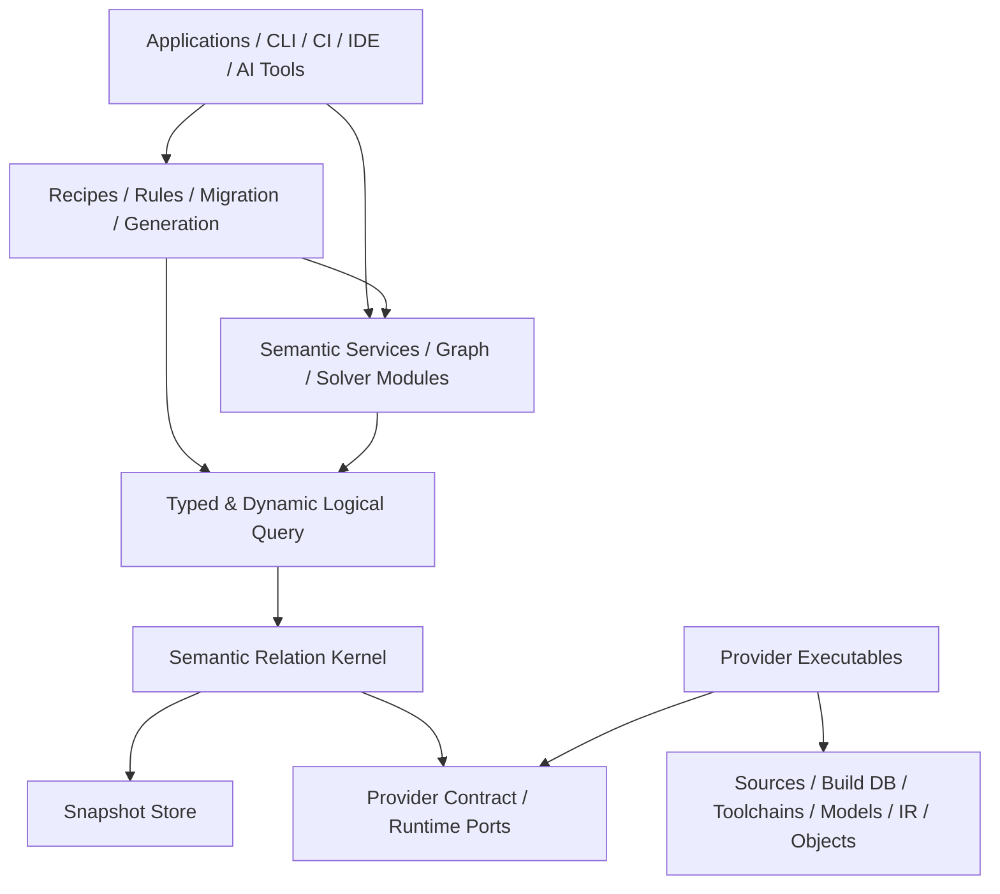
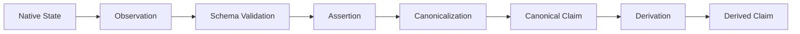
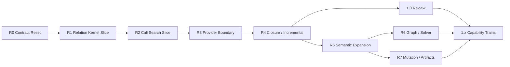

# cxxlens 次世代 Semantic Relation Platform

## 改善版 統合設計書

| 項目 | 値 |
|---|---|
| 文書 ID | `CXXLENS-NG-SRAD-002` |
| 文書版 | `1.0.0-normative` |
| 文書状態 | 規範・Issue #57 / Issue #59 / Issue #60 / Issue #61 / Issue #62 / Issue #63 / Issue #64 / Issue #65 / Issue #66 反映版 |
| 対象製品 | 次世代 `cxxlens` |
| 基準言語 | C++23 |
| 初期 primary platform | Linux |
| 初期 reference frontend | Clang 22 |
| 初期 reference store | in-memory / SQLite |
| 設計基準 | `CXXLENS-NG-SRAD-001` と旧 `CXXLENS-SRAD-001` 資産の統合レビュー |
| 作成日 | 2026-07-16 |

本書は Issue #57 により次世代 `cxxlens` の最上位規範へ昇格した。旧
`docs/archive/legacy-v1/design/cxxlens_integrated_design_ja.md` と旧 124 API freeze は移行時の provenance であり、
新規 API、relation、provider、実装 dispatch を認可しない。

---

## 文書の位置付け

本書は、次世代 `cxxlens` の製品境界、安定核、意味的不変条件、release profile、主要外部契約、検証・移行方針を定義する。

本書は、すべての relation 列、wire byte encoding、SQL DDL、solver algorithm、filesystem 実装を一つに固定する文書ではない。詳細契約は次の独立した authority へ分割する。

| Authority | 規範対象 |
|---|---|
| 本書 | 製品境界、層、依存方向、意味的不変条件、release profile |
| Relation Registry / IDL | relation key、column、reference、merge、coverage、version |
| Logical Query Contract / IR Schema | operator algebra、ordering、partiality、normalized digest |
| Semantic Guarantee Contract | truth、approximation、verification、condition、provenance の合成 |
| Snapshot / Store Contract | identity DAG、closure binding、publication series、format/compaction |
| Provider Protocol Specification | process protocol、manifest、task、batch、failure |
| Public C++ API Catalog | signature、lifetime、threading、stability |
| Acceptance Manifest | requirement、test、gate、evidence |
| Security Profile / Trust Registries | namespace ownership、certification、discovery、sandbox、support tuple |
| ADR | 選択理由、代替案、未確定実装方式 |
| Examples / Tutorials | 非規範の利用例 |

下位 authority が上位 authority と矛盾する場合、下位 authority を修正する。

---

## 規範キーワード

- **MUST**: 必ず満たす。
- **MUST NOT**: 行ってはならない。
- **SHOULD**: 原則として満たす。逸脱には ADR と代替保証が必要。
- **SHOULD NOT**: 原則として避ける。採用には ADR が必要。
- **MAY**: 任意。
- **INVARIANT**: provider、backend、execution path にかかわらず常に成立する。
- **PROFILE**: release ごとに有効化される能力集合。
- **EXPERIMENTAL**: source/semantic compatibility を約束しない。

---

## 0. 最終設計判断

### 0.1 製品定義

次世代 `cxxlens` は、次の製品である。

> **実際の C/C++ build context に基づく versioned semantic claims を provider から収集し、明示的な condition・provenance・partiality とともに immutable snapshot へ公開し、typed/dynamic logical query と versioned analysis module から利用する Semantic Relation Platform。**

次世代 `cxxlens` の安定核は、特定の lint、search、taint、rewrite、generator ではない。

```text
Project Catalog
+ Condition Universe
+ Versioned Relation Schema
+ Semantic Claims and Provenance
+ Immutable Snapshots
+ Materialization Runtime
+ Logical Query
+ Provider Contract
```

### 0.2 原案からの主要修正

| 項目 | 改善版の判断 |
|---|---|
| 初期スコープ | 全機能同時実装ではなく NG0〜NG3 profile へ分割 |
| coverage | provider execution accounting として維持 |
| negation 根拠 | `closure_certificate` を独立導入 |
| truth | policy 未確定の四値表を廃止し support-pair algebra を固定 |
| condition | `condition_universe_id` に必ず bind |
| build variant | provider/frontend identity を含めない |
| provider 差 | `interpretation_domain` を導入し、即 conflict にしない |
| identity | `semantic_key_id` / `assertion_id` / `content_digest` に分離 |
| schema API | generated static API と runtime dynamic API を両方提供 |
| query | logical IR のみ versioned。physical plan は internal |
| ordering | relation は unordered。明示 order/export のみ順序保証 |
| custom reducer | kernel callback ではなく normalization/derivation provider |
| foreign key | hard reference と soft semantic reference を分離 |
| native extension | third-party は専用 worker executable とする |
| transaction | multi-file atomicity ではなく journaled recoverability |
| public targets | 初期は少数の粗い target に限定 |
| ABI | C++ source compatibility と binary ABI を分離 |
| migration | 水平 phase ではなく end-to-end vertical slice を優先 |

### 0.3 Release Profile

#### NG0 — Semantic Relation Kernel

NG0 は 1.0 候補の最小垂直スライスである。ただし NG0 completion だけで distribution 1.0 を
production release してよい、という意味ではない。

- project catalog
- source snapshot
- finite condition universe
- versioned relation registry
- static/dynamic relation access
- observation / assertion / canonical claim
- semantic key / assertion / content identity
- immutable snapshot publication
- in-memory / SQLite parity
- positive logical algebra と total-order boundary query
- custom relation vertical slice
- Clang 22 provider boundary
- evidence / execution coverage / unresolved
- deterministic semantic serialization
- process failure isolation

#### NG1 — Closure and Incrementality

- partition invalidation
- closure certificate
- anti-join / difference / negation
- bounded recursive query
- transitive closure
- production provider protocol
- adjacent provider differential
- multi-process immutable readers

#### NG2 — Analysis Frameworks

- graph algorithms
- CFG
- abstract interpretation
- taint/resource exemplars
- targeted native refinement
- derived relation persistence

#### NG3 — Mutation and Artifacts

- patch plan
- journaled source transaction
- content-addressed artifact plan
- verification provider chain
- migration/mock/fuzz/harness recipes

GCC、LLVM IR、object/binary、remote provider は profile と独立して追加可能だが、NG0 completion の blocker にはしない。

profile と distribution release の対応は次で一意に解釈する。

| Profile | Release role | 1.0 blocker |
|---|---|---|
| NG0 | pre-1.0 で候補化する最小 kernel vertical slice | 必須 |
| NG1 | 1.0 の closure、incrementality、provider production hardening | 必須 |
| NG2 | 1.x へ独立追加可能な analysis capability | 不要 |
| NG3 | 1.x へ独立追加可能な mutation/artifact capability | 不要 |

NG1 は 1.0 release に必須の production hardening である。1.0 review の blocker は R0 から R4 および
G0 から G5、GR であり、R5、R6、R7 は 1.0 blocker ではない。NG2/NG3 の実装や追加は distribution
major を自動的に上げない。accepted stable version axis を破壊するときだけ future major を要求する。

NG0 provider protocol は manifest/digest、major/feature negotiation、bounded frame、deterministic CBOR control、
streaming column chunk、credit backpressure、ACK/同一 task transaction 内 resume、task/batch/group lifecycle、
cancel/deadline、coverage/unresolved、structured failure、process isolation までを含む最小 protocol である。
NG1 は durable resume token、heartbeat、progress-rate enforcement、spill staging、hung worker recovery、
multi-process reader、adjacent provider differential、長時間 conformance を加える。詳細境界と
release/version tuple は `schemas/cxxlens_ng_release_bundle.yaml` を規範とする。

### 0.4 初期非スコープ

NG0 では次を安定契約にしない。

- arbitrary recursive Datalog
- non-stratified negation
- generic abstract interpretation
- whole-program soundness
- distributed store
- remote execution
- stable C++ binary plugin ABI
- arbitrary shared-library native provider loading
- source mutation apply
- artifact publication
- GCC/IR/object の production support
- symbolic presence condition / BDD
- global cost-based optimizer
- stable textual query language

### 0.5 現行資産の扱い

#### 継承する

- root-independent canonical identity
- half-open byte source span
- macro/source origin
- compile unit と build variant
- no-shell compilation database parser
- bounded response/config parsing
- observation と detached semantic value の分離
- evidence / coverage / unresolved
- deterministic scheduler perturbation
- Clang native lifetime confinement
- process worker / prior snapshot preservation
- no-first-wins reducer intent
- in-memory / SQLite parity
- warm-zero provisioning
- stale digest edit precondition
- acceptance manifest 思想

#### 互換性対象から外す

- central `fact_kind`
- `fact_kind::custom`
- opaque string/JSON custom payload
- use-case profile enum
- domain 固定 selector model
- use-case 固定 query stage enum
- single implementation target への全責務集約
- 124 public API exact signature freeze
- physical query plan の wire identity
- framework-specific kernel enum

---

## 1. 製品ゴールと成功基準

### 1.1 利用者

- static analyzer author
- organization-specific rule author
- semantic search / migration tool author
- compiler/frontend provider author
- CI / IDE / review integrator
- security reviewer
- research analysis author
- AI coding agent platform author

### 1.2 成功基準

#### Extension

- 新しい relation を central enum/switch の変更なしで登録できる。
- runtime custom relation が built-in relation と同じ store、query、index、provenance 契約を利用できる。
- generated static type がない relation も dynamic query できる。
- provider executable を kernel source 改修なしで追加できる。
- Clang major の変更が stable semantic API を変更しない。

#### Semantic correctness

- empty rows と complete absence を区別する。
- negation は closure certificate なしに確定しない。
- provider unavailable を empty success にしない。
- same-domain conflict と cross-domain differential disagreement を区別する。
- direct observation と derived claim を区別する。
- condition は明示 universe に bind される。
- approximation、assumption、verification を独立表現する。

#### Operational correctness

- published snapshot は immutable。
- failed materialization は prior snapshot を破壊しない。
- native provider crash は host を破壊しない。
- semantic digest は root、jobs、task order、backend に依存しない。
- unchanged partition は warm run で provider execution を要求しない。
- query は bounded、cancellable、streaming である。

#### Usability

- flagship call search は LLVM header なしで利用できる。
- custom analyzer は static/dynamic query の双方を利用できる。
- provider author は major-specific native SDK 内で compiler API を利用できる。
- result から schema、producer、input、provenance、partiality を追跡できる。

### 1.3 NG0 の代表証明

1. `cc.call_site` と `company.lock.acquire` を同じ logical query で join できる。
2. external relation registration に core source diff が不要である。
3. memory と SQLite が同じ semantic snapshot digest を生成する。
4. jobs 1/2/8、root relocation、cold/warm で semantic output が一致する。
5. Clang worker crash 後も prior snapshot を query できる。
6. incomplete execution 上の absence check が unknown を返す。
7. generated static query と dynamic query が同じ logical IR digest を持つ。
8. frontend/native pointer が observation、batch、snapshot へ入らない。

---

## 2. Core Invariants

### INV-ARCH-001 — Dependency direction

下位 component は上位 use-case component に依存してはならない。

```text
Applications / Recipes
        ↓
Semantic Services / Analysis Modules
        ↓
Logical Query
        ↓
Semantic Relation Kernel
        ↓
Provider Contract / Runtime Ports
```

Provider implementation は provider SDK/contract に依存するが、kernel は provider implementation を link-time dependency にしてはならない。

### INV-ARCH-002 — Kernel ignorance

Kernel は次を知ってはならない。

- Clang AST node kind
- GCC tree code
- LLVM IR class
- gMock/libFuzzer 等の framework
- 特定 lint rule
- 特定 relation ID の列内容
- provider implementation 固有 enum
- UI/SARIF presentation structure

### INV-EXT-001 — Core-independent extension

新 relation/provider/recipe の追加は、中央 enum、switch、registry source list の変更を要求してはならない。installation manifest または engine build configuration の追加は許可する。

### INV-ID-001 — Stable semantic identity

semantic identity は次へ依存してはならない。

- absolute checkout root
- pointer/address
- timestamp
- PID/thread ID
- task completion order
- hash table iteration
- display prose
- provider arrival order

### INV-SOURCE-001 — Source coordinate

authoritative source coordinate は immutable source snapshot に bind された half-open byte range `[begin,end)` とする。

### INV-NATIVE-001 — Native lifetime confinement

compiler-native object、pointer、reference、address、ABI-dependent handle は provider job/callback/thread 境界を越えてはならない。

### INV-CLAIM-001 — Claim stages

observation、assertion、canonical claim、derived claim を同一状態として扱ってはならない。

### INV-PARTIAL-001 — No silent omission

unsupported、unavailable、failed、truncated、stale、open-world を empty success として表してはならない。

### INV-PARTIAL-002 — No inferred absence

closure certificate がない relation domain で、row 不在から false/true を推測してはならない。

### INV-MERGE-001 — No first-wins

same-domain semantic disagreement を priority、arrival order、task orderで隠してはならない。

### INV-SNAPSHOT-001 — Immutability

published snapshot の semantic content は変更してはならない。

### INV-SNAPSHOT-002 — Failure isolation

failed/cancelled/rejected materialization は既存 published snapshot を破壊してはならない。

### INV-QUERY-001 — Logical/physical separation

versioned Query IR は logical semantics のみを表す。index、join algorithm、spill、thread schedule 等の physical decision を authority にしてはならない。

### INV-DETERMINISM-001 — Semantic reproducibility

同じ semantic inputs、registry、provider binaries/semantics、configuration に対する semantic output は、parallelism、task order、backend、root relocation で変化してはならない。

### INV-ABI-001 — Native type isolation

stable public semantic header は LLVM/Clang/GCC native type layout に依存してはならない。

### INV-MUTATION-001 — Plan-first effect

source/artifact effect は immutable plan、precondition、verification、journaled transaction を経由しなければならない。NG0 では effect apply を提供しない。

---

## 3. 論理アーキテクチャ

### 3.1 Layer



矢印は compile/link dependency ではなく利用方向を示す。provider executable は kernel library の下位実装ではなく、protocol peer である。

### 3.2 Component responsibilities

#### `base`

- typed IDs
- semantic version
- canonical encoding
- errors/diagnostics
- evidence references
- budgets
- capability descriptors

#### `kernel`

- project catalog
- source snapshots
- condition universe
- relation registry
- claim validation
- snapshot store port
- materialization session
- provider planning/runtime port
- execution coverage
- closure certificate registry

#### `query`

- generated static DSL
- dynamic DSL
- logical Query IR
- type validation
- execution API
- physical planner interface
- cursor/result model

#### `cpp`

- standard C/C++ relation descriptors
- canonicalization providers
- semantic services
- identity contracts

#### `provider_sdk`

- provider manifest/task/batch value types
- protocol client/server helpers
- relation sink
- native SDK shared utilities
- conformance harness

#### `recipes`

- flagship semantic search
- optional rule/report adapters
- no kernel-private access

### 3.3 Initial public CMake targets

```text
cxxlens::base
cxxlens::kernel
cxxlens::query
cxxlens::cpp
cxxlens::provider_sdk
cxxlens::recipes
cxxlens::cxxlens       INTERFACE aggregate of base/kernel/query/cpp
```

Provider package examples:

```text
cxxlens-clang-worker-22
cxxlens-provider-clang22-sdk
```

`cxxlens::cxxlens` は provider executable、native SDK、recipes を強制 link してはならない。

1.0 の source compatibility authority は installed public header とする。C++ module は 1.0 の installed
stable surface に含めない。module surface を提供する場合は `experimental` とし、header authority と同値で
あることを別 gate で証明してから昇格する。native SDK は compiler/provider major ごとの別 package とし、
umbrella target に含めない。

### 3.4 Physical package rule

内部 target は public target より細分化してよい。dependency graph は CI で検証し、cycle を禁止する。

```text
base
schema
project
condition
claims
store-port
store-memory
store-sqlite
materialize
query-ir
query-exec
cpp-relations
cpp-normalizer
provider-protocol
provider-runtime
```

public target 数と internal package 数を同一にしない。

---

## 4. 用語

| 用語 | 定義 |
|---|---|
| Project Catalog | compile unit、source input、toolchain context、variant を保持する immutable catalog |
| Compile Unit | main source と一つの effective invocation の組 |
| Build Variant | 製品の declaration/semantic に影響する build context の canonical identity |
| Toolchain Context | production compiler、target、builtins、ABI、plugin/spec 等の build authority |
| Condition Universe | 一つの catalog generation に属する build variant atom の有限集合 |
| Presence Condition | condition universe 上で claim が成立する variant subset |
| Interpretation Domain | claim がどの semantic interpretation/authority の下で成立するかを表す ID |
| Observation | 一回の provider job が生成する provider-local record |
| Assertion | schema-valid で直接 observation に基づく claim |
| Canonical Claim | standard semantics に正規化された claim |
| Derived Claim | query/analysis/provider が入力 claim から導出した claim |
| Semantic Key | relation 内の同一意味対象を表す key identity |
| Assertion ID | condition、interpretation、producer semantics を含む claim identity |
| Content Digest | assertion の authoritative payload digest |
| Relation | versioned schema を持つ claim set |
| Partition | materialization/invalidation の単位 |
| Snapshot | relation partitions を原子的に固定した immutable semantic view |
| Execution Coverage | requested work unit がどう処理されたかの会計 |
| Closure Certificate | 指定 domain で absence を確定できる根拠 |
| Unresolved | 入力不足、unsupported、open world、budget 等の未解決状態 |
| Claim Conflict | 同じ interpretation domain の functional claim が両立しない状態 |
| Differential Disagreement | 異なる interpretation domain/provider view の差 |
| Provider | relation delta、coverage、certificate を生成する executable/module |
| Recipe | query/semantic service/plan を組み合わせた高水準機能 |

---

## 5. Identity and Canonical Encoding

### 5.1 Strong IDs

authoritative ID は strong type とする。

```cpp
template<class Tag>
class typed_id;
```

最低限:

```text
project_id
catalog_id
compile_unit_id
build_variant_id
toolchain_context_id
condition_universe_id
condition_id
interpretation_domain_id
source_snapshot_id
file_id
source_span_id
relation_name
relation_descriptor_id
semantic_key_id
assertion_id
content_digest
snapshot_id
partition_id
provider_id
provider_execution_id
query_id
recipe_id
evidence_id
closure_certificate_id
```

### 5.2 Three-part claim identity

```text
semantic_key_id = H(
    relation name,
    relation semantic major,
    authoritative key tuple
)

assertion_id = H(
    semantic_key_id,
    condition universe,
    canonical condition,
    interpretation domain,
    producer semantic contract
)

content_digest = H(
    assertion_id,
    authoritative payload tuple
)
```

display fields、operational metrics、containing snapshot ID は含めない。

### 5.3 Canonical tuple

hash input は versioned length-prefixed binary tuple とする。

MUST:

- schema-defined field order
- explicit type tags
- canonical integer encoding
- UTF-8 policy for semantic strings
- bytes as bytes
- sorted unique set
- sorted map keys
- explicit optional tag
- stable symbolic enum ID
- domain separation
- full digest storage

MUST NOT:

- JSON text を identity authority にする
- locale-dependent formatting
- float を primary/semantic key に使う
- unordered container iteration に依存する
- display path/prose を含める

semantic floating value を許可する relation は、NaN、signed zero、endianness を schema で定義する。NG0 standard relation は authoritative float を使用しない。

caller-supplied domain と byte payload を受ける `semantic_digest` は ADR 0016 の
`cxxlens-semantic-digest-v2` tuple（contract tag、UTF-8 domain、bytes payload）を使用する。domain は
`^[a-z][a-z0-9_.-]*$` とし、invalid domain は `sdk.semantic-domain-invalid` で拒否する。v2 の serialized form は
`semantic-v2:sha256:<64 lowercase hex>` であり、legacy の NUL-separated `sha256:` value と同一 namespace へ
silent rehash してはならない。legacy value は canonical source から明示的に再計算できる場合だけ移行する。

### 5.4 Path domains

path は単なる host absolute string ではなく domain 付き logical path とする。

```text
project://
build://
toolchain://
sysroot://
generated://
provider://
external://
```

`file_id` は path domain、normalized logical path、path contract version から作る。host mount path は evidence/operational metadata とする。

### 5.5 Semantic and operational data

#### Semantic

- IDs
- relation descriptor digest
- claim key/payload
- condition
- interpretation domain
- unresolved stable code
- execution coverage classification
- closure certificate
- assumptions
- verification level

#### Operational

- timestamp
- elapsed time
- PID
- worker host
- scheduling order
- cache lookup latency
- memory sample

operational data は semantic digest に含めない。

---

## 6. Source Model

### 6.1 Source snapshot

```cpp
struct source_file_snapshot {
    file_id file;
    source_snapshot_id snapshot;
    content_digest content;
    std::uint64_t size;
    source_encoding encoding;
    line_index_id line_index;
};
```

source content は path 上の mutable file ではなく immutable blob として扱う。

encoding は少なくとも次を表現する。

```text
utf8
utf16le
utf16be
locale_dependent
binary_or_unknown
```

compiler が byte stream として解釈した内容を authority とし、display conversion failure を semantic data loss にしてはならない。

### 6.2 Source span

```cpp
struct source_span_ref {
    source_snapshot_id snapshot;
    file_id file;
    std::uint64_t begin;
    std::uint64_t end;
    source_range_role role;
    origin_id origin;
    bool read_only;
};
```

- range は `[begin,end)`
- line/column は projection
- invalid span は fabricated default に置き換えない
- source snapshot mismatch は stale
- source excerpt は privacy policy に従う

### 6.3 Origin graph

標準 origin kind:

```text
spelled_from
expanded_from
macro_argument_from
macro_body_from
instantiated_from
generated_from
inlined_from
lowered_from
imported_from
```

origin graph は DAG とする。cycle は batch rejection。

many-to-many mapping を許可し、一つの「元位置」へ潰さない。

---

## 7. Project Catalog and Build Context

### 7.1 Catalog opening

Project Catalog は compilation database、source roots、path maps、environment policy、toolchain policy から構築する。

MUST:

- shell を実行しない
- `arguments` array を優先
- command string は bounded tokenizer
- response file を size/depth/count budget 下で展開
- duplicate JSON key、invalid Unicode、oversized input を拒否
- distinct command を保持
- raw/normalized/effective invocation を区別
- mutable input digest を保持
- unresolved executable/generated input を明示

### 7.2 Invocation forms

```cpp
struct compile_invocation {
    raw_invocation raw;
    normalized_invocation normalized;
    effective_invocation effective;
};
```

#### Raw

入力監査用。直接実行しない。

#### Normalized

- tokenization
- response expansion
- option classification
- wrapper detection
- lexical path normalization
- semantic/nonsemantic flag classification

#### Effective

- sandbox logical paths
- executable resolution
- path map
- rematerialized response file
- output action redirection
- environment allowlist
- trust profile

Provider は effective invocation を使用する。

### 7.3 Build Variant

Build Variant は製品の language semantics に影響する入力から作る。

候補:

```text
language and standard
target triple
ABI/data layout
predefined macros
-D/-U
include search identity
forced include
PCH/module inputs
sysroot
language-affecting flags
production toolchain semantic mode
product plugin/spec identity when authoritative
```

MUST NOT include:

- analysis provider executable ID
- analysis task order
- output path
- dependency file path
- elapsed/runtime metadata

flag を variant key から除外する場合、versioned argument classification registry と fixture が必要である。optimization flag は predefined macro 等へ影響し得るため、無条件に除外してはならない。

### 7.4 Toolchain Context

```text
compiler family
exact version/build
target
builtin header identity
sysroot
ABI
plugin/spec/wrapper identity
language runtime assumptions
```

production toolchain context と analysis provider identity を分離する。

### 7.5 Environment Identity

environment は allowlist を既定とする。

- semantic value のみ identity 対象
- secret は raw value を保存しない
- secret-dependent semantics が不可避な場合は workspace-local keyed fingerprint
- `LD_PRELOAD` 等の code injection variable は explicit trust profile がない限り拒否
- locale は diagnostics と tokenization へ影響する場合に固定

---

## 8. Condition Universe and Presence Conditions

### 8.1 Universe

一つの catalog generation は `condition_universe_id` を持つ。

```cpp
struct condition_universe {
    condition_universe_id id;
    catalog_id catalog;
    semantic_version semantics;
    std::vector<build_variant_id> atoms;
};
```

atoms は canonical sorted unique。

### 8.2 Condition reference

```cpp
struct condition_ref {
    condition_universe_id universe;
    condition_id condition;
};
```

異なる universe の condition を暗黙比較してはならない。

### 8.3 NG0 representation

NG0 は finite variant set のみを規範化する。

semantic representation:

```text
canonical sorted set of build_variant_id
```

physical representation:

- interned bitset
- roaring bitmap
- sorted vector

のいずれでもよい。physical bit position は semantic identity ではない。

### 8.4 Operations

```cpp
class condition_registry {
public:
    condition_ref none(condition_universe_id);
    condition_ref all(condition_universe_id);
    condition_ref variant(condition_universe_id, build_variant_id);
    condition_ref set(condition_universe_id,
                      std::span<const build_variant_id>);
    result<condition_ref> unite(condition_ref, condition_ref);
    result<condition_ref> intersect(condition_ref, condition_ref);
    result<condition_ref> difference(condition_ref, condition_ref);
    result<condition_ref> negate(condition_ref);
    result<bool> overlaps(condition_ref, condition_ref) const;
    result<bool> contains(condition_ref, condition_ref) const;
};
```

### 8.5 Universe rebase

catalog 更新後は新 universe を作る。

rebase operation は:

- common variant atoms
- removed atoms
- added atoms
- unmapped atoms

を明示する。旧 `all` を新 `all` と同一視しない。

### 8.6 Canonical condition fragments

coverage、conflict、closure を集計する場合、overlapping conditions を disjoint canonical fragments へ分割する。

同じ `(domain,key,fragment)` を複数 execution coverage state に分類してはならない。

---

## 9. Relation Schema System

### 9.1 Relation identity

```text
relation name: namespaced stable string
semantic major: key/meaning/invariant compatibility
descriptor version: exact major.minor.patch
descriptor digest: exact schema bytes/semantics
```

例:

```text
cc.call_site
semantic major 1
descriptor 1.2.0
```

logical query は relation name + compatible major/minor requirement を参照し、snapshot は exact descriptor digest を記録する。

### 9.2 Static and dynamic API

#### Static generated API

build-time に known な schema は C++ tag/view/builder を生成する。

```cpp
using R = cxxlens::cc::relations::call_site;
auto q = query::from<R>();
```

#### Dynamic API

runtime-discovered schema は descriptor/column stable ID から操作する。

```cpp
auto relation = registry.require("company.lock.acquire", major{1});
auto lock = relation.column("lock");
auto q = dynamic_query::from(relation).project(lock);
```

両 API は同じ logical IR を生成する。

### 9.3 Descriptor

relation descriptor は最低限次を持つ。

```text
name
version
semantics ID
stability
owner namespace
column descriptors
authoritative key
functional/multivalued classification
reference descriptors
condition column policy
interpretation policy
merge policy
partition hints
index hints
coverage domain
closure kinds
provenance minimum
evolution policy
```

### 9.4 Column types

NG0 scalar:

```text
bool
signed/unsigned integer
utf8_string
bytes
digest
semantic_version
typed_id
open_symbol
condition_ref
source_span_id
evidence_id
```

NG0 container:

```text
optional<T>
list<T>
set<T>
struct<T>
```

NG0 では arbitrary map、nested union、float key を standard relation で使用しない。

set は canonical sorted unique。list は order が semantics の一部である場合だけ使う。

### 9.5 Open and closed symbols

- open symbol: unknown value を保持できる。minor で symbol 追加可能。
- closed symbol: exhaustive set。symbol 追加は major change。

generated C++ API は open symbol を raw `enum class` のみで表してはならない。

### 9.6 Key and claim cardinality

#### Multivalued relation

複数 row が自然に成立する。区別に必要な列を key に含める。

例:

```text
cc.call_possible_target key = call + target + condition
```

#### Functional assertion

同じ key/condition/interpretation で authoritative payload は一つであるべき。

payload が異なる場合は claim conflict。

schema は functional dependency を明示する。

### 9.7 References

#### Hard reference

同一 staged snapshot 内で解決必須。

欠落時:

- batch rejection
- schema error

#### Soft semantic reference

外部世界、未 materialize relation、provider limitation により欠落可能。

欠落時:

- row は保持可能
- unresolved item と evidence が必須
- closure を主張できない

### 9.8 Declarative merge modes

NG0 kernel merge:

```text
set
multiset
functional_assertion
keyed_union
operational_last_writer
```

`operational_last_writer` は semantic relation に使用してはならない。

arbitrary custom reducer callback は kernel に登録しない。任意 normalization は versioned provider とする。

### 9.9 Schema registration

- engine build 前に registry を構築
- registry digest を engine/snapshot へ bind
- duplicate name/version/digest mismatch を拒否
- incompatible key change を拒否
- hard reference cycle を検証
- runtime execution 中の registry mutation を禁止
- schema 追加には新 engine generation が必要

### 9.10 Evolution

#### Patch

- documentation correction
- test metadata
- validation message
- accepted semantic value setを変えない

validation tightening/looseningで row acceptance が変わる場合、patch にしてはならない。

#### Minor

- optional column
- index/partition hint
- open symbol追加
- optional capability
- unknown-preserving additive metadata

#### Major

- key変更
- column semantics変更
- required column
- functional/multivalued変更
- condition semantics変更
- closure interpretation変更
- identity contract変更
- closed symbol追加
- source coordinate semantics変更

### 9.11 NG0 exact registry と claim envelope

Issue #60 で accepted となった exact authority は
`schemas/cxxlens_ng_relation_registry.yaml`（`cxxlens.relation-registry.v1`）である。全 user relation は
system claim envelope を共有し、condition authority は `envelope-presence-only` とする。relation payload に
`presence` / `condition_ref` を重複させない。system column は通常の user projection から除外し、明示要求時だけ
stable system column ID で参照する。

Issue #63 / ADR 0009 により system claim envelope は `cxxlens.claim-envelope.v2` へ更新された。producer input
は `producer_input_basis` の tagged direct/derived variant とし、direct observation に snapshot ID を要求しない。
derived claim だけが strict-prior published snapshot と consumed partition content digest を保持できる。

static generated API と runtime dynamic API は同じ descriptor/column ID を使用し、Logical Query IR もその ID を
operand とする。descriptor digest は exact descriptor の canonical projection から計算する。unknown open symbol と
minor optional column は保持し、unknown closed symbol、minor required column、key/cardinality/condition/identity の
変更は fail closed または semantic major change とする。

Issue #74 / ADR 0017 により descriptor identity は authority contract digest と runtime が実際に使用する
`canonical_form()` の双方を `cxxlens.relation-descriptor-binding.v2` で bind する。generated descriptor の
authority digestを保持したまま column/key/reference/merge/conflict/semanticsを改変した場合は
`sdk.descriptor-digest-mismatch` で拒否し、registry digest はこの bound descriptor digest 集合から構成する。

Issue #75 / ADR 0018 により runtime descriptor validator は relation IDL の runtime projection と同じ ASCII
pattern、`semantic_major >= 1`、unique key/reference/conflict list、claim-key role parity、merge/cardinality conflict
projectionを検査する。functional assertion の conflict columns は全 authoritative payload と exact一致し、
非 functional mergeでは空とする。reference の `hard` は `on_missing: reject_batch`、`soft_semantic` は
`on_missing: unresolved` の型付き projectionであり、runtimeで別の silent policyを選択できない。schema-invalid
dynamic descriptorは digest計算済みであっても registry adoption 前に stable `sdk.*-invalid` categoryで拒否する。

registry の build-time generation は descriptor document または installation manifest を探索する。external
relation の追加に中央 enum、switch、source list の変更を要求してはならない。hard reference は staged/base
snapshot で解決できなければ batch reject、soft semantic reference は row と `core.unresolved` をともに保持する。

---

## 10. Relation IDL Example

```yaml
schema: cxxlens.relation-registry.v1
system_claim_envelope:
  condition_authority: envelope-presence-only
  columns:
    - {id: system.claim.v2.presence, name: presence, type: condition_ref}
    - {id: system.claim.v2.producer_input_basis, name: producer_input_basis,
       type: tagged<producer-input-basis/1>}
relations:
  - descriptor_id: cc.call_site.v1
    name: cc.call_site
    version: 1.0.0
    claim:
      cardinality: functional_assertion
      key: [cc.call_site.v1.call]
      condition_policy: claim-envelope-required
    columns:
      - {id: cc.call_site.v1.call, name: call, type: typed_id<cc_call_id>}
      - {id: cc.call_site.v1.compile_unit, name: compile_unit,
         type: typed_id<compile_unit_id>}
      - {id: cc.call_site.v1.caller, name: caller,
         type: optional<typed_id<cc_entity_id>>}
      - {id: cc.call_site.v1.kind, name: kind, type: open_symbol<cc.call-kind/1>}
      - {id: cc.call_site.v1.source, name: source, type: typed_id<source_span_id>}
      - {id: cc.call_site.v1.receiver_static_type, name: receiver_static_type,
         type: optional<typed_id<cc_type_id>>}
      - {id: cc.call_site.v1.ordinal, name: ordinal, type: uint64}
    partition:
      suggested_keys: [cc.call_site.v1.compile_unit]
      condition_fragment: envelope
      interpretation_domain: envelope

  - descriptor_id: cc.call_direct_target.v1
    name: cc.call_direct_target
    version: 1.0.0
    claim:
      cardinality: functional_assertion
      key: [cc.call_direct_target.v1.call]
      condition_policy: claim-envelope-required
    columns:
      - {id: cc.call_direct_target.v1.call, name: call, type: typed_id<cc_call_id>}
      - {id: cc.call_direct_target.v1.target, name: target,
         type: typed_id<cc_entity_id>}
      - {id: cc.call_direct_target.v1.resolution, name: resolution,
         type: open_symbol<cc.direct-target-resolution/1>}
```

上記は call model の抜粋である。全列、reference、merge、coverage、closure、provenance、evolution の exact
authority は registry 本体とする。physical index、SQL table、wire layout は authority に含めない。

---

## 11. Claim and Provenance Model

### 11.1 Pipeline



### 11.2 Observation

- provider/job local
- provider-specific schema
- native pointer禁止
- compile unit / variant / source ownership必須
- batch atomic
- permanent canonical identityを要求しない
- exact provider executionへ trace

### 11.3 Assertion

- schema-valid
- direct observation に基づく
- producer semantics を保持
- provider-owned namespace でもよい
- interpretation domain を持つ

### 11.4 Canonical claim

- standard relation semantics に適合
- canonicalizer producer を保持
- input assertions を provenance に保持
- provider wording/native ID を authoritative payload にしない
- canonicalization不能時は provider-local claimを保持し、捏造しない

Issue #93 / ADR 0036 により、入力 claim を受け取る stage constructor は stage 固有判定と出力 encoding より前に共通の
independent input validation を実行する。`make_canonical_claim()` は入力 assertion の row、descriptor、condition、interpretation、
producer、basis、guarantee、semantic key/assertion/content identity を `validate_claim()` で再検証する。
`make_derived_claim()` も全入力に同じ policy を適用し、同じ invalid input は同じ validation error で拒否する。

### 11.5 Derived claim

- input semantic keys/assertions/content digests を保持
- derivation provider/version を保持
- assumptions/precision を保持
- invalidation key を計算可能
- fixed-pointの場合は convergence summary を保持

### 11.6 Claim envelope

```cpp
struct direct_input_basis {
    content_digest basis_digest;
};

struct derived_input_basis {
    snapshot_id input_snapshot; // strict-prior published snapshot only
    std::vector<content_digest> consumed_partition_contents;
    content_digest transform_semantics;
};

struct claim_envelope {
    relation_descriptor_id descriptor;
    semantic_key_id semantic_key;
    assertion_id assertion;
    content_digest content;
    condition_ref presence;
    interpretation_domain_id interpretation;
    producer_ref producer;
    std::variant<direct_input_basis, derived_input_basis> producer_input_basis;
    evidence_id provenance_root;
    guarantee guarantee;
};
```

`producer_input_basis` の exact schema は `schemas/cxxlens_ng_claim_envelope.schema.yaml` と
`schemas/cxxlens_ng_snapshot_store_contract.yaml` が所有する。direct basis は source/invocation/toolchain 等の
semantic input digest を持ち snapshot を持たない。derived basis の `input_snapshot` は出力を収容する snapshot
より前の generation でなければならない。containing snapshot ID は store association として管理し、claim、
basis、certificate の identity に含めない。

Issue #94 / ADR 0037 により semantic claim set と evidence occurrence set を分離する。非 multiset relation の claim set は
canonical sorted unique content ID 集合とし、claim envelope 全 field が完全一致する occurrence だけを deduplicate する。同じ
content でも producer ID、input basis、provenance、guarantee、stage が異なる occurrence は canonical total order ですべて保持し、
batch digest は content と occurrence projection の双方を bind する。multiset relation の multiplicity law は変更しない。

### 11.7 Evidence graph

node kinds:

```text
source_observation
compile_context
provider_execution
canonicalization
model_assumption
derivation
user_configuration
dynamic_observation
verification
exclusion
closure_proof
```

DAG とする。fixed-point は iteration summary node へ圧縮できる。

retention policy:

```text
full
compressed
summary
```

finding/plan は原則 full、bulk relation は descriptor/policy に従う。

---

## 12. Interpretation Domain, Authority, Conflict

### 12.1 Interpretation domain

claim の semantic authority を表す。

例:

```text
cc.canonical/1 + production GCC toolchain context
cc.canonical/1 + Clang approximation
frontend.clang22.native/1
ir.llvm22.optimized/1
dynamic.runtime-observation/1
```

provider implementation version と interpretation domain を同一視しない。certified provider が同じ semantic contract を実装する場合、同じ domain を宣言できる。

### 12.2 Provider-owned observation

未 certified provider は provider-owned namespace/domain へ出力する。standard canonical relation を直接出す場合、relation-specific conformance level を満たさなければならない。

### 12.3 Same-domain claim conflict

次をすべて満たす場合に `core.claim_conflict` を生成する。

- same relation semantic major
- same semantic key
- overlapping presence condition
- same interpretation domain
- functional assertion relation
- authoritative payload mismatch

overlap condition だけを conflict fragment とし、非overlap fragment の claim は保持する。

Issue #76 / ADR 0019 により batch commit の比較集合は accepted new claims と既存 snapshot claims の和集合とし、
少なくとも片側が new claimである全 functional pairへ同じ overlap/payload/interpretation classificationを適用する。
existing-existingの既知 disagreementは再掲しない。pairの左右、conflict/differential record、batch digest入力はclaimの
canonical orderで固定し、同じclaim集合をone-shot ingestionしても複数publicationへ分割しても、new claimが
関与する最終classificationは一致しなければならない。exact duplicateとsame payloadはconflictではない。

Issue #77 / ADR 0020 により query runtime が snapshot annotation から再構成する conflict/differential side
channelもclaim kernelと同じdescriptor `conflict_columns` canonical tuple digestを使用する。claim `content` IDは
condition、interpretation、producer contractを含むoccurrence identityであり、functional payload equalityへ使用して
はならない。queryとingestionは同じannotation集合についてrelation name、semantic key、pair orientation、overlap
fragments、assertion/content pairを含む同一classificationを返す。

### 12.4 Differential disagreement

異なる interpretation domain の結果差は `core.differential_disagreement` とする。

分類:

```text
missing_claim
additional_claim
key_mismatch
payload_mismatch
condition_mismatch
source_mismatch
guarantee_mismatch
closure_mismatch
```

### 12.5 Selection policy

```text
authoritative_exact
preferred_approximation
merge_same_domain
differential_compare
all_independent
```

arrival order は選択根拠にしない。

selected policy、provider candidates、rejection reason は explain 可能でなければならない。

---

## 13. Truth and Guarantee

### 13.1 Truth support

exact authority は `schemas/cxxlens_ng_semantic_guarantee_contract.yaml` と ADR 0008 である。

boolean claim/check の truth は二ビット support として定義する。

```cpp
struct truth_support {
    bool supports_true;
    bool supports_false;
};
```

名称:

```text
unknown  = {0,0}
true     = {1,0}
false    = {0,1}
conflict = {1,1}
```

knowledge order は support の componentwise inclusion（bottom `unknown`、top `conflict`）、truth order は
negative support reversed / positive support forward（bottom `false`、top `true`）とする。二つの order を混同しない。

### 13.2 Operators

```text
NOT(t,f) = (f,t)

AND((t1,f1),(t2,f2))
  = (t1 AND t2, f1 OR f2)

OR((t1,f1),(t2,f2))
  = (t1 OR t2, f1 AND f2)
```

全 truth table は Appendix A を authority とする。

planner/backend が unknown/conflict を false に coerce してはならない。

複数 evidence の集約は positive/negative support をそれぞれ union する。したがって true evidence と false
evidence の併存は conflict であり、arrival order や preferred provider policy で false/true に上書きしない。

### 13.3 Relation row と truth の区別

通常の positive relation query は row stream を返す。各 row に四値 truth を付けることを必須にしない。

truth_support は次に利用する。

- `exists(query)`
- `check(predicate)`
- targeted refinement
- functional claim resolution
- rule condition
- absence check with closure

### 13.4 Result filtering policy

truth algebra と filtering policy を分離する。

```text
true_only
retain_unknown
retain_conflict
retain_all
strict_known
strict_nonconflicting
```

policy は truth 値そのものを変更しない。

### 13.5 Guarantee

```cpp
enum class approximation_kind {
    unknown,
    under_approximation,
    over_approximation,
    exact
};

struct guarantee {
    approximation_kind approximation;
    scope_ref scope;
    assumption_set_id assumptions;
    verification_level verification;
};
```

#### Meaning

- `under_approximation`: returned positives は根拠を持つが、漏れ得る
- `over_approximation`: 対象を覆うが false positive を含み得る
- `exact`: 明示 scope/model/closure 内で exact
- `unknown`: approximation relation を主張できない

verification:

```text
unverified
schema_validated
frontend_replayed
compiler_verified
link_verified
runtime_observed
differentially_verified
```

verification は全順序 enum ではなく implication closure を持つ modality set とする。`frontend_replayed`、
`compiler_verified`、`link_verified`、`runtime_observed`、`differentially_verified` は `schema_validated` を imply
するが、互いの強弱は既定で incomparable である。比較は closure set inclusion、合成は closure intersection
で行い、contributor ごとの modality は drill-down に保持する。

approximation は sound positives と complete scope の独立二軸である。unknown=`00`、under=`10`、over=`01`、
exact=`11` とし、positive operator は軸ごとの AND で合成する。under と over の合成は unknown であり、exact
に格上げしない。`limit` は declared scope の completeness と sealed prefix を証明しない限り under とする。

exact は declared scope、condition partition、interpretation、assumption set、blocking state のない coverage、必要な
closure、overlapping same-domain conflict/unresolved の不在を独立 validator が確認した場合だけ許可する。

`summary_guarantee()` は fragment の conservative meet であり、fragment count、canonical fragment-set digest、
lossless drill-down ref を必須とする。全 fragment と coverage/closure/condition partition が exact でない summary は
exact を名乗れない。assumption は union し、evidence edge のない implicit discharge を禁止する。

confidence は optional とし、比較可能性を主張する場合 `calibration_id` を持つ。
比較には同じ population ID と metric も必要であり、それ以外は incomparable とする。confidence は truth または
approximation を格上げしない。

---

## 14. Execution Coverage, Closure, Unresolved

### 14.1 Execution coverage

Provider/materialization が requested work unit をどう処理したかの完全会計。

```cpp
enum class coverage_state {
    covered,
    excluded,
    not_applicable,
    failed,
    unresolved,
    unsupported,
    stale,
    truncated
};
```

```cpp
struct coverage_unit {
    coverage_domain_id domain;
    stable_unit_key key;
    condition_ref condition;
    coverage_state state;
    stable_reason_code reason;
    std::optional<provider_execution_id> execution;
};
```

disjoint condition fragment ごとに一つの state。

### 14.2 Coverage invariant

```text
requested fragments
  = covered
  + excluded
  + not_applicable
  + failed
  + unresolved
  + unsupported
  + stale
  + truncated
```

coverage complete は execution accounting の完了を意味し、semantic closed world を自動的に意味しない。

### 14.3 Closure certificate

```cpp
struct closure_certificate {
    closure_certificate_id id;
    relation_descriptor_id relation;
    partition_id subject_partition;
    content_digest partition_content;
    content_digest coverage;
    closure_kind kind;
    key_domain_ref key_domain;
    condition_ref condition;
    interpretation_domain_id interpretation;
    assumption_set_id assumptions;
    content_digest producer_semantics;
    content_digest evidence;
};
```

NG1 standard closure kind:

```text
relation-key-enumeration
call-target-set
inheritance-subtype-set
include-provider-set
```

certificate は relation/provider-specific rules に基づき生成・検証する。ID は上記全 field に domain-separated
hash で bind し、いずれか一つが変われば certificate ID も変わる。`input_snapshot` と containing snapshot は
持たない。certificate の subject は exact partition/content/coverage であり、snapshot は certificate ID を
包含する一方向 edge だけを持つ。

### 14.4 Negation rule

anti-join、difference、absence、unreachable を確定するには、right/input relation の適切な closure certificate が必要。

certificate がない場合:

- positive rows は返してよい
- absence result は unknown
- unresolved に missing closure を記録
- strict mode は structured failure

### 14.5 Unresolved

最低 field:

```text
stable code
category
scope/key
condition
interpretation domain
required relation/capability/closure
producer/execution
assumptions
suggested actions
evidence
```

category:

```text
missing_input
ambiguous_identity
open_world
unsupported_construct
provider_unavailable
precision_not_achieved
budget_exhausted
stale_input
claim_conflict
model_missing
trust_boundary
external_dependency
closure_missing
custom
```

message prose は control flow に使用しない。

---

## 15. Immutable Snapshot and Store

### 15.1 Snapshot semantic identity

Issue #63 の exact authority は `schemas/cxxlens_ng_snapshot_store_contract.yaml`
（`cxxlens.snapshot-store-contract.v1`）と ADR 0009 である。identity は SHA-256 の全 256 bit と
`cxxlens-canonical-tuple-v1` の versioned length-prefixed binary tuple を使用し、identity kind ごとに domain
separation する。JSON text、absolute root、unordered iteration、timestamp、task order、backend layout は authority
ではない。hash collision は candidate を quarantine し、既存 object を保持して fail closed とする。

```text
snapshot_id = H(
    snapshot semantics version,
    catalog semantic digest,
    condition universe ID,
    relation registry digest,
    selected interpretation policy digest,
    canonical sorted partition manifest projections,
    canonical sorted closure certificate IDs
)
```

次を含めない。

- timestamp
- parent snapshot ID
- publication sequence
- store path
- backend type
- jobs / task order
- physical snapshot format
- elapsed time

同一 semantic content は同じ snapshot ID を持ち得る。lineage/publication record は別 metadata。

### 15.2 Snapshot manifest

```cpp
struct snapshot_manifest {
    snapshot_id id;
    content_digest catalog_semantics;
    condition_universe_id universe;
    content_digest relation_registry;
    content_digest interpretation_policy;
    semantic_version snapshot_semantics;
    std::vector<partition_manifest> partitions;
    std::vector<closure_certificate_id> closures;
};
```

operational publication record:

```text
parent snapshot
created at
writer process
elapsed
publication series / sequence
physical format / generation / locator
```

manifest の instance schema は `schemas/cxxlens_ng_snapshot_manifest.schema.yaml` とする。physical format と
publication lineage は semantic manifest へ混入させない。

### 15.3 States

```text
building
staged
validating
published
rejected
cancelled
superseded
corrupt
```

reader は published generation のみを見る。

### 15.4 Partition

partition key は descriptor hint と provider invalidation contract から作る。

```text
relation descriptor
scope/compile unit
condition fragment
interpretation domain
producer semantics
precision
model/assumption set
```

manifest:

```text
partition ID
relation descriptor
input digest
content digest
row/claim count
coverage digest
producer
state
```

partition content は canonical sorted claim content digest と coverage digest を bind する。partition identity または
content projection に closure ID を含めないため、closure→partition→closure の逆 edge は作れない。partial
partition を complete/closed として再利用してはならない。

同一 semantic content の evidence occurrence は partition manifest の claim set/count を増やさず、payload の canonical
partition envelope と annotation set に lossless に保存する。exact duplicate occurrence は writer staging で一件へ縮約する。
非 multiset query scan は同じ content を一つの semantic row とし、producer、provenance、contributor guarantee を canonical
set union する。guarantee summary は conservative meet であり、任意の一 occurrence を first-wins で選んではならない。

### 15.5 Store port

```cpp
class snapshot_store {
public:
    result<snapshot_handle> current(const snapshot_series_selector&) const;
    result<snapshot_handle> open(std::string_view snapshot_id) const;
    result<snapshot_handle> open_publication(std::string_view publication_id) const;
    result<snapshot_writer> begin(snapshot_draft);
    store_compatibility compatibility() const;
    result<void> compact();
    result<std::string> canonical_export(std::string_view snapshot_id) const;
};
```

`snapshot_series_selector` は catalog、channel、engine generation、condition universe、relation registry digest、
interpretation policy digest、trust policy digest をすべて明示する。この exact tuple から
`snapshot_series_id` を作る。catalog-only lookup、ambient default、別 series の newest/first-wins fallback は禁止する。

### 15.6 Cursor contract

```cpp
class row_cursor {
public:
    result<std::optional<row_view>> next();
};

class row_view { public: result<detached_row> copy() const; };
```

- `row_view` は cursor advance まで有効
- snapshot handle は open 時の物理 publication generation を pin
- backend page/statement lifetime を API に漏らさない
- row ごとの heap allocation を必須にしない
- caller が長寿命化する場合 owned copy を明示

### 15.7 Ordering

relation/query result は unordered が既定。

順序保証:

- query `order_by`
- canonical export
- snapshot digest construction
- acceptance comparison

のみ。

physical scan order を public semantics にしない。

### 15.8 Reference backends

NG0:

- in-memory
- SQLite

両 backend は semantic claims、conditions、coverage、closures、unresolved、query results の意味的 equality を満たす。

byte-for-byte physical storage equality は要求しない。

### 15.9 Publication transaction

```text
created
  -> staged
  -> validating
  -> committed
or
  -> rejected/rolled_back
```

commit 前の claim は reader から見えてはならない。

foreign/reference validation、coverage balance、digest、conflict policy、required closure を commit 前に確認する。

series head の更新は expected parent publication を使う compare-and-swap とする。stale parent は reject し、
failed/cancelled/rejected publish は head を変更しない。recovery は committed journal record だけを可視化し、
staged/validating object を current として採用しない。

### 15.10 Reader pin、compaction、format、corruption

compaction は copy-on-write physical generation を作り、physical checksum、semantic snapshot digest、closure binding
を再検証してから locator を atomically swap する。失敗時は prior generation を維持し、pinned generation は最後の
handle 解放まで回収しない。

snapshot format は semantic snapshot ID から独立する。compatible major/minor を直接開くか、登録済みの
deterministic migration chain だけを使用する。migration/compaction 後の semantic digest が元と異なる場合は commit
しない。current head が corrupt な場合は prior head へ silent fallback せず structured failure を返す。caller が
明示した intact prior publication は読み続けられ、repair は新しい validated physical generation として publish する。

Issue #68 は `include/cxxlens/sdk/store.hpp` と `src/sdk/store.cpp` にこの port を実装した。memory/SQLite は同じ
canonical identity、partition/closure validator、publication CAS を共有する。SQLite physical format は ADR 0013 と
`schemas/cxxlens_ng_sqlite_store_contract.yaml` が所有し、WAL journal metadata と versioned canonical payload の
hybrid である。

Issue #69 は physical minor 2.1.0 / payload v2 に query annotation projection を追加した。payload v1 は detached
row read のために読めるが、condition、interpretation、semantic key、assertion contributor、provenance、
guarantee を推測して query を実行してはならず、`sdk.query-annotations-unavailable` で fail closed とする。
Issue #73 は physical minor 2.2.0 / payload v3 に producer ID と semantic contract を追加した。payload v2 を
読む場合は producer を推測せず explicit legacy-unknown として保持する。

Issue #78 / ADR 0021 は physical minor 2.3.0 / payload v4 に partition の exact identity binding と validated
closure certificate subject を追加した。open 時に partition/certificate ID を再計算して manifest と照合する。
payload v1〜v3 の closure ID だけから subject を推測してはならず、これらは query の closed-world proof に使わない。

Issue #90 / ADR 0033 は physical minor 2.4.0 / payload v5 に canonical partition envelope を追加する。open と compaction は
完全な claim envelope、coverage、unresolved から claim identity、claim set、coverage digest、partition content/count/complete、
row/annotation projection を bottom-up に再構成し、manifest と byte-exact に照合する。局所 validation や payload checksum だけで
semantic integrity を宣言してはならない。duplicate snapshot 比較は annotation、coverage、partition binding、partition envelope
を含み、physical generation/root relocation は除外する。

Issue #91 / ADR 0034 により closure certificate の独立 validator は `partition_manifest` 単体を subject にしてはならない。
manifest と exact `snapshot_partition_binding` を検証済みの `partition_certificate_subject` に結合し、condition、interpretation、
assumption set、producer semantics を candidate と exact match する。key-domain/evidence は digest を要求し、NG0 closure kind は
`relation-key-enumeration` に限定する。standalone API、writer、persisted reopen は同じ validator の accept/reject 集合を持つ。

Issue #92 / ADR 0035 により derived claim の consumed partition digest は文字列宣言だけでは publication できない。writer は
input snapshot ID を committed、non-corrupt、strict-prior publication の immutable manifest へ解決し、consumed 全 digest が
その exact partition content 集合に含まれることを atomic に検証する。cross-series input と同一 semantic snapshot の複数
physical publicationでも exact manifest membership は必須であり、一件でも不存在/別 snapshot 所属なら candidate 全体を拒否する。

---

## 16. Incremental Materialization

### 16.1 Invalidation inputs

```text
source content digest
include/generated dependency digest
normalized/effective invocation digest
toolchain context
condition universe
environment identity
provider binary digest
provider semantic contract
relation descriptor digest
normalizer/deriver version
model/assumption pack
precision profile
```

### 16.2 Provider contract

provider descriptor は output partition ごとに invalidation input class を宣言する。

engine は宣言だけを信用せず、conformance fixture で検証する。

### 16.3 Reuse

partition reuse 条件:

- exact descriptor compatible
- exact interpretation domain compatible
- input digest一致
- provider semantic contract一致
- coverage/closure stateが要求を満たす
- corruption check pass

### 16.4 Warm-zero

同一 input digest、provider set、registry、policy に対する unchanged materialization は frontend provider execution 0 を目標ではなく acceptance invariant とする。

store metadata check、query、manifest publication は発生してよい。

---

## 17. Provider Contract and Runtime

### 17.1 Dependency model

```text
kernel/runtime -> provider protocol port
provider executable -> provider SDK/protocol
```

kernel target は Clang/GCC/LLVM library を link してはならない。

### 17.2 Provider classes

namespaced descriptor value:

```text
catalog
source-frontend
ir-frontend
binary-frontend
normalizer
deriver
solver
model
verification
artifact
import
```

central C++ enum で extension を閉じない。

### 17.3 Provider manifest

最低 field:

```text
provider ID/version
binary digest
publisher/license/signature
protocol range
platform tuples
offered relation versions
required relation/project inputs
interpretation domains
conformance levels
invalidation contract
determinism contract
resource class
sandbox minimum
trust flags
```

provider ID/version だけで binary identity を仮定しない。

manifest の publisher、signature、trust flag、conformance level、interpretation domain は provider の request であり、
authority ではない。署名 subject は provider ID/version、package identity、publisher、manifest digest、binary
digest、semantic contract digest の exact tuple に bind する。standard namespace と canonical interpretation の
grant は `cxxlens.namespace-registry.v1` と `cxxlens.provider-certification-registry.v1` だけが行う。

### 17.4 Provider task

```cpp
struct provider_task {
    provider_id provider;
    provider_execution_id execution;
    relation_requirements outputs;
    input_partition_refs inputs;
    project_input_slice project;
    condition_ref condition;
    interpretation_request interpretation;
    execution_budget budget;
    sandbox_requirement sandbox;
};
```

### 17.5 Output

```cpp
class provider_batch_sink {
public:
    result<void> begin_dependency_group(dependency_group_descriptor);
    result<void> begin_atomic_output_group(atomic_output_group_descriptor);
    result<void> begin_batch(relation_batch_descriptor);
    result<void> push_column_chunk(column_chunk_view);
    result<void> end_batch(relation_batch_digest);
    result<void> seal_atomic_output_group();
    result<void> seal_dependency_group();
};

struct provider_task_result {
    provider_execution_report execution;
    std::vector<dependency_group_id> adopted_dependency_groups;
    coverage_report coverage;
    std::vector<closure_certificate_candidate> closures;
    std::vector<unresolved> unresolved;
    std::vector<diagnostic> diagnostics;
    provider_terminal terminal;
};
```

provider は output 全体を memory vector として返してはならない。`provider_batch_sink` は negotiated
bytes/frames credit 内の column chunk を stream し、host 側 staging validator は allocation 前に frame
limit を検査する。in-process provider も同じ logical stream state machine と validator を使用し、
wire byte encode/decode の省略を semantic validation の bypass にしてはならない。

Issue #100 / ADR 0043 により、row-oriented author surface の `relation_sink::push()` は row text を送らず、
最大 256 row の bounded window を descriptor column 順へ transpose する。各 window は
`row-window -> descriptor-column` 順で 1 column chunk ずつ stream し、task、dependency/atomic group、batch、
descriptor ID/digest、column、row offset/count、chunk index、encoding、payload/chunk digest を exact key として
bind する。optional absence と semantic unknown は validity/unknown bitset と unknown reason により区別し、
host と logical validation は同じ native-independent decoder を使う。

Issue #101 / ADR 0044 により、`provider_harness`、process runtime、public transcript reference は
`provider_validation_internal.hpp` の単一 typed transcript validator を共有する。process mode は hello/schema
handshake から、logical harness mode は task acceptance から開始するが、その後の direction/order、descriptor whitelist、
columnar batch seal、credit、coverage/unresolved、task-bound terminal は同じ state transition と stable reason code で判定する。
harness は encoded frame set または validation credit を変更してから共有 validator へ渡し、decode/sequence だけで conformance
accepted にしてはならない。callback または side-channel finalization failure は task-bound `task_failed` を送って cleanup する。

Issue #102 / ADR 0045 により、terminal verdict は raw control text ではなく typed `complete` / `failed` state と
stable registry reason の組である。`provider.success` は exact task-bound `task_complete` からだけ生成し、`task_failed` は
登録済み non-success provider reason、task ID、error field を要求する。failure frame の `provider.success` と未登録 reason は
`provider.schema-invalid` に fail closed する。`process_execution_report::succeeded()` は runtime-only validated state、
`provider.success`、最終 `task_complete` frame が全て一致するときだけ true とし、public raw terminal text を authority にしない。

closure candidate は engine/schema-specific validator を通るまで authority ではない。

### 17.6 Batch atomicity

Issue #64 / ADR 0010 は次の 4 階層を分離する。

- `batch`: exact relation descriptor、partition、atomic output group を固定する schema/shape 検証単位
- `atomic_output_group`: stream output の最小不可分単位
- `dependency_group`: adoption/rollback の最小不可分単位
- snapshot draft: task result を unpublished のまま保持する transaction staging 単位

batch は row count、column length/order、chunk digest、batch digest を検証し、1 row の failure で全体を
reject する。staged output 間の hard reference が atomic output group を跨ぐ場合、それらは同じ
`dependency_group` に属さなければならない。base snapshot または同一 group で解決できない hard
reference は group 全体を reject し、soft reference 欠落は row と unresolved の両方を保持する。

partial adoption は `OPEN_TASK` 時に宣言した dependency group 境界だけで許可する。implicit partial
publish、unsealed group、output limit 後の不定 partial publish は禁止する。各 adopted group は
coverage/unresolved を均衡させ、closure candidate の独立検証後にだけ snapshot draft へ採用する。
published series head の更新は Issue #63 の snapshot transaction だけが行う。

`batch_end` は descriptor 順の全 column ID、payload byte length、chunk count と、frame emission 順の
chunk digest 列を保持する。host は各 column の contiguous row offset、monotonic chunk index、同一最終 row count、
terminal summary と batch digest を再計算して一致するまで seal しない。column order/reorder、length mismatch、
malformed validity/offset/dictionary index、digest mismatch は `provider.batch-invalid` として batch 全体を reject する。

### 17.7 Provider selection

deterministic selection order:

1. explicit path
2. installation manifest
3. project config
4. system registry

各 discovery source 内では exact explicitly requested provider、trusted certification、project policy、conformance、
descriptor compatibility、provider ID/version/binary digest の順で判定する。PATH-only discovery は authority ではなく
`security.path-only-discovery` で reject する。同一 provider ID/version に異なる package/binary が存在すれば
`security.provider-shadowing`、同一 precedence に exact duplicate があれば `security.duplicate-provider` とする。
上位 source の exact candidate が署名、certificate、sandbox 検証に失敗した場合、下位 source への継続は
`security.downgrade-forbidden` で拒否する。

silent adjacent-version fallback 禁止。
要求した provider、provider version、binary digest、semantic contract digest、relation version が一致しない
候補への fallback は、caller policy が明示的に許可し、選択・棄却理由が explain 可能な場合に限る。
explanation は全候補の source、exact identity、selection/rejection reason、fallback 使用有無を保持する。
bool opt-in は identity authority にならない。ADR 0039 の fallback policy は provider ID/version/binary digest/semantic contract
digest の exact tuple、requested version に対する direction、unique priority、certification requirement、certified qualification set を
列挙する。manifest self-claim は qualification の証拠とせず、policy にない同名 provider を候補へ広げない。複数 tuple は policy priority、
次に discovery source precedence で決定し、selection canonical form は policy semantic digest を保持する。

ADR 0042 により、selection result は `select_provider()` だけが生成できる immutable validated token とする。token は original
selection request、selected candidate、全 decision、fallback policy digest を value-own し、const accessor 以外で candidate や
decision を変更できない。process runtime は effect 前に selected decision exact 一件、candidate identity/source、trust、
certification、authoritative path、validation error、fallback policy を original request へ replay validation する。default token、
decision 不一致、policy binding 不一致は `provider.selection-invalid` とし、binary digest 検証だけで selection authority を代替しない。

### 17.8 In-process providers

NG0 で in-process を許可するのは次だけ。

- product に静的 link された trusted provider
- compiler-native library を link しない
- immutable relation input のみ
- source/network/process accessなし
- bounded/cancellable
- exact host build ABI
- engine builder が明示登録

third-party dynamic C++ plugin を in-process load しない。

### 17.9 Out-of-process providers

以下は process isolation required。

- Clang/GCC frontend
- LLVM IR parser
- object/binary parser
- product compiler/plugin execution
- third-party native provider
- crash/RSS riskの高い solver
- remote bridge

NG0 reference implementation は `cxxlens::sdk::provider::process_provider_runtime` と
`provider_process_port` である。Linux/glibc port は executable の actual content digest を manifest と照合してから、
shell を介さない argv、explicit environment、anonymous sealed input、process group、resource limit、
`no_new_privs`、network syscall deny を適用する。timeout、cancel、output limit、signal crash、
malformed/truncated stream は同一 failure に潰さず、sandbox minimum 未達時は起動しない。詳細 contract は
`schemas/cxxlens_ng_provider_runtime_contract.yaml`、ADR 0015、ADR 0038 を authority とする。process task は manifest の
relation offer に加えて exact output descriptor set を渡す。runtime は schema response、task acceptance/binding、direction、
credit、batch nesting/group/descriptor/row shape/count/digest、coverage/unresolved/progress、terminal seal を typed state machine で
検証し、全 invariant を満たさない output を semantic result として採用しない。

process invocation の sandbox policy digest は selection authority request と exact に一致させる。assurance minimum は selection
request、process task request、manifest `sandbox_minimum` の最大値を使用し、同じ effective requirement を launch input と returned
sandbox report の双方へ検証する。caller が task request の minimum だけを下げても downgrade してはならない。

### 17.10 Native SDK packaging

official worker 内の built-in extractor は静的 link 可。

third-party Clang extractor は:

1. exact major-specific SDK を使用
2. 専用 worker executable を build
3. provider manifest を持つ
4. protocol で kernel へ接続
5. callback 外へ native object を出さない

generic `.so` plugin ABI は NG0/1 非スコープ。

### 17.11 Task graph と fixed point

runtime は required/provided relation、explicit task dependency、observation → assertion → canonical claim →
derived claim の stage order から task DAG を作る。ready task は output stage、provider ID/version/binary
digest、task ID の canonical tuple で安定ソートする。arrival order、unordered container order、provider ID
tie-break で dependency cycle を隠してはならない。

NG0 は cycle と fixed point を structured failure として reject する。NG1 で fixed point を許可するには、
monotone lattice ID、join operator ID、convergence predicate ID、maximum iteration、execution budget の明示が
必要である。この contract のない循環を暗黙の実行順序や bounded retry へ置き換えてはならない。

---

## 18. Provider Protocol

### 18.1 Goals

- language neutral
- framed
- version/capability negotiation
- bounded messages
- backpressure
- cancellation
- streaming columnar batch
- independent checksum
- content-addressed blob reference
- structured diagnostic/coverage/unresolved
- crash/heartbeat detection
- no C++ ABI

### 18.2 Lifecycle

```text
HELLO
HELLO_ACK
SCHEMA_NEGOTIATE
OPEN_TASK
TASK_ACCEPTED
INPUT_DESCRIPTOR / INPUT_CHUNK
CREDIT
BATCH_BEGIN
COLUMN_CHUNK*
BATCH_END
BATCH_ACK / BATCH_REJECT
COVERAGE_CHUNK
UNRESOLVED_CHUNK
CLOSURE_CANDIDATE
PROGRESS
CANCEL
RESUME
TASK_COMPLETE / TASK_FAILED
CLOSE
HEARTBEAT (NG1)
```

各 stream の sequence は 0 から連続し、provider は host が付与した bytes と frames の両方の
credit を消費する前に payload を送ってはならない。ACK は stream ID、highest contiguous
sequence、staged digest に bind する。resume token はそれらに task ID と protocol session ID を加えて
bind し、stale/foreign token を reject する。

out-of-process transcript は ADR 0038 の typed validator を迂回してはならない。`hello` と schema response の後に
provider ID/version/task ID へ bind した `task_accepted` が必要であり、provider が host direction の message を送ること、
credit 超過、未許可 descriptor/column、unsealed または digest 不一致 batch、不完全な coverage/unresolved/progress、
task ID が異なる terminal は fail closed とする。`task_complete` は全 group が sealed/validated で side channel が完結した
adoptable state からだけ遷移できる。in-process logical stream と wire stream は同じ semantic state transition を共有する。

### 18.3 Version

- protocol major mismatch: reject
- same major minor: feature negotiation
- unknown required feature: reject
- unknown optional feature: ignore/preserve per specification
- relation schema negotiation は protocol version と独立

### 18.4 Encoding

Issue #64 / ADR 0010 で exact wire を確定した。machine-readable authority は
`schemas/cxxlens_ng_provider_protocol.yaml` である。

- 104 byte fixed header: magic、protocol major/minor、message type、flags、stream ID、sequence、
  control/payload length、各 full SHA-256
- header は big-endian、control は RFC 8949 deterministic CBOR closed subset
- indefinite length、float、tag、duplicate map key、non-shortest integer/length、invalid UTF-8 は reject
- control/payload length と negotiated limit を allocation 前に検証
- bulk data は validity bitset、fixed-width、offset、dictionary index、blob reference の binary column chunk
- native struct layout、pointer、ABI-dependent payload は禁止

ADR 0041 により、CBOR text encoder/decoder は overlong encoding、isolated/invalid continuation、truncation、surrogate、
U+10FFFF 超過を同じ strict UTF-8 scalar validator で reject する。validated bytes は normalization や replacement を行わず
byte-preserving とする。U+0000 は codec 上 valid として保持し、許可可否は decode 後の typed control schema が決める。
現行 delimiter-based provider session control は NUL を reject し、identity comparison、digest、JSON report へ渡さない。

ADR 0040 により、decoder は major/minor/flags を public frame に保持し、session negotiation で選んだ exact
major/minor と全 frame を照合する。reserved bit と unknown required extension は reject し、codec 未交渉の
compressed payload を上位へ渡さない。unknown optional message は length/checksum/sequence/byte-and-frame credit を
account した decoded frame として report に保持してから typed state transition だけを skip する。

`end_of_stream` は最終 `TASK_COMPLETE` または `TASK_FAILED` にだけ許可し、terminal より前、optional extension、
terminal 後の frame は reject する。semantic transcript projection は protocol major/minor、flags、message type、
stream、sequence、control/payload digest を含み、header semantics の差を identity から落としてはならない。

control と payload の checksum は独立し、logical message semantics は encoding implementation に依存させない。
protocol 仕様は mandatory runtime library を追加しない。外部 CBOR implementation の採用には license review、
canonical conformance vector、fuzz corpus 通過を必須とする。

ADR 0043 の `column_chunk` control は 13-key deterministic typed CBOR map であり、payload は `CXCC`、version、
scalar kind、6 section length の little-endian header に続けて validity、unknown、value auxiliary、values、
unknown-reason offsets/reasons を並べる。fixed bool/i64/u64、UTF-8/bytes u32 offsets、byte-ordered unique dictionary と
row-aligned u32 index を canonical SDK encoding とする。unused bitmap bits、absent/unknown の value storage、
unknown 以外の reason storage は zero/zero-width でなければならない。

`batch_end` control は 10-key typed CBOR map、payload は `CXBE` v1 の descriptor-order column summary と
ordered chunk digest 列である。C++ codec と `check_ng_provider_protocol.py` の独立 reference vector は同じ bool
payload bytes を照合し、portable SDK と別実装の wire parity を gate する。

ADR 0044 の typed logical stream validation は wire decode 後の production authority である。harness と process runtime は
別々の簡略 state machine を持たず、handshake prefix の有無だけを request parameter として同じ validator を呼ぶ。
`validate_logical_transcript()` と `validate_process_transcript()` は同じ decoded frames を再検証し、production の acceptance と
failure reason をそのまま返す。この reference parity により、unsealed batch、wrong direction/order、missing/wrong terminal、
unrequested descriptor、incomplete coverage、credit exhaustion は consumer に依存せず fail closed となる。

ADR 0045 の execution report terminal は runtime contract の stable registry と同一の schema enum である。
`task_failed` reason の allowlist はその non-success provider terminal subset とし、frame kind と verdict の対応を validator が
確定する。schema の正規表現だけで未知の namespaced reason を受理したり、failure control の先頭 token を success verdict へ
コピーしてはならない。

### 18.5 Input transfer

- immutable project descriptor
- sandbox logical path
- content-addressed blob
- relation partition stream
- model pack
- bounded candidate set

host absolute path を identity としない。

### 18.6 Budget

最低:

```text
wall deadline
CPU
RSS/address space
output bytes
row count
diagnostic count
open files
created files
subprocess count
progress rate
```

limit result は crash/timeout/cancel と区別する。

terminal reason は少なくとも timeout、cancelled、output-limit、crash、malformed-frame、
checksum-mismatch、truncated-stream、schema-invalid、hard-reference-missing、coverage-incomplete を stable code で
区別する。全ての non-success terminal は実行済み scope の coverage/unresolved を保持する。
current/unsealed dependency group は rollback し、宣言済み partial policy の場合だけ prior adopted group を保持できる。
malformed/oversized/truncated stream、provider crash、timeout は prior published snapshot を変更しない。

---

## 19. Native Clang Provider

### 19.1 Worker

Clang major ごとに独立 executable/package。

```text
cxxlens-clang-worker-22
cxxlens-clang-worker-23
```

一 process に複数 major を link することを要求しない。

### 19.2 Job lifetime

compile unit job ごとに新規作成し、終了時に破棄する。

```text
VFS
CompilerInvocation
CompilerInstance
DiagnosticsEngine
FileManager
SourceManager
Preprocessor
ASTContext
FrontendAction
optional CFG context
```

### 19.3 Borrow contract

```cpp
namespace cxxlens::provider::clang22 {

class borrowed_translation_unit {
public:
    borrowed_translation_unit(const borrowed_translation_unit&) = delete;
    borrowed_translation_unit& operator=(const borrowed_translation_unit&) = delete;

    clang::CompilerInstance& compiler() const;
    clang::ASTContext& ast() const;
    clang::SourceManager& source_manager() const;
    clang::Preprocessor& preprocessor() const;
    const compile_unit_view& unit() const;
};

}
```

MUST NOT:

- callback 外保存
- cross-thread move/use
- coroutine suspend
- native pointer/address serialization
- source location の未正規化出力
- AST context の job 間共有

### 19.4 Diagnostics and semantic loss

AST が構築されたことだけを parse success としない。

区別:

```text
fatal/error
ignored semantic option
unknown attribute
unsupported pragma
missing include/toolchain
target/data-layout mismatch
module/PCH mismatch
frontend crash
```

GCC-specific inputをClangが警告付きで無視した場合、production semantic equivalenceを主張しない。

### 19.5 Output boundary

Clang provider は原則 provider-owned observation relation を出力する。

```text
frontend.clang22.entity_observation
frontend.clang22.type_observation
frontend.clang22.call_observation
frontend.clang22.macro_observation
```

standard `cc.*` への canonicalization は normalizer provider が行う。

NG0 reference path は `cxxlens-clang-worker-22` 内で既存 Clang 22 extractor の detached observation を受け、
provider protocol で上記 observation と `cc.entity`、`cc.call_site`、`cc.call_direct_target` を同時に出力する。
identity は structural observation、normalized source、compile unit、variant、toolchain から導出し、legacy symbol
ID は batch 内対応付けにのみ使う。source がない call や direct target を対応付けられない call は observation を
保持したまま unresolved とし、standard row を捏造しない。

---

## 20. Logical Query

### 20.1 Query layers

```text
Static C++ DSL
Dynamic Schema DSL
        ↓
Versioned Logical Query IR
        ↓
Validated Logical Plan
        ↓
Internal Physical Plan
        ↓
Backend Execution
```

`schemas/cxxlens_ng_logical_query_contract.yaml` と
`schemas/cxxlens_ng_logical_query_ir.schema.yaml` が Logical Query IR v1 の exact authority である。本節と ADR 0007
は意味的不変条件を定義し、operator descriptor、instance shape、stable reason code は machine-readable contract
を参照する。

### 20.2 Logical IR authority

含む:

- relation name/version requirement
- stable column ID
- typed literals
- logical operators
- condition restriction
- interpretation policy
- closure requirements
- budget
- explicit ordering
- output schema

含めない:

- index name
- hash/nested-loop join
- thread count
- spill path
- backend table
- page size
- estimated cost
- cache hit

runtime budget は query execution request に属し、normalized semantic digest には含めない。意味的な件数制限は
`query.limit.v1` operator として IR に含める。physical explanation は観測可能でよいが、logical result、cache
key、continuation compatibility の authority ではない。

normalized IR は次の canonical projection で digest 化する。

- static/dynamic surface、source location、runtime budget を除去
- relation requirement を descriptor ID 順に整列
- object/set を canonical JSON 順へ正規化
- `and` / `or` operand と bag union input を normalized child digest 順へ正規化
- typed literal は exact type と canonical value の組で保持
- physical field を検出した場合は fail closed

static/dynamic query は同じ normalized IR digest を生成しなければならない。

Issue #83 / ADR 0026 により Logical Query IR は一つの root を持つ root-closed DAG に限定する。root から input edge を
逆向きに辿った node 集合は `nodes` 全集合と一致しなければならず、非到達 component は
`sdk.query-unreachable-node` とする。全 relation requirement も reachable scan から参照されなければならず、未使用
descriptor は `sdk.query-unused-relation-requirement` とする。canonical root traversal と executor evaluation は常に同じ
node 集合を扱う。

Issue #84 / ADR 0027 により node argument の raw JSON text は identity authority ではない。全11 operator は exact typed
`operator_arguments` へ decode した後、key order、escape、integer、column availability、typed literal を単一 canonical
JSON へ再 encode する。noncanonical whitespace/member order/equivalent escape は受理して normalize し、condition set と
`and` / `or` operand は canonical sort/dedup する。typed value が同じなら surface/serializer に依存せず digest は同じで
なければならない。

Issue #88 / ADR 0031 により argument JSON decoder は RFC 8259 lexical/Unicode rules を bounded fail-closed parser として
適用する。integer leading zero、invalid raw UTF-8、isolated surrogate、vertical tab/form feed whitespace を拒否し、valid
high+low surrogate pair は non-BMP code point に合成する。raw UTF-8、BMP escape、surrogate pair が同じ Unicode scalar sequence
を表す場合、typed decode 後の canonical JSON と digest は一致しなければならない。

Issue #89 / ADR 0032 により typed literal の storage category は encode/decode 境界を越えて保存する。`bytes` と
`set` / `set<T>` は byte-backed scalar として lowercase hex を byte vector に decode し、empty sequence を受理する一方、
odd-length、uppercase、non-hex encoding は拒否する。`set<T>` の nested parameter は完全に保持し、column type と parameter が
一致しない literal は validation で拒否する。executor は decoded set を string に fallback して比較してはならない。

### 20.3 Collection and cell algebra

Logical Query IR v1 の既定 collection は annotated multiset である。一 occurrence は次を持つ。

```text
stable column ID -> tagged cell
positive multiplicity
condition universe + canonical alternatives
interpretation ID
canonical assertion contributor set
canonical provenance set
```

cell state は次の三つであり、互いに置換できない。

```text
present(type, value)
absent
unknown(reason)
```

SQL NULL を semantic value または implicit three-valued logic として使用してはならない。通常比較は
`equals_present` であり、`is_present`、`is_absent`、`is_unknown`、explicit coalesce だけが state を解釈する。

duplicate 規則:

- `scan` / `filter` / `project` は occurrence multiplicity を保存
- `project` は implicit distinct を行わない
- `union` は bag addition
- `distinct` だけが values + universe + interpretation で統合
- `distinct` は multiplicity を1にし、condition、contributors、provenance を canonical union

### 20.4 NG0 operators

```text
scan
filter
project
inner_join
semi_join
union
distinct
order_by
limit
condition_restrict
interpretation_restrict
```

`scan`、`filter`、`project`、`inner_join`、`semi_join`、`union`、`distinct`、二つの restriction は positive
algebra である。`order_by` と `limit` は non-monotone boundary operator として NG0 に残す。したがって NG0
全体を `positive monotone` とは呼ばない。

operator ごとの規範規則:

| Operator | Multiplicity | Condition | Interpretation / evidence | Ordering / partial |
|---|---|---|---|---|
| `scan` | claim occurrence を保存 | 保存 | 保存 | unordered、source prefix seal 後だけ partial |
| `filter` | selected occurrence を保存 | 保存 | 保存 | safe input prefix を保存 |
| `project` | 保存、implicit distinct 禁止 | 保存 | 保存 | order key を残す場合だけ order 保存 |
| `inner_join` | compatible multiplicity の積 | intersection、empty は破棄 | interpretation exact equality、evidence union | unordered、right complete + left sealed prefix |
| `semi_join` | left occurrence を一度だけ保存 | compatible intersection の union | 全 witness evidence を union | left order/prefix を条件付き保存 |
| `union` | bag addition | occurrence ごとに保存 | occurrence ごとに保存 | unordered、全 input head seal 後だけ merge prefix |
| `distinct` | values + universe + interpretation ごとに1 | union | contributor/provenance union | unordered、同一 key source seal 後だけ group |
| `order_by` | 保存 | 保存 | 保存 | explicit key + canonical row tie-break の total order |
| `limit` | ordered prefix を保存 | 保存 | 保存 | total-ordered sealed input が必須 |
| `condition_restrict` | nonempty intersection を保存 | restriction と intersection | 保存 | safe input prefix を保存 |
| `interpretation_restrict` | exact ID match を保存 | 保存 | exact ID filter | safe input prefix を保存 |

### 20.5 Deferred operators

```text
group
aggregate
anti_join
difference
exists_check
absence_check
recursive_union
transitive_closure
```

`group` / `aggregate` は sealed group と partial publication の contract が未成立のため NG1 以降へ移す。
aggregate は group input が complete になる前に値を publish してはならない。absence-dependent operator は
closure requirement を持つ。recursive operator は fixpoint、iteration budget、partial closure を別 contract で
固定するまで NG0 に入れない。

### 20.6 Static DSL

```cpp
using namespace cxxlens::query;
using call = cxxlens::cc::relations::call_site;
using direct = cxxlens::cc::relations::call_direct_target;
using entity = cxxlens::cc::relations::entity;

auto q =
    from<call>()
      .join<direct>(
          col<call::call>() == col<direct::call>())
      .join<entity>(
          col<direct::target>() == col<entity::entity>())
      .where(
          col<entity::qualified_name>() == value("app::dangerous"))
      .project(
          col<call::call>(),
          col<call::caller>(),
          col<call::source>());
```

exact generated names は API catalog で確定する。

### 20.7 Dynamic DSL

```cpp
auto calls = registry.require("cc.call_site", major{1});
auto direct_targets = registry.require("cc.call_direct_target", major{1});
auto entities = registry.require("cc.entity", major{1});

auto q =
    dynamic_query::from(calls)
      .join(direct_targets,
            calls.column("call") ==
            direct_targets.column("call"))
      .join(entities,
            direct_targets.column("target") ==
            entities.column("entity"))
      .where(
            entities.column("qualified_name") ==
            dynamic_value{"app::dangerous"});
```

static/dynamic query は同じ normalized logical IR digest を生成できなければならない。

dynamic literal は explicit type を必須とし、参照 column の present type と exact match しなければならない。
implicit narrowing、string coercion、diagnostic prose による型判定は禁止する。

### 20.8 Condition, interpretation, and evidence

join output condition は input conditions の intersection。

intersection が empty の row は出力しない。

union は occurrence ごとの condition を保持する。`distinct` は同じ values、universe、interpretation の condition
を union してよいが、interpretation を跨いで圧縮してはならない。join は interpretation exact equality の input
だけを組み合わせる。project/filter/restriction は contributor/provenance を保存し、join は canonical set union、
semi-join は全 compatible witness の evidence union を返す。

### 20.9 Optional column and schema minor semantics

optional value の absence は tagged `absent` であり、semantic `unknown(reason)` と異なる。

operators:

```text
is_present
is_absent
equals_present
coalesce explicit
```

relation requirement は descriptor ID と compatible minor range を持つ。major mismatch と required column missing は
拒否する。optional minor column が snapshot descriptor にない場合、通常参照は拒否し、明示した
`absent_if_schema_missing` だけが tagged absent を返す。unknown optional minor column は round-trip 時に保持する。

Issue #79 / ADR 0022 により validator は node shape を column ID の集合ではなく `column ID -> exact value_type` として
scan、join、union、projection、root まで伝播する。`output_schema` は指定 relation descriptor 自身の column と
descriptor ID、column ID、scalar、parameter、optionality が完全一致し、root typed shape とも一致しなければならない。
execution 時も advertised output column の type を snapshot descriptor と再照合し、IR digest が宣言する型と返却
cell 型の乖離を拒否する。未参照の additive optional column の欠落は compatible minor 規則どおり許容する。

Issue #80 / ADR 0023 により明示 project node がない IR に canonicalizer が付与する terminal project は reference
executor も実行する。canonicalizer と executor は同じ `output_aliases()` を共有し、source column を deterministic な
`output.*` ID へ rename する。projection は unordered canonical sort、output budget、cancellation publication より前に
適用し、explicit/implicit project の digest と result row shape を一致させる。

Issue #81 / ADR 0024 により execution bind は predicate、project、order、join、implicit output の全参照 column から
schema compatibility plan を作る。`require` は snapshot column の存在と scalar、parameter、optionality、required flag、
role の完全一致を要求する。欠落を許すのは query descriptor 上も optional である明示
`absent_if_schema_missing` だけであり、semantic major 一致と snapshot minor 下限を満たしても required shape の破壊は
`sdk.query-snapshot-schema-mismatch` とする。

### 20.10 Query result

```cpp
template<class Row>
class query_result {
public:
    row_cursor<Row> rows() const;
    query_execution_status execution() const;
    std::span<const coverage_summary> input_coverage() const;
    std::span<const closure_certificate_ref> closures() const;
    std::span<const unresolved> unresolved_items() const;
    std::span<const claim_conflict> conflicts() const;
    std::span<const differential_disagreement> differential_disagreements() const;
    std::span<const claim_producer> producer_contracts() const;
    guarantee summary_guarantee() const;
    logical_explanation explain_logical() const;
    physical_explanation explain_physical() const;
};
```

success result が complete/closed を意味しない。

query result は scanned claim の exact producer semantic contract、same-domain conflict、cross-domain differential
disagreement を side channel と row provenance の双方に保持する。backend、scan order、projection によりこれらを
脱落させてはならない。

### 20.11 Execution status and deterministic partiality

```text
complete
truncated
cancelled_with_partial
failed_before_result
```

operation error と semantic partiality を区別する。

partial publication は operator descriptor の seal 条件に従う。

- upstream logically complete 後の output cap は、ordered result なら total-order prefix、unordered result なら
  canonical semantic set prefix を返し `truncated` とする
- upstream interruption の unsealed row は publish しない
- sealed row がなければ `failed_before_result`
- `cancelled_with_partial` は一つ以上の sealed row がある場合だけ使用
- partial aggregate は NG0 で拒否

continuation は total-ordered sealed prefix だけに発行し、次の全項目へ bind する。

```text
logical IR digest
snapshot ID
relation descriptor digests
total order specification
last total key
result schema digest
```

unordered result、unsealed prefix、stale snapshot、schema major mismatch の continuation は fail closed とする。

### 20.12 Budgets

```text
max rows scanned
max rows output
max intermediate rows
max memory
max spill bytes
wall deadline
max partitions
max recursive iterations (NG1)
max refinements (NG2)
```

budget超過時:

- unsafe intermediate stateをpublishしない。intermediate/scan/memory exhaustion は空 row の
  `failed_before_result`、logically complete な output cap だけは sealed canonical prefix の `truncated` とする
- closureを生成しない
- absenceを確定しない
- continuationは上記 seal / total-order / binding 条件を満たす場合のみ

Issue #82 / ADR 0025 により operator output は共通 collector が row count と canonical accounting bytes を checked
arithmetic で予約した後にだけ保持する。memory は retained operator rows、scan source annotations、distinct key scratch を
execution 全体で数える。semi-join は witness vector を廃止して逐次 evidence union を行い、union/order/limit、distinct
growth、implicit terminal project も保持前に検査する。decoded IR metadata、allocator overhead、in-place sort control、
completion 後の result side channel は logical accounting 外であり、process RSS quota とは区別する。physical explain は
`peak-logical-bytes` と `peak-intermediate-rows` を返す。

Issue #85 / ADR 0028 により reference planner は validated rooted DAG を canonical postorder へ lower してから実行する。
`union` child は normalized subtree digest、digest collision 時は raw canonical subtree bytes の順に固定し、この total order を
branch evaluation、bag addition、budget/cancellation accounting に共通利用する。physical explain と unresolved の node subject
は canonical postorder ordinal へ正規化し、同じ logical digest、snapshot、runtime request の semantic result と side channel
を builder branch order や任意 node ID に依存させない。

Issue #86 / ADR 0029 により canonical query result の conflict は relation、semantic key、interpretation、overlap fragments、
assertions、contents の全 public semantic field を exact JSON object として保持する。三つの collection は claim kernel と共有する
canonical sort/dedup を適用し、result schema は全 field required、unknown field forbidden とする。contents または overlap の差を
canonical comparison、cache、監査 export から落としてはならない。

Issue #87 / ADR 0030 により relation、claim、logical query、query result、provider の JSON string は shared canonical encoder を
使用する。U+0000〜U+001F は raw 出力せず short escape または lower-case `\u00xx` とし、valid non-ASCII UTF-8 は normalization
せず byte-preserving とする。present string scalar と unknown reason は overlong、surrogate、truncated sequence を含む invalid
UTF-8 を `sdk.cell-invalid` で拒否する。bytes scalar は hexadecimal encoding 以外で string field に混入させない。

### 20.13 Physical planning and executable conformance

NG0 planner は deterministic reference implementation とする。

- predicate/projection pushdown
- declared index use
- partition pruning
- bounded join choice
- stable tie-break

cost-based optimization は internal experimental とし、semantic outputへ影響させない。

`tools/quality/check_ng_query_contract.py` の reference evaluator は Logical Query IR v1 の executable oracle である。
同じ vector を memory/SQLite input と forward/reverse/seeded-shuffle physical order で評価し、multiplicity、condition、
interpretation、contributors、provenance、execution status を含む canonical semantic result を比較する。これは
production backend qualification の代替ではなく、後続実装が一致すべき規範 oracle である。

Issue #69 の production reference runtime は
`schemas/cxxlens_ng_query_runtime_contract.yaml` と ADR 0014 が所有する。published snapshot の annotation cursor を
実際に読み、11 operator を同じ annotated multiset algebra で実行する。IR argument は canonical JSON authority を
維持したまま typed decoder で exact key/type/operator correspondence を検証する。runtime budget と cancellation
probe は IR digest へ入れず、scan/intermediate failure は未封印行を返さない。output cap と logically complete
publication checkpoint の cancellation だけが total-order または canonical semantic prefix を返せる。

query result は `execution_status`、`inputs_complete`、`closed` を独立軸として持つ。`complete` execution は input
coverage の complete や closure certificate を意味しない。coverage、closure ID、unresolved、conflict、
conservative summary guarantee、logical/physical explanation を落としてはならない。physical backend と reference
strategy は physical explanation にのみ現れ、logical explanation、IR digest、semantic row equality の authority
ではない。

Issue #78 / ADR 0021 により `closed` は snapshot 内の closure ID の存在では判定しない。IR root から到達する各
scan path へ condition/interpretation restriction を伝播し、交差する全 partition が relation、partition content、
coverage、condition、interpretation、assumption、producer semantics、closure kind に exact bind した certificate を
持つ場合だけ closed-world とする。join の全 input は個別に証明する。exact partition certificate は明示された
condition subset を覆えるが、unrelated relation/condition/interpretation の certificate は数えない。result の
closure ID は適用した certificate だけを canonical order で返す。

---

## 21. Standard C/C++ Semantic Model

### 21.1 Namespace

```text
build.*
source.*
cc.*
c.*
cpp.*
abi.*
ir.*
binary.*
analysis.*
model.*
dynamic.*
core.*
frontend.<provider>.*
<organization>.*
```

C/C++ 共通 call relation は `cc.call_site` に統一する。

### 21.2 NG0 standard relations

```text
build.project
build.compile_unit
build.variant
build.toolchain_context

source.file
source.span
source.origin

cc.entity
cc.declaration
cc.type
cc.type_component
cc.call_site
cc.call_direct_target

core.provider_execution
core.unresolved
core.claim_conflict
core.differential_disagreement
```

### 21.3 Entity identity

priority:

1. language-defined external identity
2. canonical owner + kind + structural signature
3. template specialization key
4. module/linkage/toolchain context where semantic
5. local/internal entity source anchor + owner
6. provider-local identity when canonicalization insufficient

qualified display name 単独は禁止。

provider USR は evidence/helper であり単独 authority にしない。

canonicalization result:

```text
canonicalized
provider_local
ambiguous_equivalence_set
```

情報不足時に無理に merge しない。

### 21.4 Type identity

type constructor は structural。

nominal record/enum type は entity ID 参照で cycle を切る。

```text
builtin
pointer
lvalue_reference
rvalue_reference
array
function
nominal_record
nominal_enum
alias
member_pointer
template_parameter
template_specialization
dependent
unknown
```

pretty spelling は observation/display。

dependent と unknown を同一視しない。

### 21.5 Declaration

```text
entity
source
storage/linkage
attributes
presence
implicit/deleted/defaulted/friend/exported
```

definition は NG1 standard relation に追加してよい。NG0 call search が必要とする minimum を優先する。

### 21.6 Calls

NG0:

```text
cc.call_site
cc.call_direct_target
```

NG1:

```text
cc.call_argument
cc.call_static_target
cc.call_possible_target
cc.call_resolution
cc.call_receiver
cc.call_conversion
```

分離する。

- syntactic direct target
- selected overload
- static member target
- possible dynamic target
- indirect candidate
- model target
- unresolved boundary

possible target relation は multivalued key に target を含め、複数候補を conflict にしない。

### 21.7 References, inheritance, templates

NG1 以降:

```text
cc.reference
cc.reference_candidate
cpp.inherits
cpp.overrides
cpp.template_pattern
cpp.specialization
cpp.instantiation
source.macro_definition
source.macro_expansion
source.conditional_region
cc.include
```

direct edge と transitive closure を別 relation にする。

### 21.8 ABI/IR/binary

source semantics から binary exactness を推測しない。

ABI claim は target/toolchain/condition を必須とし、IR/object provider evidence に基づく。

NG0 blocker にはしない。

---

## 22. Public C++ API

### 22.1 API levels

```text
Level 1: Recipes
Level 2: Semantic Services / Query
Level 3: Dynamic Relation / Provider SDK
Level 4: Native Major-specific SDK
Level 5: Kernel Internal Ports
```

Level 5 は public stability 対象外。

### 22.2 Project and engine example

```cpp
#include <cxxlens/kernel.hpp>
#include <cxxlens/cpp.hpp>
#include <cxxlens/recipes/search.hpp>

int main() {
    auto project = cxxlens::project_catalog::open({
        .project_root = ".",
        .compilation_database = "build/compile_commands.json",
    });
    if (!project) {
        return 1;
    }

    auto engine = cxxlens::analysis_engine::default_local();
    if (!engine) {
        return 1;
    }

    auto session = engine->start(*project, {});
    if (!session) {
        return 1;
    }

    auto report =
        cxxlens::recipes::calls_to_function("app::dangerous")
            .run(*session);
    if (!report) {
        return 1;
    }

    return report->execution().is_usable() ? 0 : 2;
}
```

examples は error handling を省略して契約を誤解させてはならない。

### 22.3 Engine builder

builder 固定項目:

```text
relation registry
provider manifests
store backend
interpretation policy
scheduler/resource policy
sandbox policy
environment policy
telemetry sink
cache policy
trust policy
```

build後 immutable。

### 22.4 Session

session は operational state を持てる。

- project/catalog generation に bind
- materialization operation は serialize または transaction化
- same snapshot query は concurrent
- current snapshot publication は atomic
- snapshot handle は thread-safe immutable

### 22.5 Errors and partiality

`result<T>` は `std::expected<T, error>` と同じ value-or-structured-error 意味を持つ。公開 representation を
特定 standard library の `std::expected` 実装有無に依存させず、`has_value()`、`value()`、`error()`、
dereference/arrow を提供する。expected failure の discriminator は diagnostic prose ではなく `error.code` である。

operation error:

- invalid argument
- incompatible schema/protocol
- store corruption
- invariant violation
- no usable result due cancellation
- commit failure

result object 内 partiality:

- failed compile unit
- unsupported construct
- provider unavailable for subset
- open world
- missing closure
- budget truncation
- conflict/disagreement

### 22.6 Exceptions

- public expected failure は `result<T>`
- protocol boundary を C++ exception が越えない
- destructors は throw しない
- callback exception は structured provider failure
- allocation/process-fatal failure は別 policy
- `noexcept` は実際の保証にのみ付与

### 22.7 Thread/lifetime

- immutable ID/value/snapshot descriptor は concurrent read 可
- cursor は objectごとの documented thread affinity
- row view は cursor advance まで
- progress callback は internal lock 外
- native borrowed TU は thread-affine
- registry/engine configuration は build後 immutable
- session materialization と query concurrency policy を API declaration ごとに記載

### 22.8 Stability

annotation:

```text
stable
versioned
experimental
native-major-specific
internal
```

pre-1.0:

- source compatibility 非保証
- binary ABI 非保証

1.x:

- `stable` C++ header の source compatibility を原則維持
- C++ binary ABI は certified compiler/stdlib tuple でのみ別途宣言
- protocol/schema semantics は独立 versioning
- third-party C++ plugin ABI は非提供

### 22.9 Author SDK の concrete surface

Issue #66 で、次の二 package を installable production surface として導入した。

| Package | Target | 用途 | LLVM/Clang boundary |
|---|---|---|---|
| `cxxlensProviderSDK` | `cxxlens::provider_sdk` | generated/dynamic relation、Logical Query IR、detached snapshot、portable provider、harness、recipe lowering | 通常 header/link とも禁止 |
| `cxxlensClang22ProviderSDK` | `cxxlens::clang22_provider_sdk` | callback-scoped Clang 22 source normalization と detachment | `<cxxlens/provider/clang22.hpp>` だけで明示 opt-in |

5 author path は次の同一 semantic substrate を使う。

```text
generated typed query ─┐
runtime dynamic query ─┴─ relation_descriptor + column_ref + logical_query_ir
portable provider ─────── detached_row + protocol/partiality helpers
Clang 22 native provider ─ borrowed TU -> normalized source -> detached_row
high-level recipe ─────── exact relation requirements + logical_query_ir
```

generated tag は accepted Relation Registry から `cxxlens-relation-idl` が生成する。新 relation/provider の追加は
SDK core の enum、switch、source registry を変更しない。provider 作者は `relation_sink`、coverage/unresolved/
evidence builder、`run_worker` を使い、frame header、sequence、credit、checksum を直接構成しない。native 作者は
borrowed TU/AST object を callback 外へ保存、所有、thread 移送せず、source と semantic value を detached value
へ変換する。

exact signature、error、lifetime、threading、versioning、実装 evidence は
`schemas/cxxlens_ng_public_api_catalog.yaml` を authority とする。IDL generation、compile-fail、LLVM-free install
consumer に加え、C++ 生成値を既存の `cxxlens.logical-query-ir.v1` reference validator と
`cxxlens.provider-manifest.v1` schema へ入力する gate は `cxxlens-ng-sdk-contract-check` である。product 全体の target DAG と provider-to-snapshot
vertical slice は Issue #67 以降で実装され、flagship `calls_to_function` recipe と R2 E2E は Issue #73 で
production surface へ接続された。

---

## 23. Recipes and Analysis Modules

### 23.1 Recipe contract

Recipe は:

- relation/capability requirements を事前計算
- logical query/semantic service/plan へ lower
- defaults を canonical serialize
- coverage/closure/unresolved/conflict を隠さない
- native pointer を保持しない
- same snapshot/options で same semantic output
- recipe version を独立管理

### 23.2 NG0 flagship recipe

```text
calls_to_function
```

最低 output:

```text
matches
input snapshot
logical query ID
relation descriptor versions
provider semantic contracts
execution status
coverage summaries
closure availability
unresolved
conflicts
differential disagreements
provenance references
```

公開 surface は `recipes::calls_to_function(qualified_name)`、`call_search_recipe::lower/run`、
`call_search_report` とする。report は exact plan と query result を所有し、`matched`、
`empty_complete`、`empty_incomplete`、`ambiguous` を distinct state として返す。ambiguous は diagnostic prose
ではなく、match row に含まれる distinct target semantic ID により判定する。

NG0 は call search を end-to-end proof とし、recipe catalog を広げすぎない。

### 23.3 Rule/finding — NG1以降

finding identity は message text に依存しない。

```text
producer semantic ID/major
authoritative subject semantic keys
primary semantic location
presence condition
stable category
```

baseline は finding 有無だけでなく:

- condition
- guarantee
- closure
- coverage
- interpretation
- evidence producer

を比較する。

### 23.4 Graph/solver — NG2

graph は relation view。

persistent duplicate graph identity を主データにしない。

abstract interpretation は:

```text
domain schema
bottom/join/order/widen
transfer provider
precision axes
convergence/budget
assumptions
derived relation output
```

を持つ。

generic solver completion を kernel 1.0 blocker にしない。

### 23.5 Rewrite/artifact — NG3

source mutation は:

```text
immutable plan
snapshot/source digest precondition
condition reconciliation
overlay verification
journaled prepare/commit/recovery
```

artifact content は CAS blob ref を使う。

multi-file transaction は「真の全file atomicity」ではなく、lock、journal、per-file atomic replace、recoverable state を保証する。

---

## 24. Security and Trust Boundary

### 24.1 Untrusted inputs

- compilation database
- command string/response file
- source/generated input
- PCH/module
- wrapper/plugin/spec
- provider executable
- schema/model pack
- relation batch
- snapshot/cache
- query IR
- report template
- remote response

### 24.2 Sandbox assurance

```cpp
enum class sandbox_assurance {
    none,
    best_effort,
    enforced,
    certified
};
```

provider manifest は required minimum、runtime は achieved assurance を報告する。

assurance は `none < best_effort < enforced < certified` の全順序である。effective minimum は manifest、request、
security profile の最大値とする。runtime evidence は platform、mechanism、achieved、policy digest、evidence digest を
必ず持つ。minimum を満たせなければ `security.sandbox-insufficient` として provider unavailable。silent degradation
禁止。

### 24.3 Safe defaults

- shell disabled
- argv execution
- network denied
- project/toolchain read-only
- bounded temporary write
- environment allowlist
- child process denied unless declared
- product plugin/spec execution disabled
- remote disabled
- source mutation disabled
- unsigned provider policy明示
- provider output fully validated

### 24.4 Product compiler/plugin trust

product plugin/spec/wrapper を実行する profile は:

- explicit opt-in
- trusted code execution warning
- exact executable/plugin digest
- process tree tracking
- output action redirection
- network denied
- bounded writable staging
- environment allowlist
- audit evidence

を必須とする。

### 24.5 Filesystem

- logical sandbox paths
- path containment
- symlink policy
- no device/FIFO/socket
- special file rejection
- unique task temp
- read-only source/build mount
- cleanup failure diagnostic
- platform-specific Windows path designは support 前に追加

### 24.6 Provider authenticity

署名対象 record:

```text
provider ID/version
package identity
publisher
manifest digest
binary digest
semantic contract digest
```

production signature は Ed25519、subject digest は domain-separated SHA-256 full 256 bit とする。cryptographic
verifier は trusted port とし、verifier ID、key fingerprint、signed subject digest、verdict を evidence として返す。
manifest が自己申告する signature verdict/certification state は authority ではない。

### 24.7 Namespace ownership と certification

`cxxlens.namespace-registry.v1` は relation、provider ID、interpretation domain の prefix owner を固定する。
`build.*`、`source.*`、`cc.*`、`core.*` は standard namespace であり、registry owner と trusted certificate の
双方が認可した provider だけが canonical authority を得る。`org.*` は exact child owner registration が必要で、
root の直接 claim を禁止する。`provider.<publisher>.<provider-id>.*` は exact verified provider identity から導出する
provider-owned namespace であり、standard authority を持たない。

certification level は次を区別する。

```text
experimental
schema-conformant
deterministic
sandbox-qualified
canonical-semantic-qualified
cross-version-qualified
production-supported
```

`schema-conformant` は shape validation だけを意味し、`canonical-semantic-qualified` を含意しない。certificate は
issuer、subject tuple、relation、interpretation、toolchain、platform、validity、registry sequence に bind し、trusted
registry の issuer/revocation を通る。stale/revoked/subject mismatch は structured rejection とする。本 repository の
conformance trust anchor は production authority を一切付与しない。

### 24.8 Discovery、support、validation boundary

Issue #65 / ADR 0011 により discovery precedence、shadowing、downgrade rule を exact contract とする。selection は
全候補の理由を explain 可能でなければならない。support は provider ID/version/binary digest、relation、interpretation、
toolchain、platform の exact tuple を `cxxlens.provider-support-matrix.v1` で公開し、planned/conformance-only を
production-supported と推測しない。

provider manifest/output、schema/model pack、snapshot/cache は untrusted input とし、size limit、schema digest、
canonical encoding、reference integrity、trust binding を authority/publication/cache adoption の前に検証する。失敗は
prior published snapshot を変更しない。

### 24.9 Privacy

path projection:

```text
project_relative
root_tokenized
basename_only
fully_redacted
```

source excerpt:

```text
allowed
redacted
hash_only
disabled
```

secret environment value は report/snapshot へ保存しない。

remote provider input scope は manifest/audit に記録する。

---

## 25. Determinism, Performance, Observability

### 25.1 Determinism

semantic canonicalization は次に依存しない。

- filesystem enumeration
- unordered container order
- thread completion
- provider arrival
- random hash seed
- root path
- backend physical order

provider が nondeterministic な場合:

- seed
- contract
- nondeterministic dimensions
- reproducibility limitation

を記録し、certified canonical provider として扱わない場合がある。

### 25.2 Canonical export

canonical export order:

```text
relation name
semantic major
semantic key
condition universe
condition
interpretation domain
assertion ID
content digest
```

通常 query cursor の順序とは別。

### 25.3 Scale profiles

| Profile | Compile Units | Relation Claims | Initial status |
|---|---:|---:|---|
| S | 1–100 | 100K以下 | NG0 production |
| M | 100–5,000 | 10M以下 | NG0 qualification |
| L | 5,000–50,000 | 100M以下 | architecture/performance qualification |
| XL | 50,000+ | 100M超 | future |

absolute performance は reference fixture/hardware manifest と一緒に報告する。

### 25.4 Performance principles

- AST job-local
- columnar batches
- dictionary encoding
- partition pruning
- projection/filter pushdown
- bounded cursor
- explicit sort only
- content-addressed reuse
- memory-aware provider concurrency
- spill-capable large join
- provenance retention policy
- no row-by-row mandatory heap allocation
- no unbounded vector result

### 25.5 Resource safety

budget予測超過時:

- concurrency低下
- spill
- task split
- query rejection
- explicit truncation

OOM後の不定 partial publication 禁止。

### 25.6 Telemetry

operational events:

```text
catalog.open
materialization.plan
provider.start/end
batch.validate
claim.merge/conflict
snapshot.publish
query.logical/physical/start/end
cache.hit/miss
closure.validate
transaction.* (NG3)
```

telemetry は internal lock 外で通知し、semantic behavior に影響しない。

---

## 26. Verification and Acceptance

### 26.1 Principle

completion は code/document existence ではなく、commit/input-bound acceptance evidence で証明する。
foundation completion は G0–G4 と移行完了を対象とし、G5 と GR を要求する distribution 1.0 qualification とは
分離する。tracked `schemas/cxxlens_ng_foundation_completion_manifest.yaml` が規範条件を保持し、main の同一
commit/tree に対する clean checkout、CI job、child issue 状態は
`cxxlens.ng-foundation-completion-report.v1` の CI artifact が結合する。manifest 自身へ final tree hash を
埋め込む自己参照は行わない。

### 26.2 Machine-readable traceability

各 requirement:

```yaml
id: FR-REL-EXT-001
owner: schema-kernel
profile: NG0
contracts:
  - relation-definition/2
components:
  - relation-registry
tests:
  - integration.external-relation
gates:
  - G1
evidence:
  - relation-conformance-report.json
status: proposed
```

group-level table だけで complete を宣言しない。

### 26.3 Gates

#### G0 — Base invariants

- canonical encoding
- semantic digest v2 domain/payload injectivity and legacy namespace separation
- typed IDs
- source spans
- truth table
- execution coverage balance
- condition universe
- public header native isolation

#### G1 — Relation extension

- dynamic relation registration
- generated static relation
- same logical IR
- hard/soft reference
- functional conflict
- schema evolution
- no central enum/switch

#### G2 — Snapshot/store

- immutable publication
- prior snapshot survival
- memory/SQLite parity
- root relocation / jobs / insertion order perturbation parity
- cursor lifetime
- corruption detection
- semantic/operational separation

#### G3 — Query/search vertical slice

- `cc.entity`
- `cc.call_site`
- custom relation join
- typed/dynamic query
- normalized IR digest equality
- memory/SQLite/reference evaluator parity
- orderなし limit rejection
- flagship recipe
- budgets/cancellation
- explicit partiality

#### G4 — Provider isolation

- protocol negotiation
- exact Clang 22 worker
- native lifetime
- crash/timeout/cancel
- malformed/oversized output
- sandbox assurance
- binary/input digest binding

#### G5 — Closure/incrementality

- closure certificate validation
- incomplete absence unknown
- anti-join with closure
- warm-zero
- affected partition invalidation
- bounded recursion

#### G6 — Standard semantics expansion

- reference/inheritance/templates/macros
- adjacent frontend differential
- same-domain conflict vs differential disagreement
- identity ambiguity

#### G7 — Solver

- CFG
- custom domain
- convergence/truncation
- taint/resource exemplar
- derived relation persistence

#### G8 — Mutation/artifact

- stale rejection
- journal/recovery
- overlay reparse
- CAS artifact
- no partial silent write

#### GR — Release

- install consumption
- static/shared
- compiler header matrix
- provider package
- security profile
- real project qualification
- performance manifest
- docs/support matrix
- license/notice

### 26.4 Test classes

- unit
- property-based
- schema negative vectors
- protocol fuzz/conformance
- native lifetime
- backend parity
- determinism perturbation
- differential frontend
- fault injection
- security escape
- incremental invalidation
- performance/scale
- real project
- installed consumer
- documentation state consistency

### 26.5 Required perturbation matrix

```text
jobs: 1,2,8
task order: forward,reverse,seeded-shuffle
root: original,relocated
backend: memory,SQLite
cache: cold,warm
library: static,shared
public-header compiler: GCC,Clang
provider: success,crash,timeout,malformed
```

semantic comparison は unordered relation digest と canonical export の両方で行う。

---

## 27. Migration Completion

Issue #72 で production tree の移行を完了した。

- public/build/install surface は `base/kernel/query/cpp/recipes/provider_sdk` target DAG に統一した。
- relation/claim/store/query/provider/native provider の実装は `sdk` と provider-owned boundary に統合した。
- central fact kind、opaque custom payload、profile、旧 selector/query/reducer/store authority は削除した。
- provider worker input/output は detached provider-owned value とし、compiler-native object を境界外へ出さない。
- active schema、test、example、CI、quality gate は次世代 contract のみを参照する。
- asset ledger は `active`、`archived`、`generated` の terminal state だけを許す。

履歴資料は archive にのみ保存し、新規実装 authority としない。以後の開発は relation、provider、query operator、
recipe、analysis module を現在の kernel 上へ追加する。

---

## 28. Governance and Versioning

### 28.1 Version axes

独立管理:

```text
distribution
kernel semantics
relation descriptor
identity contract
condition semantics
snapshot format
provider protocol
provider implementation
native SDK
logical Query IR
recipe semantics
model/assumption pack
patch/artifact plan
```

library version 一つから互換性を推測しない。

`schemas/cxxlens_ng_release_bundle.yaml` は各 axis、利用 context、release profile、migration path を束ねる
machine-readable authority である。互換性要求は `provider-handshake`、`snapshot-open`、`query-load`、
`release-startup` のいずれかを指定し、その context の全 required axis を提示する。暗黙の bundle 選択、
first-wins、major fallback は行わない。

判定は必ず `supported`、`migration-required`、`unsupported` のいずれかと structured reason code を返す。
same-major の新しい minor はその axis policy が許す場合だけ利用でき、古い minor は exact migration path が
ある場合だけ `migration-required` になる。major mismatch、missing axis、unknown required feature、digest
mismatch は `unsupported` である。unknown optional feature は利用不能のまま report に保持する。

`inspect` は side-effect-free な契約判定を行う。`doctor` は同じ判定に runtime qualification evidence を
加え、未 qualified release を `compat.release-not-qualified` として拒否する。両者とも fallback の有無を
明示し、1.0 では常に `fallback_used: false` である。

### 28.2 ADR required

- core abstraction追加
- identity/condition semantics変更
- relation key/functional classification変更
- truth/closure semantics変更
- protocol major変更
- snapshot format変更
- native lifetime緩和
- in-process third-party provider
- sandbox弱化
- mutation default変更
- determinism例外
- license変更

### 28.3 Stable API admission

stable public API は次を満たす。

- 二つ以上の independent consumer、または不可避な foundational invariant
- 実装が存在
- acceptance fixture
- error/partial semantics
- thread/lifetime/order
- versioning
- performance characteristics
- lower-level escape path
- experimental period
- native API の単なる言い換えでない

### 28.4 Relation review

- use case
- namespace ownership
- authoritative key
- cardinality
- condition semantics
- interpretation domain
- hard/soft references
- merge/conflict
- coverage domain
- closure support
- provenance
- partition/index hints
- schema evolution
- negative vectors
- static/dynamic query example
- provider conformance

### 28.5 Provider certification

```text
experimental
schema-conformant
deterministic
sandbox-qualified
canonical-semantic-qualified
cross-version-qualified
production-supported
```

certification state は provider manifest の自己申告ではなく trusted certification registry に由来する。standard
namespace authority は `canonical-semantic-qualified` 以上、production claim は exact support matrix entry を必要とする。
support matrix は provider ID/version/binary digest/relation/interpretation/toolchain/platform tuple 単位。資格の上位化、
tuple の wildcard、planned から production への推測は禁止する。

---

## 29. Risks and Controls

| ID | Risk | Control |
|---|---|---|
| R-001 | kernel が抽象的で使いにくい | flagship recipe を各 kernel slice と同時開発 |
| R-002 | relation schema 乱立 | namespace ownership、review、catalog |
| R-003 | custom relation が dynamic only で型安全性低下 | generated static + dynamic dual API |
| R-004 | query engine過大 | NG0 positive algebra と boundary operator を分離、physical planner internal |
| R-005 | negation誤用 | closure certificate を型/IR requirement化 |
| R-006 | frontend identity誤統合 | provider-local/ambiguous states |
| R-007 | conflict explosion | interpretation domain と authority policy |
| R-008 | condition複雑化 | NG0 finite universe、symbolic延期 |
| R-009 | provenance肥大 | retention policy、DAG compression |
| R-010 | SQLite scale不足 | reference backend限定、L profile qualification |
| R-011 | provider protocol overhead | columnar batch、CAS、worker pool |
| R-012 | sandbox非対応platform | assurance level と fail-closed |
| R-013 | C++ ABI期待誤認 | source/ABI/protocol compatibility明記 |
| R-014 | migration二重保守 | vertical slice、one-way bridge、removal gate |
| R-015 | docs/manifest drift | documentation consistency acceptance |
| R-016 | schema compiler bootstrap | generated artifact reproducibility、checked-in policy ADR |
| R-017 | closure certificate過大主張 | relation-specific validator/conformance |
| R-018 | multi-file rollback失敗 | journal、recovery_required、platform qualification |
| R-019 | secret fingerprint漏洩 | keyed local fingerprint、report redaction |
| R-020 | public target乱立 | initial coarse targets、internal split |

---

## 30. Open Decisions

以下は実装前 ADR で選定する。ただし本書の意味契約を変更してはならない。

### RD-001 Wire encoding — ADR 0010 で解決済み

provider wire は 104 byte fixed header、deterministic CBOR control、binary column chunk、control/payload の
独立 full SHA-256 を使用する。bounded allocation、credit backpressure、ACK/resume、dependency group
atomicity は encoding implementation にかかわらず必須とする。external implementation は license review、
canonical vector、fuzz corpus を通過しなければならない。

### OD-002 SQLite physical schema

ADR 0013 / Issue #68 で解決済み。exact publication/series metadata を normalized table、semantic manifest と
pointer-free detached row を versioned canonical binary payload に置く hybrid とする。checksum と semantic digest を
open/compaction 時に再検証し、physical generation は reader pin が解放されるまで回収しない。旧
`cxxlens.sqlite-fact-store.v1` は source を変更しない一方向 adapter のみ許可し、Issue #72 で撤去する。physical
schema、path、page/index order は public API と semantic snapshot identity へ漏らさない。

### RD-003 Hash algorithm — ADR 0009 で解決済み

semantic identity は domain-separated SHA-256 full 256 bit と `cxxlens-canonical-tuple-v1` を使用する。truncation、
silent algorithm fallback、JSON text authority を禁止する。algorithm/version を metadata に記録し、変更は
identity-contract major とする。

### OD-004 Generated source policy

- schema compiler bootstrap
- checked-in generated files
- release tarball policy
- reproducibility check

### OD-005 Provider discovery — ADR 0011 で解決済み

precedence は explicit path、installation manifest、project config、system registry。PATH-only authority、invalid な上位
candidate から下位 candidate への downgrade、同一 ID/version の異なる binary shadowing を禁止する。署名、namespace、
certificate、sandbox、support tuple と全 selection/rejection reason は `cxxlens.security-profile.v1` に従う。

PATH-only authorityは禁止。

### OD-006 C++ module/header layout

public source compatibility reviewで確定。native SDKをumbrellaへ含めない。

### OD-007 Symbolic conditions

finite universe が実証上不足した場合のみ、BDD/normalized expression profile を追加する。

### OD-008 Multi-process store

NG1 default:

- single writer
- immutable readers
- process lock
- daemon arbitration optional

---

## 31. Requirement Set

本書の requirement は少数の実装可能な単位へまとめる。詳細 trace は machine-readable manifest を authority とする。

### Core P0

| ID | Requirement |
|---|---|
| FR-ID-001 | semantic ID は canonical versioned tuple から生成する |
| FR-ID-002 | semantic key/assertion/content identity を分離する |
| FR-SRC-001 | source span は snapshot-bound half-open byte range |
| FR-PROJ-001 | compilation DB を no-shell/bounded で読み込む |
| FR-PROJ-002 | raw/normalized/effective invocation を分離する |
| FR-PROJ-003 | build variant と provider identity を分離する |
| FR-COND-001 | condition は explicit universe に bind する |
| FR-REL-001 | central relation enum を要求しない |
| FR-REL-002 | static/dynamic relation API を同一 kernel で扱う |
| FR-REL-003 | relation は key/cardinality/reference/merge を宣言する |
| FR-CLAIM-001 | observation/assertion/canonical/derived を区別する |
| FR-CLAIM-002 | interpretation domain を全 claim に付与する |
| FR-CLAIM-003 | same-domain conflict と differential disagreement を分ける |
| FR-STORE-001 | query は immutable published snapshot を読む |
| FR-STORE-002 | publication は reader に対して atomic |
| FR-STORE-003 | memory/SQLite は semantic parity を持つ |
| FR-STORE-004 | cursor view lifetime を明示する |
| FR-ENG-001 | provider dependency/selection は deterministic |
| FR-ENG-002 | provider unavailable を empty success にしない |
| FR-ENG-003 | native provider は process isolation required |
| FR-ENG-004 | provider output は bounded credit で streaming し、全件 memory vector を要求しない |
| FR-ENG-005 | partial adoption は宣言済み dependency group 境界だけで行う |
| FR-ENG-006 | task dependency cycle/fixed point を暗黙の順序に変換しない |
| FR-ENG-007 | in/out-of-process provider は同一 logical validator/failure contract を通る |
| FR-QUERY-001 | logical IR と physical plan を分離する |
| FR-QUERY-002 | NG0 positive algebra と total-order boundary query を提供する |
| FR-QUERY-003 | query は budget/cancel/cursor を持つ |
| FR-QUERY-004 | set/bag、cell state、condition、interpretation、evidence algebra を operator ごとに固定する |
| FR-QUERY-005 | orderなし limit と unsealed partial/continuation を拒否する |
| FR-QUERY-006 | static/dynamic surface は同じ normalized IR digest を生成する |
| FR-PARTIAL-001 | execution coverage と closure を分離する |
| FR-PARTIAL-002 | closureなしのabsenceはunknown |
| FR-PROV-001 | claim は producer/input/provenanceへtrace可能 |
| FR-DET-001 | root/jobs/order/backend invariant |
| FR-SEC-001 | provider task は sandbox assurance を宣言/検証する |
| FR-API-001 | stable semantic header は compiler-native type free |
| FR-EXT-001 | external relation/provider追加にcore switch不要 |

### NG1+

| ID | Profile | Requirement |
|---|---|---|
| FR-CLOSURE-001 | NG1 | closure certificate validation |
| FR-QUERY-NEG-001 | NG1 | anti-join/negation requires closure |
| FR-QUERY-REC-001 | NG1 | bounded recursive query |
| FR-INC-001 | NG1 | partition invalidation/warm-zero |
| FR-GRAPH-001 | NG2 | relation graph algorithms |
| FR-SOLVER-001 | NG2 | versioned abstract domain/solver |
| FR-EDIT-001 | NG3 | immutable patch plan |
| FR-EDIT-002 | NG3 | journaled recoverable apply |
| FR-ART-001 | NG3 | CAS artifact plan |

---

## 32. Detailed NG0 Acceptance Checklist

### Identity/condition

- [ ] absolute root を identity へ含めない
- [x] full digest と contract version を保持
- [x] semantic key/assertion/content digest が独立
- [ ] provider ID は build variant に入らない
- [x] condition は universe なしに作れない
- [x] different universe comparison は structured error
- [ ] root relocationで同じ semantic IDs

### Relation/schema

- [ ] central `fact_kind` が v2 path にない
- [x] external relation registration に core source diffなし
- [x] static generated relation と dynamic relation が同じ descriptor
- [x] open symbol unknown preservation
- [x] hard reference missing は batch rejection
- [x] soft reference missing は unresolved
- [x] functional payload mismatch は conflict
- [x] arbitrary custom reducer callbackなし
- [ ] schema compatibility negative vectors

### Claims/provenance

- [x] native pointer/address payload rejection
- [x] observation/assertion/canonical relation separation
- [x] producer input basis が direct/derived tagged model で記録される
- [x] containing snapshot なしで claim/certificate を検証できる
- [ ] multiple contributor evidence
- [x] same-domain conflict condition fragment
- [x] cross-domain差は differential disagreement
- [x] arrival order不変

### Store

- [ ] published snapshot immutable
- [ ] failed publish後 prior snapshot readable
- [ ] memory/SQLite semantic digest equality
- [ ] operational timestamp excludes snapshot ID
- [ ] cursor view invalidates on advance as documented
- [ ] owned copy works after cursor destruction
- [ ] corruption detected
- [ ] partial partition not reused as complete
- [ ] claim/partition/closure/snapshot identity graph が DAG
- [ ] closure が subject/content/coverage/key-domain/condition/interpretation/assumption を bind
- [ ] catalog-only current selection を拒否
- [ ] failed publish/compaction/corruption 後も intact prior publication を明示 open 可能
- [ ] root/jobs/order/backend で snapshot semantic digest 一致

### Query

- [ ] typed/dynamic query logical IR equality
- [ ] 11 NG0 operator の exact descriptor と negative vector
- [ ] filter/project/inner/semi/union/distinct の bag semantics
- [ ] group/aggregate は sealed input contract まで deferred
- [ ] explicit order only order guarantee
- [ ] orderなし limit rejection
- [ ] condition intersection on join
- [ ] interpretation restriction
- [ ] contributor/provenance preservation
- [ ] absent/unknown/SQL NULL distinction
- [ ] optional minor column と dynamic literal validation
- [ ] bounded cursor
- [ ] cancellation
- [ ] budget truncation explicit
- [ ] safe continuation binding と stale rejection
- [ ] memory/SQLite/order perturbation reference parity
- [ ] physical index choice not serialized authority
- [ ] success does not imply closure

### Provider

- [ ] exact manifest/binary digest
- [ ] 104 byte header / deterministic CBOR / column chunk canonical vector
- [ ] malformed/truncated/oversized/checksum failure の stable rejection と fuzz corpus
- [ ] bytes/frames credit と contiguous sequence の enforcement
- [ ] ACK/resume token の stale/foreign rejection
- [ ] provider output 全体の memory vector 化なし
- [ ] batch / atomic output group / dependency group の不可分性
- [ ] hard reference の cross-group staging rejection
- [ ] partial adoption は宣言済み dependency group 境界のみ
- [ ] task DAG の deterministic order と cycle rejection
- [ ] NG0 fixed point rejection、NG1 explicit monotone contract 要求
- [ ] process-isolated Clang worker
- [ ] callback/thread lifetime tests
- [ ] crash/timeout/cancel distinction
- [ ] malformed/oversized/crash/timeout 後も prior published snapshot 不変
- [ ] in-process / out-of-process / task order の semantic parity
- [ ] malformed batch atomic rejection
- [ ] output limits
- [ ] network denied under enforced profile
- [ ] achieved sandbox assurance reported
- [ ] no adjacent silent fallback
- [ ] kernel link closure LLVM-free

### Security / Trust

- [ ] namespace owner registry が standard/custom/provider-owned authority を分離
- [ ] schema-conformant が canonical semantic authority を含意しない
- [ ] certification は trusted issuer/subject/validity/revocation registry に由来
- [ ] unsigned/self-certified provider は standard authority を取得不能
- [ ] discovery precedence と全 selection/rejection reason が explain 可能
- [ ] PATH-only、duplicate、shadowing、downgrade が structured rejection
- [ ] sandbox effective minimum と achieved evidence を照合
- [ ] product compiler/plugin/spec execution は opt-in と exact audit binding が必須
- [ ] untrusted provider/schema/model/snapshot/cache を adoption 前に検証
- [ ] support state は provider/relation/interpretation/toolchain/platform exact tuple
- [ ] conformance trust anchor は production authority を持たない
- [ ] security conformance positive/negative vector が green

### End-to-end

- [ ] `cc.call_site` materialization
- [ ] `company.lock.acquire` materialization
- [ ] cross-relation join
- [ ] flagship call recipe
- [ ] evidence drill-down
- [ ] empty vs incomplete
- [ ] jobs 1/2/8
- [ ] root relocation
- [ ] memory/SQLite
- [ ] cold/warm
- [ ] static/shared install consumer
- [ ] README/support state matches acceptance manifest

foundation gate は上記のうち G0–G4/R0–R3 に属する実装済み evidence、install consumer、legacy-zero、
documentation drift zero を machine validation する。closure/incrementality、cold/warm production qualification、
GR 全項目は G5/GR の deferred state として保持し、foundation 完了を production 1.0 完了へ読み替えない。

---

## Appendix A. Truth Tables

### NOT

| A | NOT A |
|---|---|
| false | true |
| true | false |
| unknown | unknown |
| conflict | conflict |

### AND

| AND | false | true | unknown | conflict |
|---|---|---|---|---|
| false | false | false | false | false |
| true | false | true | unknown | conflict |
| unknown | false | unknown | unknown | false |
| conflict | false | conflict | false | conflict |

### OR

| OR | false | true | unknown | conflict |
|---|---|---|---|---|
| false | false | true | unknown | conflict |
| true | true | true | true | true |
| unknown | unknown | true | unknown | true |
| conflict | conflict | true | true | conflict |

これらは support-pair の式から一意に導出される。filtering policy は表を変更しない。

---

## Appendix B. Query IR Example

```yaml
schema: cxxlens.query/1

inputs:
  calls:
    relation: cc.call_site
    version: 1.x
  targets:
    relation: cc.call_direct_target
    version: 1.x
  entities:
    relation: cc.entity
    version: 1.x

context:
  interpretation:
    policy: authoritative_exact
  condition:
    universe: condition-universe:...
    restrict: condition:all

operators:
  - id: calls_scan
    kind: scan
    input: calls

  - id: targets_scan
    kind: scan
    input: targets

  - id: call_target_join
    kind: inner_join
    left: calls_scan
    right: targets_scan
    on:
      eq: [calls.call, targets.call]

  - id: entities_scan
    kind: scan
    input: entities

  - id: entity_filter
    kind: filter
    input: entities_scan
    predicate:
      eq: [entities.qualified_name, "app::dangerous"]

  - id: resolved
    kind: inner_join
    left: call_target_join
    right: entity_filter
    on:
      eq: [targets.target, entities.id]

  - id: output
    kind: project
    input: resolved
    columns:
      - calls.call
      - calls.caller
      - calls.source

budget:
  max_rows_scanned: 10000000
  max_rows_output: 100000
  max_memory_bytes: 536870912
```

IR は index 名や join algorithm を含まない。

---

## Appendix C. Provider Manifest Example

```yaml
schema: cxxlens.provider-manifest.v1
provider_id: cxxlens.clang22.reference
provider_version: 1.0.0
provider_binary_digest: sha256:<64 lowercase hex>
provider_semantic_contract_digest: sha256:<64 lowercase hex>
publisher: cxxlens.project
license: Apache-2.0 WITH LLVM-exception
signature: null
protocol_range:
  major: 1
  minimum_minor: 0
  maximum_minor: 0
  required_features: [streamed-column-chunks, credit-backpressure]
  optional_features: [durable-resume-token]
platform_tuples: [linux-glibc]
offered_relations:
  - frontend.clang22.entity_observation.v1
  - frontend.clang22.type_observation.v1
  - frontend.clang22.call_observation.v1
  - cc.entity.v1
  - cc.call_site.v1
  - cc.call_direct_target.v1
required_relations: []
interpretation_domains: [cc.clang22-canonical-1]
invalidation_contract: sha256:<64 lowercase hex>
determinism_contract: sha256:<64 lowercase hex>
resource_class: ast-heavy
sandbox_minimum: enforced
task_stage: {input: observation, output: observation}
```

exact instance schema は `schemas/cxxlens_ng_provider_manifest.schema.yaml` である。

---

## Appendix D. Reproduction Manifest

```yaml
schema: cxxlens.reproduction/2

distribution: ...
kernel_semantics: ...
git_revision: ...
dirty: false

catalog_digest: ...
condition_universe: ...
relation_registry_digest: ...
interpretation_policy_digest: ...

providers:
  - id: ...
    version: ...
    binary_digest: ...

configuration_digest: ...
environment_identity: ...
snapshot_id: ...
query_or_recipe_digest: ...
semantic_output_digest: ...

operational:
  created_at: ...
  elapsed_ms: ...
  peak_rss: ...
```

operational section は semantic output digest から除外する。

NG foundation の canonical reproduction report はこの一般形を
`schemas/cxxlens_ng_foundation_completion_report.schema.yaml` に具体化し、git revision/tree、authority digest、
version contract、CI job、issue closure、asset ledger、zero audit を記録する。

---

## Appendix E. Milestone Dependency Graph



1.0 review は R0–R4 と G0–G5/GR の完了を要求する。R5/R6/R7 は 1.0 の依存辺に含めず、
NG0/NG1 の意味核が production evidence を持つことを優先する。

---

## 33. Final Architecture Statement

次世代 `cxxlens` の価値は、機能数ではなく、異なる解析器が同じ意味契約を共有できることにある。

1. frontend は native object ではなく observation を出力する。
2. canonicalizer は interpretation domain と provenance を失わず standard claim を生成する。
3. claim は condition universe、semantic key、assertion、content digest を持つ。
4. snapshot は immutable かつ content-addressed である。
5. query は logical semantics を authority とし、physical plan から独立する。
6. execution coverage は作業会計、closure certificate は absence 証明である。
7. provider 差は権威領域を考慮して conflict または differential disagreement とする。
8. custom relation は static type の有無にかかわらず first-class kernel capability を利用する。
9. native compiler API は major-specific worker 内へ閉じ込める。
10. high-level recipe は kernel の意味的不完全性を隠さない。

1.0 で凍結すべきものは、search、lint、taint、mock 等の API 数ではない。

```text
no silent omission
no first-wins
root-independent identity
condition-universe binding
interpretation-aware claims
immutable snapshot publication
explicit execution coverage
certificate-based absence
exact provenance
native lifetime confinement
process failure isolation
logical/physical query separation
core-independent extension
```

これらを小さな縦断 release で実証したとき、`cxxlens` は用途別 SDK の集合ではなく、多様な C/C++ 解析機を安全に構築できる長期安定な Semantic Relation Platform となる。
