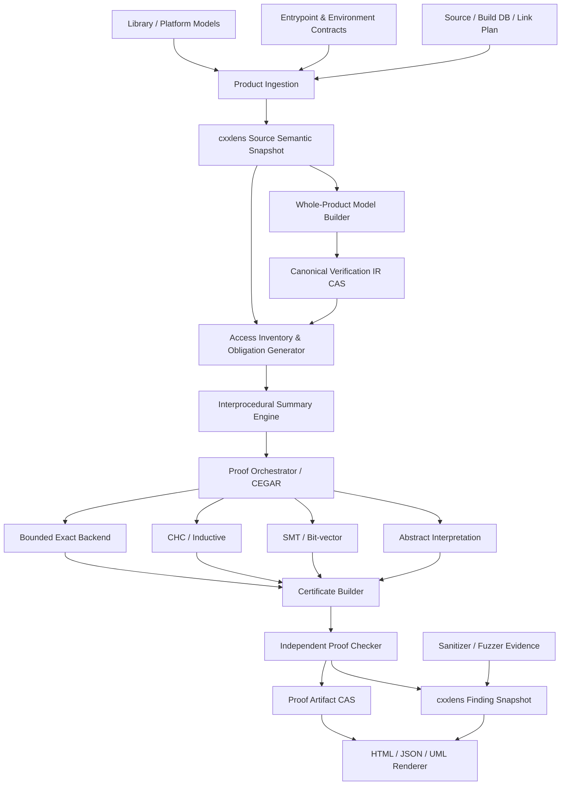
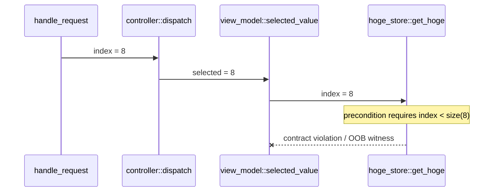
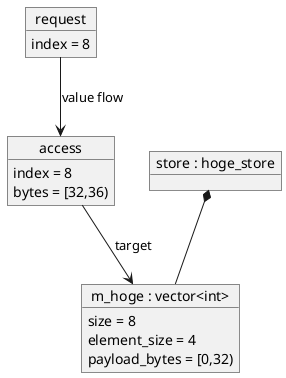

# ooblens Whole-Product OOB Contract-Closure Verifier

## Integrated design proposal

| Field | Value |
| --- | --- |
| Document ID | `OOBLENS-SRAD-001` |
| Version | `0.1.0-proposal` |
| Status | non-normative proposal |
| Owner issue | `#188` |
| Target product | `ooblens` |
| Foundation | `cxxlens` Semantic Relation Platform |
| Base cxxlens revision | `cf4d55d291a9869f7f1efcccfed4d6593898ea8d` |
| Language | C++23 |
| Initial frontend | exact Clang 22 |
| Initial primary platform | Linux |
| Initial property | spatial out-of-bounds access |
| Created | 2026-07-19 |

本書は `ooblens` の product semantics、requirements、architecture、proof contract、cxxlens boundary、
reporting、qualification の統合設計提案です。既存 cxxlens authority を変更しません。
実装時に cxxlens の identity、condition、closure、provider、snapshot、native lifetime、determinism を
変更する必要が判明した場合は、Issue #188 の proposal を直接 authority とせず、別 issue、design feedback、
ADR、machine-readable contract、independent review の順で扱います。

---

## 0. Final design decisions

### 0.1 Product definition

`ooblens` は、次の product です。

> **一つの exact product realization に属する entrypoint、environment、build/link context、source、
> external model、contract を versioned whole-product semantic model に合成し、到達可能な全 memory access と
> caller/callee bounds contract を会計して、OOB の存在または不在を machine-checkable evidence とともに
> 証明する verification application。**

中心的な問いは局所的な `may_oob(access)` ではありません。

```text
forall entry_input in declared_input_domain:
  forall reachable_execution from declared_entrypoints:
    every executed memory access satisfies its bounds obligation
```

hot-path callee に precondition がある場合は、callee body の検証と caller contract-closure の検証を分離します。

```text
callee implementation obligation:
  callee_precondition => every callee-local bounds obligation

call-site obligation:
  caller_reachable_state => instantiated_callee_precondition

product obligation:
  every reachable call target at every reachable call site satisfies call-site obligation
```

### 0.2 Explicitly rejected product

次は `ooblens` の product value ではありません。

```text
get_hoge(index) contains m_hoge[index].
Therefore it may be OOB if index is invalid.
```

宣言された precondition の下で本体が安全なら、その局所的可能性は finding ではありません。
finding となるのは、次のいずれかです。

1. precondition 自体が callee body の安全性を保証しない。
2. product 内の到達可能な caller state が precondition を破る。
3. bounds access が contract を持たず、到達状態から OOB が証明される。
4. runtime observation が exact semantic access と結び付いて OOB を示す。

### 0.3 Completeness position

有限な source tree だけでは verification state space は閉じません。次が未指定なら product は open です。

- entrypoint と callback
- input domain と外部 event stream
- build variant と link unit
- shared object、plugin、JIT、dynamic loading
- virtual/function-pointer target universe
- external/native library behavior
- heap/resource bound または帰納的 model
- thread/interference model
- filesystem、network、time、random、hardware input
- language/toolchain/ABI semantics

一方、これらを exact contract として閉じた有限 machine model は有限状態です。その場合、具体状態の全探索は
原理上停止します。ただし状態数は実用上天文学的になり得ます。本設計は次を組み合わせます。

- exact finite-state checking
- abstract interpretation
- interprocedural summaries
- SCC fixpoint
- SMT/bit-vector refinement
- CHC/PDR-style inductive verification
- bounded model checking with checked unwinding
- counterexample-guided abstraction refinement
- explicit unresolved and budget accounting

したがって `ooblens` の「100%」は slogan ではなく、profile ごとの machine contract とします。

### 0.4 100% guarantees

`ooblens` は次を目標とします。

1. **Access inventory completeness**  
   対象 product/profile の全 memory access に stable identity と status がある。黙って omission しない。

2. **Finding soundness**  
   `proved_oob` は exact input model と replayable path によって独立 checker が再現できる。

3. **Safety soundness**  
   `proved_safe_closed` は closure、callee contracts、inductive invariants、all-target call coverage を
   独立 checker が検証できる。

4. **No silent uncertainty**  
   model 不足、target 不明、budget 超過、unsupported semantics は `unresolved` または `unsupported` で残す。

5. **Profile-relative completeness**  
   `closed == true` のときだけ、その exact product/profile に対する OOB 不在を主張する。

任意の C++ program に対して常に完全判定できるとは主張しません。閉じられない問いも必ず finite-time で
structured partial result として返します。

### 0.5 Architecture decision

whole-product model は一枚の巨大 flattened graph としてのみ保持しません。意味上は product 全体を合成しつつ、
計算上は次へ分割します。

```text
product realization
  -> link units
  -> entrypoint roots
  -> call-graph SCCs
  -> function summaries
  -> path/state partitions
  -> property-specific obligations
```

function summary は局所最適化ではなく、callee semantics を caller へ lossless に合成する proof boundary です。
必要な場合だけ inline/refine します。

### 0.6 AI position

core verdict は deterministic logic と versioned models によって生成します。生成 AI は optional assistant として、

- unresolved external model の草案
- contract 候補
- source explanation
- report prose
- regression fixture generation

に利用できますが、AI output は authority ではありません。schema validation、human acceptance、proof checking を
通るまで trusted model または finding にしません。

---

## 1. Stakeholders and use cases

### 1.1 Users

- product-wide C/C++ quality owner
- security reviewer
- platform/engine developer
- safety-critical software team
- CI integrator
- library author defining hot-path contracts
- compiler/provider author
- verification engineer
- coding agent implementing and maintaining models
- future UB property-pack author

### 1.2 Primary use case: hot-path precondition closure

```cpp
class hoge_store {
public:
    int get_hoge(int index) const
        /* pre: 0 <= index && index < m_hoge.size() */
    {
        return m_hoge[index];
    }

private:
    std::vector<int> m_hoge;
};
```

`ooblens` は次を行います。

1. `get_hoge` precondition を normalized predicate にする。
2. precondition を assumption として body 内 access を検証する。
3. product link unit 内の direct/virtual/function-pointer call target を列挙する。
4. product entrypoint の input domain から caller states を伝播する。
5. 各 call site で actual argument と receiver state を precondition symbol へ bind する。
6. `caller_state => 0 <= index && index < receiver.m_hoge.size()` を証明する。
7. 反例があれば entry input から call path、branch decisions、receiver size、index、access までを提出する。
8. 全 call target と全 reachable context が証明され、他の unresolved がなければ contract closure を認定する。

### 1.3 Secondary use cases

- pointer + length API の全 caller contract closure
- `std::span`、`std::vector`、`std::array`、`std::basic_string` access
- `memcpy`、`memmove`、`memset`、read/write-like API の source/destination extent
- plugin-free closed virtual hierarchy
- request/message handlers から内部 collection access までの end-to-end verification
- exported library API ごとの input-domain verification
- sanitizer/fuzzer observation と static access identity の join
- release 間での proof closure regression
- build variant ごとの safe/unsafe divergence

### 1.4 Non-goals for initial property release

- general UB verdict
- data race proof
- temporal lifetime proof
- arbitrary liveness/functional correctness
- source rewrite/apply
- probable-bug ranking as a substitute for proof
- inferred precondition を silently trusted assumption にすること
- dynamic plugin/JIT を model なしで closed と扱うこと
- one build variant の結果を別 variant へ流用すること

---

## 2. Requirement definition

### 2.1 Functional requirements

#### FR-001 Product realization

source tree ではなく、compile invocation、toolchain、target、variant、link unit、loaded component policy を含む
exact product realization を入力とする。

#### FR-002 Entry points

`main` だけでなく、exported API、thread start、event handler、callback、RPC/message handler、test harness、
framework registration point を entrypoint として登録できる。

#### FR-003 Input domains

各 entrypoint parameter、global/environment state、external response に finite set、bit-vector range、
predicate、symbolic object model、stream protocol のいずれかを bind できる。

#### FR-004 Contract ingestion

precondition/postcondition/invariant を次から versioned adapter で取得できる。

- source-language contract syntax
- configured macro/attribute
- GSL-like assertion form
- `assert`/project assertion macro
- sidecar contract document
- library/model registry
- generated-but-untrusted contract proposal

syntax ではなく normalized predicate semantics が identity authority となる。

#### FR-005 Whole-product call closure

direct call、closed virtual dispatch、function pointer、callback registration、template instantiation、
external model call を target set として表現し、unknown target を omission しない。

#### FR-006 Dynamic extent

固定長配列だけでなく、次の extent を symbolic に扱う。

- dynamic allocation size
- `new T[n]`
- `malloc/calloc/realloc`
- container size/capacity/data
- `span` length
- pointer + count pair
- subobject extent
- string/buffer length
- project-specific container model

#### FR-007 Bounds obligations

read/write/copy/fill/compare 等の access を byte interval と language-level object/subobject ruleへ lower し、
operation ごとの definedness predicate を生成する。

#### FR-008 Callee verification

callee precondition の下で body の全 bounds obligation が成立するかを検証する。

#### FR-009 Call-site verification

全 reachable caller state が instantiated callee precondition を含意するか検証する。

#### FR-010 Interprocedural state propagation

return value、out parameter、object field、container size、allocation extent、alias/provenance、exceptional exit を
summary として caller/callee 間で合成する。

#### FR-011 Loops and recursion

loop/recursive SCC を、bounded exact exploration、abstract fixpoint、inductive invariant、CHC 等で処理し、
完了しない場合は reason-bound unresolved とする。

#### FR-012 Counterexample

OOB または contract violation について、entry input、call stack、branch path、state transitions、
object/access interval、first-UB position を含む concrete witness を生成する。

#### FR-013 Safety proof

OOB 不在について、entry closure、call target closure、function summary、inductive invariant、
discharged obligation set を含む certificate を生成する。

#### FR-014 Independent checking

analysis engine と独立した checker が proof certificate を再検証する。renderer は checker-approved certificate
だけを `proved_*` と表示する。

#### FR-015 Report

HTML/JSON と、product path、call sequence、CFG witness、object diagram、memory interval diagram を生成する。

#### FR-016 Incremental reuse

source、dependency、invocation、toolchain、provider、model、contract、profile、solver/checker semantics の
exact fingerprint が同じ partition だけ再利用する。

#### FR-017 Variant separation

condition universe/build variant ごとに verdict を保持し、variant 間の silent merge をしない。

#### FR-018 Runtime evidence fusion

ASan/UBSan/fuzzer 等の runtime observation を optional provider として取り込み、static access identity と
exact build/binary/source binding が一致した場合だけ join する。

#### FR-019 Machine query

finding、proof、unresolved、coverage、entrypoint、function、call path、access、model dependency を
typed/dynamic query できる。

#### FR-020 Extension

OOB-specific property pack を入れ替えることで、後続 UB verifier が program model、summary engine、
proof orchestration、certificate/report infrastructure を再利用できる。

### 2.2 Non-functional requirements

- deterministic semantic identity
- checkout-root、jobs、task order、backend に依存しない semantic output
- fail-closed ingestion
- immutable published result
- prior snapshot survival on failure
- bounded memory/time/process/output
- cancellation with sealed partial result
- Linux primary, static/shared install qualification
- no LLVM/Clang native types in stable generic surface
- exact compiler-major native package
- file/process/time/hash through ports
- no raw owning pointer in public design
- independent negative fixtures
- machine-readable versioned contracts
- reproducible report generation
- accessibility: color aloneに依存しない diagrams
- large product scalability through demand-driven partitions and summaries

---

## 3. Product closure model

### 3.1 Product scope

一つの `product_scope` は次を含みます。

```text
catalog
link units
build variants
condition universe
entrypoints
input domains
external components
dynamic-loading policy
thread model
language/toolchain/ABI
library/model registry
contract registry
verification profile
trust policy
resource policy
```

`product_scope_id` は上記 canonical projection の digest です。

### 3.2 Closure dimensions

| Dimension | Closed condition |
| --- | --- |
| Source/build | all compile units and exact invocations known |
| Link | every linked object/library classified as analyzed, modeled, or rejected |
| Dynamic loading | disabled or exact plugin set/model declared |
| Entrypoints | every externally invocable root declared |
| Inputs | each root input has a domain/model |
| Call targets | every reachable indirect/virtual target set closed |
| External calls | body analyzed or exact summary model accepted |
| Memory | allocation/extent/provenance semantics covered |
| Control | loop/recursion proof or exact bound established |
| Conditions | all applicable variants/feature atoms represented |
| Concurrency | single-thread proof or interference model closed |
| Native/asm | modeled or unsupported explicitly |
| Budget | no proof-relevant partition truncated |

product closure は one boolean ではなく dimension ごとの evidence を持ち、最終 `closed` は property requirement に
必要な dimension の conjunction です。

### 3.3 Verification profiles

#### `ooblens.closed-bounded.v1`

- finite bit-vector machine model
- finite input domains
- finite heap/object count bound
- checked loop/recursion unwinding
- exact target closure
- exhaustive/symbolic concrete state coverage

完了時は bounded profile 内で complete です。

#### `ooblens.closed-inductive.v1`

- input domains は symbolically large でもよい
- loop/recursion は inductive invariant/fixpoint で処理
- abstract over-approximation が全 concrete behavior を包含
- checker が transition preservation と property implication を検証

証明成功時は profile 内で safe です。precision 不足は false alarm ではなく refinement または unresolved にする。

#### `ooblens.open-audit.v1`

- product closure が不完全でも走行可能
- proved OOB は提出できる
- proved safe は closed subset に限定
- product 全体の absence claim は禁止

### 3.4 Finite-time service behavior

analysis は resource budget 内で必ず次を返します。

```text
complete proof
complete counterexample
sealed partial proof set + unresolved-budget
failed-before-result
```

「proof search 自体が数学的に常に終了する」とは仮定しません。service contract として cancellation/budget を持ち、
不完了を status に変換します。

---

## 4. Semantic foundations

### 4.1 Three semantic layers

```text
C++ source semantics
  -> normalized source semantic facts
  -> verification IR semantics
  -> property semantics (OOB)
```

各 lowering は provider/transform semantic contract と evidence digest を持ちます。

### 4.2 Source semantic facts

cxxlens snapshot で共有する長寿命 facts:

- project/build/source identities
- semantic entities and declarations
- structural types
- call sites and resolved direct targets
- link units and entrypoints
- declared contracts
- source/macro origin
- provider execution/coverage/unresolved

### 4.3 Verification IR

solver-oriented internal IR。cxxlens kernel の generic relation/query algebraへ solver semantics を押し込まない。

```text
module
function
basic block
instruction
SSA value
phi
call/invoke/return
branch/switch
memory object
pointer/provenance value
load/store/memory operation
allocation/deallocation
exception edge
contract assume/assert
environment nondeterminism
```

IR は canonical encoding と digest を持ち、content-addressed artifact store に保存します。
cxxlens relation は artifact manifest、index、proof input binding、finding を保持します。

### 4.4 Why not store every solver node as a public cxxlens relation

- solver IR は backend/optimization evolution が速い
- physical normalization を long-term semantic identity にしてはいけない
- public relation explosion を避ける
- generic query engine を theorem prover に変えない
- app implementation を小さく保つ

ただし cross-app value が確認された source-level CFG、contract、link/entrypoint relation は
cxxlens experimental relation candidate とします。

---

## 5. Contract semantics

### 5.1 Contract kinds

```text
precondition
postcondition
object invariant
loop invariant
external summary assumption
environment assumption
access definedness obligation
```

### 5.2 Authority classes

| Class | Meaning |
| --- | --- |
| verified | body/model proof establishes contract |
| declared | project author declared; caller obligation and callee assumption |
| trusted_external | accepted library/platform model; included in TCB |
| inferred_candidate | never assumed; proposal only |
| runtime_observed | evidence, not universal contract |

### 5.3 Caller/callee law

function `f` with `pre_f`, transition `body_f`, and `post_f`:

```text
implementation proof:
  pre_f && entry_invariant
    => body_f never violates bounds
    && every normal return satisfies post_f

call proof at c:
  caller_state_c
    => bind_actuals(pre_f)

composition:
  caller_state_c
    => safe(body_f) && bind_returns(post_f)
```

precondition を callee 内の safety assumption に使う代わりに、全 caller へ obligation を生成します。
この duality を崩してはいけません。

### 5.4 Missing contracts

contract がない access は、reachable input state を直接使って bounds obligation を解きます。
inferred condition が見つかっても自動的に trusted precondition にしません。

### 5.5 Contract source adapters

source syntax は evolving surface なので、次の adapter ID と exact parser semantics へ bind します。

```text
ooblens.contract-adapter.cxx-contracts.<compiler-major>.v1
ooblens.contract-adapter.gsl-expects.v1
ooblens.contract-adapter.project-macro.<digest>.v1
ooblens.contract-adapter.assertion.v1
ooblens.contract-adapter.sidecar-json.v1
```

同じ predicate が異なる syntax から来ても、normalized predicate identity と provenance occurrences を分離します。

### 5.6 Contract predicate language

初期 predicate algebra:

```text
boolean constants
machine integer constants
parameter/value/object references
size/extent/capacity projections
== != < <= > >=
checked + - *
logical and/or/not
conditional
old-value reference for postcondition
result reference
set membership for finite enum/domain
```

side effect、I/O、allocation、non-pure call は predicate から除外するか model function として明示します。

---

## 6. Whole-product graph

### 6.1 Graph categories

```text
Product graph
  link unit -> entrypoint -> function/call target

Control graph
  function -> basic blocks -> control edges

Value graph
  definitions -> uses -> argument/return/field bindings

Memory graph
  object -> extent -> subobject -> pointer provenance -> access

Contract graph
  declaration -> predicate -> call-site instantiation -> obligation

Proof graph
  obligation -> summary/invariant/model -> proof result -> certificate
```

### 6.2 Dynamic dispatch

virtual call target closure は次の優先順で構成します。

1. exact devirtualized target from analyzed IR
2. closed class hierarchy under exact link/LTO visibility
3. class hierarchy analysis plus construction/reachability facts
4. configured plugin/derived-type registry
5. conservative compatible target set
6. unresolved target universe

target set は `complete` flag と closure evidence を持ちます。profile が all-target proof を要求する場合、
不完全 target set では safety closure を認定しません。

### 6.3 Function pointers and callbacks

- address-taken function set
- assignment/data-flow
- callback registration summary
- ABI/signature compatibility
- external callback injection model
- unknown code write to function pointer
- dynamic symbol lookup model

を合成します。

### 6.4 Templates

actual product build で materialized した instantiation を entity/function realization として扱います。
未 materialize generic template の全理論 instantiation を product closure に含めません。
exported generic library profile は別 harness/contract domain で検証します。

### 6.5 Link units

one executable/DSO を意味的 linkage unit とし、LTO unit と混同しません。LTO/WPD evidence は call target
精度向上に利用できますが、LTO unit 外から派生/override 可能なら closed target とみなしません。

---

## 7. Memory and bounds semantics

### 7.1 Memory objects

`memory_object` は少なくとも次を持ちます。

```text
object identity
allocation/storage kind
owning product/function/thread scope
base address symbol
extent expression in bytes
alignment
element/subobject layout
lifetime state
mutability
provenance root
source/model evidence
```

OOB property 初期版では lifetime は access eligibility の前提として保持するが、temporal UB の最終 verdict は
別 property pack に委ねます。first-UB discipline のため、先行 lifetime violation は unresolved/other-UB dependency とします。

### 7.2 Dynamic extent

extent expression は concrete constant に限定しません。

```text
sizeof(T) * n
allocation_returned_size(p)
vector.size(this) * sizeof(T)
span.size(this) * sizeof(T)
end - begin
field.length
min(capacity, protocol_length)
```

object state transition は container/library summary が更新します。

### 7.3 Access model

各 access を次へ lower します。

```text
base object/provenance
signed byte offset
access width
read/write/atomic/copy/etc.
language operation kind
source span
program point
path condition
required alignment/lifetime constraints
```

spatial bounds の基本 obligation:

```text
object_known
&& provenance_permits_access
&& offset >= 0
&& width >= 0
&& checked_add(offset, width) succeeds
&& offset + width <= object_extent
&& language_subobject_rule
```

`one-past` pointer formation と dereference を区別します。

### 7.4 Standard container models

初期 standard model set:

- `std::array`
- `std::span`
- `std::vector`
- `std::basic_string`
- `std::basic_string_view`
- `std::unique_ptr<T[]>`
- `std::shared_ptr<T[]>` where supported
- iterator/pointer-returning accessors required by bounds proof
- `memcpy`, `memmove`, `memset`, `memcmp`, `copy_n`-like operations

model は exact standard-library/toolchain ABI implementation に依存する observation と、
language/library semantic summary を分離します。

### 7.5 Project-specific models

versioned sidecar model で次を表現できます。

```text
type recognizer
state variables
method precondition
method postcondition
field/return alias
extent projection
mutation/reallocation effect
exception effect
thread/interference classification
```

model は schema validation と fixture verification を通り、trusted_external として明示されます。

### 7.6 Integer semantics

index/size arithmetic は mathematical integer へ無条件 lifting しません。source operation の bit width、
signedness、conversion、overflow semantics を保持します。

OOB path より先に signed overflow 等の UB が起きる場合、その後の OOB を primary proof としません。
certificate は `first_ub` を要求します。

---

## 8. Analysis strategy

### 8.1 Obligation-driven whole-product analysis

全 state を先に列挙するのではなく、全 access inventory から obligation を生成し、entrypoint へ向かう
relevant slice を求めます。

```text
access inventory
  -> local bounds obligation
  -> required values/extents/provenance
  -> backward value/control slice
  -> caller dependencies
  -> entrypoint/input dependencies
  -> proof query
```

全 access を会計するため、demand-driven でも omission はありません。非選択 access には cached proof/result status が残ります。

### 8.2 Function summaries

summary は次の relation を表します。

```text
required precondition
guaranteed postcondition
memory read/write footprint
object extent updates
return/out alias relation
call target dependencies
exceptional effects
unresolved dependencies
proof invariant references
```

summary 自体を body から検証し、declared contract と区別します。

### 8.3 SCC order

1. call graph を strongly connected components に分解する。
2. acyclic component は callee-first で解く。
3. recursive SCC は joint summary fixpoint を計算する。
4. widening により収束させ、narrowing/refinement を行う。
5. checker が inductiveness を検証できない summary は proof に使わない。

### 8.4 Abstract domains

初期 domain stack:

- constant
- interval
- known bits
- congruence
- symbolic equality
- difference constraints
- pointer object + signed offset
- symbolic extent relation
- finite target set
- path predicate partition

必要に応じて octagon/polyhedral/array segment domain を追加します。domain の追加は proof certificate vocabulary と
checker support を同時に追加します。

### 8.5 Refinement ladder

```text
R0 constant folding
R1 interval/congruence
R2 path split
R3 relational numeric domain
R4 function-summary specialization
R5 selective inline
R6 SMT bit-vector query
R7 CHC/inductive query
R8 bounded exact whole-slice query
R9 unresolved with exact reason
```

前段の result を捨てず provenance と cost を保持します。

### 8.6 Backend interface

backend は `safe/unsafe/unknown` の文字列だけを返しません。

```text
supported semantics
consumed model digest
obligation set
result class
certificate fragment
counterexample model
coverage
resource accounting
unresolved dependencies
backend binary/semantic digest
```

### 8.7 Optional external backends

- CBMC: bounded exact/refinement and witness
- SeaHorn/CHC backend: inductive invariant
- Clang Static Analyzer backend: candidate path and program-state evidence
- runtime sanitizer/fuzzer providers: observed execution

external backend verdict は adapter validation と independent ooblens certificate checking を通します。

---

## 9. Proof model

### 9.1 Proof result taxonomy

```text
proved_safe_closed
proved_safe_subset
proved_oob
reachable_contract_violation
callee_contract_insufficient
runtime_observed_oob
unreachable_proved
unresolved_model
unresolved_target
unresolved_environment
unresolved_concurrency
unresolved_other_ub
unresolved_budget
unsupported_semantics
failed_before_result
```

### 9.2 OOB certificate

counterexample certificate は少なくとも次を含みます。

```text
exact product scope
entrypoint and input assignment
build/condition/interpretation
call target choices
control-flow path
value/state transitions
object/extent identity
access offset and width
caller precondition instantiation
first-UB proof
source/macro spans
consumed model/contracts
analysis and checker identities
```

concrete witness は deterministic interpreter で replay します。

### 9.3 Safety certificate

safety certificate は次を含みます。

```text
closed scope dimensions
complete access set digest
complete reachable target-set digests
entry-state predicates
function summaries
CFG/SCC invariants
transition preservation obligations
call-site implication proofs
access bounds implication proofs
unresolved set = empty for required dimensions
```

checker は各 invariant `I` について次を検証します。

```text
entry => I(entry)
I(node) && transition(node,next) => I(next)
I(access_node) => bounds_obligation
I(call_node) => instantiated_callee_precondition
```

### 9.4 Proof assurance levels

| Level | Meaning |
| --- | --- |
| A0 | analysis result only; never shown as proved |
| A1 | concrete OOB witness independently replayed |
| A2 | safety invariants independently checked using trusted solver |
| A3 | solver proof object independently checked where available |
| A4 | differential frontend/backend agreement plus A3 |

initial production target:

- `proved_oob`: A1 minimum
- `proved_safe_closed`: A2 minimum
- high-assurance profile: A3

### 9.5 Trusted computing base

TCB inventory を report に含めます。

- exact frontend/provider
- source-to-IR lowering
- language/library models
- proof checker
- checker solver/proof-object verifier
- canonical encoding/digest
- product closure authority

analysis search heuristics と renderer は TCB 外です。

---

## 10. Partiality and coverage

### 10.1 Coverage units

```text
compile unit analyzed
link input classified
entrypoint modeled
call site target-closed
function body modeled
memory access inventoried
bounds obligation emitted
proof obligation attempted
proof obligation discharged
runtime access observed
```

### 10.2 No-warning is not proof

finding count zeroでも、次が一つでもあれば product safety claim を禁止します。

- access inventory incomplete
- target set incomplete
- external model missing
- entrypoint/input domain missing
- unresolved other UB before access
- analysis budget truncation
- checker failure
- unsupported instruction/ABI
- condition universe incomplete
- concurrent interference unknown

### 10.3 Closure certificate

`ooblens.product-bounds-closure.v1` は product scope、access set、target sets、model set、proof results、
condition universe、checker profile に bind します。snapshot row 不在から closure を推測しません。

---

## 11. cxxlens integration boundary

### 11.1 Reused without modification

- canonical semantic identity
- versioned relation descriptors
- observation/assertion/canonical/derived claim stages
- immutable memory/SQLite snapshots
- claim provenance and guarantees
- provider task/runtime/harness
- typed/dynamic query
- coverage/unresolved/conflict/differential disagreement
- exact incremental input fingerprint
- bounded closure primitive
- source span and macro origin
- exact Clang-major native lifetime confinement

### 11.2 App-owned responsibilities

- product closure semantics
- verification IR
- contract predicate algebra
- object/extent/provenance model
- interprocedural summary engine
- abstract domains
- solver/CHC/BMC adapters
- proof certificate
- independent proof checker
- report/UML renderer
- model registry
- app artifact CAS
- OOB status semantics

### 11.3 Proposed reusable cxxlens extensions

#### Candidate A: link unit and entrypoint relations

```text
build.link_unit
build.link_input
build.entry_point
build.dynamic_component_policy
```

OOB だけでなく architecture、reachability、security、size、test-selection、AI agent に有用。
現行 compile-unit catalog blocker #187 と整合する identity DAG が必要です。

#### Candidate B: contract declaration relations

```text
cc.contract
cc.contract_binding
cc.contract_source
```

taint、resource、lifetime、API migration 等で再利用可能。predicate IR は versioned artifact ref と typed summary を持つ。

#### Candidate C: experimental analysis module runtime

snapshot-to-derived-snapshot の high-level coordinator:

```text
analysis_request
analysis_partition
analysis_module
analysis_context
analysis_report
```

exact input snapshot/partition/model/assumption/precision を bindし、provider-like isolated execution、
derived claim staging、transactional publication、partiality を共通化する。

#### Candidate D: artifact references

proof/model/report の content-addressed immutable artifact ref。NG3 artifact publicationを先取りして stable 化せず、
app-owned CAS から開始する。

### 11.4 Extensions not requested

- numeric theorem proving in Logical Query IR
- generic arbitrary Datalog
- solver callback inside kernel
- OOB-specific enum in cxxlens core
- Clang AST type in stable API
- stable generic binary plugin ABI
- source mutation API

### 11.5 Adoption rule

候補 API/relation は ooblens 内部で一度実証し、第二の独立 UB/analysis consumer が現れるか、
foundational invariant として不可避になるまで stable cxxlens API に昇格させません。

---

## 12. System architecture



### 12.1 Deployment processes

```text
ooblens                    host CLI/orchestrator
ooblens-clang22-worker     native extraction process
ooblens-analysis-worker    isolated analysis process
ooblens-solver-worker      optional solver/backend process
ooblens-proof-check        minimal checker executable
ooblens-report             deterministic renderer
```

worker crash/failure は prior published snapshot を破壊しません。

### 12.2 Storage

- cxxlens SQLite: long-lived semantic/finding claims
- app CAS: canonical verification IR, proof certificate, diagrams input
- temporary solver workspace: non-authoritative and cleaned
- report directory: reproducible projection, not authority

---

## 13. Report design

### 13.1 Top-level summary

```text
Product: app-linux-x86_64-release
Entrypoints: 17/17 closed
Reachable functions: 42,381
Memory accesses: 188,204/188,204 inventoried
Proved safe: 188,198
Proved OOB: 2
Unresolved: 4
Product bounds closure: NO
```

### 13.2 Finding report

```text
entry input
  -> product/module path
  -> call chain
  -> violating caller state
  -> callee precondition
  -> access state
```

必須 pane:

1. source slice
2. product call path
3. branch/CFG witness
4. contract implication
5. object/memory interval
6. proof steps and checker result
7. assumptions/models/TCB
8. reproduction command

### 13.3 GetHoge report example

```text
reachable_contract_violation

Entry:
  handle_request(request.index = 8)

Path:
  handle_request
    -> controller::dispatch
    -> view_model::selected_value
    -> hoge_store::get_hoge(index = 8)

Receiver state:
  m_hoge.size() = 8

Required:
  0 <= index && index < m_hoge.size()

Actual:
  index = 8
  m_hoge.size() = 8
  predicate = false

Consequent access:
  element range [32,36)
  object payload range [0,32)
```

### 13.4 Diagrams

#### Product path



#### Object diagram source



renderer は certificate の approved facts だけを使用します。

---

## 14. Determinism, performance and operations

### 14.1 Partitioning

```text
product scope
link unit
build variant
entrypoint root set
call SCC
function realization
model set
property pack
precision profile
```

### 14.2 Cache fingerprint

cxxlens incremental input に加えて次を bind します。

- verification IR schema/normalizer
- contract adapter set
- library model set
- property semantics
- abstract domain configuration
- backend semantic contract
- checker semantic contract
- closure policy
- entrypoint/input model

### 14.3 Demand and priority

analysis order は finding probability ではなく、closure value と dependency centrality を使います。

1. externally reachable entrypoints
2. unverified call contracts
3. bounds obligations with small slices
4. SCC articulation points
5. model blockers affecting many obligations
6. expensive isolated obligations

### 14.4 Budgets

- wall/cpu
- resident/address space
- solver calls
- SMT terms/clauses
- path partitions
- summary specializations
- SCC iterations
- artifact bytes
- findings/diagnostics
- worker subprocesses

budget 超過は sealed partial result と exact unresolved reason を生成します。

---

## 15. Security and trust

- source/model/certificate input is untrusted
- all parsers bounded and strict
- solver process isolated
- no shell string concatenation
- exact executable digest binding
- temporary files permission restricted
- symlink/path traversal rejected
- report escapes source/prose
- graph size limits
- decompression limits
- proof checker independent from analysis process
- malformed certificate never downgraded to warning
- model signature/namespace ownership policy
- external model change invalidates dependent proofs
- runtime trace must bind exact binary/build/source
- no network access required for core verification

---

## 16. Evolution to other UB properties

### 16.1 Reusable foundation

次は property-independent です。

- product closure
- entrypoint/environment model
- call target closure
- verification IR
- interprocedural summaries
- abstract state/fixpoint
- CEGAR orchestration
- proof certificate envelope
- checker framework
- artifact/snapshot/report pipeline
- coverage/unresolved taxonomy

### 16.2 Property packs

```text
bounds
lifetime
null/alignment
integer
shift/division
invalid downcast/vptr
iterator invalidation
race
resource protocol
```

property pack は次を提供します。

```text
obligation generator
state components
transfer hooks
summary projections
certificate rules
report views
acceptance fixtures
```

### 16.3 Extraction path

二つ以上の property pack が共通実装を使用した段階で、次のいずれかへ抽出します。

- `libubmodel`
- experimental `cxxlensAnalysisSDK`
- standard reusable relation set
- generic proof-certificate envelope

OOB-specific terminologyを generic cxxlens kernel へ持ち込みません。

---

## 17. Risks and mitigations

| Risk | Mitigation |
| --- | --- |
| state explosion | summaries, slicing, abstract domains, CEGAR, budgets |
| C++ semantic complexity | exact frontend major, versioned models, unsupported accounting |
| polymorphism incompleteness | link/visibility closure evidence, conservative targets |
| external libraries | analyzed body or trusted versioned model |
| contract misuse | caller obligation + callee implementation proof; authority class |
| false safety from loop bounds | checked unwinding or inductive proof |
| solver bug | concrete replay, independent checker, proof objects/differential |
| model drift | digest-bound model dependencies and requalification |
| huge cxxlens API growth | app-internal first, experimental candidates only |
| current cxxlens ingestion blockers | prototype boundary explicit; no production claim |
| concurrency invalidates size | initial confinement assumption or interference unresolved |
| report/proof mismatch | render only checker-approved certificate facts |

---

## 18. Initial product profile

最初の useful release は固定長配列 lint ではなく、次です。

### `ooblens.product-contract-closure.v1`

Supported:

- exact product link unit and declared entrypoints
- direct calls
- closed virtual target sets
- selected function-pointer/callback flows
- scalar machine integer predicates
- symbolic container/object extents
- `std::array`, `std::span`, `std::vector`, `std::basic_string`, pointer+length models
- precondition propagation
- function-local CFG plus interprocedural summaries
- affine/monotone loops and checked bounded fallback
- OOB witness replay
- invariant-based safety certificate
- whole-product access/status accounting

Initially unresolved:

- unknown dynamic plugin/JIT
- arbitrary inline assembly
- unknown custom allocator/container
- unrestricted concurrent mutation
- pointer-int provenance reconstruction
- unsupported exception/coroutine semantics
- unresolved indirect target
- unmodeled external binary

Definition of success:

> `get_hoge` 本体に自明な local warning を出さず、宣言済み precondition で callee body を証明し、
> product entrypoint からの全到達 caller context を検証して、違反経路を具体的に示すか、
> exact closure certificate を提出する。

---

## 19. Open decisions

1. verification IR を Clang CFG source-level、LLVM IR、または dual representation のどれで開始するか。
2. initial solver backend を custom abstract interpreter + SMT とするか、CBMC adapter を先行するか。
3. safety certificate の A2 checker solver と proof-object support。
4. C++ contract syntax adapter の初期 compiler support。
5. closed virtual hierarchy authority を link plan、LTO visibility、sidecar のどれで認定するか。
6. app CAS を filesystem SQLite/BLOB のどれで開始するか。
7. concurrency を initial unsupported とするか、thread-confined proofを提供するか。
8. cxxlens `build.link_unit`/`build.entry_point` proposal を #187 解決前に設計だけ進めるか。
9. external model trust/signing policy。
10. proof certificate を cxxlens relation row 群と独立 artifact のどちらへどこまで分割するか。

これらは implementation issue へ分割し、semantics/identity/closureを変える decision は accepted ADR/contract の後に実装します。

---

## 20. References

- cxxlens integrated design: `docs/design/cxxlens_next_generation_integrated_design_ja.md`
- cxxlens architecture: `docs/development/architecture.md`
- cxxlens extension workflow: `docs/development/extending-platform.md`
- cxxlens implementation learning: `docs/development/implementation-learning/README.md`
- CBMC documentation: <https://diffblue.github.io/cbmc/>
- CBMC memory bounds checking: <https://diffblue.github.io/cbmc/memory-bounds-checking.html>
- Clang Static Analyzer: <https://clang.llvm.org/docs/ClangStaticAnalyzer.html>
- Clang analyzer checker developer manual: <https://clang-analyzer.llvm.org/checker_dev_manual>
- LLVM LTO visibility: <https://clang.llvm.org/docs/LTOVisibility.html>
- LLVM type metadata / whole-program devirtualization inputs: <https://llvm.org/docs/TypeMetadata.html>
- SeaHorn verification framework: <https://seahorn.github.io/>
- Astrée static analyzer: <https://www.astree.ens.fr/>
- KLEE paper: <https://www.usenix.org/legacy/event/osdi08/tech/full_papers/cadar/cadar.pdf>
- WG21 contracts papers: <https://www.open-std.org/jtc1/sc22/wg21/docs/papers/>
